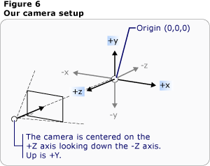
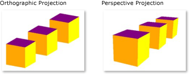

# 3-D Graphics Overview
 The [!INCLUDE[TLA2#tla_3d](../../../../includes/tla2sharptla-3d-md.md)] functionality in [!INCLUDE[TLA#tla_winclient](../../../../includes/tlasharptla-winclient-md.md)] enables developers to draw, transform, and animate 3-D graphics in both markup and procedural code. Developers can combine [!INCLUDE[TLA#tla_2d](../../../../includes/tlasharptla-2d-md.md)] and [!INCLUDE[TLA2#tla_3d](../../../../includes/tla2sharptla-3d-md.md)] graphics to create rich controls, provide complex illustrations of data, or enhance the user experience of an application's interface. [!INCLUDE[TLA2#tla_3d](../../../../includes/tla2sharptla-3d-md.md)] support in [!INCLUDE[TLA2#tla_winclient](../../../../includes/tla2sharptla-winclient-md.md)] is not designed to provide a full-featured game-development platform. This topic provides an overview of [!INCLUDE[TLA#tla_3d](../../../../includes/tlasharptla-3d-md.md)] functionality in the [!INCLUDE[TLA2#tla_winclient](../../../../includes/tla2sharptla-winclient-md.md)] graphics system.  
 
  
   
## 3-D in a 2-D Container  
 [!INCLUDE[TLA2#tla_3d](../../../../includes/tla2sharptla-3d-md.md)] graphics content in [!INCLUDE[TLA2#tla_winclient](../../../../includes/tla2sharptla-winclient-md.md)] is encapsulated in an element, <xref:System.Windows.Controls.Viewport3D>, that can participate in the two-dimensional element structure. The graphics system treats <xref:System.Windows.Controls.Viewport3D> as a two-dimensional visual element like many others in [!INCLUDE[TLA2#tla_winclient](../../../../includes/tla2sharptla-winclient-md.md)]. <xref:System.Windows.Controls.Viewport3D> functions as a window—a viewport—into a three-dimensional scene. More accurately, it is a surface on which a [!INCLUDE[TLA2#tla_3d](../../../../includes/tla2sharptla-3d-md.md)] scene is projected.  
  
 In a conventional [!INCLUDE[TLA2#tla_2d](../../../../includes/tla2sharptla-2d-md.md)] application, use <xref:System.Windows.Controls.Viewport3D> as you would another container element like Grid or Canvas.  Although you can use <xref:System.Windows.Controls.Viewport3D> with other [!INCLUDE[TLA2#tla_2d](../../../../includes/tla2sharptla-2d-md.md)] drawing objects in the same scene graph, you cannot interpenetrate [!INCLUDE[TLA2#tla_2d](../../../../includes/tla2sharptla-2d-md.md)] and [!INCLUDE[TLA2#tla_3d](../../../../includes/tla2sharptla-3d-md.md)] objects within a <xref:System.Windows.Controls.Viewport3D>.  This topic will focus on how to draw [!INCLUDE[TLA2#tla_3d](../../../../includes/tla2sharptla-3d-md.md)] graphics inside the <xref:System.Windows.Controls.Viewport3D>.  
  
   
## 3-D Coordinate Space  
 The [!INCLUDE[TLA2#tla_winclient](../../../../includes/tla2sharptla-winclient-md.md)] coordinate system for [!INCLUDE[TLA2#tla_2d](../../../../includes/tla2sharptla-2d-md.md)] graphics locates the origin in the upper left of the rendering area (typically the screen). In the [!INCLUDE[TLA2#tla_2d](../../../../includes/tla2sharptla-2d-md.md)] system, positive x-axis values proceed to the right and positive y-axis values proceed downward.  In the [!INCLUDE[TLA2#tla_3d](../../../../includes/tla2sharptla-3d-md.md)] coordinate system, however, the origin is located in the center of the rendering area, with positive x-axis values proceeding to the right but positive y-axis values proceeding upward instead, and positive z-axis values proceeding outward from the origin, toward the viewer.  
  
   
Conventional 2-D and 3-D coordinate system representations  
  
 The space defined by these axes is the stationary frame of reference for [!INCLUDE[TLA2#tla_3d](../../../../includes/tla2sharptla-3d-md.md)] objects in [!INCLUDE[TLA2#tla_winclient](../../../../includes/tla2sharptla-winclient-md.md)]. As you build models in this space and create lights and cameras to view them, it's helpful to distinguish this stationary frame of reference, or "world space," from the local frame of reference you create for each model when you apply transformations to it. Remember also that objects in world space might look entirely different, or not be visible at all, depending on light and camera settings, but the position of the camera does not change the location of objects in world space.  
  
   
## Cameras and Projections  
 Developers who work in [!INCLUDE[TLA2#tla_2d](../../../../includes/tla2sharptla-2d-md.md)] are accustomed to positioning drawing primitives on a two-dimensional screen. When you create a [!INCLUDE[TLA2#tla_3d](../../../../includes/tla2sharptla-3d-md.md)] scene, it's important to remember that you are really creating a [!INCLUDE[TLA2#tla_2d](../../../../includes/tla2sharptla-2d-md.md)] representation of [!INCLUDE[TLA2#tla_3d](../../../../includes/tla2sharptla-3d-md.md)] objects. Because a [!INCLUDE[TLA2#tla_3d](../../../../includes/tla2sharptla-3d-md.md)] scene looks different depending on the onlooker's point of view, you must specify that point of view. The <xref:System.Windows.Media.Media3D.Camera> class allows you to specify this point of view for a [!INCLUDE[TLA2#tla_3d](../../../../includes/tla2sharptla-3d-md.md)] scene.  
  
 Another way to understand how a [!INCLUDE[TLA2#tla_3d](../../../../includes/tla2sharptla-3d-md.md)] scene is represented on a [!INCLUDE[TLA2#tla_2d](../../../../includes/tla2sharptla-2d-md.md)] surface is by describing the scene as a projection onto the viewing surface. The <xref:System.Windows.Media.Media3D.ProjectionCamera> allows you to specify different projections and their properties to change how the onlooker sees [!INCLUDE[TLA2#tla_3d](../../../../includes/tla2sharptla-3d-md.md)] models. A <xref:System.Windows.Media.Media3D.PerspectiveCamera> specifies a projection that foreshortens the scene.  In other words, the <xref:System.Windows.Media.Media3D.PerspectiveCamera> provides vanishing-point perspective.  You can specify the position of the camera in the coordinate space of the scene, the direction and field of view for the camera, and a vector that defines the direction of "up" in the scene. The following diagram illustrates the <xref:System.Windows.Media.Media3D.PerspectiveCamera>'s projection.  
  
 The <xref:System.Windows.Media.Media3D.ProjectionCamera.NearPlaneDistance%2A> and <xref:System.Windows.Media.Media3D.ProjectionCamera.FarPlaneDistance%2A> properties of <xref:System.Windows.Media.Media3D.ProjectionCamera> limit the range of the camera's projection. Because cameras can be located anywhere in the scene, it's possible for the camera to be actually positioned inside a model or very near a model, making it hard to distinguish objects properly.  <xref:System.Windows.Media.Media3D.ProjectionCamera.NearPlaneDistance%2A> allows you to specify a minimum distance from the camera beyond which objects will not be drawn.  Conversely, <xref:System.Windows.Media.Media3D.ProjectionCamera.FarPlaneDistance%2A> lets you specify a distance from the camera beyond which objects will not be drawn, which ensures that objects too far away to be recognizable won't be included in the scene.  
  
   
Camera position  
  
 <xref:System.Windows.Media.Media3D.OrthographicCamera> specifies an orthogonal projection of a [!INCLUDE[TLA2#tla_3d](../../../../includes/tla2sharptla-3d-md.md)] model to a [!INCLUDE[TLA2#tla_2d](../../../../includes/tla2sharptla-2d-md.md)] visual surface. Like other cameras, it specifies a position, viewing direction, and "upward" direction. Unlike <xref:System.Windows.Media.Media3D.PerspectiveCamera>, however, <xref:System.Windows.Media.Media3D.OrthographicCamera> describes a projection that does not include perspective foreshortening. In other words, <xref:System.Windows.Media.Media3D.OrthographicCamera> describes a viewing box whose sides are parallel, instead of one whose sides meet in a point at the camera. The following image shows the same model as viewed using <xref:System.Windows.Media.Media3D.PerspectiveCamera> and <xref:System.Windows.Media.Media3D.OrthographicCamera>.  
  
   
Perspective and Orthographic Projections  
  
 The following code shows some typical camera settings.  
  
 [!code-csharp[3dgallery_procedural_snip#Basic3DShapeCodeExampleInline1](../../../../samples/snippets/csharp/VS_Snippets_Wpf/3DGallery_procedural_snip/CSharp/Basic3DShapeExample.cs#basic3dshapecodeexampleinline1)]
 [!code-vb[3dgallery_procedural_snip#Basic3DShapeCodeExampleInline1](../../../../samples/snippets/visualbasic/VS_Snippets_Wpf/3DGallery_procedural_snip/visualbasic/basic3dshapeexample.vb#basic3dshapecodeexampleinline1)]  
  
   
## Model and Mesh Primitives  
  
 <xref:System.Windows.Media.Media3D.Model3D> is the abstract base class that represents a generic [!INCLUDE[TLA2#tla_3d](../../../../includes/tla2sharptla-3d-md.md)] object. To build a [!INCLUDE[TLA2#tla_3d](../../../../includes/tla2sharptla-3d-md.md)] scene, you need some objects to view, and the objects that make up the scene graph derive from <xref:System.Windows.Media.Media3D.Model3D>. Currently, the [!INCLUDE[TLA2#tla_winclient](../../../../includes/tla2sharptla-winclient-md.md)] supports modeling geometries with <xref:System.Windows.Media.Media3D.GeometryModel3D>. The <xref:System.Windows.Media.Media3D.GeometryModel3D.Geometry%2A> property of this model takes a mesh primitive.  
  
 To build a model, begin by building a primitive, or mesh. A [!INCLUDE[TLA2#tla_3d](../../../../includes/tla2sharptla-3d-md.md)] primitive is a collection of vertices that form a single [!INCLUDE[TLA2#tla_3d](../../../../includes/tla2sharptla-3d-md.md)] entity. Most [!INCLUDE[TLA2#tla_3d](../../../../includes/tla2sharptla-3d-md.md)] systems provide primitives modeled on the simplest closed figure: a triangle defined by three vertices.  Because the three points of a triangle are coplanar, you can continue adding triangles in order to model more complex shapes, called meshes.  
  
 The [!INCLUDE[TLA2#tla_winclient](../../../../includes/tla2sharptla-winclient-md.md)] [!INCLUDE[TLA2#tla_3d](../../../../includes/tla2sharptla-3d-md.md)] system currently provides the <xref:System.Windows.Media.Media3D.MeshGeometry3D> class, which allows you to specify any geometry; it does not currently support predefined [!INCLUDE[TLA2#tla_3d](../../../../includes/tla2sharptla-3d-md.md)] primitives like spheres and cubic forms. Begin creating a <xref:System.Windows.Media.Media3D.MeshGeometry3D> by specifying a list of triangle vertices as its <xref:System.Windows.Media.Media3D.MeshGeometry3D.Positions%2A> property. Each vertex is specified as a <xref:System.Windows.Media.Media3D.Point3D>.  (In [!INCLUDE[TLA#tla_xaml](../../../../includes/tlasharptla-xaml-md.md)], specify this property as a list of numbers grouped in threes that represent the coordinates of each vertex.) Depending on its geometry, your mesh might be composed of many triangles, some of which share the same corners (vertices). To draw the mesh correctly, the [!INCLUDE[TLA2#tla_winclient](../../../../includes/tla2sharptla-winclient-md.md)] needs information about which vertices are shared by which triangles. You provide this information by specifying a list of triangle indices with the <xref:System.Windows.Media.Media3D.MeshGeometry3D.TriangleIndices%2A> property. This list specifies the order in which the points specified in the <xref:System.Windows.Media.Media3D.MeshGeometry3D.Positions%2A> list will determine a triangle.  
  
 [!code-xaml[basic3d#Basic3DXAML3DN3](../../../../samples/snippets/xaml/VS_Snippets_Wpf/Basic3D/XAML/Window1.xaml#basic3dxaml3dn3)]  
  
 In the preceding example, the <xref:System.Windows.Media.Media3D.MeshGeometry3D.Positions%2A> list specifies eight vertices to define a cube-shaped mesh. The <xref:System.Windows.Media.Media3D.MeshGeometry3D.TriangleIndices%2A> property specifies a list of twelve groups of three indices.  Each number in the list refers to an offset into the <xref:System.Windows.Media.Media3D.MeshGeometry3D.Positions%2A> list.  For example, the first three vertices specified by the <xref:System.Windows.Media.Media3D.MeshGeometry3D.Positions%2A> list are (1,1,0), (0,1,0), and (0,0,0). The first three indices specified by the <xref:System.Windows.Media.Media3D.MeshGeometry3D.TriangleIndices%2A> list are 0, 2, and 1, which correspond to the first, third, and second points in the <xref:System.Windows.Media.Media3D.MeshGeometry3D.Positions%2A> list. As a result, the first triangle that makes up the cube model will be composed from (1,1,0) to (0,1,0) to  (0,0,0), and the remaining eleven triangles will be determined similarly.  
  
 You can continue defining the model by specifying values for the <xref:System.Windows.Media.Media3D.MeshGeometry3D.Normals%2A> and <xref:System.Windows.Media.Media3D.MeshGeometry3D.TextureCoordinates%2A> properties.  To render the surface of the model, the graphics system needs information about which direction the surface is facing at any given triangle. It uses this information to make lighting calculations for the model: surfaces that face directly towards a light source appear brighter than those angled away from the light. Though the [!INCLUDE[TLA2#tla_winclient](../../../../includes/tla2sharptla-winclient-md.md)] can determine default normal vectors by using the position coordinates, you can also specify different normal vectors to approximate the appearance of curved surfaces.  
  
 The <xref:System.Windows.Media.Media3D.MeshGeometry3D.TextureCoordinates%2A> property specifies a collection of <xref:System.Windows.Point>s that tell the graphics system how to map the coordinates that determine how a texture is drawn to the vertices of the mesh. <xref:System.Windows.Media.Media3D.MeshGeometry3D.TextureCoordinates%2A> are specified as a value between zero and 1, inclusive.  As with the <xref:System.Windows.Media.Media3D.MeshGeometry3D.Normals%2A> property, the graphics system can calculate default texture coordinates, but you might choose to set different texture coordinates to control the mapping of a texture that includes part of a repeating pattern, for example. More information about texture coordinates can be found in subsequent topics or in the Managed Direct3D SDK.  
  
 The following example shows how to create one face of the cube model in procedural code. Note that you can draw the entire cube as a single GeometryModel3D; this example draws the cube's face as a distinct model in order to apply separate textures to each face later.  
  
 [!code-csharp[3doverview#3DOverview3DN6](../../../../samples/snippets/csharp/VS_Snippets_Wpf/3DOverview/CSharp/Window1.xaml.cs#3doverview3dn6)]
 [!code-vb[3doverview#3DOverview3DN6](../../../../samples/snippets/visualbasic/VS_Snippets_Wpf/3DOverview/visualbasic/window1.xaml.vb#3doverview3dn6)]  
  
 [!code-csharp[3doverview#3DOverview3DN7](../../../../samples/snippets/csharp/VS_Snippets_Wpf/3DOverview/CSharp/Window1.xaml.cs#3doverview3dn7)]
 [!code-vb[3doverview#3DOverview3DN7](../../../../samples/snippets/visualbasic/VS_Snippets_Wpf/3DOverview/visualbasic/window1.xaml.vb#3doverview3dn7)]  
  
   
## Applying Materials to the Model  
  
 For a mesh to look like a three-dimensional object, it must have an applied texture to cover the surface defined by its vertices and triangles so it can be lit and projected by the camera. In [!INCLUDE[TLA2#tla_2d](../../../../includes/tla2sharptla-2d-md.md)], you use the <xref:System.Windows.Media.Brush> class to apply colors, patterns, gradients, or other visual content to areas of the screen.  The appearance of [!INCLUDE[TLA2#tla_3d](../../../../includes/tla2sharptla-3d-md.md)] objects, however, is a function of the lighting model, not just of the color or pattern applied to them. Real-world objects reflect light differently depending on the quality of their surfaces: glossy and shiny surfaces don't look the same as rough or matte surfaces, and some objects seem to absorb light while others glow. You can apply all the same brushes to [!INCLUDE[TLA2#tla_3d](../../../../includes/tla2sharptla-3d-md.md)] objects that you can apply to [!INCLUDE[TLA2#tla_2d](../../../../includes/tla2sharptla-2d-md.md)] objects, but you can't apply them directly.  
  
 To define the characteristics of a model's surface, [!INCLUDE[TLA2#tla_winclient](../../../../includes/tla2sharptla-winclient-md.md)] uses the <xref:System.Windows.Media.Media3D.Material> abstract class. The concrete subclasses of Material determine some of the appearance characteristics of the model's surface, and each also provides a Brush property to which you can pass a SolidColorBrush, TileBrush, or VisualBrush.  
  
-   <xref:System.Windows.Media.Media3D.DiffuseMaterial> specifies that the brush will be applied to the model as though that model were lit diffusely. Using DiffuseMaterial most resembles using brushes directly on [!INCLUDE[TLA2#tla_2d](../../../../includes/tla2sharptla-2d-md.md)] models; model surfaces do not reflect light as though shiny.  
  
-   <xref:System.Windows.Media.Media3D.SpecularMaterial> specifies that the brush will be applied to the model as though the model's surface were hard or shiny, capable of reflecting highlights. You can set the degree to which the texture will suggest this reflective quality, or "shine," by specifying a value for the <xref:System.Windows.Media.Media3D.SpecularMaterial.SpecularPower%2A> property.  
  
-   <xref:System.Windows.Media.Media3D.EmissiveMaterial> allows you to specify that the texture will be applied as though the model were emitting light equal to the color of the brush. This does not make the model a light; however, it will participate differently in shadowing than it would if textured with DiffuseMaterial or SpecularMaterial.  
  
 For better performance, the backfaces of a <xref:System.Windows.Media.Media3D.GeometryModel3D> (those faces that are out of view because they are on the opposite side of the model from the camera) are culled from the scene.  To specify a <xref:System.Windows.Media.Media3D.Material> to apply to the backface of a model like a plane, set the model's <xref:System.Windows.Media.Media3D.GeometryModel3D.BackMaterial%2A> property.  
  
 To achieve some surface qualities, like glowing or reflective effects, you might want to apply several different brushes to a model in succession. You can apply and reuse multiple Materials by using the <xref:System.Windows.Media.Media3D.MaterialGroup> class. The children of the MaterialGroup are applied first to last in multiple rendering passes.  
  
 The following code examples show how to apply a solid color and a drawing as brushes to [!INCLUDE[TLA2#tla_3d](../../../../includes/tla2sharptla-3d-md.md)] models.  
  
 [!code-xaml[basic3d#Basic3DXAML3DN5](../../../../samples/snippets/xaml/VS_Snippets_Wpf/Basic3D/XAML/Window1.xaml#basic3dxaml3dn5)]  
  
 [!code-xaml[3doverview#3DOverview3DN9](../../../../samples/snippets/csharp/VS_Snippets_Wpf/3DOverview/CSharp/app.xaml#3doverview3dn9)]  
  
 [!code-csharp[3doverview#3DOverview3DN8](../../../../samples/snippets/csharp/VS_Snippets_Wpf/3DOverview/CSharp/Window1.xaml.cs#3doverview3dn8)]
 [!code-vb[3doverview#3DOverview3DN8](../../../../samples/snippets/visualbasic/VS_Snippets_Wpf/3DOverview/visualbasic/window1.xaml.vb#3doverview3dn8)]  
  
   
## Illuminating the Scene  
 Lights in [!INCLUDE[TLA2#tla_3d](../../../../includes/tla2sharptla-3d-md.md)] graphics do what lights do in the real world: they make surfaces visible. More to the point, lights determine what part of a scene will be included in the projection. Light objects in [!INCLUDE[TLA2#tla_winclient](../../../../includes/tla2sharptla-winclient-md.md)] create a variety of light and shadow effects and are modeled after the behavior of various real-world lights. You must include at least one light in your scene, or no models will be visible.  
  
 The following lights derive from the base class <xref:System.Windows.Media.Media3D.Light>:  
  
-   <xref:System.Windows.Media.Media3D.AmbientLight>: Provides ambient lighting that illuminates all objects uniformly regardless of their location or orientation.  
  
-   <xref:System.Windows.Media.Media3D.DirectionalLight>: Illuminates like a distant light source.  Directional lights have a <xref:System.Windows.Media.Media3D.DirectionalLight.Direction%2A> specified as a Vector3D, but no specified location.  
  
-   <xref:System.Windows.Media.Media3D.PointLight>: Illuminates like a nearby light source. PointLights have a position and cast light from that position. Objects in the scene are illuminated depending on their position and distance with respect to the light. <xref:System.Windows.Media.Media3D.PointLightBase> exposes a <xref:System.Windows.Media.Media3D.PointLightBase.Range%2A> property, which determines a distance beyond which models will not be illuminated by the light. PointLight also exposes attenuation properties which determine how the light's intensity diminishes over distance. You can specify constant, linear, or quadratic interpolations for the light's attenuation.  
  
-   <xref:System.Windows.Media.Media3D.SpotLight>: Inherits from <xref:System.Windows.Media.Media3D.PointLight>. Spotlights illuminate like PointLight and have both position and direction. They project light in a cone-shaped area set by <xref:System.Windows.Media.Media3D.SpotLight.InnerConeAngle%2A> and <xref:System.Windows.Media.Media3D.SpotLight.OuterConeAngle%2A> properties, specified in degrees.  
  
 Lights are <xref:System.Windows.Media.Media3D.Model3D> objects, so you can transform and animate light properties, including position, color, direction, and range.  
  
 [!code-xaml[hittest3d#HitTest3D3DN6](../../../../samples/snippets/csharp/VS_Snippets_Wpf/HitTest3D/CSharp/Window1.xaml#hittest3d3dn6)]  
  
 [!code-csharp[basic3d#Basic3D3DN11](../../../../samples/snippets/csharp/VS_Snippets_Wpf/Basic3D/CSharp/Window1.xaml.cs#basic3d3dn11)]
 [!code-vb[basic3d#Basic3D3DN11](../../../../samples/snippets/visualbasic/VS_Snippets_Wpf/Basic3D/visualbasic/window1.xaml.vb#basic3d3dn11)]  
  
 [!code-csharp[basic3d#Basic3D3DN12](../../../../samples/snippets/csharp/VS_Snippets_Wpf/Basic3D/CSharp/Window1.xaml.cs#basic3d3dn12)]
 [!code-vb[basic3d#Basic3D3DN12](../../../../samples/snippets/visualbasic/VS_Snippets_Wpf/Basic3D/visualbasic/window1.xaml.vb#basic3d3dn12)]  
  
 [!code-csharp[basic3d#Basic3D3DN13](../../../../samples/snippets/csharp/VS_Snippets_Wpf/Basic3D/CSharp/Window1.xaml.cs#basic3d3dn13)]
 [!code-vb[basic3d#Basic3D3DN13](../../../../samples/snippets/visualbasic/VS_Snippets_Wpf/Basic3D/visualbasic/window1.xaml.vb#basic3d3dn13)]  
  
   
## Transforming Models  
 When you create models, they have a particular location in the scene. To move those models around in the scene, to rotate them, or to change their size, it's not practical to change the vertices that define the models themselves.  Instead, just as in [!INCLUDE[TLA2#tla_2d](../../../../includes/tla2sharptla-2d-md.md)], you apply transformations to models.  
  
 Each model object has a <xref:System.Windows.Media.Media3D.Model3D.Transform%2A> property with which you can move, re-orient, or resize the model.  When you apply a transform, you effectively offset all the points of the model by whatever vector or value specified by the transform. In other words, you've transformed the coordinate space in which the model is defined ("model space"), but you haven't changed the values that make up the model's geometry in the coordinate system of the entire scene ("world space").  
  
 For more information about transforming models, see [3-D Transformations Overview](../../../../docs/framework/wpf/graphics-multimedia/3-d-transformations-overview.md).  
  
   
## Animating Models  
 The [!INCLUDE[TLA2#tla_winclient](../../../../includes/tla2sharptla-winclient-md.md)] [!INCLUDE[TLA2#tla_3d](../../../../includes/tla2sharptla-3d-md.md)] implementation participates in the same timing and animation system as [!INCLUDE[TLA2#tla_2d](../../../../includes/tla2sharptla-2d-md.md)] graphics. In other words, to animate a 3-D scene, animate the properties of its models. It's possible to animate properties of primitives directly, but it's typically easier to animate transformations that change the position or appearance of models. Because transformations can be applied to <xref:System.Windows.Media.Media3D.Model3DGroup> objects as well as individual models, it's possible to apply one set of animations to a child of a Model3DGroup and another set of animations to a group of child objects. You can also achieve a variety of visual effects by animating the properties of your scene's lighting. Finally, you might choose to animate the projection itself by animating the camera position or field of view. For background information on the [!INCLUDE[TLA2#tla_winclient](../../../../includes/tla2sharptla-winclient-md.md)] timing and animation system, see the [Animation Overview](../../../../docs/framework/wpf/graphics-multimedia/animation-overview.md), [Storyboards Overview](../../../../docs/framework/wpf/graphics-multimedia/storyboards-overview.md), and [Freezable Objects Overview](../../../../docs/framework/wpf/advanced/freezable-objects-overview.md) topics.  
  
 To animate an object in [!INCLUDE[TLA2#tla_winclient](../../../../includes/tla2sharptla-winclient-md.md)], you create a timeline, define an animation (which is really a change in some property value over time), and specify the property to which to apply the animation. Because all the objects in a [!INCLUDE[TLA2#tla_3d](../../../../includes/tla2sharptla-3d-md.md)] scene are children of <xref:System.Windows.Controls.Viewport3D>, the properties targeted by any animation you want to apply to the scene are properties of properties of Viewport3D.  
  
 Suppose you want to make a model appear to wobble in place. You might choose to apply a <xref:System.Windows.Media.Media3D.RotateTransform3D> to the model, and animate the axis of its rotation from one vector to another. The following code example demonstrates applying a Vector3DAnimation to the Axis property of the transformation's Rotation3D, assuming the RotateTransform3D to be one of several transforms applied to the model with a TransformGroup.  
  
 [!code-csharp[3doverview#3DOverview3DN1](../../../../samples/snippets/csharp/VS_Snippets_Wpf/3DOverview/CSharp/Window1.xaml.cs#3doverview3dn1)]
 [!code-vb[3doverview#3DOverview3DN1](../../../../samples/snippets/visualbasic/VS_Snippets_Wpf/3DOverview/visualbasic/window1.xaml.vb#3doverview3dn1)]  
  
 [!code-csharp[3doverview#3DOverview3DN3](../../../../samples/snippets/csharp/VS_Snippets_Wpf/3DOverview/CSharp/Window1.xaml.cs#3doverview3dn3)]
 [!code-vb[3doverview#3DOverview3DN3](../../../../samples/snippets/visualbasic/VS_Snippets_Wpf/3DOverview/visualbasic/window1.xaml.vb#3doverview3dn3)]  
  
 [!code-csharp[3doverview#3DOverview3DN4](../../../../samples/snippets/csharp/VS_Snippets_Wpf/3DOverview/CSharp/Window1.xaml.cs#3doverview3dn4)]
 [!code-vb[3doverview#3DOverview3DN4](../../../../samples/snippets/visualbasic/VS_Snippets_Wpf/3DOverview/visualbasic/window1.xaml.vb#3doverview3dn4)]  
  
 [!code-csharp[3doverview#3DOverview3DN5](../../../../samples/snippets/csharp/VS_Snippets_Wpf/3DOverview/CSharp/Window1.xaml.cs#3doverview3dn5)]
 [!code-vb[3doverview#3DOverview3DN5](../../../../samples/snippets/visualbasic/VS_Snippets_Wpf/3DOverview/visualbasic/window1.xaml.vb#3doverview3dn5)]  
  
   
## Add 3-D Content to the Window  
 To render the scene, add models and lights to a <xref:System.Windows.Media.Media3D.Model3DGroup>, then set the <xref:System.Windows.Media.Media3D.Model3DGroup> as the <xref:System.Windows.Media.Media3D.ModelVisual3D.Content%2A> of a <xref:System.Windows.Media.Media3D.ModelVisual3D>. Add the <xref:System.Windows.Media.Media3D.ModelVisual3D> to the <xref:System.Windows.Controls.Viewport3D.Children%2A> collection of the <xref:System.Windows.Controls.Viewport3D>. Add cameras to the <xref:System.Windows.Controls.Viewport3D> by setting its <xref:System.Windows.Controls.Viewport3D.Camera%2A> property.  
  
 Finally, add the <xref:System.Windows.Controls.Viewport3D> to the window. When the <xref:System.Windows.Controls.Viewport3D> is included as the content of a layout element like Canvas, specify the size of the Viewport3D by setting its <xref:System.Windows.FrameworkElement.Height%2A> and <xref:System.Windows.FrameworkElement.Width%2A> properties (inherited from <xref:System.Windows.FrameworkElement>).  
  
 [!code-xaml[hostingwpfusercontrolinwf#1](../../../../samples/snippets/csharp/VS_Snippets_Wpf/HostingWpfUserControlInWf/CSharp/HostingWpfUserControlInWf/ConeControl.xaml#1)]  
  
## See Also  
 <xref:System.Windows.Controls.Viewport3D>  
 <xref:System.Windows.Media.Media3D.PerspectiveCamera>  
 <xref:System.Windows.Media.Media3D.DirectionalLight>  
 <xref:System.Windows.Media.Media3D.Material>  
 [3-D Transformations Overview](../../../../docs/framework/wpf/graphics-multimedia/3-d-transformations-overview.md)  
 [Maximize WPF 3D Performance](../../../../docs/framework/wpf/graphics-multimedia/maximize-wpf-3d-performance.md)  
 [How-to Topics](../../../../docs/framework/wpf/graphics-multimedia/3-d-graphics-how-to-topics.md)  
 [Shapes and Basic Drawing in WPF Overview](../../../../docs/framework/wpf/graphics-multimedia/shapes-and-basic-drawing-in-wpf-overview.md)  
 [Painting with Images, Drawings, and Visuals](../../../../docs/framework/wpf/graphics-multimedia/painting-with-images-drawings-and-visuals.md)
