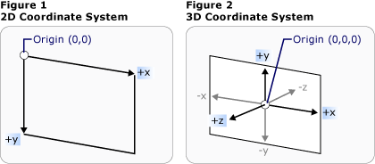
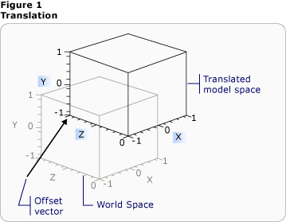
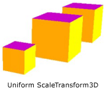
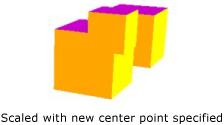
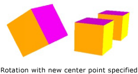
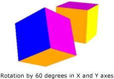

# 3-D Transformations Overview
This topic describes how to apply transformations to 3-D models in the [!INCLUDE[TLA#tla_winclient](../../../../includes/tlasharptla-winclient-md.md)] graphics system. Transformations allow the developer to reposition, resize, and reorient models without changing the base values that define them.  
  

  
## 3-D Coordinate Space  
 3-D graphics content in [!INCLUDE[TLA#tla_winclient](../../../../includes/tlasharptla-winclient-md.md)] is encapsulated in an element, <xref:System.Windows.Controls.Viewport3D>, that can participate in the two-dimensional element structure. The graphics system treats Viewport3D as a two-dimensional visual element like many others in [!INCLUDE[TLA#tla_winclient](../../../../includes/tlasharptla-winclient-md.md)]. Viewport3D functions as a window—a viewport—into a three-dimensional scene. More accurately, it is a surface on which a 3-D scene is projected.  Although you can use Viewport3D with other 2-D drawing objects in the same scene graph, you cannot interpenetrate 2-D and 3-D objects within a Viewport3D. In the following discussion, the coordinate space described is contained by the Viewport3D element.  
  
 The [!INCLUDE[TLA#tla_winclient](../../../../includes/tlasharptla-winclient-md.md)] coordinate system for 2-D graphics locates the origin in the upper left of the rendering surface (typically the screen). In the 2-D system, positive x-axis values proceed to the right and positive y-axis values proceed downward. In the 3-D coordinate system, however, the origin is located in the center of the screen, with positive x-axis values proceeding to the right but positive y-axis values proceeding upward instead, and positive z-axis values proceeding outward from the origin, toward the viewer.  
  
   
Coordinate System Comparison  
  
 The space defined by these axes is the stationary frame of reference for 3-D objects in [!INCLUDE[TLA#tla_winclient](../../../../includes/tlasharptla-winclient-md.md)]. As you build models in this space and create lights and cameras to view them, it's helpful to distinguish this stationary frame of reference, or "world space," from the local frame of reference you create for each model when you apply transformations to it. Remember also that objects in world space might look entirely different, or not be visible at all, depending on light and camera settings, but the position of the camera does not change the location of objects in world space.  
  
## Transforming Models  
 When you create models, they have a particular location in the scene. To move those models around in the scene, to rotate them, or to change their size, it's not practical to change the vertices that define the models themselves. Instead, just as in 2-D, you apply transformations to models.  
  
 Each model object has a <xref:System.Windows.Media.Media3D.Model3D.Transform%2A> property with which you can move, re-orient, or resize the model. When you apply a transform, you effectively offset all the points of the model by whatever vector or value is specified by the transform. In other words, you've transformed the coordinate space in which the model is defined ("model space"), but you haven't changed the values that make up the model's geometry in the coordinate system of the entire scene ("world space").  
  
## Translation Transformations  
 3-D transformations inherit from the abstract base class <xref:System.Windows.Media.Media3D.Transform3D>; these include the affine transform classes <xref:System.Windows.Media.Media3D.TranslateTransform3D>, <xref:System.Windows.Media.Media3D.ScaleTransform3D>, and <xref:System.Windows.Media.Media3D.RotateTransform3D>. The [!INCLUDE[TLA#tla_winclient](../../../../includes/tlasharptla-winclient-md.md)] 3-D system also provides a <xref:System.Windows.Media.Media3D.MatrixTransform3D> class that lets you specify the same transformations in more concise matrix operations.  
  
 <xref:System.Windows.Media.Media3D.TranslateTransform3D> moves all the points in the Model3D in the direction of the offset vector you specify with the <xref:System.Windows.Media.Media3D.TranslateTransform3D.OffsetX%2A>, <xref:System.Windows.Media.Media3D.TranslateTransform3D.OffsetY%2A>, and <xref:System.Windows.Media.Media3D.TranslateTransform3D.OffsetZ%2A> properties. For example, given one vertex of a cube at (2,2,2), an offset vector of (0,1.6,1) would move that vertex (2,2,2) to (2,3.6,3). The cube's vertex is still (2,2,2) in model space, but now that model space has changed its relationship to world space so that (2,2,2) in model space is (2,3.6,3) in world space.  
  
   
Translation with Offset  
  
 The following code examples show how to apply a translation.  
  
 [!code-xaml[animation3dgallery_snip#Translation3DAnimationExampleWholePage](../../../../samples/snippets/csharp/VS_Snippets_Wpf/Animation3DGallery_snip/CS/Translation3DAnimationExample.xaml#translation3danimationexamplewholepage)]  
  
## Scale Transformations  
 <xref:System.Windows.Media.Media3D.ScaleTransform3D> changes the model's scale by a specified scale vector with reference to a center point. Specify a uniform scale, which scales the model by the same value in the X, Y, and Z axes, to change the model's size proportionally. For example, setting the transform's <xref:System.Windows.Media.ScaleTransform.ScaleX%2A>, <xref:System.Windows.Media.ScaleTransform.ScaleY%2A>, and <xref:System.Windows.Media.Media3D.ScaleTransform3D.ScaleZ%2A> properties to 0.5 halves the size of the model; setting the same properties to 2 doubles its scale in all three axes.  
  
   
ScaleVector Example  
  
 By specifying a non-uniform scale transformation—a scale transformation whose X, Y, and Z values are not all the same—you can cause a model to stretch or contract in one or two dimensions without affecting the others. For example, setting <xref:System.Windows.Media.ScaleTransform.ScaleX%2A> to 1, <xref:System.Windows.Media.ScaleTransform.ScaleY%2A> to 2, and <xref:System.Windows.Media.Media3D.ScaleTransform3D.ScaleZ%2A> to 1 would cause the transformed model to double in height but remain unchanged along the X and Z axes.  
  
 By default, ScaleTransform3D causes vertices to expand or contract about the origin (0,0,0). If the model you want to transform is not drawn from the origin, however, scaling the model from the origin will not scale the model "in place." Instead, when the model's vertices are multiplied by the scale vector, the scale operation will have the effect of translating the model as well as scaling it.  
  
   
Scale Center Example  
  
 To scale a model "in place," specify the center of the model by setting the ScaleTransform3D's <xref:System.Windows.Media.ScaleTransform.CenterX%2A>, <xref:System.Windows.Media.ScaleTransform.CenterY%2A>, and <xref:System.Windows.Media.Media3D.ScaleTransform3D.CenterZ%2A> properties. This ensures that the graphics system scales the model space and then translates it to center on the specified <xref:System.Windows.Media.Media3D.Point3D>. Conversely, if you've built the model about the origin and specify a different center point, expect to see the model translated away from the origin.  
  
## Rotation Transformations  
 You can rotate a model in 3-D in several different ways. A typical rotation transformation specifies an axis and an angle of rotation around that axis. The <xref:System.Windows.Media.Media3D.RotateTransform3D> class allows you to define a <xref:System.Windows.Media.Media3D.Rotation3D> with its <xref:System.Windows.Media.Media3D.RotateTransform3D.Rotation%2A> property. You then specify <xref:System.Windows.Media.Media3D.AxisAngleRotation3D.Axis%2A> and <xref:System.Windows.Media.Media3D.AxisAngleRotation3D.Angle%2A> properties on the Rotation3D, in this case an <xref:System.Windows.Media.Media3D.AxisAngleRotation3D>, to define the transformation. The following examples rotate a model by 60 degrees around the Y axis.  
  
 [!code-xaml[animation3dgallery_snip#Rotate3DUsingAxisAngleRotation3DExampleWholePage](../../../../samples/snippets/csharp/VS_Snippets_Wpf/Animation3DGallery_snip/CS/Rotat3DUsingAxisAngleRotation3DExample.xaml#rotate3dusingaxisanglerotation3dexamplewholepage)]  
  
 Note:[!INCLUDE[TLA#tla_winclient](../../../../includes/tlasharptla-winclient-md.md)] 3-D is a right-handed system, which means that a positive angle value for a rotation results in a counter-clockwise rotation about the axis.  
  
 Axis-angle rotations assume rotation about the origin if a value is not specified for the <xref:System.Windows.Media.Media3D.RotateTransform3D.CenterX%2A>, <xref:System.Windows.Media.Media3D.RotateTransform3D.CenterY%2A>, and <xref:System.Windows.Media.Media3D.RotateTransform3D.CenterZ%2A> properties on RotateTransform3D. As with scaling, it's helpful to remember that the rotation transforms the model's entire coordinate space. If the model was not created about the origin, or has been translated previously, the rotation might "pivot" about the origin instead of rotating in place.  
  
   
Rotation with new center specified  
  
 To rotate the model "in place," specify the model's actual center as the center of rotation. Because geometry is typically modeled about the origin, you can most often get the expected result of a set of transformations by first sizing the model (scaling it), then setting its orientation (rotating it), and finally moving it to the desired location (translating it).  
  
   
Rotation Example  
  
 Axis-angle rotations work well for static transformations and some animations. However, consider rotating a cube model 60 degrees around the X axis, then 45 degrees around the Z axis. You can describe this transformation as two discrete affine transformations, or as a matrix. However, it might be difficult to smoothly animate a rotation defined this way. Although the beginning and ending positions of the model computed by either approach are the same, the intermediate positions taken by the model are computationally uncertain. Quaternions represent an alternative way to compute the interpolation between the start and end of a rotation.  
  
 A quaternion represents an axis in 3-D space and a rotation around that axis. For example, a quaternion might represent a (1,1,2) axis and a rotation of 50 degrees. Quaternions’ power in defining rotations comes from the two operations that you can perform on them: composition and interpolation. The composition of two quaternions applied to a geometry means "rotate the geometry around axis2 by rotation2, then rotate it around axis1 by rotation1." By using composition, you can combine the two rotations on the geometry to get a single quaternion that represents the result. Because quaternion interpolation can calculate a smooth and reasonable path from one axis and orientation to another, you can interpolate from the original to the composed quaternion to achieve a smooth transition from one to the other, enabling you to animate the transformation. For models that you want to animate, you can specify a destination <xref:System.Windows.Media.Media3D.Quaternion> for the rotation by using a <xref:System.Windows.Media.Media3D.QuaternionRotation3D> for the <xref:System.Windows.Media.Media3D.RotateTransform3D.Rotation%2A> property.  
  
## Using Transformation Collections  
 When building a scene, it's common to apply more than one transformation to a model. Add transforms to the <xref:System.Windows.Media.Media3D.Transform3DGroup.Children%2A> collection of the <xref:System.Windows.Media.Media3D.Transform3DGroup> class to group transforms conveniently to apply to various models in the scene. It's often convenient to reuse a transformation in several different groups, in much the way that you can reuse a model by applying a different set of transforms to each instance. Note that order in which the transformations are added to the collection is significant: transforms in the collection are applied from first to last.  
  
## Animating Transformations  
 The [!INCLUDE[TLA#tla_winclient](../../../../includes/tlasharptla-winclient-md.md)] 3-D implementation participates in the same timing and animation system as 2-D graphics. In other words, to animate a 3-D scene, animate the properties of its models. It's possible to animate properties of primitives directly, but it's typically easier to animate transformations that change the position or appearance of models. Because transformations can be applied to <xref:System.Windows.Media.Media3D.Model3DGroup> objects as well as individual models, it's possible to apply one set of animations to the children of a Model3Dgroup and another set of animations to a group of objects.  For background information on the [!INCLUDE[TLA#tla_winclient](../../../../includes/tlasharptla-winclient-md.md)] timing and animation system, see [Animation Overview](../../../../docs/framework/wpf/graphics-multimedia/animation-overview.md) and [Storyboards Overview](../../../../docs/framework/wpf/graphics-multimedia/storyboards-overview.md).  
  
 To animate an object in [!INCLUDE[TLA#tla_winclient](../../../../includes/tlasharptla-winclient-md.md)], create a timeline, define an animation (which is really a change in some property value over time), and specify the property to which to apply the animation. This property must be a property of a FrameworkElement. Because all the objects in a 3-D scene are children of Viewport3D, the properties targeted by any animation you want to apply to the scene are properties of properties of Viewport3D. It's important to work out the property path for the animation carefully, because the syntax can be verbose.  
  
 Suppose you want to rotate an object in place, but also to apply a swinging motion to expose more of the object to view. You might choose to apply a RotateTransform3D to the model, and animate the axis of its rotation from one vector to another. The following code example demonstrates applying a <xref:System.Windows.Media.Animation.Vector3DAnimation> to the Axis property of the transformation's Rotation3D, assuming the RotateTransform3D to be one of several transforms applied to the model with a <xref:System.Windows.Media.TransformGroup>.  
  
 [!code-csharp[3doverview#3DOverview3DN1](../../../../samples/snippets/csharp/VS_Snippets_Wpf/3DOverview/CSharp/Window1.xaml.cs#3doverview3dn1)]
 [!code-vb[3doverview#3DOverview3DN1](../../../../samples/snippets/visualbasic/VS_Snippets_Wpf/3DOverview/visualbasic/window1.xaml.vb#3doverview3dn1)]  
  
 [!code-csharp[3doverview#3DOverview3DN3](../../../../samples/snippets/csharp/VS_Snippets_Wpf/3DOverview/CSharp/Window1.xaml.cs#3doverview3dn3)]
 [!code-vb[3doverview#3DOverview3DN3](../../../../samples/snippets/visualbasic/VS_Snippets_Wpf/3DOverview/visualbasic/window1.xaml.vb#3doverview3dn3)]  
  
 Use a similar syntax to target other transformation properties to move or scale the object.  For example, you might apply a <xref:System.Windows.Media.Animation.Point3DAnimation> to the ScaleCenter property on a scale transform to cause a model to smoothly distort its shape.  
  
 Although the preceding examples transform the properties of <xref:System.Windows.Media.Media3D.GeometryModel3D>, it’s also possible to transform the properties of other models in the scene.  By animating translations applied to Light objects, for example, you can create moving light and shadow effects that can dramatically change the appearance of your models.  
  
 Because cameras are also models, it’s possible to transform camera properties as well.  While you can certainly change the appearance of the scene by transforming the camera location or plane distances—in effect, transforming the entire scene projection—note that many of the effects you achieve this way may not make as much "visual sense" to the viewer as transformations applied to the location or position of the models in the scene.  
  
## See Also  
 [3-D Graphics Overview](../../../../docs/framework/wpf/graphics-multimedia/3-d-graphics-overview.md)  
 [Transforms Overview](../../../../docs/framework/wpf/graphics-multimedia/transforms-overview.md)  
 [2-D Transforms Sample](http://go.microsoft.com/fwlink/?LinkID=158252)
