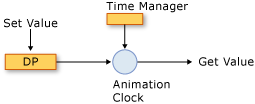
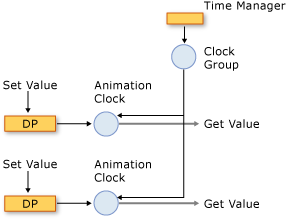
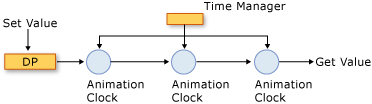

# Animation and Timing System Overview
This topic describes how the timing system uses the animation, <xref:System.Windows.Media.Animation.Timeline>, and <xref:System.Windows.Media.Animation.Clock> classes to animate properties.  
  
   
## Prerequisites  
 To understand this topic, you should be able to use [!INCLUDE[TLA2#tla_winclient](../../../../includes/tla2sharptla-winclient-md.md)] animations to animate properties, as described in the [Animation Overview](../../../../docs/framework/wpf/graphics-multimedia/animation-overview.md). It also helps to be familiar with dependency properties; for more information, see the [Dependency Properties Overview](../../../../docs/framework/wpf/advanced/dependency-properties-overview.md).  
  
   
## Timelines and Clocks  
 The [Animation Overview](../../../../docs/framework/wpf/graphics-multimedia/animation-overview.md) described how a <xref:System.Windows.Media.Animation.Timeline> represents a segment of time, and an animation is a type of <xref:System.Windows.Media.Animation.Timeline> that produces output values. By itself, a <xref:System.Windows.Media.Animation.Timeline>, doesn't do anything other than just describe a segment of time. It's the timeline's <xref:System.Windows.Media.Animation.Clock> object that does the real work. Likewise, animation doesn't actually animate properties: an animation class describes how output values should be calculated, but it’s the <xref:System.Windows.Media.Animation.Clock> that was created for the animation that drives the animation output and applies it to properties.  
  
 A <xref:System.Windows.Media.Animation.Clock> is a special type of object that maintains timing-related run-time state for the <xref:System.Windows.Media.Animation.Timeline>. It provides three bits of information that are essential to the animation and timing system: <xref:System.Windows.Media.Animation.Clock.CurrentTime%2A>, <xref:System.Windows.Media.Animation.Clock.CurrentProgress%2A>, and <xref:System.Windows.Media.Animation.Clock.CurrentState%2A>. A <xref:System.Windows.Media.Animation.Clock> determines its current time, progress, and state by using the timing behaviors described by its <xref:System.Windows.Media.Animation.Timeline>: <xref:System.Windows.Media.Animation.Timeline.Duration%2A>, <xref:System.Windows.Media.Animation.Timeline.RepeatBehavior%2A>, <xref:System.Windows.Media.Animation.Timeline.AutoReverse%2A>, and so on.  
  
 In most cases, a <xref:System.Windows.Media.Animation.Clock> is created automatically for your timeline. When you animate by using a <xref:System.Windows.Media.Animation.Storyboard> or the <xref:System.Windows.Media.Animation.Animatable.BeginAnimation%2A> method, clocks are automatically created for your timelines and animations and applied to their targeted properties. You can also create a <xref:System.Windows.Media.Animation.Clock> explicitly by using the <xref:System.Windows.Media.Animation.Timeline.CreateClock%2A> method of your <xref:System.Windows.Media.Animation.Timeline>. The <xref:System.Windows.Media.MediaTimeline.CreateClock%2A?displayProperty=nameWithType> method creates a clock of the appropriate type for the <xref:System.Windows.Media.Animation.Timeline> on which it is called. If the <xref:System.Windows.Media.Animation.Timeline> contains child timelines, it creates <xref:System.Windows.Media.Animation.Clock> objects for them as well. The resulting <xref:System.Windows.Media.Animation.Clock> objects are arranged in trees that match the structure of the <xref:System.Windows.Media.Animation.Timeline> objects tree from which they are created.  
  
 There are different types of clocks for different types of timelines. The following table shows the <xref:System.Windows.Media.Animation.Clock> types that correspond to some of the different <xref:System.Windows.Media.Animation.Timeline> types.  
  
|Timeline type|Clock type|Clock purpose|  
|-------------------|----------------|-------------------|  
|Animation (inherits from <xref:System.Windows.Media.Animation.AnimationTimeline>)|<xref:System.Windows.Media.Animation.AnimationClock>|Generates output values for a dependency property.|  
|<xref:System.Windows.Media.MediaTimeline>|<xref:System.Windows.Media.MediaClock>|Processes a media file.|  
|<xref:System.Windows.Media.Animation.ParallelTimeline>|<xref:System.Windows.Media.Animation.ClockGroup>|Groups and controls its child <xref:System.Windows.Media.Animation.Clock> objects|  
|<xref:System.Windows.Media.Animation.Storyboard>|<xref:System.Windows.Media.Animation.ClockGroup>|Groups and controls its child <xref:System.Windows.Media.Animation.Clock> objects|  
  
 You can apply any <xref:System.Windows.Media.Animation.AnimationClock> objects you create to compatible dependency properties by using the <xref:System.Windows.Media.Animation.IAnimatable.ApplyAnimationClock%2A> method.  
  
 In performance-intensive scenarios, such as animating large numbers of similar objects, managing your own <xref:System.Windows.Media.Animation.Clock> use can provide performance benefits.  
  
   
## Clocks and the Time Manager  
 When you animate objects in [!INCLUDE[TLA2#tla_winclient](../../../../includes/tla2sharptla-winclient-md.md)], it’s the time manager that manages the <xref:System.Windows.Media.MediaPlayer.Clock%2A> objects created for your timelines. The time manager is the root of a tree of <xref:System.Windows.Media.MediaPlayer.Clock%2A> objects and controls the flow of time in that tree.  A time manager is automatically created for each [!INCLUDE[TLA2#tla_winclient](../../../../includes/tla2sharptla-winclient-md.md)] application and is invisible to the application developer. The time manager "ticks" many times per second; the actual number of ticks that occur each second varies depending on available system resources. During each one of these ticks, the time manager computes the state of all <xref:System.Windows.Media.Animation.ClockState.Active> <xref:System.Windows.Media.Animation.Clock> objects in the timing tree.  
  
 The following illustration shows the relationship between the time manager, and <xref:System.Windows.Media.Animation.AnimationClock>, and an animated dependency property.  
  
   
Animating a property  
  
 When the time manager ticks, it updates the time of every <xref:System.Windows.Media.Animation.ClockState.Active> <xref:System.Windows.Media.Animation.Clock> in the application. If the <xref:System.Windows.Media.Animation.Clock> is an <xref:System.Windows.Media.Animation.AnimationClock>, it uses the <xref:System.Windows.Media.Animation.AnimationTimeline.GetCurrentValue%2A> method of the <xref:System.Windows.Media.Animation.AnimationTimeline> from which it was created to calculate its current output value. The <xref:System.Windows.Media.Animation.AnimationClock> supplies the <xref:System.Windows.Media.Animation.AnimationTimeline> with the current local time, an input value, which is typically the base value of the property, and a default destination value. When you retrieve the value of an animated by property using the <xref:System.Windows.DependencyObject.GetValue%2A> method or its CLR accessor, you get the output of its <xref:System.Windows.Media.Animation.AnimationClock>.  
  
#### Clock Groups  
 The preceding section described how there are different types of <xref:System.Windows.Media.Animation.Clock> objects for different types of timelines. The following illustration shows the relationship between the time manager, a <xref:System.Windows.Media.Animation.ClockGroup>, an <xref:System.Windows.Media.Animation.AnimationClock>, and an animated dependency property. A <xref:System.Windows.Media.Animation.ClockGroup> is created for timelines that group other timelines, such as the <xref:System.Windows.Media.Animation.Storyboard> class, which groups animations and other timelines.  
  
   
A ClockGroup  
  
#### Composition  
 It's possible to associate multiple clocks with a single property, in which case each clock uses the output value of the preceding clock as its base value. The following illustration shows three <xref:System.Windows.Media.Animation.AnimationClock> objects applied to the same property. Clock1 uses the base value of the animated property as its input and uses it to generate output. Clock2 takes the output from Clock1 as its input and uses it to generate output. Clock3 takes the output from Clock2 as its input and uses it to generate output. When multiple clocks affect the same property simultaneously, they are said to be in a composition chain.  
  
   
A composition chain  
  
 Note that although a relationship is created among the input and output of the <xref:System.Windows.Media.Animation.AnimationClock> objects in the composition chain, their timing behaviors are not affected; <xref:System.Windows.Media.Animation.Clock> objects (including <xref:System.Windows.Media.Animation.AnimationClock> objects) have a hierarchical dependency on their parent <xref:System.Windows.Media.Animation.Clock> objects.  
  
 To apply multiple clocks to the same property, use the <xref:System.Windows.Media.Animation.HandoffBehavior.Compose> <xref:System.Windows.Media.Animation.HandoffBehavior> when applying a <xref:System.Windows.Media.Animation.Storyboard>, animation, or <xref:System.Windows.Media.Animation.AnimationClock>.  
  
#### Ticks and Event Consolidation  
 In addition to calculating output values, the time manager does other work every time it ticks: it determines the state of each clock and raises events as appropriate.  
  
 While ticks occur frequently, it's possible for a lot of things to happen between ticks. For example, a <xref:System.Windows.Media.Animation.Clock> might be stopped, started, and stopped again, in which case its <xref:System.Windows.Media.Animation.Clock.CurrentState%2A> value will have changed three times. In theory, the <xref:System.Windows.Media.Animation.Clock.CurrentStateInvalidated> event could be raised multiple times in a single tick; however, the timing engine consolidates events, so that the <xref:System.Windows.Media.Animation.Clock.CurrentStateInvalidated> event can be raised at most once per tick. This is true for all timing events: at most one event of each type is raised for a given <xref:System.Windows.Media.Animation.Clock> object.  
  
 When a <xref:System.Windows.Media.Animation.Clock> switches states and returns back to its original state between ticks (such as changing from <xref:System.Windows.Media.Animation.ClockState.Active> to <xref:System.Windows.Media.Animation.ClockState.Stopped> and back to <xref:System.Windows.Media.Animation.ClockState.Active>), the associated event still occurs.  
  
 For more information about timing events, see the [Timing Events Overview](../../../../docs/framework/wpf/graphics-multimedia/timing-events-overview.md).  
  
   
## Current Values and Base Values of Properties  
 An animatable property can have two values: a base value and a current value. When you set property using its CLR accessor or the <xref:System.Windows.DependencyObject.SetValue%2A> method, you set its base value. When a property is not animated, its base and current values are the same.  
  
 When you animate a property, the <xref:System.Windows.Media.Animation.AnimationClock> sets the property's *current* value. Retrieving the property's value through its CLR accessor or the <xref:System.Windows.DependencyObject.GetValue%2A> method returns the output of the <xref:System.Windows.Media.Animation.AnimationClock> when the <xref:System.Windows.Media.Animation.AnimationClock> is <xref:System.Windows.Media.Animation.ClockState.Active> or <xref:System.Windows.Media.Animation.ClockState.Filling>. You can retrieve the property's base value by using the <xref:System.Windows.Media.Animation.IAnimatable.GetAnimationBaseValue%2A> method.  
  
## See Also  
 [Animation Overview](../../../../docs/framework/wpf/graphics-multimedia/animation-overview.md)  
 [Timing Events Overview](../../../../docs/framework/wpf/graphics-multimedia/timing-events-overview.md)  
 [Timing Behaviors Overview](../../../../docs/framework/wpf/graphics-multimedia/timing-behaviors-overview.md)
