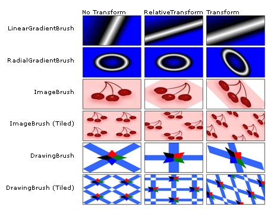
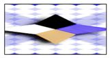
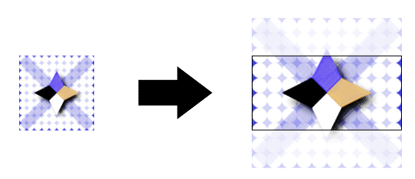
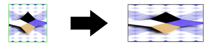

# Brush Transformation Overview
The Brush class provides two transformation properties: <xref:System.Windows.Media.Brush.Transform%2A> and <xref:System.Windows.Media.Brush.RelativeTransform%2A>. The properties enable you to rotate, scale, skew, and translate a brush's contents. This topic describes the differences between these two properties and provides examples of their usage.  
  
   
## Prerequisites  
 To understand this topic, you should understand the features of the brush that you are transforming. For <xref:System.Windows.Media.LinearGradientBrush> and <xref:System.Windows.Media.RadialGradientBrush>, see the [Painting with Solid Colors and Gradients Overview](../../../../docs/framework/wpf/graphics-multimedia/painting-with-solid-colors-and-gradients-overview.md). For <xref:System.Windows.Media.ImageBrush>, <xref:System.Windows.Media.DrawingBrush>, or <xref:System.Windows.Media.VisualBrush>, see  [Painting with Images, Drawings, and Visuals](../../../../docs/framework/wpf/graphics-multimedia/painting-with-images-drawings-and-visuals.md). You should also be familiar with the 2D transforms described in the  [Transforms Overview](../../../../docs/framework/wpf/graphics-multimedia/transforms-overview.md).  
  
   
## Differences between the Transform and RelativeTransform Properties  
 When you apply a transform to a brush's <xref:System.Windows.Media.Brush.Transform%2A> property, you need to know the size of the painted area if you want to transform the brush contents about its center. Suppose the painted area is 200 device independent pixels wide and 150 tall.  If you used a <xref:System.Windows.Media.RotateTransform> to rotate the brush's output 45 degrees about its center, you'd give the <xref:System.Windows.Media.RotateTransform> a <xref:System.Windows.Media.RotateTransform.CenterX%2A> of 100 and a <xref:System.Windows.Media.RotateTransform.CenterY%2A> of 75.  
  
 When you apply a transform to a brush's <xref:System.Windows.Media.Brush.RelativeTransform%2A> property, that transform is applied to the brush before its output is mapped to the painted area. The following list describes the order in which a brush’s contents are processed and transformed.  
  
1.  Process the brush’s contents. For a <xref:System.Windows.Media.GradientBrush>, this means determining the gradient area. For a <xref:System.Windows.Media.TileBrush>, the <xref:System.Windows.Media.TileBrush.Viewbox%2A> is mapped to the <xref:System.Windows.Media.TileBrush.Viewport%2A>. This becomes the brush’s output.  
  
2.  Project the brush’s output onto the 1 x 1 transformation rectangle.  
  
3.  Apply the brush’s <xref:System.Windows.Media.Brush.RelativeTransform%2A>, if it has one.  
  
4.  Project the transformed output onto the area to paint.  
  
5.  Apply the brush’s <xref:System.Windows.Media.Transform>, if it has one.  
  
 Because the <xref:System.Windows.Media.Brush.RelativeTransform%2A> is applied while the brush’s output is mapped to a 1 x 1 rectangle, transform center and offset values appear to be relative. For example, if you used a <xref:System.Windows.Media.RotateTransform> to rotate the brush's output 45 degrees about its center, you'd give the <xref:System.Windows.Media.RotateTransform> a <xref:System.Windows.Media.RotateTransform.CenterX%2A> of 0.5 and a <xref:System.Windows.Media.RotateTransform.CenterY%2A> of 0.5.  
  
 The following illustration shows the output of several brushes that have been rotated by 45 degrees using the <xref:System.Windows.Media.Brush.RelativeTransform%2A> and <xref:System.Windows.Media.Brush.Transform%2A> properties.  
  
   
  
   
## Using RelativeTransform with a TileBrush  
 Because tile brushes are more complex than other brushes, applying a <xref:System.Windows.Media.Brush.RelativeTransform%2A> to one might produce unexpected results. For example, take the following image.  
  
   
  
 The following example uses an <xref:System.Windows.Media.ImageBrush> to paint a rectangular area with the preceding image. It applies a <xref:System.Windows.Media.RotateTransform> to the <xref:System.Windows.Media.ImageBrush> object's <xref:System.Windows.Media.Brush.RelativeTransform%2A> property, and sets its <xref:System.Windows.Media.TileBrush.Stretch%2A> property to <xref:System.Windows.Media.Stretch.UniformToFill>, which should preserve the image's aspect ratio when it is stretched to completely fill the rectangle.  
  
 [!code-xaml[BrushOverviewExamples_snip#GraphicsMMRelativeTransformExample2Inline](../../../../samples/snippets/xaml/VS_Snippets_Wpf/BrushOverviewExamples_snip/XAML/RelativeTransformIllustration.xaml#graphicsmmrelativetransformexample2inline)]  
  
 This example produces the following output:  
  
   
  
 Notice that the image is distorted, even though the brush's <xref:System.Windows.Media.TileBrush.Stretch%2A> was set to <xref:System.Windows.Media.Stretch.UniformToFill>. That's because the relative transform is applied after the brush's <xref:System.Windows.Media.TileBrush.Viewbox%2A> is mapped to its <xref:System.Windows.Media.TileBrush.Viewport%2A>. The following list describes each step of the process:  
  
1.  Project the brush's contents (<xref:System.Windows.Media.TileBrush.Viewbox%2A>) onto its base tile (<xref:System.Windows.Media.TileBrush.Viewport%2A>) using the brush's <xref:System.Windows.Media.TileBrush.Stretch%2A> setting.  
  
       
  
2.  Project the base tile onto the 1 x 1 transformation rectangle.  
  
       
  
3.  Apply the <xref:System.Windows.Media.RotateTransform>.  
  
       
  
4.  Project the transformed base tile onto the area to paint.  
  
       
  
   
## Example: Rotate an ImageBrush 45 Degrees  
 The following example applies a <xref:System.Windows.Media.RotateTransform> to the <xref:System.Windows.Media.Brush.RelativeTransform%2A> property of an <xref:System.Windows.Media.ImageBrush>. The <xref:System.Windows.Media.RotateTransform> object's <xref:System.Windows.Media.RotateTransform.CenterX%2A> and <xref:System.Windows.Media.RotateTransform.CenterY%2A> properties are both set to 0.5, the relative coordinates of the content's center point. As a result, the brush's contents are rotated about its center.  
  
 [!code-csharp[BrushesIntroduction_snip#ImageBrushRelativeTransformExample](../../../../samples/snippets/csharp/VS_Snippets_Wpf/BrushesIntroduction_snip/CSharp/BrushTransformExample.cs#imagebrushrelativetransformexample)]
 [!code-vb[BrushesIntroduction_snip#ImageBrushRelativeTransformExample](../../../../samples/snippets/visualbasic/VS_Snippets_Wpf/BrushesIntroduction_snip/visualbasic/brushtransformexample.vb#imagebrushrelativetransformexample)]
 [!code-xaml[BrushesIntroduction_snip#ImageBrushRelativeTransformExample](../../../../samples/snippets/xaml/VS_Snippets_Wpf/BrushesIntroduction_snip/XAML/BrushTransformExample.xaml#imagebrushrelativetransformexample)]  
  
 The next example also applies a <xref:System.Windows.Media.RotateTransform> to an <xref:System.Windows.Media.ImageBrush>, but uses the <xref:System.Windows.Media.Brush.Transform%2A> property instead of the <xref:System.Windows.Media.Brush.RelativeTransform%2A> property. To rotate the brush about its center, the <xref:System.Windows.Media.RotateTransform> object's <xref:System.Windows.Media.RotateTransform.CenterX%2A> and <xref:System.Windows.Media.RotateTransform.CenterY%2A> must be set to absolute coordinates. Because the rectangle being painted by the brush is 175 by 90 pixels, its center point is (87.5, 45).  
  
 [!code-csharp[BrushesIntroduction_snip#ImageBrushTransformExample](../../../../samples/snippets/csharp/VS_Snippets_Wpf/BrushesIntroduction_snip/CSharp/BrushTransformExample.cs#imagebrushtransformexample)]
 [!code-vb[BrushesIntroduction_snip#ImageBrushTransformExample](../../../../samples/snippets/visualbasic/VS_Snippets_Wpf/BrushesIntroduction_snip/visualbasic/brushtransformexample.vb#imagebrushtransformexample)]
 [!code-xaml[BrushesIntroduction_snip#ImageBrushTransformExample](../../../../samples/snippets/xaml/VS_Snippets_Wpf/BrushesIntroduction_snip/XAML/BrushTransformExample.xaml#imagebrushtransformexample)]  
  
 The following illustration shows the brush without a transform, with the transform applied to the <xref:System.Windows.Media.Brush.RelativeTransform%2A> property, and with the transform applied to the <xref:System.Windows.Media.Brush.Transform%2A> property.  
  
   
  
 This example is part of a larger sample. For the complete sample, see the [Brushes Sample](http://go.microsoft.com/fwlink/?LinkID=159973). For more information about brushes, see the  [WPF Brushes Overview](../../../../docs/framework/wpf/graphics-multimedia/wpf-brushes-overview.md).  
  
## See Also  
 <xref:System.Windows.Media.Brush.Transform%2A>  
 <xref:System.Windows.Media.Brush.RelativeTransform%2A>  
 <xref:System.Windows.Media.Transform>  
 <xref:System.Windows.Media.Brush>  
 [Painting with Solid Colors and Gradients Overview](../../../../docs/framework/wpf/graphics-multimedia/painting-with-solid-colors-and-gradients-overview.md)  
 [Painting with Images, Drawings, and Visuals](../../../../docs/framework/wpf/graphics-multimedia/painting-with-images-drawings-and-visuals.md)  
 [Transforms Overview](../../../../docs/framework/wpf/graphics-multimedia/transforms-overview.md)
