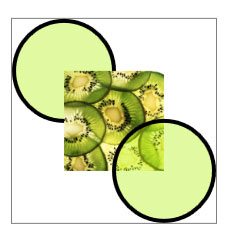
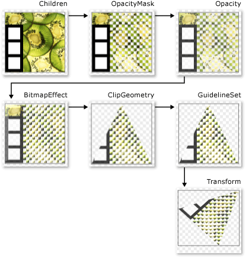
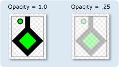
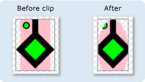
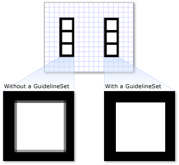
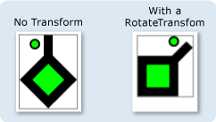
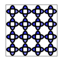

# Drawing Objects Overview
This topic introduces <xref:System.Windows.Media.Drawing> objects and describes how to use them to efficiently draw shapes, bitmaps, text, and media. Use <xref:System.Windows.Media.Drawing> objects when you create clip art, paint with a <xref:System.Windows.Media.DrawingBrush>, or use <xref:System.Windows.Media.Visual> objects.  
  
 
  
   
## What Is a Drawing Object?  
 A <xref:System.Windows.Media.Drawing> object describes visible content, such as a shape, bitmap, video, or a line of text. Different types of drawings describe different types of content. The following is a list of the different types of drawing objects.  
  
-   <xref:System.Windows.Media.GeometryDrawing> – Draws a shape.  
  
-   <xref:System.Windows.Media.ImageDrawing> – Draws an image.  
  
-   <xref:System.Windows.Media.GlyphRunDrawing> – Draws text.  
  
-   <xref:System.Windows.Media.VideoDrawing> – Plays an audio or video file.  
  
-   <xref:System.Windows.Media.DrawingGroup> – Draws other drawings. Use a drawing group to combine other drawings into a single composite drawing.  
  
 <xref:System.Windows.Media.Drawing> objects are versatile; there are many ways you can use a <xref:System.Windows.Media.Drawing> object.  
  
-   You can display it as an image by using a <xref:System.Windows.Media.DrawingImage> and an <xref:System.Windows.Controls.Image> control.  
  
-   You can use it with a <xref:System.Windows.Media.DrawingBrush> to paint an object, such as the <xref:System.Windows.Controls.Page.Background%2A> of a <xref:System.Windows.Controls.Page>.  
  
-   You can use it to describe the appearance of a <xref:System.Windows.Media.DrawingVisual>.  
  
-   You can use it to enumerate the contents of a <xref:System.Windows.Media.Visual>.  
  
 WPF provides other types of objects that are capable of drawing shapes, bitmaps, text, and media. For example, you can also use <xref:System.Windows.Shapes.Shape> objects to draw shapes, and the <xref:System.Windows.Controls.MediaElement> control provides another way to add video to your application. So when should you use <xref:System.Windows.Media.Drawing> objects? When you can sacrifice framework level features to gain performance benefits or when you need <xref:System.Windows.Freezable> features. Because <xref:System.Windows.Media.Drawing> objects lack support for [Layout](../../../../docs/framework/wpf/advanced/layout.md), input, and focus, they provide performance benefits that make them ideal for describing backgrounds, clip art, and for low-level drawing with <xref:System.Windows.Media.Visual> objects.  
  
 Because they are a type <xref:System.Windows.Freezable> object, <xref:System.Windows.Media.Drawing> objects gain several special features, which include the following: they can be declared as [resources](../../../../docs/framework/wpf/advanced/xaml-resources.md), shared among multiple objects, made read-only to improve performance, cloned, and made thread-safe. For more information about the different features provided by <xref:System.Windows.Freezable> objects, see the [Freezable Objects Overview](../../../../docs/framework/wpf/advanced/freezable-objects-overview.md).  
  
   
## Draw a Shape  
 To draw a shape, you use a <xref:System.Windows.Media.GeometryDrawing>. A geometry drawing's <xref:System.Windows.Media.GeometryDrawing.Geometry%2A> property describes the shape to draw, its <xref:System.Windows.Media.GeometryDrawing.Brush%2A> property describes how the interior of the shape should be painted, and its <xref:System.Windows.Media.GeometryDrawing.Pen%2A> property describes how its outline should be drawn.  
  
 The following example uses a <xref:System.Windows.Media.GeometryDrawing> to draw a shape. The shape is described by a <xref:System.Windows.Media.GeometryGroup> and two <xref:System.Windows.Media.EllipseGeometry> objects. The shape's interior is painted with a <xref:System.Windows.Media.LinearGradientBrush> and its outline is drawn with a <xref:System.Windows.Media.Brushes.Black%2A> <xref:System.Windows.Media.Pen>.  
  
 This example creates the following <xref:System.Windows.Media.GeometryDrawing>.  
  
   
A GeometryDrawing  
  
 [!code-csharp[DrawingMiscSnippets_snip#GeometryDrawingExampleInline](../../../../samples/snippets/csharp/VS_Snippets_Wpf/DrawingMiscSnippets_snip/CSharp/GeometryDrawingExample.cs#geometrydrawingexampleinline)]
 [!code-xaml[DrawingMiscSnippets_snip#GeometryDrawingExampleInline](../../../../samples/snippets/xaml/VS_Snippets_Wpf/DrawingMiscSnippets_snip/XAML/GeometryDrawingExample.xaml#geometrydrawingexampleinline)]  
  
 For the complete example, see [Create a GeometryDrawing](../../../../docs/framework/wpf/graphics-multimedia/how-to-create-a-geometrydrawing.md).  
  
 Other <xref:System.Windows.Media.Geometry> classes, such as <xref:System.Windows.Media.PathGeometry> enable you to create more complex shapes by creating curves and arcs. For more information about <xref:System.Windows.Media.Geometry> objects, see the [Geometry Overview](../../../../docs/framework/wpf/graphics-multimedia/geometry-overview.md).  
  
 For more information about other ways to draw shapes that don't use <xref:System.Windows.Media.Drawing> objects, see [Shapes and Basic Drawing in WPF Overview](../../../../docs/framework/wpf/graphics-multimedia/shapes-and-basic-drawing-in-wpf-overview.md).  
  
   
## Draw an Image  
 To draw an image, you use an <xref:System.Windows.Media.ImageDrawing>. An <xref:System.Windows.Media.ImageDrawing> object's  <xref:System.Windows.Media.ImageDrawing.ImageSource%2A> property describes the image to draw, and its <xref:System.Windows.Media.ImageDrawing.Rect%2A> property defines the region where the image is drawn.  
  
 The following example draws an image into a rectangle located at (75,75) that is 100 by 100 pixel. The following illustration shows the <xref:System.Windows.Media.ImageDrawing> created by the example. A gray border was added to show the bounds of the <xref:System.Windows.Media.ImageDrawing>.  
  
   
A 100 by 100 ImageDrawing  
  
 [!code-csharp[DrawingMiscSnippets_snip#ImageDrawing100by100Inline](../../../../samples/snippets/csharp/VS_Snippets_Wpf/DrawingMiscSnippets_snip/CSharp/ImageDrawingExample.cs#imagedrawing100by100inline)]
 [!code-xaml[DrawingMiscSnippets_snip#ImageDrawing100by100Inline](../../../../samples/snippets/xaml/VS_Snippets_Wpf/DrawingMiscSnippets_snip/XAML/ImageDrawingExample.xaml#imagedrawing100by100inline)]  
  
 For more information about images, see the [Imaging Overview](../../../../docs/framework/wpf/graphics-multimedia/imaging-overview.md).  
  
   
## Play Media (Code Only)  
  
> [!NOTE]
>  Although you can declare a <xref:System.Windows.Media.VideoDrawing> in [!INCLUDE[TLA#tla_xaml](../../../../includes/tlasharptla-xaml-md.md)], you can only load and play its media using code. To play video in [!INCLUDE[TLA#tla_xaml](../../../../includes/tlasharptla-xaml-md.md)], use a <xref:System.Windows.Controls.MediaElement> instead.  
  
 To play an audio or video file, you use a <xref:System.Windows.Media.VideoDrawing> and a <xref:System.Windows.Media.MediaPlayer>. There are two ways to load and play media. The first is to use a <xref:System.Windows.Media.MediaPlayer> and a <xref:System.Windows.Media.VideoDrawing> by themselves, and the second way is to create your own <xref:System.Windows.Media.MediaTimeline> to use with the <xref:System.Windows.Media.MediaPlayer> and <xref:System.Windows.Media.VideoDrawing>.  
  
> [!NOTE]
>  When distributing media with your application, you cannot use a media file as a project resource, like you would an image. In your project file, you must instead set the media type to `Content` and set `CopyToOutputDirectory` to `PreserveNewest` or `Always`.  
  
 To play media without creating your own <xref:System.Windows.Media.MediaTimeline>, you perform the following steps.  
  
1.  Create a <xref:System.Windows.Media.MediaPlayer> object.  
  
     [!code-csharp[DrawingMiscSnippets_snip#VideoDrawingExampleInline1](../../../../samples/snippets/csharp/VS_Snippets_Wpf/DrawingMiscSnippets_snip/CSharp/VideoDrawingExample.cs#videodrawingexampleinline1)]  
  
2.  Use the <xref:System.Windows.Media.MediaPlayer.Open%2A> method to load the media file.  
  
     [!code-csharp[DrawingMiscSnippets_snip#VideoDrawingExampleInline2](../../../../samples/snippets/csharp/VS_Snippets_Wpf/DrawingMiscSnippets_snip/CSharp/VideoDrawingExample.cs#videodrawingexampleinline2)]  
  
3.  Create a <xref:System.Windows.Media.VideoDrawing>.  
  
     [!code-csharp[DrawingMiscSnippets_snip#VideoDrawingExampleInline3](../../../../samples/snippets/csharp/VS_Snippets_Wpf/DrawingMiscSnippets_snip/CSharp/VideoDrawingExample.cs#videodrawingexampleinline3)]  
  
4.  Specify the size and location to draw the media by setting the <xref:System.Windows.Media.VideoDrawing.Rect%2A> property of the <xref:System.Windows.Media.VideoDrawing>.  
  
     [!code-csharp[DrawingMiscSnippets_snip#VideoDrawingExampleInline4](../../../../samples/snippets/csharp/VS_Snippets_Wpf/DrawingMiscSnippets_snip/CSharp/VideoDrawingExample.cs#videodrawingexampleinline4)]  
  
5.  Set the <xref:System.Windows.Media.VideoDrawing.Player%2A> property of the <xref:System.Windows.Media.VideoDrawing> with the <xref:System.Windows.Media.MediaPlayer> you created.  
  
     [!code-csharp[DrawingMiscSnippets_snip#VideoDrawingExampleInline5](../../../../samples/snippets/csharp/VS_Snippets_Wpf/DrawingMiscSnippets_snip/CSharp/VideoDrawingExample.cs#videodrawingexampleinline5)]  
  
6.  Use the <xref:System.Windows.Media.MediaPlayer.Play%2A> method of the <xref:System.Windows.Media.MediaPlayer> to start playing the media.  
  
     [!code-csharp[DrawingMiscSnippets_snip#VideoDrawingExampleInline6](../../../../samples/snippets/csharp/VS_Snippets_Wpf/DrawingMiscSnippets_snip/CSharp/VideoDrawingExample.cs#videodrawingexampleinline6)]  
  
 The following example uses a <xref:System.Windows.Media.VideoDrawing> and a <xref:System.Windows.Media.MediaPlayer> to play a video file once.  
  
 [!code-csharp[DrawingMiscSnippets_snip#VideoDrawingExampleInline](../../../../samples/snippets/csharp/VS_Snippets_Wpf/DrawingMiscSnippets_snip/CSharp/VideoDrawingExample.cs#videodrawingexampleinline)]  
  
 To gain additional timing control over the media, use a <xref:System.Windows.Media.MediaTimeline> with the <xref:System.Windows.Media.MediaPlayer> and <xref:System.Windows.Media.VideoDrawing> objects. The <xref:System.Windows.Media.MediaTimeline> enables you to specify whether the video should repeat. To use a <xref:System.Windows.Media.MediaTimeline> with a <xref:System.Windows.Media.VideoDrawing>, you perform the following steps:  
  
1.  Declare the <xref:System.Windows.Media.MediaTimeline> and set its timing behaviors.  
  
     [!code-csharp[DrawingMiscSnippets_snip#RepeatingVideoDrawingExampleInline1](../../../../samples/snippets/csharp/VS_Snippets_Wpf/DrawingMiscSnippets_snip/CSharp/VideoDrawingExample.cs#repeatingvideodrawingexampleinline1)]  
  
2.  Create a <xref:System.Windows.Media.MediaClock> from the <xref:System.Windows.Media.MediaTimeline>.  
  
     [!code-csharp[DrawingMiscSnippets_snip#RepeatingVideoDrawingExampleInline2](../../../../samples/snippets/csharp/VS_Snippets_Wpf/DrawingMiscSnippets_snip/CSharp/VideoDrawingExample.cs#repeatingvideodrawingexampleinline2)]  
  
3.  Create a <xref:System.Windows.Media.MediaPlayer> and use the <xref:System.Windows.Media.MediaClock> to set its <xref:System.Windows.Media.MediaPlayer.Clock%2A> property.  
  
     [!code-csharp[DrawingMiscSnippets_snip#RepeatingVideoDrawingExampleInline3](../../../../samples/snippets/csharp/VS_Snippets_Wpf/DrawingMiscSnippets_snip/CSharp/VideoDrawingExample.cs#repeatingvideodrawingexampleinline3)]  
  
4.  Create a <xref:System.Windows.Media.VideoDrawing> and assign the <xref:System.Windows.Media.MediaPlayer> to the <xref:System.Windows.Media.VideoDrawing.Player%2A> property of the <xref:System.Windows.Media.VideoDrawing>.  
  
     [!code-csharp[DrawingMiscSnippets_snip#RepeatingVideoDrawingExampleInline4](../../../../samples/snippets/csharp/VS_Snippets_Wpf/DrawingMiscSnippets_snip/CSharp/VideoDrawingExample.cs#repeatingvideodrawingexampleinline4)]  
  
 The following example uses a <xref:System.Windows.Media.MediaTimeline> with a <xref:System.Windows.Media.MediaPlayer> and a <xref:System.Windows.Media.VideoDrawing> to play a video repeatedly.  
  
 [!code-csharp[DrawingMiscSnippets_snip#RepeatingVideoDrawingExampleInline](../../../../samples/snippets/csharp/VS_Snippets_Wpf/DrawingMiscSnippets_snip/CSharp/VideoDrawingExample.cs#repeatingvideodrawingexampleinline)]  
  
 Note that, when you use a <xref:System.Windows.Media.MediaTimeline>, you use the interactive <xref:System.Windows.Media.Animation.ClockController> returned from the <xref:System.Windows.Media.Animation.Clock.Controller%2A> property of the <xref:System.Windows.Media.MediaClock> to control media playback instead of the interactive methods of <xref:System.Windows.Media.MediaPlayer>.  
  
   
## Draw Text  
 To draw text, you use a <xref:System.Windows.Media.GlyphRunDrawing> and a <xref:System.Windows.Media.GlyphRun>. The following example uses a <xref:System.Windows.Media.GlyphRunDrawing> to draw the text "Hello World".  
  
 [!code-csharp[DrawingMiscSnippets_snip#GlyphRunDrawingExampleInline](../../../../samples/snippets/csharp/VS_Snippets_Wpf/DrawingMiscSnippets_snip/CSharp/GlyphRunDrawingExample.cs#glyphrundrawingexampleinline)]
 [!code-xaml[DrawingMiscSnippets_snip#GlyphRunDrawingExampleInline](../../../../samples/snippets/xaml/VS_Snippets_Wpf/DrawingMiscSnippets_snip/XAML/GlyphRunExample.xaml#glyphrundrawingexampleinline)]  
  
 A <xref:System.Windows.Media.GlyphRun> is a low-level object intended for use with fixed-format document presentation and print scenarios. A simpler way to draw text to the screen is to use a <xref:System.Windows.Controls.Label> or a <xref:System.Windows.Controls.TextBlock>. For more information about <xref:System.Windows.Media.GlyphRun>, see the [Introduction to the GlyphRun Object and Glyphs Element](../../../../docs/framework/wpf/advanced/introduction-to-the-glyphrun-object-and-glyphs-element.md) overview.  
  
   
## Composite Drawings  
 A <xref:System.Windows.Media.DrawingGroup> enables you to combine multiple drawings into a single composite drawing. By using a <xref:System.Windows.Media.DrawingGroup>, you can combine shapes, images, and text into a single <xref:System.Windows.Media.Drawing> object.  
  
 The following example uses a <xref:System.Windows.Media.DrawingGroup> to combine two <xref:System.Windows.Media.GeometryDrawing> objects and an <xref:System.Windows.Media.ImageDrawing> object. This example produces the following output.  
  
   
A composite drawing  
  
 [!code-csharp[DrawingMiscSnippets_snip#GraphicsMMSimpleDrawingGroupExample](../../../../samples/snippets/csharp/VS_Snippets_Wpf/DrawingMiscSnippets_snip/CSharp/DrawingGroupExample.cs#graphicsmmsimpledrawinggroupexample)]
 [!code-xaml[DrawingMiscSnippets_snip#GraphicsMMSimpleDrawingGroupExample](../../../../samples/snippets/xaml/VS_Snippets_Wpf/DrawingMiscSnippets_snip/XAML/DrawingGroupExample.xaml#graphicsmmsimpledrawinggroupexample)]  
  
 A <xref:System.Windows.Media.DrawingGroup> also enables you to apply opacity masks, transforms, bitmap effects, and other operations to its contents. <xref:System.Windows.Media.DrawingGroup> operations are applied in the following order: <xref:System.Windows.Media.DrawingGroup.OpacityMask%2A>, <xref:System.Windows.Media.DrawingGroup.Opacity%2A>, <xref:System.Windows.Media.DrawingGroup.BitmapEffect%2A>, <xref:System.Windows.Media.DrawingGroup.ClipGeometry%2A>, <xref:System.Windows.Media.DrawingGroup.GuidelineSet%2A>, and then <xref:System.Windows.Media.DrawingGroup.Transform%2A>.  
  
 The following illustration shows the order in which <xref:System.Windows.Media.DrawingGroup> operations are applied.  
  
   
Order of DrawingGroup operations  
  
 The following table describes the properties you can use to manipulate a <xref:System.Windows.Media.DrawingGroup> object's contents.  
  
|Property|Description|Illustration|  
|--------------|-----------------|------------------|  
|<xref:System.Windows.Media.DrawingGroup.OpacityMask%2A>|Alters the opacity of selected portions of the <xref:System.Windows.Media.DrawingGroup> contents. For an example, see [How to: Control the Opacity of a Drawing](http://msdn.microsoft.com/library/68580652-7d32-4d27-93cc-a5148cf4d5ee).||  
|<xref:System.Windows.Media.DrawingGroup.Opacity%2A>|Uniformly changes the opacity of the <xref:System.Windows.Media.DrawingGroup> contents. Use this property to make a <xref:System.Windows.Media.Drawing> transparent or partially transparent. For an example, see [How to: Apply an Opacity Mask to a Drawing](http://msdn.microsoft.com/library/d77b420b-9be2-479c-a45e-82f4da30eb9f).||  
|<xref:System.Windows.Media.DrawingGroup.BitmapEffect%2A>|Applies a <xref:System.Windows.Media.Effects.BitmapEffect> to the <xref:System.Windows.Media.DrawingGroup> contents. For an example, see [How to: Apply a BitmapEffect to a Drawing](http://msdn.microsoft.com/library/c5b1de83-8d09-47fb-96db-5f174471f4b5).||  
|<xref:System.Windows.Media.DrawingGroup.ClipGeometry%2A>|Clips the <xref:System.Windows.Media.DrawingGroup> contents to a region you describe using a <xref:System.Windows.Media.Geometry>. For an example, see [How to: Clip a Drawing](http://msdn.microsoft.com/library/1f7d8a2c-c3c2-42cb-a542-e6796f9fb058) .||  
|<xref:System.Windows.Media.DrawingGroup.GuidelineSet%2A>|Snaps device independent pixels to device pixels along the specified guidelines. This property is useful for ensuring that finely detailed graphics render sharply on low-DPI displays. For an example, see [Apply a GuidelineSet to a Drawing](../../../../docs/framework/wpf/graphics-multimedia/how-to-apply-a-guidelineset-to-a-drawing.md).||  
|<xref:System.Windows.Media.DrawingGroup.Transform%2A>|Transforms the <xref:System.Windows.Media.DrawingGroup> contents. For an example, see [How to: Apply a Transform to a Drawing](http://msdn.microsoft.com/library/0d525f2b-682d-4d67-9660-cf46929fbabd).||  
  
   
## Display a Drawing as an Image  
 To display a <xref:System.Windows.Media.Drawing> with an <xref:System.Windows.Controls.Image> control, use a <xref:System.Windows.Media.DrawingImage> as the <xref:System.Windows.Controls.Image> control's <xref:System.Windows.Controls.Image.Source%2A> and set the <xref:System.Windows.Media.DrawingImage> object's <xref:System.Windows.Media.DrawingImage.Drawing%2A?displayProperty=nameWithType> property to the drawing you want to display.  
  
 The following example uses a <xref:System.Windows.Media.DrawingImage> and an <xref:System.Windows.Controls.Image> control to display a <xref:System.Windows.Media.GeometryDrawing>. This example produces the following output.  
  
   
A DrawingImage  
  
 [!code-csharp[DrawingMiscSnippets_snip#DrawingImageExampleWholePage](../../../../samples/snippets/csharp/VS_Snippets_Wpf/DrawingMiscSnippets_snip/CSharp/DrawingImageExample.cs#drawingimageexamplewholepage)]
 [!code-xaml[DrawingMiscSnippets_snip#DrawingImageExampleWholePage](../../../../samples/snippets/xaml/VS_Snippets_Wpf/DrawingMiscSnippets_snip/XAML/DrawingImageExample.xaml#drawingimageexamplewholepage)]  
  
   
## Paint an Object with a Drawing  
 A <xref:System.Windows.Media.DrawingBrush> is a type of brush that paints an area with a drawing object. You can use it to paint just about any graphical object with a drawing. The <xref:System.Windows.Media.Drawing> property of a <xref:System.Windows.Media.DrawingBrush> describes its <xref:System.Windows.Media.DrawingBrush.Drawing%2A>. To render a <xref:System.Windows.Media.Drawing> with a <xref:System.Windows.Media.DrawingBrush>, add it to the brush using the brush's <xref:System.Windows.Media.Drawing> property and use the brush to paint a graphical object, such as a control or panel.  
  
 The following examples uses a <xref:System.Windows.Media.DrawingBrush> to paint the <xref:System.Windows.Shapes.Shape.Fill%2A> of a <xref:System.Windows.Shapes.Rectangle> with a pattern created from a <xref:System.Windows.Media.GeometryDrawing>. This example produces the following output.  
  
   
A GeometryDrawing used with a DrawingBrush  
  
 [!code-csharp[DrawingMiscSnippets_snip#DrawingBrushExampleWholePage](../../../../samples/snippets/csharp/VS_Snippets_Wpf/DrawingMiscSnippets_snip/CSharp/DrawingBrushExample.cs#drawingbrushexamplewholepage)]
 [!code-xaml[DrawingMiscSnippets_snip#DrawingBrushExampleWholePage](../../../../samples/snippets/xaml/VS_Snippets_Wpf/DrawingMiscSnippets_snip/XAML/DrawingBrushExample.xaml#drawingbrushexamplewholepage)]  
  
 The <xref:System.Windows.Media.DrawingBrush> class provides a variety of options for stretching and tiling its content. For more information about <xref:System.Windows.Media.DrawingBrush>, see the [Painting with Images, Drawings, and Visuals](../../../../docs/framework/wpf/graphics-multimedia/painting-with-images-drawings-and-visuals.md) overview.  
  
   
## Render a Drawing with a Visual  
 A <xref:System.Windows.Media.DrawingVisual> is a type of visual object designed to render a drawing. Working directly at the visual layer is an option for developers who want to build a highly customized graphical environment, and is not described in this overview. For more information, see the [Using DrawingVisual Objects](../../../../docs/framework/wpf/graphics-multimedia/using-drawingvisual-objects.md) overview.  
  
   
## DrawingContext Objects  
 The <xref:System.Windows.Media.DrawingContext> class enables you to populate a <xref:System.Windows.Media.Visual> or a <xref:System.Windows.Media.Drawing> with visual content. Many such lower-level graphics objects use a <xref:System.Windows.Media.DrawingContext> because it describes graphical content very efficiently.  
  
 Although the <xref:System.Windows.Media.DrawingContext> draw methods appear similar to the draw methods of the <xref:System.Drawing.Graphics?displayProperty=nameWithType> type, they are actually very different. <xref:System.Windows.Media.DrawingContext> is used with a retained mode graphics system, while the <xref:System.Drawing.Graphics?displayProperty=nameWithType> type is used with an immediate mode graphics system. When you use a <xref:System.Windows.Media.DrawingContext> object's draw commands, you are actually storing a set of rendering instructions (although the exact storage mechanism depends on the type of object that supplies the <xref:System.Windows.Media.DrawingContext>) that will later be used by the graphics system; you are not drawing to the screen in real-time. For more information about how the [!INCLUDE[TLA#tla_wpf](../../../../includes/tlasharptla-wpf-md.md)] graphics system works, see the [WPF Graphics Rendering Overview](../../../../docs/framework/wpf/graphics-multimedia/wpf-graphics-rendering-overview.md).  
  
 You never directly instantiate a <xref:System.Windows.Media.DrawingContext>; you can, however, acquire a drawing context from certain methods, such as <xref:System.Windows.Media.DrawingGroup.Open%2A?displayProperty=nameWithType> and <xref:System.Windows.Media.DrawingVisual.RenderOpen%2A?displayProperty=nameWithType>.  
  
   
## Enumerate the Contents of a Visual  
 In addition to their other uses, <xref:System.Windows.Media.Drawing> objects also provide an object model for enumerating the contents of a <xref:System.Windows.Media.Visual>.  
  
 The following example uses the <xref:System.Windows.Media.VisualTreeHelper.GetDrawing%2A> method to retrieve the <xref:System.Windows.Media.DrawingGroup> value of a <xref:System.Windows.Media.Visual> and enumerate it.  
  
 [!code-csharp[DrawingMiscSnippets_snip#GraphicsMMRetrieveDrawings](../../../../samples/snippets/csharp/VS_Snippets_Wpf/DrawingMiscSnippets_snip/CSharp/EnumerateDrawingsExample.xaml.cs#graphicsmmretrievedrawings)]  
  
## See Also  
 <xref:System.Windows.Media.Drawing>  
 <xref:System.Windows.Media.DrawingGroup>  
 [2D Graphics and Imaging](../../../../docs/framework/wpf/advanced/optimizing-performance-2d-graphics-and-imaging.md)  
 [Painting with Images, Drawings, and Visuals](../../../../docs/framework/wpf/graphics-multimedia/painting-with-images-drawings-and-visuals.md)  
 [Geometry Overview](../../../../docs/framework/wpf/graphics-multimedia/geometry-overview.md)  
 [Shapes and Basic Drawing in WPF Overview](../../../../docs/framework/wpf/graphics-multimedia/shapes-and-basic-drawing-in-wpf-overview.md)  
 [WPF Graphics Rendering Overview](../../../../docs/framework/wpf/graphics-multimedia/wpf-graphics-rendering-overview.md)  
 [Freezable Objects Overview](../../../../docs/framework/wpf/advanced/freezable-objects-overview.md)  
 [How-to Topics](../../../../docs/framework/wpf/graphics-multimedia/drawings-how-to-topics.md)
