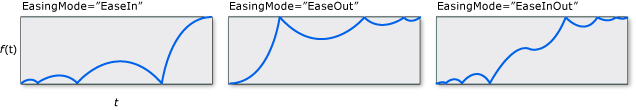
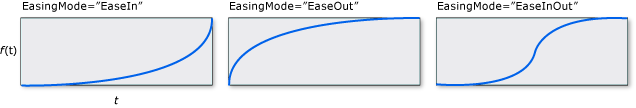
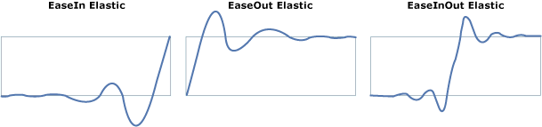

# Easing Functions
Easing functions allow you to apply custom mathematical formulas to your animations. For example, you may want an object to realistically bounce or behave as though it were on a spring. You could use Key-Frame or even From/To/By animations to approximate these effects but it would take a significant amount of work and the animation would be less accurate than using a mathematical formula.  
  
 Besides creating your own custom easing function by inheriting from <xref:System.Windows.Media.Animation.EasingFunctionBase>, you can use one of several easing functions provided by the runtime to create common effects.  
  
-   <xref:System.Windows.Media.Animation.BackEase>: Retracts the motion of an animation slightly before it begins to animate in the path indicated.  
  
-   <xref:System.Windows.Media.Animation.BounceEase>: Creates a bouncing effect.  
  
-   <xref:System.Windows.Media.Animation.CircleEase>: Creates an animation that accelerates and/or decelerates using a circular function.  
  
-   <xref:System.Windows.Media.Animation.CubicEase>: Creates an animation that accelerates and/or decelerates using the formula *f*(*t*) = *t*3.  
  
-   <xref:System.Windows.Media.Animation.ElasticEase>: Creates an animation that resembles a spring oscillating back and forth until it comes to rest.  
  
-   <xref:System.Windows.Media.Animation.ExponentialEase>: Creates an animation that accelerates and/or decelerates using an exponential formula.  
  
-   <xref:System.Windows.Media.Animation.PowerEase>: Creates an animation that accelerates and/or decelerates using the formula *f*(*t*) = *t*p where p is equal to the <xref:System.Windows.Media.Animation.PowerEase.Power%2A> property.  
  
-   <xref:System.Windows.Media.Animation.QuadraticEase>: Creates an animation that accelerates and/or decelerates using the formula *f*(*t*) = *t*2.  
  
-   <xref:System.Windows.Media.Animation.QuarticEase>: Creates an animation that accelerates and/or decelerates using the formula *f*(*t*) = *t*4.  
  
-   <xref:System.Windows.Media.Animation.QuinticEase>: Create an animation that accelerates and/or decelerates using the formula *f*(*t*) = *t*5.  
  
-   <xref:System.Windows.Media.Animation.SineEase>: Creates an animation that accelerates and/or decelerates using a sine formula.  
  
 You can explore the behavior of these easing functions with the following sample.  
  
 [Run this sample](http://go.microsoft.com/fwlink/?LinkId=139798&sref=easing_functions_gallery)  
  
 To apply an easing function to an animation, use the `EasingFunction` property of the animation specify the easing function to apply to the animation. The following example applies a <xref:System.Windows.Media.Animation.BounceEase> easing function to a <xref:System.Windows.Media.Animation.DoubleAnimation> to create a bouncing effect.  
  
 [Run this sample](http://go.microsoft.com/fwlink/?LinkId=139798&sref=BounceEase)  
  
 [!code-xaml[BounceEase_snippet#BounceEase](../../../../samples/snippets/csharp/VS_Snippets_Wpf/bounceease_snippet/CS/window1.xaml#bounceease)]  
  
 In the previous example, the easing function was applied to a From/To/By animation. You can also apply these easing functions to Key-Frame animations. The following example shows how to use key frames with easing functions associated with them to create an animation of a rectangle that contracts upward, slows down, then expands downward (as though falling) and then bounces to a stop.  
  
 [Run this sample](http://go.microsoft.com/fwlink/?LinkId=139798&sref=EasingFunctionDoubleKeyFrame)  
  
 [!code-xaml[EasingFunctionDoubleKeyFrame_snippet#EasingFunctionDoubleKeyFrame](../../../../samples/snippets/csharp/VS_Snippets_Wpf/easingfunctiondoublekeyframe_snippet/CS/window1.xaml#easingfunctiondoublekeyframe)]  
  
 You can use the <xref:System.Windows.Media.Animation.EasingFunctionBase.EasingMode%2A> property to alter how the easing function behaves, that is, change how the animation interpolates. There are three possible values you can give for <xref:System.Windows.Media.Animation.EasingFunctionBase.EasingMode%2A>:  
  
-   <xref:System.Windows.Media.Animation.EasingMode.EaseIn>: Interpolation follows the mathematical formula associated with the easing function.  
  
-   <xref:System.Windows.Media.Animation.EasingMode.EaseOut>: Interpolation follows 100% interpolation minus the output of the formula associated with the easing function.  
  
-   <xref:System.Windows.Media.Animation.EasingMode.EaseInOut>: Interpolation uses <xref:System.Windows.Media.Animation.EasingMode.EaseIn> for the first half of the animation and <xref:System.Windows.Media.Animation.EasingMode.EaseOut> for the second half.  
  
 The graphs below demonstrate the different values of <xref:System.Windows.Media.Animation.EasingFunctionBase.EasingMode%2A> where *f*(*x*) represents the animation progress and *t* represents time.  
  
 <xref:System.Windows.Media.Animation.BackEase>  
  
   
  
 <xref:System.Windows.Media.Animation.BounceEase>  
  
   
  
 <xref:System.Windows.Media.Animation.CircleEase>  
  
   
  
 <xref:System.Windows.Media.Animation.CubicEase>  
  
   
  
 <xref:System.Windows.Media.Animation.ElasticEase>  
  
   
  
 <xref:System.Windows.Media.Animation.ExponentialEase>  
  
   
  
 <xref:System.Windows.Media.Animation.PowerEase>  
  
   
  
 <xref:System.Windows.Media.Animation.QuadraticEase>  
  
   
  
 <xref:System.Windows.Media.Animation.QuarticEase>  
  
   
  
 <xref:System.Windows.Media.Animation.QuinticEase>  
  
   
  
 <xref:System.Windows.Media.Animation.SineEase>  
  
   
  
> [!NOTE]
>  You can use <xref:System.Windows.Media.Animation.PowerEase> to create the same behavior as <xref:System.Windows.Media.Animation.CubicEase>, <xref:System.Windows.Media.Animation.QuadraticEase>, <xref:System.Windows.Media.Animation.QuarticEase>, and <xref:System.Windows.Media.Animation.QuinticEase> by using the <xref:System.Windows.Media.Animation.PowerEase.Power%2A> property. For example, if you want to use <xref:System.Windows.Media.Animation.PowerEase> to substitute for <xref:System.Windows.Media.Animation.CubicEase>, specify a <xref:System.Windows.Media.Animation.PowerEase.Power%2A> value of 3.  
  
 In addition to using the easing functions included in the run-time, you can create your own custom easing functions by inheriting from <xref:System.Windows.Media.Animation.EasingFunctionBase>. The following example demonstrates how to create a simple custom easing function. You can add your own mathematical logic for how the easing function behaves by overriding the <xref:System.Windows.Media.Animation.EasingFunctionBase.EaseInCore%2A> method.  
  
 [Run this sample](http://go.microsoft.com/fwlink/?LinkId=139798&sref=CustomEasingFunction)  
  
 [!code-csharp[CustomEasingFunction#CustomEasingFunction](../../../../samples/snippets/csharp/VS_Snippets_Wpf/customeasingfunction/csharp/customlog10easingfunction.cs#customeasingfunction)]
 [!code-vb[CustomEasingFunction#CustomEasingFunction](../../../../samples/snippets/visualbasic/VS_Snippets_Wpf/customeasingfunction/visualbasic/customlog10easingfunction.vb#customeasingfunction)]
 [!code-xaml[CustomEasingFunction#CustomEasingFunction](../../../../samples/snippets/csharp/VS_Snippets_Wpf/customeasingfunction/csharp/window1.xaml#customeasingfunction)]
