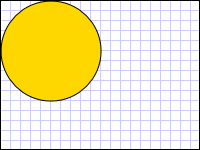
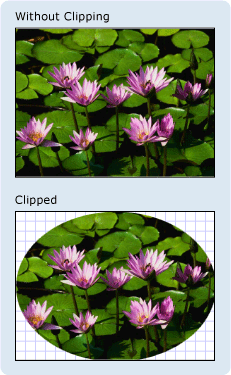
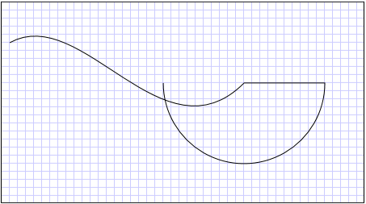
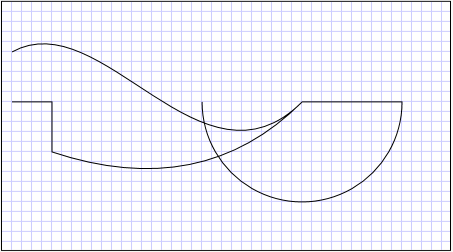
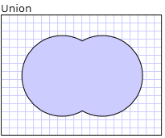
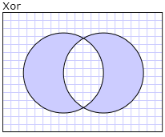

# Geometry Overview
This overview describes how to use the [!INCLUDE[TLA#tla_winclient](../../../../includes/tlasharptla-winclient-md.md)] <xref:System.Windows.Media.Geometry> classes to describe shapes. This topic also contrasts the differences between <xref:System.Windows.Media.Geometry> objects and <xref:System.Windows.Shapes.Shape> elements.  
  
  
   
## What Is a Geometry?  
 The <xref:System.Windows.Media.Geometry> class and the classes which derive from it, such as <xref:System.Windows.Media.EllipseGeometry>, <xref:System.Windows.Media.PathGeometry>, and <xref:System.Windows.Media.CombinedGeometry>, enable you to describe the geometry of a 2-D shape. These geometric descriptions have many uses, such defining a shape to paint to the screen or defining hit-test and clip regions. You can even use a geometry to define an animation path.  
  
 <xref:System.Windows.Media.Geometry> objects can be simple, such as rectangles and circles, or composite, created from two or more geometry objects.  More complex geometries can be created by using the <xref:System.Windows.Media.PathGeometry> and <xref:System.Windows.Media.StreamGeometry> classes, which enable you to describe arcs and curves.  
  
 Because a <xref:System.Windows.Media.Geometry> is a type of <xref:System.Windows.Freezable>, <xref:System.Windows.Media.Geometry> objects provide several special features: they can be declared as [resources](../../../../docs/framework/wpf/advanced/xaml-resources.md), shared among multiple objects, made read-only to improve performance, cloned, and made thread-safe. For more information about the different features provided by <xref:System.Windows.Freezable> objects, see the [Freezable Objects Overview](../../../../docs/framework/wpf/advanced/freezable-objects-overview.md).  
  
   
## Geometries vs. Shapes  
 The <xref:System.Windows.Media.Geometry> and <xref:System.Windows.Shapes.Shape> classes seem similar in that they both describe 2-D shapes (compare <xref:System.Windows.Media.EllipseGeometry> and <xref:System.Windows.Shapes.Ellipse> for example), but there are important differences.  
  
 For one, the <xref:System.Windows.Media.Geometry> class inherits from the <xref:System.Windows.Freezable> class while the <xref:System.Windows.Shapes.Shape> class inherits from <xref:System.Windows.FrameworkElement>. Because they are elements, <xref:System.Windows.Shapes.Shape> objects can render themselves and participate in the layout system, while <xref:System.Windows.Media.Geometry> objects cannot.  
  
 Although <xref:System.Windows.Shapes.Shape> objects are more readily usable than <xref:System.Windows.Media.Geometry> objects, <xref:System.Windows.Media.Geometry> objects are more versatile. While a <xref:System.Windows.Shapes.Shape> object is used to render 2-D graphics, a <xref:System.Windows.Media.Geometry> object can be used to define the geometric region for 2-D graphics, define a region for clipping, or define a region for hit testing, for example.  
  
### The Path Shape  
 One <xref:System.Windows.Shapes.Shape>, the <xref:System.Windows.Shapes.Path> class, actually uses a <xref:System.Windows.Media.Geometry> to describe its contents. By setting the <xref:System.Windows.Shapes.Path.Data%2A> property of the <xref:System.Windows.Shapes.Path> with a <xref:System.Windows.Media.Geometry> and setting its <xref:System.Windows.Shapes.Shape.Fill%2A> and <xref:System.Windows.Shapes.Shape.Stroke%2A> properties, you can render a <xref:System.Windows.Media.Geometry>.  
  
   
## Common Properties That Take a Geometry  
 The preceding sections mentioned that Geometry objects can be used with other objects for a variety of purposes, such as drawing shapes, animating, and clipping. The following table lists several classes that have properties that take a <xref:System.Windows.Media.Geometry> object.  
  
|Type|Property|  
|----------|--------------|  
|<xref:System.Windows.Media.Animation.DoubleAnimationUsingPath>|<xref:System.Windows.Media.Animation.DoubleAnimationUsingPath.PathGeometry%2A>|  
|<xref:System.Windows.Media.DrawingGroup>|<xref:System.Windows.Media.DrawingGroup.ClipGeometry%2A>|  
|<xref:System.Windows.Media.GeometryDrawing>|<xref:System.Windows.Media.GeometryDrawing.Geometry%2A>|  
|<xref:System.Windows.Shapes.Path>|<xref:System.Windows.Shapes.Path.Data%2A>|  
|<xref:System.Windows.UIElement>|<xref:System.Windows.UIElement.Clip%2A>|  
  
   
## Simple Geometry Types  
 The base class for all geometries is the abstract class <xref:System.Windows.Media.Geometry>.  The classes which derive from the <xref:System.Windows.Media.Geometry> class can be roughly grouped into three categories: simple geometries, path geometries, and composite geometries.  
  
 Simple geometry classes include <xref:System.Windows.Media.LineGeometry>, <xref:System.Windows.Media.RectangleGeometry>, and <xref:System.Windows.Media.EllipseGeometry> and are used to create basic geometric shapes, such as lines, rectangles, and circles.  
  
-   A <xref:System.Windows.Media.LineGeometry> is defined by specifying the start point of the line and the end point.  
  
-   A <xref:System.Windows.Media.RectangleGeometry> is defined with a <xref:System.Windows.Rect> structure which specifies its relative position and its height and width. You can create a rounded rectangle by setting the <xref:System.Windows.Media.RectangleGeometry.RadiusX%2A> and <xref:System.Windows.Media.RectangleGeometry.RadiusY%2A> properties.  
  
-   An <xref:System.Windows.Media.EllipseGeometry> is defined by a center point, an x-radius and a y-radius.  The following examples show how to create simple geometries for rendering and for clipping.  
  
 These same shapes, as well as more complex shapes, can be created using a <xref:System.Windows.Media.PathGeometry> or by combining geometry objects together, but these classes provide a simpler means for producing these basic geometric shapes.  
  
 The following example shows how to create and render a <xref:System.Windows.Media.LineGeometry>.  As noted previously, a <xref:System.Windows.Media.Geometry> object is unable to draw itself, so the example uses a <xref:System.Windows.Shapes.Path> shape to render the line.  Because a line has no area, setting the <xref:System.Windows.Shapes.Shape.Fill%2A> property of the <xref:System.Windows.Shapes.Path> would have no effect; instead, only the <xref:System.Windows.Shapes.Shape.Stroke%2A> and <xref:System.Windows.Shapes.Shape.StrokeThickness%2A> properties are specified. The following illustration shows the output from the example.  
  
   
A LineGeometry drawn from (10,20) to (100,130)  
  
 [!code-xaml[GeometryOverviewSamples_snip#GraphicsMMLineGeometryExample](../../../../samples/snippets/csharp/VS_Snippets_Wpf/GeometryOverviewSamples_snip/CS/GeometryExamples.xaml#graphicsmmlinegeometryexample)]  
  
 [!code-csharp[GeometryOverviewSamples_procedural_snip#GraphicsMMLineGeometryExample](../../../../samples/snippets/csharp/VS_Snippets_Wpf/GeometryOverviewSamples_procedural_snip/CSharp/GeometryExamples.cs#graphicsmmlinegeometryexample)]
 [!code-vb[GeometryOverviewSamples_procedural_snip#GraphicsMMLineGeometryExample](../../../../samples/snippets/visualbasic/VS_Snippets_Wpf/GeometryOverviewSamples_procedural_snip/visualbasic/geometryexamples.vb#graphicsmmlinegeometryexample)]  
  
 The next example shows how to create and render an <xref:System.Windows.Media.EllipseGeometry>.  The examples sets the <xref:System.Windows.Media.EllipseGeometry.Center%2A> of the <xref:System.Windows.Media.EllipseGeometry> is set to the point `50,50` and the x-radius and the y-radius are both set to `50`, which creates a circle with a diameter of 100.  The interior of the ellipse is painted by assigning a value to the Path element's Fill property, in this case <xref:System.Windows.Media.Brushes.Gold%2A>. The following illustration shows the output from the example.  
  
   
An EllipseGeometry drawn at (50,50)  
  
 [!code-xaml[GeometryOverviewSamples_snip#GraphicsMMEllipseGeometryExample](../../../../samples/snippets/csharp/VS_Snippets_Wpf/GeometryOverviewSamples_snip/CS/GeometryExamples.xaml#graphicsmmellipsegeometryexample)]  
  
 [!code-csharp[GeometryOverviewSamples_procedural_snip#GraphicsMMEllipseGeometryExample](../../../../samples/snippets/csharp/VS_Snippets_Wpf/GeometryOverviewSamples_procedural_snip/CSharp/GeometryExamples.cs#graphicsmmellipsegeometryexample)]
 [!code-vb[GeometryOverviewSamples_procedural_snip#GraphicsMMEllipseGeometryExample](../../../../samples/snippets/visualbasic/VS_Snippets_Wpf/GeometryOverviewSamples_procedural_snip/visualbasic/geometryexamples.vb#graphicsmmellipsegeometryexample)]  
  
 The following example shows how to create and render a <xref:System.Windows.Media.RectangleGeometry>.  The position and the dimensions of the rectangle are defined by a <xref:System.Windows.Rect> structure. The position is `50,50` and the height and width are both `25`, which creates a square. The following illustration shows the output from the example.  
  
   
A RectangleGeometry drawn at 50,50  
  
 [!code-xaml[GeometryOverviewSamples_snip#GraphicsMMRectangleGeometryExample](../../../../samples/snippets/csharp/VS_Snippets_Wpf/GeometryOverviewSamples_snip/CS/GeometryExamples.xaml#graphicsmmrectanglegeometryexample)]  
  
 [!code-csharp[GeometryOverviewSamples_procedural_snip#GraphicsMMRectangleGeometryExample](../../../../samples/snippets/csharp/VS_Snippets_Wpf/GeometryOverviewSamples_procedural_snip/CSharp/GeometryExamples.cs#graphicsmmrectanglegeometryexample)]
 [!code-vb[GeometryOverviewSamples_procedural_snip#GraphicsMMRectangleGeometryExample](../../../../samples/snippets/visualbasic/VS_Snippets_Wpf/GeometryOverviewSamples_procedural_snip/visualbasic/geometryexamples.vb#graphicsmmrectanglegeometryexample)]  
  
 The following example shows how to use an <xref:System.Windows.Media.EllipseGeometry> as the clip region for an image.  An <xref:System.Windows.Controls.Image> object is defined with a <xref:System.Windows.FrameworkElement.Width%2A> of 200 and a <xref:System.Windows.FrameworkElement.Height%2A> of 150.  An <xref:System.Windows.Media.EllipseGeometry> with a <xref:System.Windows.Media.EllipseGeometry.RadiusX%2A> value of 100, a <xref:System.Windows.Media.EllipseGeometry.RadiusY%2A> value of 75, and a <xref:System.Windows.Media.EllipseGeometry.Center%2A> value of 100,75 is set to the <xref:System.Windows.UIElement.Clip%2A> property of the image.  Only the part of the image that is within the area of the ellipse will be displayed. The following illustration shows the output from the example.  
  
   
An EllipseGeometry used to clip an Image control  
  
 [!code-xaml[GeometryOverviewSamples_snip#GraphicsMMImageClipGeometryExample](../../../../samples/snippets/csharp/VS_Snippets_Wpf/GeometryOverviewSamples_snip/CS/GeometryExamples.xaml#graphicsmmimageclipgeometryexample)]  
  
 [!code-csharp[GeometryOverviewSamples_procedural_snip#GraphicsMMImageClipGeometryExample](../../../../samples/snippets/csharp/VS_Snippets_Wpf/GeometryOverviewSamples_procedural_snip/CSharp/GeometryExamples.cs#graphicsmmimageclipgeometryexample)]
 [!code-vb[GeometryOverviewSamples_procedural_snip#GraphicsMMImageClipGeometryExample](../../../../samples/snippets/visualbasic/VS_Snippets_Wpf/GeometryOverviewSamples_procedural_snip/visualbasic/geometryexamples.vb#graphicsmmimageclipgeometryexample)]  
  
   
## Path Geometries  
 The <xref:System.Windows.Media.PathGeometry> class and its light-weight equivalent, the <xref:System.Windows.Media.StreamGeometry> class, provide the means to describe multiple complex figures composed of arcs, curves, and lines.  
  
 At the heart of a <xref:System.Windows.Media.PathGeometry> is a collection of <xref:System.Windows.Media.PathFigure> objects, so named because each figure describes a discrete shape in the <xref:System.Windows.Media.PathGeometry>. Each <xref:System.Windows.Media.PathFigure> is itself comprised of one or more <xref:System.Windows.Media.PathSegment> objects, each of which describes a segment of the figure.  
  
 There are many types of segments.  
  
|Segment Type|Description|Example|  
|------------------|-----------------|-------------|  
|<xref:System.Windows.Media.ArcSegment>|Creates an elliptical arc between two points.|[Create an Elliptical Arc](../../../../docs/framework/wpf/graphics-multimedia/how-to-create-an-elliptical-arc.md).|  
|<xref:System.Windows.Media.BezierSegment>|Creates a cubic Bezier curve between two points.|[Create a Cubic Bezier Curve](../../../../docs/framework/wpf/graphics-multimedia/how-to-create-a-cubic-bezier-curve.md).|  
|<xref:System.Windows.Media.LineSegment>|Creates a line between two points.|[Create a LineSegment in a PathGeometry](../../../../docs/framework/wpf/graphics-multimedia/how-to-create-a-linesegment-in-a-pathgeometry.md)|  
|<xref:System.Windows.Media.PolyBezierSegment>|Creates a series of cubic Bezier curves.|See the <xref:System.Windows.Media.PolyBezierSegment> type page.|  
|<xref:System.Windows.Media.PolyLineSegment>|Creates a series of lines.|See the <xref:System.Windows.Media.PolyLineSegment> type page.|  
|<xref:System.Windows.Media.PolyQuadraticBezierSegment>|Creates a series of quadratic Bezier curves.|See the <xref:System.Windows.Media.PolyQuadraticBezierSegment> page.|  
|<xref:System.Windows.Media.QuadraticBezierSegment>|Creates a quadratic Bezier curve.|[Create a Quadratic Bezier Curve](../../../../docs/framework/wpf/graphics-multimedia/how-to-create-a-quadratic-bezier-curve.md).|  
  
 The segments within a <xref:System.Windows.Media.PathFigure> are combined into a single geometric shape with the end point of each segment being the start point of the next segment. The <xref:System.Windows.Media.PathFigure.StartPoint%2A> property of a <xref:System.Windows.Media.PathFigure> specifies the point from which the first segment is drawn. Each subsequent segment starts at the end point of the previous segment. For example, a vertical line from `10,50` to `10,150` can be defined by setting the <xref:System.Windows.Media.PathFigure.StartPoint%2A> property to `10,50` and creating a <xref:System.Windows.Media.LineSegment> with a <xref:System.Windows.Media.LineSegment.Point%2A> property setting of `10,150`.  
  
 The following example creates a simple <xref:System.Windows.Media.PathGeometry> comprised of a single <xref:System.Windows.Media.PathFigure> with a <xref:System.Windows.Media.LineSegment> and displays it using a <xref:System.Windows.Shapes.Path> element. The <xref:System.Windows.Media.PathFigure> object's <xref:System.Windows.Media.PathFigure.StartPoint%2A> is set to `10,20` and a <xref:System.Windows.Media.LineSegment> is defined with an end point of `100,130`. The following illustration shows the <xref:System.Windows.Media.PathGeometry> created by this example.  
  
   
A PathGeometry that contains a single LineSegment  
  
 [!code-xaml[GeometryOverviewSamples_snip#GraphicsMMPathGeometryLineExample](../../../../samples/snippets/csharp/VS_Snippets_Wpf/GeometryOverviewSamples_snip/CS/GeometryExamples.xaml#graphicsmmpathgeometrylineexample)]  
  
 [!code-csharp[GeometryOverviewSamples_procedural_snip#GraphicsMMPathGeometryLineExample](../../../../samples/snippets/csharp/VS_Snippets_Wpf/GeometryOverviewSamples_procedural_snip/CSharp/GeometryExamples.cs#graphicsmmpathgeometrylineexample)]
 [!code-vb[GeometryOverviewSamples_procedural_snip#GraphicsMMPathGeometryLineExample](../../../../samples/snippets/visualbasic/VS_Snippets_Wpf/GeometryOverviewSamples_procedural_snip/visualbasic/geometryexamples.vb#graphicsmmpathgeometrylineexample)]  
  
 It is worth contrasting this example with the preceding <xref:System.Windows.Media.LineGeometry> example.  The syntax used for a <xref:System.Windows.Media.PathGeometry> is much more verbose than that used for a simple <xref:System.Windows.Media.LineGeometry>, and it may make more sense to use the <xref:System.Windows.Media.LineGeometry> class in this case, but the verbose syntax of the <xref:System.Windows.Media.PathGeometry> allows for extremely intricate and complex geometric regions.  
  
 More complex geometries can be created by using a combination of <xref:System.Windows.Media.PathSegment> objects.  
  
 The next example uses a <xref:System.Windows.Media.BezierSegment>, a <xref:System.Windows.Media.LineSegment>, and an <xref:System.Windows.Media.ArcSegment> to create shape. The example first creates a cubic Bezier curve is by defining four points: a start point, which is the end point of the previous segment, an end point (<xref:System.Windows.Media.BezierSegment.Point3%2A>), and two control points (<xref:System.Windows.Media.BezierSegment.Point1%2A> and <xref:System.Windows.Media.BezierSegment.Point2%2A>).  The two control points of a cubic Bezier curve behave like magnets, attracting portions of what would otherwise be a straight line towards themselves, producing a curve. The first control point, <xref:System.Windows.Media.BezierSegment.Point1%2A>, affects the beginning portion of the curve; the second control point, <xref:System.Windows.Media.BezierSegment.Point2%2A>, affects the ending portion of the curve.  
  
 The example then adds a <xref:System.Windows.Media.LineSegment>, which is drawn between the end point of the preceding <xref:System.Windows.Media.BezierSegment> that preceded it to the point specified by its <xref:System.Windows.Media.LineSegment> property.  
  
 The example then adds an <xref:System.Windows.Media.ArcSegment>, which is drawn from the end point of the preceding <xref:System.Windows.Media.LineSegment> to the point specified by its <xref:System.Windows.Media.ArcSegment.Point%2A> property. The example also specifies the arc's x- and y-radius (<xref:System.Windows.Media.ArcSegment.Size%2A>), a rotation angle (<xref:System.Windows.Media.ArcSegment.RotationAngle%2A>), a flag indicating how large the angle of the resulting arc should be (<xref:System.Windows.Media.ArcSegment.IsLargeArc%2A>), and a value indicating in which direction the arc is drawn (<xref:System.Windows.Media.ArcSegment.SweepDirection%2A>). The following illustration shows the shape created by this example.  
  
   
A PathGeometry  
  
 [!code-xaml[GeometryOverviewSamples_snip#GraphicsMMPathGeometryComplexExample](../../../../samples/snippets/csharp/VS_Snippets_Wpf/GeometryOverviewSamples_snip/CS/GeometryExamples.xaml#graphicsmmpathgeometrycomplexexample)]  
  
 [!code-csharp[GeometryOverviewSamples_procedural_snip#GraphicsMMPathGeometryComplexExample](../../../../samples/snippets/csharp/VS_Snippets_Wpf/GeometryOverviewSamples_procedural_snip/CSharp/GeometryExamples.cs#graphicsmmpathgeometrycomplexexample)]
 [!code-vb[GeometryOverviewSamples_procedural_snip#GraphicsMMPathGeometryComplexExample](../../../../samples/snippets/visualbasic/VS_Snippets_Wpf/GeometryOverviewSamples_procedural_snip/visualbasic/geometryexamples.vb#graphicsmmpathgeometrycomplexexample)]  
  
 Even more complex geometries can be created by using multiple <xref:System.Windows.Media.PathFigure> objects within a <xref:System.Windows.Media.PathGeometry>.  
  
 The following example creates a <xref:System.Windows.Media.PathGeometry> with two <xref:System.Windows.Media.PathFigure> objects, each of which contains multiple <xref:System.Windows.Media.PathSegment> objects.  The <xref:System.Windows.Media.PathFigure> from the above example and a <xref:System.Windows.Media.PathFigure> with a <xref:System.Windows.Media.PolyLineSegment> and a <xref:System.Windows.Media.QuadraticBezierSegment> are used.  A <xref:System.Windows.Media.PolyLineSegment> is defined with an array of points and the <xref:System.Windows.Media.QuadraticBezierSegment> is defined with a control point and an end point. The following illustration shows the shape created by this example.  
  
   
A PathGeometry with multiple figures  
  
 [!code-xaml[GeometryOverviewSamples_snip#GraphicsMMPathGeometryComplexMultiExample](../../../../samples/snippets/csharp/VS_Snippets_Wpf/GeometryOverviewSamples_snip/CS/GeometryExamples.xaml#graphicsmmpathgeometrycomplexmultiexample)]  
  
 [!code-csharp[GeometryOverviewSamples_procedural_snip#GraphicsMMPathGeometryComplexMultiExample](../../../../samples/snippets/csharp/VS_Snippets_Wpf/GeometryOverviewSamples_procedural_snip/CSharp/GeometryExamples.cs#graphicsmmpathgeometrycomplexmultiexample)]
 [!code-vb[GeometryOverviewSamples_procedural_snip#GraphicsMMPathGeometryComplexMultiExample](../../../../samples/snippets/visualbasic/VS_Snippets_Wpf/GeometryOverviewSamples_procedural_snip/visualbasic/geometryexamples.vb#graphicsmmpathgeometrycomplexmultiexample)]  
  
### StreamGeometry  
 Like the <xref:System.Windows.Media.PathGeometry> class, a <xref:System.Windows.Media.StreamGeometry> defines a complex geometric shape that may contain curves, arcs, and lines. Unlike a <xref:System.Windows.Media.PathGeometry>, the contents of a  <xref:System.Windows.Media.StreamGeometry> do not support data binding, animation, or modification. Use a <xref:System.Windows.Media.StreamGeometry> when you need to describe a complex geometry but do not want the overhead of supporting data binding, animation, or modification. Because of its efficiency, the <xref:System.Windows.Media.StreamGeometry> class is a good choice for describing adorners.  
  
 For an example, see [Create a Shape Using a StreamGeometry](../../../../docs/framework/wpf/graphics-multimedia/how-to-create-a-shape-using-a-streamgeometry.md).  
  
### Path Markup Syntax  
 The <xref:System.Windows.Media.PathGeometry> and <xref:System.Windows.Media.StreamGeometry> types support a [!INCLUDE[TLA#tla_xaml](../../../../includes/tlasharptla-xaml-md.md)] attribute syntax using a special series of move and draw commands. For more information, see [Path Markup Syntax](../../../../docs/framework/wpf/graphics-multimedia/path-markup-syntax.md).  
  
   
## Composite Geometries  
 Composite geometry objects can be created using a <xref:System.Windows.Media.GeometryGroup>, a <xref:System.Windows.Media.CombinedGeometry>, or by calling the static <xref:System.Windows.Media.Geometry> method <xref:System.Windows.Media.Geometry.Combine%2A>.  
  
-   The <xref:System.Windows.Media.CombinedGeometry> object and the <xref:System.Windows.Media.Geometry.Combine%2A> method performs a Boolean operation to combine the area defined by two geometries. <xref:System.Windows.Media.Geometry> objects that have no area are discarded. Only two <xref:System.Windows.Media.Geometry> objects can be combined (although these two geometries may also be composite geometries).  
  
-   The <xref:System.Windows.Media.GeometryGroup> class creates an amalgamation of the <xref:System.Windows.Media.Geometry> objects it contains without combining their area. Any number of <xref:System.Windows.Media.Geometry> objects can be added to a <xref:System.Windows.Media.GeometryGroup>. For an example, see [Create a Composite Shape](../../../../docs/framework/wpf/graphics-multimedia/how-to-create-a-composite-shape.md).  
  
 Because they do not perform a combine operation, using <xref:System.Windows.Media.GeometryGroup> objects provides performance benefits over using <xref:System.Windows.Media.CombinedGeometry> objects or the <xref:System.Windows.Media.Geometry.Combine%2A> method.  
  
   
## Combined Geometries  
 The preceding section mentioned the <xref:System.Windows.Media.CombinedGeometry> object and the <xref:System.Windows.Media.Geometry.Combine%2A> method combine the area defined by the geometries they contain. The <xref:System.Windows.Media.GeometryCombineMode> enumeration specifies how the geometries are combined. The possible values for the <xref:System.Windows.Media.CombinedGeometry.GeometryCombineMode%2A> property are: <xref:System.Windows.Media.GeometryCombineMode.Union>, <xref:System.Windows.Media.GeometryCombineMode.Intersect>, <xref:System.Windows.Media.GeometryCombineMode.Exclude>, and <xref:System.Windows.Media.GeometryCombineMode.Xor>.  
  
 In the following example, a <xref:System.Windows.Media.CombinedGeometry> is defined with a combine mode of Union.  Both <xref:System.Windows.Media.CombinedGeometry.Geometry1%2A> and the <xref:System.Windows.Media.CombinedGeometry.Geometry2%2A> are defined as circles of the same radius, but with centers offset by 50.  
  
 [!code-xaml[GeometrySample#23](../../../../samples/snippets/csharp/VS_Snippets_Wpf/GeometrySample/CS/combininggeometriesexample.xaml#23)]  
  
   
  
 In the following example, a <xref:System.Windows.Media.CombinedGeometry> is defined with a combine mode of <xref:System.Windows.Media.GeometryCombineMode.Xor>.  Both <xref:System.Windows.Media.CombinedGeometry.Geometry1%2A> and the <xref:System.Windows.Media.CombinedGeometry.Geometry2%2A> are defined as circles of the same radius, but with centers offset by 50.  
  
 [!code-xaml[GeometrySample#24](../../../../samples/snippets/csharp/VS_Snippets_Wpf/GeometrySample/CS/combininggeometriesexample.xaml#24)]  
  
   
  
 For additional examples, see [Create a Composite Shape](../../../../docs/framework/wpf/graphics-multimedia/how-to-create-a-composite-shape.md) and [Create a Combined Geometry](../../../../docs/framework/wpf/graphics-multimedia/how-to-create-a-combined-geometry.md).  
  
   
## Freezable Features  
 Because it inherits from the <xref:System.Windows.Freezable> class, the <xref:System.Windows.Media.Geometry> class  provide several special features: <xref:System.Windows.Media.Geometry> objects can be declared as [XAML Resources](../../../../docs/framework/wpf/advanced/xaml-resources.md), shared among multiple objects, made read-only to improve performance, cloned, and made thread-safe. For more information about the different features provided by <xref:System.Windows.Freezable> objects, see the [Freezable Objects Overview](../../../../docs/framework/wpf/advanced/freezable-objects-overview.md).  
  
   
## Other Geometry Features  
 The <xref:System.Windows.Media.Geometry> class also provides useful utility methods, such as the following:  
  
-   <xref:System.Windows.Media.Geometry.GetArea%2A> - Gets the area of the <xref:System.Windows.Media.Geometry>.  
  
-   <xref:System.Windows.Media.Geometry.FillContains%2A> - Determines whether the Geometry contains another <xref:System.Windows.Media.Geometry>.  
  
-   <xref:System.Windows.Media.Geometry.StrokeContains%2A> - Determines whether the stroke of a <xref:System.Windows.Media.Geometry> contains a specified point.  
  
 See the <xref:System.Windows.Media.Geometry> class for a complete listing of its methods.  
  
## See Also  
 <xref:System.Windows.Media.Geometry>  
 <xref:System.Windows.Media.PathGeometry>  
 <xref:System.Windows.Shapes.Path>  
 <xref:System.Windows.Media.GeometryDrawing>  
 [2D Graphics and Imaging](../../../../docs/framework/wpf/advanced/optimizing-performance-2d-graphics-and-imaging.md)  
 [Path Markup Syntax](../../../../docs/framework/wpf/graphics-multimedia/path-markup-syntax.md)  
 [How-to Topics](../../../../docs/framework/wpf/graphics-multimedia/geometries-how-to-topics.md)  
 [Animation Overview](../../../../docs/framework/wpf/graphics-multimedia/animation-overview.md)  
 [Shapes and Basic Drawing in WPF Overview](../../../../docs/framework/wpf/graphics-multimedia/shapes-and-basic-drawing-in-wpf-overview.md)  
 [Drawing Objects Overview](../../../../docs/framework/wpf/graphics-multimedia/drawing-objects-overview.md)
