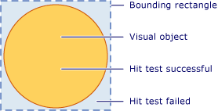
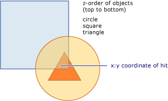
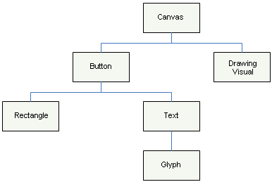
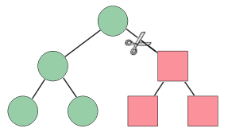

# Hit Testing in the Visual Layer
This topic provides an overview of hit testing functionality provided by the visual layer. Hit testing support allows you to determine whether a geometry or point value falls within the rendered content of a <xref:System.Windows.Media.Visual>, allowing you to implement user interface behavior such as a selection rectangle to select multiple objects.  
  
 
  
   
## Hit Testing Scenarios  
 The <xref:System.Windows.UIElement> class provides the <xref:System.Windows.UIElement.InputHitTest%2A> method, which allows you to hit test against an element using a given coordinate value. In many cases, the <xref:System.Windows.UIElement.InputHitTest%2A> method provides the desired functionality for implementing hit testing of elements. However, there are several scenarios in which you may need to implement hit testing at the visual layer.  
  
-   Hit testing against non-<xref:System.Windows.UIElement> objects: This applies if you are hit testing non-<xref:System.Windows.UIElement> objects, such as <xref:System.Windows.Media.DrawingVisual> or graphics objects.  
  
-   Hit testing using a geometry: This applies if you need to hit test using a geometry object rather than the coordinate value of a point.  
  
-   Hit testing against multiple objects: This applies when you need to hit test against multiple objects, such as overlapping objects. You can get results for all visuals intersecting a geometry or point, not just the first one.  
  
-   Ignoring <xref:System.Windows.UIElement> hit testing policy: This applies when you need to ignore the <xref:System.Windows.UIElement> hit testing policy, which takes into consideration such factors as whether an element is disabled or invisible.  
  
> [!NOTE]
>  For a complete code sample illustrating hit testing at the visual layer, see [Hit Test Using DrawingVisuals Sample](http://go.microsoft.com/fwlink/?LinkID=159994) and [Hit Test with Win32 Interoperation Sample](http://go.microsoft.com/fwlink/?LinkID=159995).  
  
   
## Hit Testing Support  
 The purpose of the <xref:System.Windows.Media.VisualTreeHelper.HitTest%2A> methods in the <xref:System.Windows.Media.VisualTreeHelper> class is to determine whether a geometry or point coordinate value is within the rendered content of a given object, such as a control or graphic element. For example, you could use hit testing to determine whether a mouse click within the bounding rectangle of an object falls within the geometry of a circle. You can also choose to override the default implementation of hit testing to perform your own custom hit test calculations.  
  
 The following illustration shows the relationship between a non-rectangular object's region and its bounding rectangle.  
  
   
Diagram of valid hit test region  
  
   
## Hit Testing and Z-Order  
 The [!INCLUDE[TLA#tla_winclient](../../../../includes/tlasharptla-winclient-md.md)] visual layer supports hit testing against all objects under a point or geometry, not just the top-most object. Results are returned in z-order. However, the visual object that you pass as the parameter to the <xref:System.Windows.Media.VisualTreeHelper.HitTest%2A> method determines which portion of the visual tree that will be hit test. You can hit test against the entire visual tree, or any portion of it.  
  
 In the following illustration, the circle object is on top of both the square and triangle objects. If you are only interested in hit testing the visual object whose z-order value is top-most, you can set the visual hit test enumeration to return <xref:System.Windows.Media.HitTestResultBehavior.Stop> from the <xref:System.Windows.Media.HitTestResultCallback> to stop the hit test traversal after the first item.  
  
   
Diagram of the z-order of a visual tree  
  
 If you want to enumerate all visual objects under a specific point or geometry, return <xref:System.Windows.Media.HitTestResultBehavior.Continue> from the <xref:System.Windows.Media.HitTestResultCallback>. This means you can hit test for visual objects that are beneath other objects, even if they are wholly obscured. See the sample code in the section "Using a Hit Test Results Callback" for more information.  
  
> [!NOTE]
>  A visual object that is transparent can also be hit test.  
  
   
## Using Default Hit Testing  
 You can identify whether a point is within the geometry of a visual object, by using the <xref:System.Windows.Media.VisualTreeHelper.HitTest%2A> method to specify a visual object and a point coordinate value to test against. The visual object parameter identifies the starting point in the visual tree for the hit test search. If a visual object is found in the visual tree whose geometry contains the coordinate, it is set to the <xref:System.Windows.Media.HitTestResult.VisualHit%2A> property of a <xref:System.Windows.Media.HitTestResult> object. The <xref:System.Windows.Media.HitTestResult> is then returned from the <xref:System.Windows.Media.VisualTreeHelper.HitTest%2A> method. If the point is not contained with the visual sub-tree you are hit testing, <xref:System.Windows.Media.VisualTreeHelper.HitTest%2A> returns `null`.  
  
> [!NOTE]
>  Default hit testing always returns the top-most object in the z-order. In order to identify all visual objects, even those that may be partly or wholly obscured, use a hit test result callback.  
  
 The coordinate value you pass as the point parameter for the <xref:System.Windows.Media.VisualTreeHelper.HitTest%2A> method has to be relative to the coordinate space of the visual object you are hit testing against. For example, if you have nested visual objects defined at (100, 100) in the parent's coordinate space, then hit testing a child visual at (0, 0) is equivalent to hit testing at (100, 100) in the parent's coordinate space.  
  
 The following code shows how to set up mouse event handlers for a <xref:System.Windows.UIElement> object that is used to capture events used for hit testing.  
  
 [!code-csharp[HitTestingOverview#100](../../../../samples/snippets/csharp/VS_Snippets_Wpf/HitTestingOverview/CSharp/Window1.xaml.cs#100)]
 [!code-vb[HitTestingOverview#100](../../../../samples/snippets/visualbasic/VS_Snippets_Wpf/HitTestingOverview/visualbasic/window1.xaml.vb#100)]  
  
### How the Visual Tree Affects Hit Testing  
 The starting point in the visual tree determines which objects are returned during the hit test enumeration of objects. If you have multiple objects you want to hit test, the visual object used as the starting point in the visual tree must be the common ancestor of all objects of interest. For example, if you were interested in hit testing both the button element and drawing visual in the following diagram, you would have to set the starting point in the visual tree to the common ancestor of both. In this case, the canvas element is the common ancestor of both the button element and the drawing visual.  
  
   
Diagram of a visual tree hierarchy  
  
> [!NOTE]
>  The <xref:System.Windows.UIElement.IsHitTestVisible%2A> property gets or sets a value that declares whether a <xref:System.Windows.UIElement>-derived object can possibly be returned as a hit test result from some portion of its rendered content. This allows you to selectively alter the visual tree to determine which visual objects are involved in a hit test.  
  
   
## Using a Hit Test Result Callback  
 You can enumerate all visual objects in a visual tree whose geometry contains a specified coordinate value. This allows you to identify all visual objects, even those that may be partly or wholly obscured by other visual objects. To enumerate visual objects in a visual tree use the <xref:System.Windows.Media.VisualTreeHelper.HitTest%2A> method with a hit test callback function. The hit test callback function is called by the system when the coordinate value you specify is contained in a visual object.  
  
 During the hit test results enumeration, you should not perform any operation that modifies the visual tree. Adding or removing an object from the visual tree while it is being traversed can result in unpredictable behavior. You can safely modify the visual tree after the <xref:System.Windows.Media.VisualTreeHelper.HitTest%2A> method returns. You may want to provide a data structure, such as an <xref:System.Collections.ArrayList>, to store values during the hit test results enumeration.  
  
 [!code-csharp[HitTestingOverview#101](../../../../samples/snippets/csharp/VS_Snippets_Wpf/HitTestingOverview/CSharp/Window1.xaml.cs#101)]
 [!code-vb[HitTestingOverview#101](../../../../samples/snippets/visualbasic/VS_Snippets_Wpf/HitTestingOverview/visualbasic/window1.xaml.vb#101)]  
  
 The hit test callback method defines the actions you perform when a hit test is identified on a particular visual object in the visual tree. After you perform the actions, you return a <xref:System.Windows.Media.HitTestResultBehavior> value that determines whether to continue the enumeration of any other visual objects or not.  
  
 [!code-csharp[HitTestingOverview#102](../../../../samples/snippets/csharp/VS_Snippets_Wpf/HitTestingOverview/CSharp/Window1.xaml.cs#102)]
 [!code-vb[HitTestingOverview#102](../../../../samples/snippets/visualbasic/VS_Snippets_Wpf/HitTestingOverview/visualbasic/window1.xaml.vb#102)]  
  
> [!NOTE]
>  The order of enumeration of hit visual objects is by z-order. The visual object at the top-most z-order level is the first object enumerated. Any other visual objects enumerated are at decreasing z-order level. This order of enumeration corresponds to the rendering order of the visuals.  
  
 You can stop the enumeration of visual objects at any time in the hit test callback function by returning <xref:System.Windows.Media.HitTestResultBehavior.Stop>.  
  
 [!code-csharp[HitTestingOverview#103](../../../../samples/snippets/csharp/VS_Snippets_Wpf/HitTestingOverview/CSharp/Window1.xaml.cs#103)]
 [!code-vb[HitTestingOverview#103](../../../../samples/snippets/visualbasic/VS_Snippets_Wpf/HitTestingOverview/visualbasic/window1.xaml.vb#103)]  
  
   
## Using a Hit Test Filter Callback  
 You can use an optional hit test filter to restrict the objects that are passed on to the hit test results. This allows you to ignore parts of the visual tree that you are not interested in processing in your hit test results. To implement a hit test filter, you define a hit test filter callback function and pass it as a parameter value when you call the <xref:System.Windows.Media.VisualTreeHelper.HitTest%2A> method.  
  
 [!code-csharp[HitTestingOverview#104](../../../../samples/snippets/csharp/VS_Snippets_Wpf/HitTestingOverview/CSharp/Window1.xaml.cs#104)]
 [!code-vb[HitTestingOverview#104](../../../../samples/snippets/visualbasic/VS_Snippets_Wpf/HitTestingOverview/visualbasic/window1.xaml.vb#104)]  
  
 If you do not want to supply the optional hit test filter callback function, pass a `null` value as its parameter for the <xref:System.Windows.Media.VisualTreeHelper.HitTest%2A> method.  
  
 [!code-csharp[HitTestingOverview#105](../../../../samples/snippets/csharp/VS_Snippets_Wpf/HitTestingOverview/CSharp/Window1.xaml.cs#105)]
 [!code-vb[HitTestingOverview#105](../../../../samples/snippets/visualbasic/VS_Snippets_Wpf/HitTestingOverview/visualbasic/window1.xaml.vb#105)]  
  
   
Pruning a visual tree  
  
 The hit test filter callback function allows you to enumerate through all the visuals whose rendered content contains the coordinates you specify. However, you may want to ignore certain branches of the visual tree that you are not interested in processing in your hit test results callback function. The return value of the hit test filter callback function determines what type of action the enumeration of the visual objects should take. For example, if you return the value, <xref:System.Windows.Media.HitTestFilterBehavior.ContinueSkipSelfAndChildren>, you can remove the current visual object and its children from the hit test results enumeration. This means that the hit test results callback function will not see these objects in its enumeration. Pruning the visual tree of objects decreases the amount of processing during the hit test results enumeration pass. In the following code example, the filter skips labels and their descendants and hit tests everything else.  
  
 [!code-csharp[HitTestingOverview#106](../../../../samples/snippets/csharp/VS_Snippets_Wpf/HitTestingOverview/CSharp/Window1.xaml.cs#106)]
 [!code-vb[HitTestingOverview#106](../../../../samples/snippets/visualbasic/VS_Snippets_Wpf/HitTestingOverview/visualbasic/window1.xaml.vb#106)]  
  
> [!NOTE]
>  The hit test filter callback will sometimes be called in cases where the hit test results callback is not called.  
  
   
## Overriding Default Hit Testing  
 You can override a visual object’s default hit testing support by overriding the <xref:System.Windows.Media.Visual.HitTestCore%2A> method. This means that when you invoke the <xref:System.Windows.Media.VisualTreeHelper.HitTest%2A> method, your overridden implementation of <xref:System.Windows.Media.Visual.HitTestCore%2A> is called. Your overridden method is called when a hit test falls within the bounding rectangle of the visual object, even if the coordinate falls outside the rendered content of the visual object.  
  
 [!code-csharp[HitTestingOverview#107](../../../../samples/snippets/csharp/VS_Snippets_Wpf/HitTestingOverview/CSharp/Window1.xaml.cs#107)]
 [!code-vb[HitTestingOverview#107](../../../../samples/snippets/visualbasic/VS_Snippets_Wpf/HitTestingOverview/visualbasic/window1.xaml.vb#107)]  
  
 There may be times when you want to hit test against both the bounding rectangle and the rendered content of a visual object. By using the `PointHitTestParameters` parameter value in your overridden <xref:System.Windows.Media.Visual.HitTestCore%2A> method as the parameter to the base method <xref:System.Windows.Media.Visual.HitTestCore%2A>, you can perform actions based on a hit of the bounding rectangle of a visual object, and then perform a second hit test against the rendered content of the visual object.  
  
 [!code-csharp[HitTestingOverview#108](../../../../samples/snippets/csharp/VS_Snippets_Wpf/HitTestingOverview/CSharp/Window1.xaml.cs#108)]
 [!code-vb[HitTestingOverview#108](../../../../samples/snippets/visualbasic/VS_Snippets_Wpf/HitTestingOverview/visualbasic/window1.xaml.vb#108)]  
  
## See Also  
 <xref:System.Windows.Media.VisualTreeHelper.HitTest%2A>  
 <xref:System.Windows.Media.HitTestResult>  
 <xref:System.Windows.Media.HitTestResultCallback>  
 <xref:System.Windows.Media.HitTestFilterCallback>  
 <xref:System.Windows.UIElement.IsHitTestVisible%2A>  
 [Hit Test Using DrawingVisuals Sample](http://go.microsoft.com/fwlink/?LinkID=159994)  
 [Hit Test with Win32 Interoperation Sample](http://go.microsoft.com/fwlink/?LinkID=159995)  
 [Hit Test Geometry in a Visual](../../../../docs/framework/wpf/graphics-multimedia/how-to-hit-test-geometry-in-a-visual.md)  
 [Hit Test Using a Win32 Host Container](../../../../docs/framework/wpf/graphics-multimedia/how-to-hit-test-using-a-win32-host-container.md)
