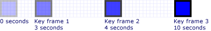
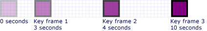
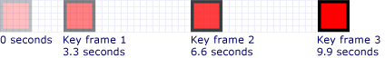
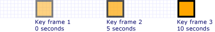

# How to: Control Key-Frame Animation Timing
This example shows how to control the timing of key frames within a key-frame animation. Like other animations, key-frame animations have a <xref:System.Windows.Media.Animation.Timeline.Duration%2A> property. In addition to specifying the duration of an animation, you need to specify what part of that duration is allotted to each of its key frames. To allot the time, you specify a <xref:System.Windows.Media.Animation.KeyTime> for each key frame in the animation.  
  
 The <xref:System.Windows.Media.Animation.KeyTime> for each key frame specifies when a key frame ends (it does not specify the length of time a key frame plays). You can specify a <xref:System.Windows.Media.Animation.KeyTime> as a <xref:System.TimeSpan> value, as a percentage, or as the <xref:System.Windows.Media.Animation.KeyTime.Uniform%2A> or <xref:System.Windows.Media.Animation.KeyTime.Paced%2A> special value.  
  
## Example  
 The following example uses a <xref:System.Windows.Media.Animation.DoubleAnimationUsingKeyFrames> to animate a rectangle across the screen. The key frames' key times are set with <xref:System.TimeSpan> values.  
  
 [!code-csharp[keyframes_snip#KeyTimesTimeSpanExample](../../../../samples/snippets/csharp/VS_Snippets_Wpf/keyframes_snip/CSharp/KeyTimesExample.cs#keytimestimespanexample)]
 [!code-vb[keyframes_snip#KeyTimesTimeSpanExample](../../../../samples/snippets/visualbasic/VS_Snippets_Wpf/keyframes_snip/visualbasic/keytimesexample.vb#keytimestimespanexample)]
 [!code-xaml[keyframes_snip#KeyTimesTimeSpanExample](../../../../samples/snippets/xaml/VS_Snippets_Wpf/keyframes_snip/XAML/KeyTimesExample.xaml#keytimestimespanexample)]  
  
 The following illustration shows when the value of each key frame is reached.  
  
   
  
 The next example shows an animation that is identical, except that the key frames' key times are set with percentage values.  
  
 [!code-csharp[keyframes_snip#KeyTimesPercentageExample](../../../../samples/snippets/csharp/VS_Snippets_Wpf/keyframes_snip/CSharp/KeyTimesExample.cs#keytimespercentageexample)]
 [!code-vb[keyframes_snip#KeyTimesPercentageExample](../../../../samples/snippets/visualbasic/VS_Snippets_Wpf/keyframes_snip/visualbasic/keytimesexample.vb#keytimespercentageexample)]
 [!code-xaml[keyframes_snip#KeyTimesPercentageExample](../../../../samples/snippets/xaml/VS_Snippets_Wpf/keyframes_snip/XAML/KeyTimesExample.xaml#keytimespercentageexample)]  
  
 The following illustration shows when the value of each key frame is reached.  
  
   
  
 The next example uses <xref:System.Windows.Media.Animation.KeyTime.Uniform%2A> key time values.  
  
 [!code-csharp[keyframes_snip#KeyTimesUniformExample](../../../../samples/snippets/csharp/VS_Snippets_Wpf/keyframes_snip/CSharp/KeyTimesExample.cs#keytimesuniformexample)]
 [!code-vb[keyframes_snip#KeyTimesUniformExample](../../../../samples/snippets/visualbasic/VS_Snippets_Wpf/keyframes_snip/visualbasic/keytimesexample.vb#keytimesuniformexample)]
 [!code-xaml[keyframes_snip#KeyTimesUniformExample](../../../../samples/snippets/xaml/VS_Snippets_Wpf/keyframes_snip/XAML/KeyTimesExample.xaml#keytimesuniformexample)]  
  
 The following illustration shows when the value of each key frame is reached.  
  
   
  
 The final example uses <xref:System.Windows.Media.Animation.KeyTime.Paced%2A> key time values.  
  
 [!code-csharp[keyframes_snip#KeyTimesPacedExample](../../../../samples/snippets/csharp/VS_Snippets_Wpf/keyframes_snip/CSharp/KeyTimesExample.cs#keytimespacedexample)]
 [!code-vb[keyframes_snip#KeyTimesPacedExample](../../../../samples/snippets/visualbasic/VS_Snippets_Wpf/keyframes_snip/visualbasic/keytimesexample.vb#keytimespacedexample)]
 [!code-xaml[keyframes_snip#KeyTimesPacedExample](../../../../samples/snippets/xaml/VS_Snippets_Wpf/keyframes_snip/XAML/KeyTimesExample.xaml#keytimespacedexample)]  
  
 The following illustration shows when the value of each key frame is reached.  
  
   
  
 For simplicity, the code versions of this example use local animations, not storyboards, because only a single animation is being applied to a single property, but the examples may be modified to use storyboards instead. For an example showing how to declare a storyboard in code, see [Animate a Property by Using a Storyboard](../../../../docs/framework/wpf/graphics-multimedia/how-to-animate-a-property-by-using-a-storyboard.md).  
  
 For the complete sample, see [KeyFrame Animation Sample](http://go.microsoft.com/fwlink/?LinkID=160012). For more information about key frame animations, see the [Key-Frame Animations Overview](../../../../docs/framework/wpf/graphics-multimedia/key-frame-animations-overview.md).  
  
## See Also  
 [Key-Frame Animations Overview](../../../../docs/framework/wpf/graphics-multimedia/key-frame-animations-overview.md)  
 [Animation Overview](../../../../docs/framework/wpf/graphics-multimedia/animation-overview.md)  
 [How-to Topics](../../../../docs/framework/wpf/graphics-multimedia/animation-and-timing-how-to-topics.md)
