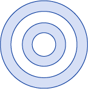
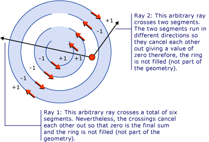
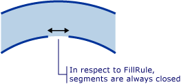

# How to: Control the Fill of a Composite Shape
The <xref:System.Windows.Media.GeometryGroup.FillRule%2A> property of a <xref:System.Windows.Media.GeometryGroup> or a <xref:System.Windows.Media.PathGeometry>, specifies a "rule" which the composite shape uses to determine whether a given point is part of the geometry. There are two possible values for <xref:System.Windows.Media.FillRule>: <xref:System.Windows.Media.FillRule.EvenOdd> and <xref:System.Windows.Media.FillRule.Nonzero>. The following sections will describe how to use these two rules.  
  
 **EvenOdd:** This rule determines whether a point is in the fill region by drawing a ray from that point to infinity in any direction and counting the number of path segments within the given shape that the ray crosses. If this number is odd, the point is inside; if even, the point is outside.  
  
 For example, the XAML below creates a composite shape made up of a series of concentric rings (target) with a <xref:System.Windows.Media.GeometryGroup.FillRule%2A> set to <xref:System.Windows.Media.FillRule.EvenOdd>.  
  
 [!code-xaml[GeometriesMiscSnippets_snip#FillRuleEvenOddValue](../../../../samples/snippets/xaml/VS_Snippets_Wpf/GeometriesMiscSnippets_snip/XAML/FillRuleExample.xaml#fillruleevenoddvalue)]  
  
 The following illustration shows the shape created in the previous example.  
  
   
  
 In the illustration above, notice that the center and 3rd ring are not filled. This is because a ray drawn from any point within either of those two rings passes through an even number of segments. See illustration below:  
  
   
  
 **NonZero:** This rule determines whether a point is in the fill region of the path by drawing a ray from that point to infinity in any direction and then examining the places where a segment of the shape crosses the ray. Starting with a count of zero, add one each time a Segment crosses the ray from left to right and subtract one each time a path segment crosses the ray from right to left. After counting the crossings, if the result is zero then the point is outside the path. Otherwise, it is inside.  
  
 [!code-xaml[GeometriesMiscSnippets_snip#FillRuleNonZeroValueEllipseGeometry](../../../../samples/snippets/xaml/VS_Snippets_Wpf/GeometriesMiscSnippets_snip/XAML/FillRuleExample.xaml#fillrulenonzerovalueellipsegeometry)]  
  
 Using the example above, a value of <xref:System.Windows.Media.FillRule.Nonzero> for <xref:System.Windows.Media.GeometryGroup.FillRule%2A> gives the following illustration as a result:  
  
   
  
 As you can see, all the rings are filled. This is because all the segments are running in the same direction and so a ray drawn from any point will cross one or more segments and the sum of the crossings will not equal zero. For example, in the illustration below, the red arrows represent the direction the segments are drawn and the white arrow represents an arbitrary ray running from a point in the innermost ring. Starting with a value of zero, for each segment that the ray crosses, a value of one is added because the segment crosses the ray from left to right.  
  
   
  
 To better demonstrate the behavior of <xref:System.Windows.Media.FillRule.Nonzero> rule a more complex shape with segments running in different directions is required. The XAML code below creates a similar shape as the previous example except that it is created with a <xref:System.Windows.Media.PathGeometry> rather then a <xref:System.Windows.Media.EllipseGeometry> which creates four concentric arcs rather then fully closed concentric circles.  
  
 [!code-xaml[GeometriesMiscSnippets_snip#FillRuleNonZeroValuePathGeometry](../../../../samples/snippets/xaml/VS_Snippets_Wpf/GeometriesMiscSnippets_snip/XAML/FillRuleExample.xaml#fillrulenonzerovaluepathgeometry)]  
  
 The following illustration shows the shape created in the previous example.  
  
   
  
 Notice that the third arc from the center is not filled. The illustration below shows why this is. In the illustration, the red arrows represent the direction the segments are drawn. The two white arrows represent two arbitrary rays that move out from a point in the "non-filled" region. As can be seen from the illustration, the sum of the values from a given ray crossing the segments in its path is zero. As defined above, a sum of zero means that the point is not part of the geometry (not part of the fill) while a sum that is *not* zero, including a negative value, is part of the geometry.  
  
   
  
 **Note:** For the purposes of <xref:System.Windows.Media.FillRule>, all shapes are considered closed. If there is a gap in a segment, draw an imaginary line to close it. In the example above, there are small gaps in the rings. Given this, one might expect a ray that runs through the gap to give a different result then a ray running in another direction. Below is an enlarged illustration of one of these gaps and the "imaginary segment" (segment that is drawn for purposes of applying the <xref:System.Windows.Media.FillRule>) that closes it.  
  
   
  
## Example  
  
## See Also  
 [Create a Composite Shape](../../../../docs/framework/wpf/graphics-multimedia/how-to-create-a-composite-shape.md)  
 [Geometry Overview](../../../../docs/framework/wpf/graphics-multimedia/geometry-overview.md)
