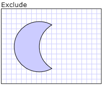
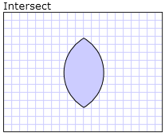

# How to: Create a Combined Geometry
This example shows how to combine geometries. To combine two geometries, use a <xref:System.Windows.Media.CombinedGeometry> object. Set its <xref:System.Windows.Media.CombinedGeometry.Geometry1%2A> and <xref:System.Windows.Media.CombinedGeometry.Geometry2%2A> properties  with the two geometries to combine, and set the <xref:System.Windows.Media.CombinedGeometry.GeometryCombineMode%2A> property, which determines how the geometries will be combined together, to `Union`, `Intersect`, `Exclude`, or `Xor`.  
  
 To create a composite geometry from two or more geometries, use a <xref:System.Windows.Media.GeometryGroup>.  
  
## Example  
 In the following example, a <xref:System.Windows.Media.CombinedGeometry> is defined with a geometry combine mode of `Exclude`.  Both <xref:System.Windows.Media.CombinedGeometry.Geometry1%2A> and the <xref:System.Windows.Media.CombinedGeometry.Geometry2%2A> are defined as circles of the same radius, but with centers offset by 50.  
  
 [!code-xaml[GeometrySample#21](../../../../samples/snippets/csharp/VS_Snippets_Wpf/GeometrySample/CS/combininggeometriesexample.xaml#21)]  
  
   
Combined Geometry Exclude  
  
 In the following markup, a <xref:System.Windows.Media.CombinedGeometry> is defined with a combine mode of `Intersect`.  Both <xref:System.Windows.Media.CombinedGeometry.Geometry1%2A> and the <xref:System.Windows.Media.CombinedGeometry.Geometry2%2A> are defined as circles of the same radius, but with centers offset by 50.  
  
 [!code-xaml[GeometrySample#22](../../../../samples/snippets/csharp/VS_Snippets_Wpf/GeometrySample/CS/combininggeometriesexample.xaml#22)]  
  
   
Combined Geometry Intersect  
  
 In the following markup, a <xref:System.Windows.Media.CombinedGeometry> is defined with a combine mode of `Union`.  Both <xref:System.Windows.Media.CombinedGeometry.Geometry1%2A> and the <xref:System.Windows.Media.CombinedGeometry.Geometry2%2A> are defined as circles of the same radius, but with centers offset by 50.  
  
 [!code-xaml[GeometrySample#23](../../../../samples/snippets/csharp/VS_Snippets_Wpf/GeometrySample/CS/combininggeometriesexample.xaml#23)]  
  
   
Combined Geometry Union  
  
 In the following markup, a <xref:System.Windows.Media.CombinedGeometry> is defined with a combine mode of `Xor`.  Both <xref:System.Windows.Media.CombinedGeometry.Geometry1%2A> and the <xref:System.Windows.Media.CombinedGeometry.Geometry2%2A> are defined as circles of the same radius, but with centers offset by 50.  
  
 [!code-xaml[GeometrySample#24](../../../../samples/snippets/csharp/VS_Snippets_Wpf/GeometrySample/CS/combininggeometriesexample.xaml#24)]  
  
   
Combined Geometry Xor
