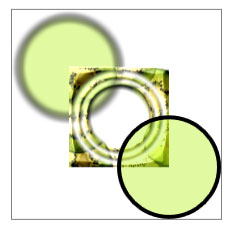

# How to: Create a Composite Drawing
This example shows how to use a <xref:System.Windows.Media.DrawingGroup> to create complex drawings by combining multiple <xref:System.Windows.Media.Drawing> objects into a single composite drawing.  
  
## Example  
 The following example uses a <xref:System.Windows.Media.DrawingGroup> to create a composite drawing from the <xref:System.Windows.Media.GeometryDrawing> and <xref:System.Windows.Media.ImageDrawing> objects. The following illustration shows the output that this example produces.  
  
   
A composite drawing that is created by using DrawingGroup  
  
 Note the gray border, which shows the bounds of the drawing.  
  
 [!code-csharp[DrawingMiscSnippets_snip#GraphicsMMSimpleDrawingGroupExample](../../../../samples/snippets/csharp/VS_Snippets_Wpf/DrawingMiscSnippets_snip/CSharp/DrawingGroupExample.cs#graphicsmmsimpledrawinggroupexample)]
 [!code-xaml[DrawingMiscSnippets_snip#GraphicsMMSimpleDrawingGroupExample](../../../../samples/snippets/xaml/VS_Snippets_Wpf/DrawingMiscSnippets_snip/XAML/DrawingGroupExample.xaml#graphicsmmsimpledrawinggroupexample)]  
  
 You can use a <xref:System.Windows.Media.DrawingGroup> to apply a <xref:System.Windows.Media.DrawingGroup.Transform%2A>, <xref:System.Windows.Media.DrawingGroup.Opacity%2A> setting, <xref:System.Windows.Media.DrawingGroup.OpacityMask%2A>, <xref:System.Windows.Media.DrawingGroup.BitmapEffect%2A>, <xref:System.Windows.Media.DrawingGroup.ClipGeometry%2A>, or <xref:System.Windows.Media.DrawingGroup.GuidelineSet%2A> to the drawings it contains. Because a <xref:System.Windows.Media.DrawingGroup> is also a <xref:System.Windows.Media.Drawing>, it can contain other <xref:System.Windows.Media.DrawingGroup> objects.  
  
 The following example is similar to the preceding example, except that it uses additional <xref:System.Windows.Media.DrawingGroup> objects to apply bitmap effects and an opacity mask to some of its drawings. The following illustration shows the output that this example produces.  
  
   
Composite drawing that has multiple DrawingGroup objects  
  
 Note the gray border, which shows the bounds of the drawing.  
  
 [!code-csharp[DrawingMiscSnippets_snip#GraphicsMMMultipleDrawingGroupsExample](../../../../samples/snippets/csharp/VS_Snippets_Wpf/DrawingMiscSnippets_snip/CSharp/DrawingGroupExample.cs#graphicsmmmultipledrawinggroupsexample)]
 [!code-xaml[DrawingMiscSnippets_snip#GraphicsMMMultipleDrawingGroupsExample](../../../../samples/snippets/xaml/VS_Snippets_Wpf/DrawingMiscSnippets_snip/XAML/DrawingGroupExample.xaml#graphicsmmmultipledrawinggroupsexample)]  
  
 For more information about <xref:System.Windows.Media.Drawing> objects, see [Drawing Objects Overview](../../../../docs/framework/wpf/graphics-multimedia/drawing-objects-overview.md).  
  
## See Also  
 <xref:System.Windows.Media.DrawingGroup.BitmapEffect%2A>  
 <xref:System.Windows.Media.DrawingGroup.Transform%2A>  
 <xref:System.Windows.Media.DrawingGroup.OpacityMask%2A>  
 <xref:System.Windows.Media.DrawingGroup.Opacity%2A>  
 <xref:System.Windows.Media.DrawingGroup.ClipGeometry%2A>  
 <xref:System.Windows.Media.DrawingGroup.GuidelineSet%2A>  
 [Drawing Objects Overview](../../../../docs/framework/wpf/graphics-multimedia/drawing-objects-overview.md)
