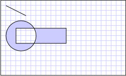

# How to: Create a Composite Shape
This example shows how to create composite shapes using <xref:System.Windows.Media.Geometry> objects and display them using a <xref:System.Windows.Shapes.Path> element. In the following example, a <xref:System.Windows.Media.LineGeometry>, <xref:System.Windows.Media.EllipseGeometry>, and a <xref:System.Windows.Media.RectangleGeometry> are used with a <xref:System.Windows.Media.GeometryGroup> to create a composite shape. The geometries are then drawn using a <xref:System.Windows.Shapes.Path> element.  
  
## Example  
 [!code-xaml[GeometrySample#19](../../../../samples/snippets/csharp/VS_Snippets_Wpf/GeometrySample/CS/combininggeometriesexample.xaml#19)]  
  
 [!code-csharp[GeometriesMiscSnippets_procedural_snip#CompositeShapeCodeExampleInline1](../../../../samples/snippets/csharp/VS_Snippets_Wpf/GeometriesMiscSnippets_procedural_snip/CSharp/CompositeShapeExample.cs#compositeshapecodeexampleinline1)]
 [!code-vb[GeometriesMiscSnippets_procedural_snip#CompositeShapeCodeExampleInline1](../../../../samples/snippets/visualbasic/VS_Snippets_Wpf/GeometriesMiscSnippets_procedural_snip/visualbasic/compositeshapeexample.vb#compositeshapecodeexampleinline1)]  
  
 The following illustration shows the shape created in the previous example.  
  
   
Composite Geometry  
  
 More complex shapes, such as polygons and shapes with curved segments, may be created using a <xref:System.Windows.Media.PathGeometry>. For an example showing how to create a shape using a <xref:System.Windows.Media.PathGeometry>, see [Create a Shape by Using a PathGeometry](../../../../docs/framework/wpf/graphics-multimedia/how-to-create-a-shape-by-using-a-pathgeometry.md).  Although this example renders a shape to the screen using a <xref:System.Windows.Shapes.Path> element, <xref:System.Windows.Media.Geometry> objects may also be used to describe the contents of a <xref:System.Windows.Media.GeometryDrawing> or a <xref:System.Windows.Media.DrawingContext>. They may also be used for clipping and hit-testing.  
  
 This example is part of larger sample; for the complete sample, see the [Geometries Sample](http://go.microsoft.com/fwlink/?LinkID=159989).
