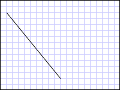

# How to: Create a Line Using a LineGeometry
This example shows how to use the <xref:System.Windows.Media.LineGeometry> class to describe a line. A <xref:System.Windows.Media.LineGeometry> is defined by its start and end points.  
  
## Example  
 The following example shows how to create and render a <xref:System.Windows.Media.LineGeometry>.  A <xref:System.Windows.Shapes.Path> element is used to render the line.  Since a line has no area, the <xref:System.Windows.Shapes.Path> object's <xref:System.Windows.Shapes.Shape.Fill%2A> is not specified; instead the <xref:System.Windows.Shapes.Shape.Stroke%2A> and <xref:System.Windows.Shapes.Shape.StrokeThickness%2A> properties are used.  
  
 [!code-xaml[GeometryOverviewSamples_snip#GraphicsMMLineGeometryExample](../../../../samples/snippets/csharp/VS_Snippets_Wpf/GeometryOverviewSamples_snip/CS/GeometryExamples.xaml#graphicsmmlinegeometryexample)]  
  
 [!code-csharp[GeometryOverviewSamples_procedural_snip#GraphicsMMLineGeometryExample](../../../../samples/snippets/csharp/VS_Snippets_Wpf/GeometryOverviewSamples_procedural_snip/CSharp/GeometryExamples.cs#graphicsmmlinegeometryexample)]
 [!code-vb[GeometryOverviewSamples_procedural_snip#GraphicsMMLineGeometryExample](../../../../samples/snippets/visualbasic/VS_Snippets_Wpf/GeometryOverviewSamples_procedural_snip/visualbasic/geometryexamples.vb#graphicsmmlinegeometryexample)]  
  
   
A LineGeometry drawn from (10,20) to (100,130)  
  
 Other simple geometry classes include <xref:System.Windows.Media.LineGeometry> and <xref:System.Windows.Media.EllipseGeometry>. These geometries, as well as more complex ones, can also be created using a <xref:System.Windows.Media.PathGeometry> or <xref:System.Windows.Media.StreamGeometry>. For more information, see the [Geometry Overview](../../../../docs/framework/wpf/graphics-multimedia/geometry-overview.md).  
  
## See Also  
 [Geometry Overview](../../../../docs/framework/wpf/graphics-multimedia/geometry-overview.md)  
 [Create a Composite Shape](../../../../docs/framework/wpf/graphics-multimedia/how-to-create-a-composite-shape.md)  
 [Create a Shape by Using a PathGeometry](../../../../docs/framework/wpf/graphics-multimedia/how-to-create-a-shape-by-using-a-pathgeometry.md)
