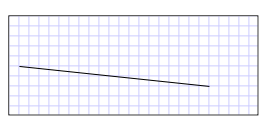

# How to: Create a LineSegment in a PathGeometry
This example shows how to create a line segment. To create a line segment, use the <xref:System.Windows.Media.PathGeometry>, <xref:System.Windows.Media.PathFigure>, and <xref:System.Windows.Media.LineSegment> classes.  
  
## Example  
 The following examples draw a <xref:System.Windows.Media.LineSegment> from (10, 50) to (200, 70). The following illustration shows the resulting <xref:System.Windows.Media.LineSegment>; a grid background was added to show the coordinate system.  
  
   
A LineSegment drawn from (10,50) to (200,70)  
  
 [xaml]  
  
 In [!INCLUDE[TLA#tla_xaml](../../../../includes/tlasharptla-xaml-md.md)], you may use attribute syntax to describe a path.  
  
```xaml  
<Path Stroke="Black" StrokeThickness="1"    
  Data="M 10,50 L 200,70" />  
```  
  
 [xaml]  
  
 (Note that this attribute syntax actually creates a <xref:System.Windows.Media.StreamGeometry>, a lighter-weight version of a <xref:System.Windows.Media.PathGeometry>. For more information, see the [Path Markup Syntax](../../../../docs/framework/wpf/graphics-multimedia/path-markup-syntax.md) page.)  
  
 In [!INCLUDE[TLA2#tla_xaml](../../../../includes/tla2sharptla-xaml-md.md)], you may also draw a line segment by using object element syntax. The following is equivalent to the previous [!INCLUDE[TLA2#tla_xaml](../../../../includes/tla2sharptla-xaml-md.md)] example.  
  
```xaml  
<Path Stroke="Black" StrokeThickness="1">  
  <Path.Data>  
    <PathGeometry>  
      <PathFigure StartPoint="10,50">  
        <LineSegment Point="200,70" />  
      </PathFigure>  
    </PathGeometry>  
  </Path.Data>  
</Path>  
```  
  
```csharp  
PathFigure myPathFigure = new PathFigure();  
myPathFigure.StartPoint = new Point(10, 50);  
  
LineSegment myLineSegment = new LineSegment();  
myLineSegment.Point = new Point(200, 70);  
  
PathSegmentCollection myPathSegmentCollection = new PathSegmentCollection();  
myPathSegmentCollection.Add(myLineSegment);  
  
myPathFigure.Segments = myPathSegmentCollection;  
  
PathFigureCollection myPathFigureCollection = new PathFigureCollection();  
myPathFigureCollection.Add(myPathFigure);  
  
PathGeometry myPathGeometry = new PathGeometry();  
myPathGeometry.Figures = myPathFigureCollection;  
  
Path myPath = new Path();  
myPath.Stroke = Brushes.Black;  
myPath.StrokeThickness = 1;  
myPath.Data = myPathGeometry;  
```  
  
```vb  
Dim myPathFigure As New PathFigure()  
			myPathFigure.StartPoint = New Point(10, 50)  
  
			Dim myLineSegment As New LineSegment()  
			myLineSegment.Point = New Point(200, 70)  
  
			Dim myPathSegmentCollection As New PathSegmentCollection()  
			myPathSegmentCollection.Add(myLineSegment)  
  
			myPathFigure.Segments = myPathSegmentCollection  
  
			Dim myPathFigureCollection As New PathFigureCollection()  
			myPathFigureCollection.Add(myPathFigure)  
  
			Dim myPathGeometry As New PathGeometry()  
			myPathGeometry.Figures = myPathFigureCollection  
  
			Dim myPath As New Path()  
			myPath.Stroke = Brushes.Black  
			myPath.StrokeThickness = 1  
			myPath.Data = myPathGeometry  
```  
  
 This example is part of larger sample; for the complete sample, see the [Geometries Sample](http://go.microsoft.com/fwlink/?LinkID=159989).  
  
## See Also  
 <xref:System.Windows.Media.PathFigure>  
 <xref:System.Windows.Media.PathGeometry>  
 <xref:System.Windows.Media.GeometryDrawing>  
 <xref:System.Windows.Shapes.Path>  
 [Geometry Overview](../../../../docs/framework/wpf/graphics-multimedia/geometry-overview.md)
