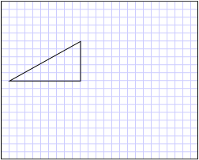

# How to: Create a Shape by Using a PathGeometry
This example shows how to create a shape using the <xref:System.Windows.Media.PathGeometry> class. <xref:System.Windows.Media.PathGeometry> objects are composed of one or more <xref:System.Windows.Media.PathFigure> objects; each <xref:System.Windows.Media.PathFigure> represents a different "figure" or shape. Each <xref:System.Windows.Media.PathFigure> is itself composed of one or more <xref:System.Windows.Media.PathSegment> objects, each representing a connected portion of the figure or shape. Segment types include <xref:System.Windows.Media.LineSegment>, <xref:System.Windows.Media.ArcSegment>, and <xref:System.Windows.Media.BezierSegment>.  
  
## Example  
 The following example uses a <xref:System.Windows.Media.PathGeometry> to create a triangle. The  <xref:System.Windows.Media.PathGeometry> is displayed using a <xref:System.Windows.Shapes.Path> element.  
  
 [!code-xaml[GeometrySample#49](../../../../samples/snippets/csharp/VS_Snippets_Wpf/GeometrySample/CS/pathgeometryexample.xaml#49)]  
  
 The following illustration shows the shape created in the previous example.  
  
   
A triangle created with a PathGeometry  
  
 The previous example showed how to create a relatively simple shape, a triangle. A <xref:System.Windows.Media.PathGeometry> can also be used to create more complex shapes, including arcs and curves. For examples, see [Create an Elliptical Arc](../../../../docs/framework/wpf/graphics-multimedia/how-to-create-an-elliptical-arc.md), [Create a Cubic Bezier Curve](../../../../docs/framework/wpf/graphics-multimedia/how-to-create-a-cubic-bezier-curve.md), and [Create a Quadratic Bezier Curve](../../../../docs/framework/wpf/graphics-multimedia/how-to-create-a-quadratic-bezier-curve.md).  
  
 This example is part of larger sample; for the complete sample, see the [Geometries Sample](http://go.microsoft.com/fwlink/?LinkID=159989).  
  
## See Also  
 <xref:System.Windows.Shapes.Path>  
 <xref:System.Windows.Media.GeometryDrawing>  
 [Geometry Overview](../../../../docs/framework/wpf/graphics-multimedia/geometry-overview.md)  
 [Geometries Sample](http://go.microsoft.com/fwlink/?LinkID=159989)
