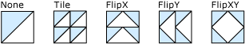

# How to: Create Different Tile Patterns with a TileBrush
This example shows how to use the <xref:System.Windows.Media.TileBrush.TileMode%2A> property of a <xref:System.Windows.Media.TileBrush> to create a pattern.  
  
 The <xref:System.Windows.Media.TileBrush.TileMode%2A> property enables you to specify how the content of a <xref:System.Windows.Media.TileBrush> is repeated, that is, tiled to fill an output area. To create a pattern, you set the <xref:System.Windows.Media.TileBrush.TileMode%2A> to <xref:System.Windows.Media.TileMode.Tile>, <xref:System.Windows.Media.TileMode.FlipX>, <xref:System.Windows.Media.TileMode.FlipY>, or <xref:System.Windows.Media.TileMode.FlipXY>. You must also set the <xref:System.Windows.Media.TileBrush.Viewport%2A> of the <xref:System.Windows.Media.TileBrush> so that it is smaller than the area that you are painting; otherwise, only a single tile is produced, regardless which <xref:System.Windows.Media.TileBrush.TileMode%2A> setting you use.  
  
## Example  
 The following example creates five <xref:System.Windows.Media.DrawingBrush> objects, gives them each a different <xref:System.Windows.Media.TileBrush.TileMode%2A> setting, and uses them to paint five rectangles. Although this example uses the <xref:System.Windows.Media.DrawingBrush> class to demonstrate <xref:System.Windows.Media.TileBrush.TileMode%2A> behavior, the <xref:System.Windows.Media.TileBrush.TileMode%2A> property works identically for all the <xref:System.Windows.Media.TileBrush> objects, that is, for <xref:System.Windows.Media.ImageBrush>, <xref:System.Windows.Media.VisualBrush>, and <xref:System.Windows.Media.DrawingBrush>.  
  
 The following illustration shows the output that this example produces.  
  
   
Tile patterns created with the TileMode property  
  
 [!code-csharp[BrushesIntroduction_snip#GraphicsMMDrawingBrushTileModeExample](../../../../samples/snippets/csharp/VS_Snippets_Wpf/BrushesIntroduction_snip/CSharp/TileModeExample.cs#graphicsmmdrawingbrushtilemodeexample)]
 [!code-vb[BrushesIntroduction_snip#GraphicsMMDrawingBrushTileModeExample](../../../../samples/snippets/visualbasic/VS_Snippets_Wpf/BrushesIntroduction_snip/visualbasic/tilemodeexample.vb#graphicsmmdrawingbrushtilemodeexample)]
 [!code-xaml[BrushesIntroduction_snip#GraphicsMMDrawingBrushTileModeExample](../../../../samples/snippets/xaml/VS_Snippets_Wpf/BrushesIntroduction_snip/XAML/TileModeExample.xaml#graphicsmmdrawingbrushtilemodeexample)]  
  
## See Also  
 [Set the Tile Size for a TileBrush](../../../../docs/framework/wpf/graphics-multimedia/how-to-set-the-tile-size-for-a-tilebrush.md)  
 [Painting with Images, Drawings, and Visuals](../../../../docs/framework/wpf/graphics-multimedia/painting-with-images-drawings-and-visuals.md)
