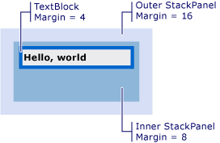

# How to: Get the Offset of a Visual
These examples show how to retrieve the offset value of a visual object that is relative to its parent, or any ancestor or descendant.  
  
## Example  
 The following markup example shows a <xref:System.Windows.Controls.TextBlock> that is defined with <xref:System.Windows.FrameworkElement.Margin%2A> value of 4.  
  
 [!code-xaml[VisualSnippets#VisualSnippet1](../../../../samples/snippets/csharp/VS_Snippets_Wpf/VisualSnippets/CSharp/Window1.xaml#visualsnippet1)]  
  
 The following code example shows how to use the <xref:System.Windows.Media.VisualTreeHelper.GetOffset%2A> method to retrieve the offset of the <xref:System.Windows.Controls.TextBlock>. The offset values are contained within the returned <xref:System.Windows.Vector> value.  
  
 [!code-csharp[VisualSnippets#VisualSnippet2](../../../../samples/snippets/csharp/VS_Snippets_Wpf/VisualSnippets/CSharp/Window1.xaml.cs#visualsnippet2)]
 [!code-vb[VisualSnippets#VisualSnippet2](../../../../samples/snippets/visualbasic/VS_Snippets_Wpf/VisualSnippets/visualbasic/window1.xaml.vb#visualsnippet2)]  
  
 The offset takes into account the <xref:System.Windows.FrameworkElement.Margin%2A> value. In this case, <xref:System.Windows.Vector.X%2A> is 4, and <xref:System.Windows.Vector.Y%2A> is 4.  
  
 The returned offset value is relative to the parent of the <xref:System.Windows.Media.Visual>. If you want to return an offset value that is not relative to the parent of a <xref:System.Windows.Media.Visual>, use the <xref:System.Windows.Media.Visual.TransformToAncestor%2A> method.  
  
## Getting the Offset Relative to an Ancestor  
 The following markup example shows a <xref:System.Windows.Controls.TextBlock> that is nested within two <xref:System.Windows.Controls.StackPanel> objects.  
  
 [!code-xaml[VisualSnippets#VisualSnippet7](../../../../samples/snippets/csharp/VS_Snippets_Wpf/VisualSnippets/CSharp/Window2.xaml#visualsnippet7)]  
  
 The following illustration shows the results of the markup.  
  
   
TextBlock nested within two StackPanels  
  
 The following code example shows how to use the <xref:System.Windows.Media.Visual.TransformToAncestor%2A> method to retrieve the offset of the <xref:System.Windows.Controls.TextBlock> relative to the containing <xref:System.Windows.Window>. The offset values are contained within the returned <xref:System.Windows.Media.GeneralTransform> value.  
  
 [!code-csharp[VisualSnippets#VisualSnippet5](../../../../samples/snippets/csharp/VS_Snippets_Wpf/VisualSnippets/CSharp/Window1.xaml.cs#visualsnippet5)]
 [!code-vb[VisualSnippets#VisualSnippet5](../../../../samples/snippets/visualbasic/VS_Snippets_Wpf/VisualSnippets/visualbasic/window1.xaml.vb#visualsnippet5)]  
  
 The offset takes into account the <xref:System.Windows.FrameworkElement.Margin%2A> values for all objects within the containing <xref:System.Windows.Window>. In this case, <xref:System.Windows.Vector.X%2A> is 28 (16 + 8 + 4), and <xref:System.Windows.Vector.Y%2A> is 28.  
  
 The returned offset value is relative to the ancestor of the <xref:System.Windows.Media.Visual>. If you want to return an offset value that is relative to the descendant of a <xref:System.Windows.Media.Visual>, use the <xref:System.Windows.Media.Visual.TransformToDescendant%2A> method.  
  
## Getting the Offset Relative to a Descendant  
 The following markup example shows a <xref:System.Windows.Controls.TextBlock> that is contained within a <xref:System.Windows.Controls.StackPanel> object.  
  
 [!code-xaml[VisualSnippets#VisualSnippet4](../../../../samples/snippets/csharp/VS_Snippets_Wpf/VisualSnippets/CSharp/Window1.xaml#visualsnippet4)]  
  
 The following code example shows how to use the <xref:System.Windows.Media.Visual.TransformToDescendant%2A> method to retrieve the offset of the <xref:System.Windows.Controls.StackPanel> relative to its child <xref:System.Windows.Controls.TextBlock>. The offset values are contained within the returned <xref:System.Windows.Media.GeneralTransform> value.  
  
 [!code-csharp[VisualSnippets#VisualSnippet9](../../../../samples/snippets/csharp/VS_Snippets_Wpf/VisualSnippets/CSharp/Window1.xaml.cs#visualsnippet9)]
 [!code-vb[VisualSnippets#VisualSnippet9](../../../../samples/snippets/visualbasic/VS_Snippets_Wpf/VisualSnippets/visualbasic/window1.xaml.vb#visualsnippet9)]  
  
 The offset takes into account the <xref:System.Windows.FrameworkElement.Margin%2A> values for all objects. In this case, <xref:System.Windows.Vector.X%2A> is -4, and <xref:System.Windows.Vector.Y%2A> is -4. The offset values are negative values, since the parent object is negatively offset relative to its child object.  
  
## See Also  
 <xref:System.Windows.Media.Visual>  
 <xref:System.Windows.Media.VisualTreeHelper>  
 [WPF Graphics Rendering Overview](../../../../docs/framework/wpf/graphics-multimedia/wpf-graphics-rendering-overview.md)
