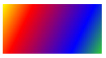
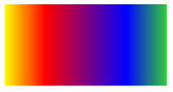
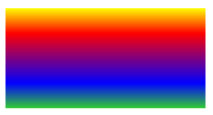

# How to: Paint an Area with a Linear Gradient
This example shows how to use the <xref:System.Windows.Media.LinearGradientBrush> class to paint an area with a linear gradient. In the following example, the <xref:System.Windows.Shapes.Shape.Fill%2A> of a <xref:System.Windows.Shapes.Rectangle> is painted with a diagonal linear gradient that transitions from yellow to red to blue to lime green.  
  
## Example  
 [!code-xaml[GradientBrushExamples_snip#DiagonalGradient1XAML](../../../../samples/snippets/xaml/VS_Snippets_Wpf/GradientBrushExamples_snip/XAML/LinearGradientBrushExample.xaml#diagonalgradient1xaml)]  
  
 [!code-csharp[GradientBrushExamples_snip#DiagonalGradient1CSharp](../../../../samples/snippets/csharp/VS_Snippets_Wpf/GradientBrushExamples_snip/CSharp/LinearGradientBrushExample.cs#diagonalgradient1csharp)]  
  
 The following illustration shows the gradient created by the previous example.  
  
   
  
 To create a horizontal linear gradient, change the <xref:System.Windows.Media.LinearGradientBrush.StartPoint%2A> and <xref:System.Windows.Media.LinearGradientBrush.EndPoint%2A> of the <xref:System.Windows.Media.LinearGradientBrush> to (0,0.5) and (1,0.5). In the following example, a <xref:System.Windows.Shapes.Rectangle> is painted with a horizontal linear gradient.  
  
 [!code-xaml[GradientBrushExamples_snip#HorizontalGradient1XAML](../../../../samples/snippets/xaml/VS_Snippets_Wpf/GradientBrushExamples_snip/XAML/LinearGradientBrushExample.xaml#horizontalgradient1xaml)]  
  
 [!code-csharp[GradientBrushExamples_snip#HorizontalGradient1CSharp](../../../../samples/snippets/csharp/VS_Snippets_Wpf/GradientBrushExamples_snip/CSharp/LinearGradientBrushExample.cs#horizontalgradient1csharp)]  
  
 The following illustration shows the gradient created by the previous example.  
  
   
  
 To create a vertical linear gradient, change the <xref:System.Windows.Media.LinearGradientBrush.StartPoint%2A> and <xref:System.Windows.Media.LinearGradientBrush.EndPoint%2A> of the <xref:System.Windows.Media.LinearGradientBrush> to (0.5,0) and (0.5,1). In the following example, a <xref:System.Windows.Shapes.Rectangle> is painted with a vertical linear gradient.  
  
 [!code-xaml[GradientBrushExamples_snip#VerticalGradient1XAML](../../../../samples/snippets/xaml/VS_Snippets_Wpf/GradientBrushExamples_snip/XAML/LinearGradientBrushExample.xaml#verticalgradient1xaml)]  
  
 [!code-csharp[GradientBrushExamples_snip#VerticalGradient1CSharp](../../../../samples/snippets/csharp/VS_Snippets_Wpf/GradientBrushExamples_snip/CSharp/LinearGradientBrushExample.cs#verticalgradient1csharp)]  
  
 The following illustration shows the gradient created by the previous example.  
  
   
  
> [!NOTE]
>  The examples in this topic use the default coordinate system for setting start points and end points. The default coordinate system is relative to a bounding box: 0 indicates 0 percent of the bounding box, and 1 indicates 100 percent of the bounding box. You can change this coordinate system by setting the <xref:System.Windows.Media.GradientBrush.MappingMode%2A> property to the value <xref:System.Windows.Media.BrushMappingMode.Absolute?displayProperty=nameWithType>. An absolute coordinate system is not relative to a bounding box. Values are interpreted directly in local space.  
  
 For additional examples, see [Brushes Sample](http://go.microsoft.com/fwlink/?LinkID=159973). For more information about gradients and other types of brushes, see [Painting with Solid Colors and Gradients Overview](../../../../docs/framework/wpf/graphics-multimedia/painting-with-solid-colors-and-gradients-overview.md).
