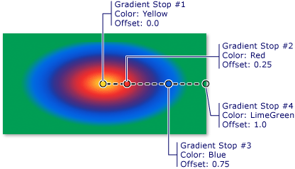

# How to: Paint an Area with a Radial Gradient
This example shows how to use the <xref:System.Windows.Media.RadialGradientBrush> class to paint an area with a radial gradient.  
  
## Example  
 The following example uses a <xref:System.Windows.Media.RadialGradientBrush> to paint a rectangle with a radial gradient that transitions from yellow to red to blue to lime green.  
  
 [!code-csharp[BrushesIntroduction_snip#SimpleRadialGradientExampleWholePage](../../../../samples/snippets/csharp/VS_Snippets_Wpf/BrushesIntroduction_snip/CSharp/RadialGradientBrushSnippet.cs#simpleradialgradientexamplewholepage)]
 [!code-vb[BrushesIntroduction_snip#SimpleRadialGradientExampleWholePage](../../../../samples/snippets/visualbasic/VS_Snippets_Wpf/BrushesIntroduction_snip/visualbasic/radialgradientbrushsnippet.vb#simpleradialgradientexamplewholepage)]
 [!code-xaml[BrushesIntroduction_snip#SimpleRadialGradientExampleWholePage](../../../../samples/snippets/xaml/VS_Snippets_Wpf/BrushesIntroduction_snip/XAML/RadialGradientBrushSnippet.xaml#simpleradialgradientexamplewholepage)]  
  
 The following illustration shows the gradient from the preceding example. The gradient's stops have been highlighted.  
  
   
  
> [!NOTE]
>  The examples in this topic use the default coordinate system for setting control points. The default coordinate system is relative to a bounding box: 0 indicates 0 percent of the bounding box, and 1 indicates 100 percent of the bounding box. You can change this coordinate system by setting the <xref:System.Windows.Media.GradientBrush.MappingMode%2A> property to the value <xref:System.Windows.Media.BrushMappingMode.Absolute>. An absolute coordinate system is not relative to a bounding box. Values are interpreted directly in local space.  
  
 For additional <xref:System.Windows.Media.RadialGradientBrush> examples, see the [Brushes Sample](http://go.microsoft.com/fwlink/?LinkID=159973). For more information about gradients and other types of brushes, see [Painting with Solid Colors and Gradients Overview](../../../../docs/framework/wpf/graphics-multimedia/painting-with-solid-colors-and-gradients-overview.md).
