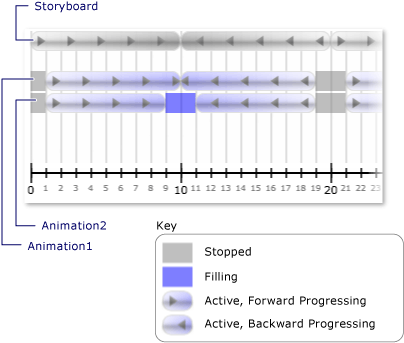

# How to: Receive Notification When a Clock&#39;s State Changes
A clock's <xref:System.Windows.Media.Animation.Clock.CurrentStateInvalidated> event occurs when its <xref:System.Windows.Media.Animation.Clock.CurrentState%2A> becomes invalid, such as when the clock starts or stops. You can register for this event with directly using a <xref:System.Windows.Media.Animation.Clock>, or you can register using a <xref:System.Windows.Media.Animation.Timeline>.  
  
 In the following example, a <xref:System.Windows.Media.Animation.Storyboard> and two <xref:System.Windows.Media.Animation.DoubleAnimation> objects are used to animate the width of two rectangles. The <xref:System.Windows.Media.Animation.Timeline.CurrentStateInvalidated> event is used to listen for clock state changes.  
  
## Example  
 [!code-xaml[timingbehaviors_snip#_graphicsmm_StateExampleMarkupWholePage](../../../../samples/snippets/csharp/VS_Snippets_Wpf/timingbehaviors_snip/CSharp/StateExample.xaml#_graphicsmm_stateexamplemarkupwholepage)]  
  
 [!code-csharp[timingbehaviors_snip#_graphicsmm_StateEventHandlers](../../../../samples/snippets/csharp/VS_Snippets_Wpf/timingbehaviors_snip/CSharp/StateExample.xaml.cs#_graphicsmm_stateeventhandlers)]
 [!code-vb[timingbehaviors_snip#_graphicsmm_StateEventHandlers](../../../../samples/snippets/visualbasic/VS_Snippets_Wpf/timingbehaviors_snip/visualbasic/stateexample.xaml.vb#_graphicsmm_stateeventhandlers)]  
  
 The following illustration shows the different states the animations enter as the parent timeline (*Storyboard*) progresses.  
  
   
  
 The following table shows the times at which *Animation1*'s <xref:System.Windows.Media.Animation.Timeline.CurrentStateInvalidated> event fires:  
  
||||||||  
|-|-|-|-|-|-|-|  
|Time (Seconds)|1|10|19|21|30|39|  
|State|Active|Active|Stopped|Active|Active|Stopped|  
  
 The following table shows the times at which *Animation2*'s <xref:System.Windows.Media.Animation.Timeline.CurrentStateInvalidated> event fires:  
  
||||||||||  
|-|-|-|-|-|-|-|-|-|  
|Time (Seconds)|1|9|11|19|21|29|31|39|  
|State|Active|Filling|Active|Stopped|Active|Filling|Active|Stopped|  
  
 Notice that *Animation1*'s  <xref:System.Windows.Media.Animation.Timeline.CurrentStateInvalidated> event fires at 10 seconds, even though its state remains <xref:System.Windows.Media.Animation.ClockState.Active>. That's because its state changed at 10 seconds, but it changed from <xref:System.Windows.Media.Animation.ClockState.Active> to <xref:System.Windows.Media.Animation.ClockState.Filling> and then back to <xref:System.Windows.Media.Animation.ClockState.Active> in the same tick.
