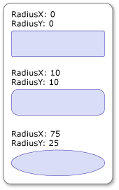

# How to: Round the Corners of a RectangleGeometry
To round the corners of a <xref:System.Windows.Media.RectangleGeometry>, set its <xref:System.Windows.Media.RectangleGeometry.RadiusX%2A> and <xref:System.Windows.Media.RectangleGeometry.RadiusY%2A> properties to a value greater than zero. The larger the values, the rounder the rectangle's corners.  
  
## Example  
 The following example shows several <xref:System.Windows.Media.RectangleGeometry> objects with different <xref:System.Windows.Media.RectangleGeometry.RadiusX%2A> and <xref:System.Windows.Media.RectangleGeometry.RadiusY%2A> settings. The <xref:System.Windows.Media.RectangleGeometry> objects are displayed using <xref:System.Windows.Shapes.Path> elements.  
  
 [!code-xaml[GeometryOverviewSamples_snip#GraphicsMMRoundedRectangleGeometryExampleWholePage](../../../../samples/snippets/csharp/VS_Snippets_Wpf/GeometryOverviewSamples_snip/CS/RectangleGeometryRoundedCornerExample.xaml#graphicsmmroundedrectanglegeometryexamplewholepage)]  
  
   
Rectangles with Rounded Corners  
  
## See Also  
 [Geometry Overview](../../../../docs/framework/wpf/graphics-multimedia/geometry-overview.md)  
 [Create a Composite Shape](../../../../docs/framework/wpf/graphics-multimedia/how-to-create-a-composite-shape.md)  
 [Create a Shape by Using a PathGeometry](../../../../docs/framework/wpf/graphics-multimedia/how-to-create-a-shape-by-using-a-pathgeometry.md)
