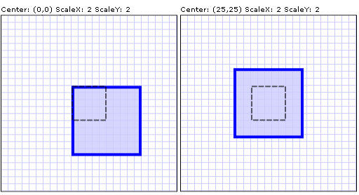

# How to: Scale an Element
This example shows how to use a <xref:System.Windows.Media.ScaleTransform> to scale an element.  
  
 Use the <xref:System.Windows.Media.ScaleTransform.ScaleX%2A> and <xref:System.Windows.Media.ScaleTransform.ScaleY%2A> properties to resize the element by the factor you specify. For example, a <xref:System.Windows.Media.ScaleTransform.ScaleX%2A> value of 1.5 stretches the element to 150 percent of its original width. A <xref:System.Windows.Media.ScaleTransform.ScaleY%2A> value of 0.5 shrinks the height of an element by 50 percent.  
  
 Use the <xref:System.Windows.Media.ScaleTransform.CenterX%2A> and <xref:System.Windows.Media.ScaleTransform.CenterY%2A> properties to specify the point that is the center of the scale operation. By default, a <xref:System.Windows.Media.ScaleTransform> is centered at the point (0,0), which corresponds to the upper-left corner of the rectangle. This has the effect of moving the element and also of making it appear larger, because when you apply a <xref:System.Windows.Media.Transform>, you change the coordinate space in which the object resides.  
  
 The following example uses a <xref:System.Windows.Media.ScaleTransform> to double the size of a 50-by-50 <xref:System.Windows.Shapes.Rectangle>. The <xref:System.Windows.Media.ScaleTransform> has a value of 0 (the default) for both <xref:System.Windows.Media.ScaleTransform.CenterX%2A> and <xref:System.Windows.Media.ScaleTransform.CenterY%2A>.  
  
## Example  
 [!code-xaml[transformsSample#21](../../../../samples/snippets/csharp/VS_Snippets_Wpf/transformsSample/CS/ScaleTransformExample.xaml#21)]  
  
 Typically, you set <xref:System.Windows.Media.ScaleTransform.CenterX%2A> and <xref:System.Windows.Media.ScaleTransform.CenterY%2A> to the center of the object that is scaled: (<xref:System.Windows.FrameworkElement.Width%2A>/2, <xref:System.Windows.FrameworkElement.Height%2A>/2).  
  
 The following example shows another <xref:System.Windows.Shapes.Rectangle> that is doubled in size; however, this <xref:System.Windows.Media.ScaleTransform> has a value of 25 for both <xref:System.Windows.Media.ScaleTransform.CenterX%2A> and <xref:System.Windows.Media.ScaleTransform.CenterY%2A>, which corresponds to the center of the rectangle.  
  
 [!code-xaml[transformsSample#22](../../../../samples/snippets/csharp/VS_Snippets_Wpf/transformsSample/CS/ScaleTransformExample.xaml#22)]  
  
 The following illustration shows the difference between the two <xref:System.Windows.Media.ScaleTransform> operations. The dotted line shows the size and position of the rectangle before scaling.  
  
   
Two ScaleTransform operations with identical ScaleX and ScaleY values but different centers  
  
 For the complete sample, see [2-D Transforms Sample](http://go.microsoft.com/fwlink/?LinkID=158252).  
  
## See Also  
 <xref:System.Windows.Media.Transform>  
 <xref:System.Windows.Media.ScaleTransform>  
 [Transforms Overview](../../../../docs/framework/wpf/graphics-multimedia/transforms-overview.md)  
 [How-to Topics](../../../../docs/framework/wpf/graphics-multimedia/transformations-how-to-topics.md)
