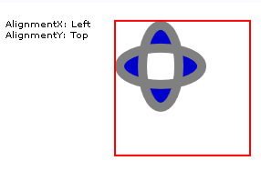
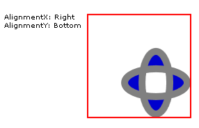
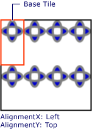
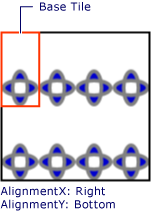

# How to: Set the Horizontal and Vertical Alignment of a TileBrush
This example shows how to control the horizontal and vertical alignment of content in a tile. To control the horizontal and vertical alignment of a <xref:System.Windows.Media.TileBrush>, use its <xref:System.Windows.Media.TileBrush.AlignmentX%2A> and <xref:System.Windows.Media.TileBrush.AlignmentY%2A> properties.  
  
 The <xref:System.Windows.Media.TileBrush.AlignmentX%2A> and <xref:System.Windows.Media.TileBrush.AlignmentY%2A> properties of a <xref:System.Windows.Media.TileBrush> are used when either of the following conditions is true:  
  
-   The <xref:System.Windows.Media.TileBrush.Stretch%2A> property is <xref:System.Windows.Media.Stretch.Uniform> or <xref:System.Windows.Media.Stretch.UniformToFill> and the <xref:System.Windows.Media.TileBrush.Viewbox%2A> and <xref:System.Windows.Media.TileBrush.Viewport%2A> have different aspect ratios.  
  
-   The <xref:System.Windows.Media.TileBrush.Stretch%2A> property is <xref:System.Windows.Media.Stretch.None> and the <xref:System.Windows.Media.TileBrush.Viewbox%2A> and <xref:System.Windows.Media.TileBrush.Viewport%2A> are different sizes.  
  
## Example  
 The following example aligns the content of a <xref:System.Windows.Media.DrawingBrush>, which is a type of <xref:System.Windows.Media.TileBrush>, to the upper-left corner of its tile. To align the content, the example sets the <xref:System.Windows.Media.TileBrush.AlignmentX%2A> property of the <xref:System.Windows.Media.DrawingBrush> to <xref:System.Windows.Media.AlignmentX.Left> and the <xref:System.Windows.Media.TileBrush.AlignmentY%2A> property to <xref:System.Windows.Media.AlignmentY.Top>. This example produces the following output.  
  
   
TileBrush with content aligned to the upper-left corner  
  
 [!code-csharp[brushoverviewexamples_snip#TileBrushTopLeftAlignmentInline](../../../../samples/snippets/csharp/VS_Snippets_Wpf/BrushOverviewExamples_snip/CSharp/TileBrushAlignmentExample.cs#tilebrushtopleftalignmentinline)]
 [!code-vb[brushoverviewexamples_snip#TileBrushTopLeftAlignmentInline](../../../../samples/snippets/visualbasic/VS_Snippets_Wpf/BrushOverviewExamples_snip/visualbasic/tilebrushalignmentexample.vb#tilebrushtopleftalignmentinline)]
 [!code-xaml[brushoverviewexamples_snip#TileBrushTopLeftAlignmentInline](../../../../samples/snippets/xaml/VS_Snippets_Wpf/BrushOverviewExamples_snip/XAML/TileBrushAlignmentExample.xaml#tilebrushtopleftalignmentinline)]  
  
## Example  
 The next example aligns the content of a <xref:System.Windows.Media.DrawingBrush> to the lower-right corner of its tile by setting the <xref:System.Windows.Media.TileBrush.AlignmentX%2A> property to <xref:System.Windows.Media.AlignmentX.Right> and the <xref:System.Windows.Media.TileBrush.AlignmentY%2A> property to <xref:System.Windows.Media.AlignmentY.Bottom>. The example produces the following output.  
  
   
TileBrush with content aligned to the lower-right corner  
  
 [!code-csharp[brushoverviewexamples_snip#TileBrushBottomRightAlignmentInline](../../../../samples/snippets/csharp/VS_Snippets_Wpf/BrushOverviewExamples_snip/CSharp/TileBrushAlignmentExample.cs#tilebrushbottomrightalignmentinline)]
 [!code-vb[brushoverviewexamples_snip#TileBrushBottomRightAlignmentInline](../../../../samples/snippets/visualbasic/VS_Snippets_Wpf/BrushOverviewExamples_snip/visualbasic/tilebrushalignmentexample.vb#tilebrushbottomrightalignmentinline)]
 [!code-xaml[brushoverviewexamples_snip#TileBrushBottomRightAlignmentInline](../../../../samples/snippets/xaml/VS_Snippets_Wpf/BrushOverviewExamples_snip/XAML/TileBrushAlignmentExample.xaml#tilebrushbottomrightalignmentinline)]  
  
## Example  
 The next example aligns the content of a <xref:System.Windows.Media.DrawingBrush> to the upper-left corner of its tile by setting the <xref:System.Windows.Media.TileBrush.AlignmentX%2A> property to <xref:System.Windows.Media.AlignmentX.Left> and the <xref:System.Windows.Media.TileBrush.AlignmentY%2A> property to <xref:System.Windows.Media.AlignmentY.Top>. It also sets the <xref:System.Windows.Media.TileBrush.Viewport%2A> and <xref:System.Windows.Media.TileBrush.TileMode%2A> of the <xref:System.Windows.Media.DrawingBrush> to produce a tile pattern. The example produces the following output.  
  
   
Tile pattern with content aligned to upper-left in base tile  
  
 The illustration highlights abase tile so that you can see how its content is aligned. Notice that the <xref:System.Windows.Media.TileBrush.AlignmentX%2A> setting has no effect because the content of the <xref:System.Windows.Media.DrawingBrush> completely fills the base tile horizontally.  
  
 [!code-csharp[brushoverviewexamples_snip#TileBrushTopLeftAlignmentTiledInline](../../../../samples/snippets/csharp/VS_Snippets_Wpf/BrushOverviewExamples_snip/CSharp/TileBrushAlignmentExample.cs#tilebrushtopleftalignmenttiledinline)]
 [!code-vb[brushoverviewexamples_snip#TileBrushTopLeftAlignmentTiledInline](../../../../samples/snippets/visualbasic/VS_Snippets_Wpf/BrushOverviewExamples_snip/visualbasic/tilebrushalignmentexample.vb#tilebrushtopleftalignmenttiledinline)]
 [!code-xaml[brushoverviewexamples_snip#TileBrushTopLeftAlignmentTiledInline](../../../../samples/snippets/xaml/VS_Snippets_Wpf/BrushOverviewExamples_snip/XAML/TileBrushAlignmentExample.xaml#tilebrushtopleftalignmenttiledinline)]  
  
## Example  
 The final example aligns the content of a tiled <xref:System.Windows.Media.DrawingBrush> to the lower-right of its base tile by setting the <xref:System.Windows.Media.TileBrush.AlignmentX%2A> property to <xref:System.Windows.Media.AlignmentX.Right> and the <xref:System.Windows.Media.TileBrush.AlignmentY%2A> property to <xref:System.Windows.Media.AlignmentY.Bottom>. The example produces the following output.  
  
   
Tile pattern with content aligned to lower-right in base tile  
  
 Again, the <xref:System.Windows.Media.TileBrush.AlignmentX%2A> setting has no effect because the content of the <xref:System.Windows.Media.DrawingBrush> completely fills the base tile horizontally.  
  
 [!code-csharp[brushoverviewexamples_snip#TileBrushBottomRightAlignmentInline](../../../../samples/snippets/csharp/VS_Snippets_Wpf/BrushOverviewExamples_snip/CSharp/TileBrushAlignmentExample.cs#tilebrushbottomrightalignmentinline)]
 [!code-vb[brushoverviewexamples_snip#TileBrushBottomRightAlignmentInline](../../../../samples/snippets/visualbasic/VS_Snippets_Wpf/BrushOverviewExamples_snip/visualbasic/tilebrushalignmentexample.vb#tilebrushbottomrightalignmentinline)]
 [!code-xaml[brushoverviewexamples_snip#TileBrushBottomRightAlignmentInline](../../../../samples/snippets/xaml/VS_Snippets_Wpf/BrushOverviewExamples_snip/XAML/TileBrushAlignmentExample.xaml#tilebrushbottomrightalignmentinline)]  
  
 The examples use <xref:System.Windows.Media.DrawingBrush> objects to demonstrate how the <xref:System.Windows.Media.TileBrush.AlignmentX%2A> and <xref:System.Windows.Media.TileBrush.AlignmentY%2A> properties are used. These properties behave identically for all the tile brushes: <xref:System.Windows.Media.DrawingBrush>, <xref:System.Windows.Media.ImageBrush>, and <xref:System.Windows.Media.VisualBrush>. For more information about tile brushes, see [Painting with Images, Drawings, and Visuals](../../../../docs/framework/wpf/graphics-multimedia/painting-with-images-drawings-and-visuals.md).  
  
## See Also  
 <xref:System.Windows.Media.DrawingBrush>  
 <xref:System.Windows.Media.ImageBrush>  
 <xref:System.Windows.Media.VisualBrush>  
 [Painting with Images, Drawings, and Visuals](../../../../docs/framework/wpf/graphics-multimedia/painting-with-images-drawings-and-visuals.md)
