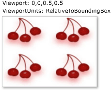
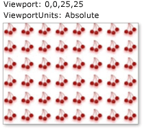

# How to: Set the Tile Size for a TileBrush

This example shows how to set the tile size for a <xref:System.Windows.Media.TileBrush>. By default, a <xref:System.Windows.Media.TileBrush> produces a single tile that completely fills the area that you are painting. You can override this behavior by setting the <xref:System.Windows.Media.TileBrush.Viewport%2A> and <xref:System.Windows.Media.TileBrush.ViewportUnits%2A> properties.

The <xref:System.Windows.Media.TileBrush.Viewport%2A> property specifies the tile size for a <xref:System.Windows.Media.TileBrush>. By default, the value of the <xref:System.Windows.Media.TileBrush.Viewport%2A> property is relative to the size of the area being painted. To make the <xref:System.Windows.Media.TileBrush.Viewport%2A> property specify an absolute tile size, set the <xref:System.Windows.Media.TileBrush.ViewportUnits%2A> property to <xref:System.Windows.Media.BrushMappingMode.Absolute>.

## Example

The following example uses an <xref:System.Windows.Media.ImageBrush>, a type of <xref:System.Windows.Media.TileBrush>, to paint a rectangle with tiles. The example sets each tile to 50 percent by 50 percent of the output area (the rectangle). As a result, the rectangle is painted with four projections of the image.

The following illustration shows the output that the example produces:

[!code-csharp[UsingImageBrush_snip#RelativeTileSizeExample](~/samples/snippets/csharp/VS_Snippets_Wpf/UsingImageBrush_snip/CSharp/TileSizeExample.cs#relativetilesizeexample)]

The next example creates an <xref:System.Windows.Media.ImageBrush>, sets its <xref:System.Windows.Media.TileBrush.Viewport%2A> to `0,0,25,25` and its <xref:System.Windows.Media.TileBrush.ViewportUnits%2A> to <xref:System.Windows.Media.BrushMappingMode.Absolute>, and uses it to paint another rectangle. As a result, the brush produces tiles that have a width of 25  pixels and a height of 25 pixels .

The following illustration shows the output that the example produces:

[!code-csharp[UsingImageBrush_snip#AbsoluteTileSizeExample](~/samples/snippets/csharp/VS_Snippets_Wpf/UsingImageBrush_snip/CSharp/TileSizeExample.cs#absolutetilesizeexample)]

The preceding examples are part of a larger sample. For the complete sample, see [ImageBrush Sample](https://go.microsoft.com/fwlink/?LinkID=160005).

Although this example uses the <xref:System.Windows.Media.ImageBrush> class, the <xref:System.Windows.Media.TileBrush.Viewport%2A> and <xref:System.Windows.Media.TileBrush.ViewportUnits%2A> properties behave identically for the other <xref:System.Windows.Media.TileBrush> objects, that is, for <xref:System.Windows.Media.DrawingBrush> and <xref:System.Windows.Media.VisualBrush>. For more information about <xref:System.Windows.Media.ImageBrush> and the other <xref:System.Windows.Media.TileBrush> objects, see [Painting with Images, Drawings, and Visuals](painting-with-images-drawings-and-visuals.md).

## See also

- <xref:System.Windows.Media.TileBrush>
- [Painting with Images, Drawings, and Visuals](painting-with-images-drawings-and-visuals.md)
- [Create Different Tile Patterns with a TileBrush](how-to-create-different-tile-patterns-with-a-tilebrush.md)
