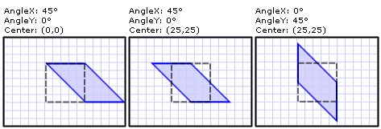

# How to: Skew an Element
This example shows how to use a <xref:System.Windows.Media.SkewTransform> to skew an element. A skew, which is also known as a shear, is a transformation that stretches the coordinate space in a non-uniform manner. One typical use of a <xref:System.Windows.Media.SkewTransform> is for simulating [!INCLUDE[TLA#tla_3d](../../../../includes/tlasharptla-3d-md.md)] depth in [!INCLUDE[TLA#tla_2d](../../../../includes/tlasharptla-2d-md.md)] objects.  
  
 Use the <xref:System.Windows.Media.SkewTransform.CenterX%2A> and <xref:System.Windows.Media.SkewTransform.CenterY%2A> properties to specify the center point of the <xref:System.Windows.Media.SkewTransform>.  
  
 Use the <xref:System.Windows.Media.SkewTransform.AngleX%2A> and <xref:System.Windows.Media.SkewTransform.AngleY%2A> properties to specify the skew angle of the x-axis and y-axis, and to skew the current coordinate system along these axes.  
  
 To predict the effect of a skew transformation, consider that <xref:System.Windows.Media.SkewTransform.AngleX%2A> skews x-axis values relative to the original coordinate system. Therefore, for an <xref:System.Windows.Media.SkewTransform.AngleX%2A> of 30, the y-axis rotates 30 degrees through the origin and skews the values in x- by 30 degrees from that origin. Likewise, an <xref:System.Windows.Media.SkewTransform.AngleY%2A> of 30 skews the y- values of the shape by 30 degrees from the origin. Note that this is not the same effect as translating (moving) the coordinate system by 30 degrees in x- or y-.  
  
 The following example applies a horizontal skew of 45 degrees to a <xref:System.Windows.Shapes.Rectangle> from a center point of (0,0).  
  
## Example  
 [!code-xaml[transformsSample#41](../../../../samples/snippets/csharp/VS_Snippets_Wpf/transformsSample/CS/SkewTransformExample.xaml#41)]  
  
 The following example applies a horizontal skew of 45 degrees to a <xref:System.Windows.Shapes.Rectangle> from a center point of (25,25).  
  
 [!code-xaml[transformsSample#42](../../../../samples/snippets/csharp/VS_Snippets_Wpf/transformsSample/CS/SkewTransformExample.xaml#42)]  
  
 The following example applies a vertical skew of 45 degrees to a <xref:System.Windows.Shapes.Rectangle> from a center point of (25,25).  
  
 [!code-xaml[transformsSample#43](../../../../samples/snippets/csharp/VS_Snippets_Wpf/transformsSample/CS/SkewTransformExample.xaml#43)]  
  
 The following illustration shows the different skews that are used in this example.  
  
   
The three SkewTransform examples illustrated  
  
 For the complete sample, see [2-D Transforms Sample](http://go.microsoft.com/fwlink/?LinkID=158252).  
  
## See Also  
 <xref:System.Windows.Media.Transform>  
 <xref:System.Windows.Media.SkewTransform>  
 [Transforms Overview](../../../../docs/framework/wpf/graphics-multimedia/transforms-overview.md)  
 [How-to Topics](../../../../docs/framework/wpf/graphics-multimedia/transformations-how-to-topics.md)
