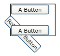
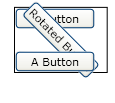

# How to: Specify the Origin of a Transform by Using Relative Values
This example shows how to use relative values to specify the origin of a <xref:System.Windows.UIElement.RenderTransform%2A> that is applied to a <xref:System.Windows.FrameworkElement>.  
  
 When you rotate, scale, or skew a <xref:System.Windows.FrameworkElement> by using the <xref:System.Windows.UIElement.RenderTransform%2A> property, the default setting applies the transform to the upper-left corner of the element. If you want to rotate, scale, or skew from the center of the element, you can compensate by setting the center of the transform to the center of the element. However, that solution requires that you know the size of the element. An easier way of applying a transform to the center of an element is to set its <xref:System.Windows.UIElement.RenderTransformOrigin%2A> property to (0.5, 0.5), instead of setting a center value on the transform itself.  
  
## Example  
 The following example uses a <xref:System.Windows.Media.RotateTransform> to rotate a <xref:System.Windows.Controls.Button> 45 degrees clockwise. Because the example does not specify a center, the button rotates about the point (0, 0), which is its upper-left corner. The <xref:System.Windows.Media.RotateTransform> is applied to the <xref:System.Windows.UIElement.RenderTransform%2A> property.  
  
 The following illustration shows the transformation result for the example that follows.  
  
   
A 45 degree clockwise rotation by using the RenderTransform property  
  
 [!code-xaml[Transforms_snip#GraphicsMMRotateButtonExample1](../../../../samples/snippets/csharp/VS_Snippets_Wpf/Transforms_snip/CS/ButtonRotateTransformExample.xaml#graphicsmmrotatebuttonexample1)]  
  
 The following example also uses a <xref:System.Windows.Media.RotateTransform> to rotate a <xref:System.Windows.Controls.Button> 45 degrees clockwise; however, this example sets the <xref:System.Windows.UIElement.RenderTransformOrigin%2A> of the button to (0.5, 0.5). As a result, the rotation is applied to the center of the button instead of to the upper-left corner.  
  
 The following illustration shows the transformation result for the example that follows.  
  
   
A 45 degree rotation by using the RenderTransform property with a RenderTransformOrigin of (0.5, 0.5)  
  
 [!code-xaml[Transforms_snip#GraphicsMMRotateButtonExample2](../../../../samples/snippets/csharp/VS_Snippets_Wpf/Transforms_snip/CS/ButtonRotateTransformExample.xaml#graphicsmmrotatebuttonexample2)]  
  
 For more information about transforming <xref:System.Windows.FrameworkElement> objects, see the [Transforms Overview](../../../../docs/framework/wpf/graphics-multimedia/transforms-overview.md).  
  
## See Also  
 <xref:System.Windows.Media.Transform>  
 [Transforms Overview](../../../../docs/framework/wpf/graphics-multimedia/transforms-overview.md)  
 [How-to Topics](../../../../docs/framework/wpf/graphics-multimedia/transformations-how-to-topics.md)
