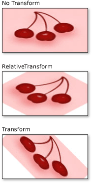

# How to: Transform a Brush
This example shows how to transform <xref:System.Windows.Media.Brush> objects by using their two transformation properties: <xref:System.Windows.Media.Brush.RelativeTransform%2A> and <xref:System.Windows.Media.Brush.Transform%2A>.  
  
 The following examples use a <xref:System.Windows.Media.RotateTransform> to rotate the content of an <xref:System.Windows.Media.ImageBrush> by 45 degrees.  
  
 The following illustration shows the <xref:System.Windows.Media.ImageBrush> without a <xref:System.Windows.Media.RotateTransform>, with the <xref:System.Windows.Media.RotateTransform> applied to the <xref:System.Windows.Media.Brush.RelativeTransform%2A> property, and with the <xref:System.Windows.Media.RotateTransform> applied to the <xref:System.Windows.Media.Brush.Transform%2A> property.  
  
   
  
## Example  
 The first example applies a <xref:System.Windows.Media.RotateTransform> to the <xref:System.Windows.Media.Brush.RelativeTransform%2A> property of an <xref:System.Windows.Media.ImageBrush>. The <xref:System.Windows.Media.RotateTransform.CenterX%2A> and <xref:System.Windows.Media.RotateTransform.CenterY%2A> properties of a <xref:System.Windows.Media.RotateTransform> object are both set to 0.5, which is the relative coordinate of the center point of this content. As a result, the <xref:System.Windows.Media.ImageBrush> content rotates about its center.  
  
 [!code-csharp[BrushesIntroduction_snip#ImageBrushRelativeTransformExample](../../../../samples/snippets/csharp/VS_Snippets_Wpf/BrushesIntroduction_snip/CSharp/BrushTransformExample.cs#imagebrushrelativetransformexample)]
 [!code-vb[BrushesIntroduction_snip#ImageBrushRelativeTransformExample](../../../../samples/snippets/visualbasic/VS_Snippets_Wpf/BrushesIntroduction_snip/visualbasic/brushtransformexample.vb#imagebrushrelativetransformexample)]
 [!code-xaml[BrushesIntroduction_snip#ImageBrushRelativeTransformExample](../../../../samples/snippets/xaml/VS_Snippets_Wpf/BrushesIntroduction_snip/XAML/BrushTransformExample.xaml#imagebrushrelativetransformexample)]  
  
 The second example also applies a <xref:System.Windows.Media.RotateTransform> to an <xref:System.Windows.Media.ImageBrush>; however, this example uses the <xref:System.Windows.Media.Brush.Transform%2A> property instead of the <xref:System.Windows.Media.Brush.RelativeTransform%2A> property.  
  
 To rotate the brush about its center, the example sets the <xref:System.Windows.Media.RotateTransform.CenterX%2A> and <xref:System.Windows.Media.RotateTransform.CenterY%2A> properties of the <xref:System.Windows.Media.RotateTransform> object to absolute coordinates. Because the brush paints a rectangle that is 175 by 90 pixels, the center point of the rectangle is (87.5, 45).  
  
 [!code-csharp[BrushesIntroduction_snip#ImageBrushTransformExample](../../../../samples/snippets/csharp/VS_Snippets_Wpf/BrushesIntroduction_snip/CSharp/BrushTransformExample.cs#imagebrushtransformexample)]
 [!code-vb[BrushesIntroduction_snip#ImageBrushTransformExample](../../../../samples/snippets/visualbasic/VS_Snippets_Wpf/BrushesIntroduction_snip/visualbasic/brushtransformexample.vb#imagebrushtransformexample)]
 [!code-xaml[BrushesIntroduction_snip#ImageBrushTransformExample](../../../../samples/snippets/xaml/VS_Snippets_Wpf/BrushesIntroduction_snip/XAML/BrushTransformExample.xaml#imagebrushtransformexample)]  
  
 For a description of how the <xref:System.Windows.Media.Brush.RelativeTransform%2A> and <xref:System.Windows.Media.Brush.Transform%2A> properties work, see the [Brush Transformation Overview](../../../../docs/framework/wpf/graphics-multimedia/brush-transformation-overview.md).  
  
 For the complete sample, see [Brushes Sample](http://go.microsoft.com/fwlink/?LinkID=159973). For more information about brushes, see [Painting with Solid Colors and Gradients Overview](../../../../docs/framework/wpf/graphics-multimedia/painting-with-solid-colors-and-gradients-overview.md).  
  
## See Also  
 [Brush Transformation Overview](../../../../docs/framework/wpf/graphics-multimedia/brush-transformation-overview.md)  
 [Painting with Solid Colors and Gradients Overview](../../../../docs/framework/wpf/graphics-multimedia/painting-with-solid-colors-and-gradients-overview.md)  
 [Transforms Overview](../../../../docs/framework/wpf/graphics-multimedia/transforms-overview.md)
