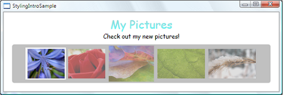

# Graphics and Multimedia
<a name="introduction"></a>
[!INCLUDE[TLA#tla_winclient](../../../../includes/tlasharptla-winclient-md.md)] provides support for multimedia, vector graphics, animation, and content composition, making it easy for developers to build interesting user interfaces and content. Using [!INCLUDE[TLA#tla_visualstu](../../../../includes/tlasharptla-visualstu-md.md)], you can create vector graphics or complex animations and integrate media into your applications.  
  
 This topic introduces the graphics, animation, and media features of [!INCLUDE[TLA2#tla_winclient](../../../../includes/tla2sharptla-winclient-md.md)], which enable you to add graphics, transition effects, sound, and video to your applications.  
  
> [!NOTE]
>  Using WPF types in a Windows service is strongly discouraged. If you attempt to use WPF types in a Windows service, the service may not work as expected.   
  
<a name="whats_new_with_graphics_and_multimedia_in_wpf_4"></a>   
## What's New with Graphics and Multimedia in WPF 4  
 Several changes have been made related to graphics and animations.  
  
-   Layout Rounding  
  
     When an object edge falls in the middle of a pixel device, the DPI-independent graphics system can create rendering artifacts, such as blurry or semi-transparent edges. Previous versions of WPF included pixel snapping to help handle this case. Silverlight 2 introduced layout rounding, which is another way to move elements so that edges fall on whole pixel boundaries. WPF now supports layout rounding with the <xref:System.Windows.FrameworkElement.UseLayoutRounding%2A> attached property on <xref:System.Windows.FrameworkElement>.  
  
-   Cached Composition  
  
     By using the new <xref:System.Windows.Media.BitmapCache> and <xref:System.Windows.Media.BitmapCacheBrush> classes, you can cache a complex part of the visual tree as a bitmap and greatly improve rendering time. The bitmap remains responsive to user input, such as mouse clicks, and you can paint it onto other elements just like any brush.  
  
-   Pixel Shader 3 Support  
  
     WPF 4 builds on top of the <xref:System.Windows.Media.Effects.ShaderEffect> support introduced in WPF 3.5 SP1 by allowing applications to write effects by using Pixel Shader (PS) version 3.0. The PS 3.0 shader model is more sophisticated than PS 2.0, which allows for even more effects on supported hardware.  
  
-   Easing Functions  
  
     You can enhance animations with easing functions, which give you additional control over the behavior of animations. For example, you can apply an <xref:System.Windows.Media.Animation.ElasticEase> to an animation to give the animation a springy behavior. For more information, see the easing types in the <xref:System.Windows.Media.Animation> namespace.  
  
<a name="graphics_and_rendering"></a>   
## Graphics and Rendering  
 WPF includes support for high quality 2-D graphics. The functionality includes brushes, geometries, images, shapes and transformations. For more information, see [Graphics](../../../../docs/framework/wpf/graphics-multimedia/graphics.md). The rendering of graphical elements is based on the <xref:System.Windows.Media.Visual> class. The structure of visual objects on the screen is described by the visual tree. For more information, see [WPF Graphics Rendering Overview](../../../../docs/framework/wpf/graphics-multimedia/wpf-graphics-rendering-overview.md).  
  
### 2-D Shapes  
 [!INCLUDE[TLA2#tla_wpf](../../../../includes/tla2sharptla-wpf-md.md)] provides a library of commonly used, vector-drawn [!INCLUDE[TLA2#tla_2d](../../../../includes/tla2sharptla-2d-md.md)] shapes, such as rectangles and ellipses, which the following illustration shows.  
  
   
  
 These intrinsic [!INCLUDE[TLA2#tla_wpf](../../../../includes/tla2sharptla-wpf-md.md)] shapes are not just shapes: they are programmable elements that implement many of the features that you expect from most common controls, which include keyboard and mouse input. The following example shows how to handle the <xref:System.Windows.UIElement.MouseUp> event raised by clicking an <xref:System.Windows.Shapes.Ellipse> element.  
  
```xaml  
<Window  
  xmlns="http://schemas.microsoft.com/winfx/2006/xaml/presentation"  
  xmlns:x="http://schemas.microsoft.com/winfx/2006/xaml"  
  x:Class="Window1" >  
  <Ellipse Fill="LightBlue" MouseUp="ellipseButton_MouseUp" />  
</Window>  
```  
  
```csharp  
public partial class Window1  : Window  
{  
    void ellipseButton_MouseUp(object sender, MouseButtonEventArgs e)  
    {  
        MessageBox.Show("You clicked the ellipse!");  
    }  
}  
```  
  
```vb  
Partial Public Class Window1  
    Inherits Window  
    Private Sub ellipseButton_MouseUp(ByVal sender As Object, ByVal e As MouseButtonEventArgs)  
        MessageBox.Show("You clicked the ellipse!")  
    End Sub  
End Class  
```  
  
 The following illustration shows the output for the preceding [!INCLUDE[TLA2#tla_xaml](../../../../includes/tla2sharptla-xaml-md.md)] markup and code-behind.  
  
   
  
 For more information, see [Shapes and Basic Drawing in WPF Overview](../../../../docs/framework/wpf/graphics-multimedia/shapes-and-basic-drawing-in-wpf-overview.md). For an introductory sample, see [Shape Elements Sample](http://go.microsoft.com/fwlink/?LinkID=160037).  
  
### 2-D Geometries  
 When the [!INCLUDE[TLA2#tla_2d](../../../../includes/tla2sharptla-2d-md.md)] shapes that [!INCLUDE[TLA2#tla_wpf](../../../../includes/tla2sharptla-wpf-md.md)] provides are not sufficient, you can use [!INCLUDE[TLA2#tla_wpf](../../../../includes/tla2sharptla-wpf-md.md)] support for geometries and paths to create your own. The following illustration shows how you can use geometries to create shapes, as a drawing brush, and to clip other [!INCLUDE[TLA2#tla_wpf](../../../../includes/tla2sharptla-wpf-md.md)] elements.  
  
   
  
 For more information, see [Geometry Overview](../../../../docs/framework/wpf/graphics-multimedia/geometry-overview.md). For an introductory sample, see [Geometries Sample](http://go.microsoft.com/fwlink/?LinkID=159989).  
  
### 2-D Effects  
 [!INCLUDE[TLA2#tla_wpf](../../../../includes/tla2sharptla-wpf-md.md)] provides a library of [!INCLUDE[TLA2#tla_2d](../../../../includes/tla2sharptla-2d-md.md)] classes that you can use to create a variety of effects. The [!INCLUDE[TLA2#tla_2d](../../../../includes/tla2sharptla-2d-md.md)] rendering capability of [!INCLUDE[TLA2#tla_wpf](../../../../includes/tla2sharptla-wpf-md.md)] provides the ability to paint [!INCLUDE[TLA2#tla_ui](../../../../includes/tla2sharptla-ui-md.md)] elements that have gradients, bitmaps, drawings, and videos; and to manipulate them by using rotation, scaling, and skewing. The following illustration gives an example of the many effects you can achieve by using [!INCLUDE[TLA2#tla_wpf](../../../../includes/tla2sharptla-wpf-md.md)] brushes.  
  
   
  
 For more information, see [WPF Brushes Overview](../../../../docs/framework/wpf/graphics-multimedia/wpf-brushes-overview.md). For an introductory sample, see [Brushes Sample](http://go.microsoft.com/fwlink/?LinkID=159973).  
  
<a name="rendering"></a>   
## 3-D Rendering  
 [!INCLUDE[TLA2#tla_wpf](../../../../includes/tla2sharptla-wpf-md.md)] provides a set of [!INCLUDE[TLA2#tla_3d](../../../../includes/tla2sharptla-3d-md.md)] rendering capabilities that integrate with [!INCLUDE[TLA2#tla_2d](../../../../includes/tla2sharptla-2d-md.md)] graphics support in [!INCLUDE[TLA2#tla_wpf](../../../../includes/tla2sharptla-wpf-md.md)] in order for you to create more exciting layout, [!INCLUDE[TLA2#tla_ui](../../../../includes/tla2sharptla-ui-md.md)], and data visualization. At one end of the spectrum, [!INCLUDE[TLA2#tla_wpf](../../../../includes/tla2sharptla-wpf-md.md)] enables you to render [!INCLUDE[TLA2#tla_2d](../../../../includes/tla2sharptla-2d-md.md)] images onto the surfaces of [!INCLUDE[TLA2#tla_3d](../../../../includes/tla2sharptla-3d-md.md)] shapes, which the following illustration demonstrates.  
  
   
  
 For more information, see [3-D Graphics Overview](../../../../docs/framework/wpf/graphics-multimedia/3-d-graphics-overview.md). For an introductory sample, see [3-D Solids Sample](http://go.microsoft.com/fwlink/?LinkID=159964).  
  
<a name="animation"></a>   
## Animation  
 Use animation to make controls and elements grow, shake, spin, and fade; and to create interesting page transitions, and more. Because [!INCLUDE[TLA2#tla_wpf](../../../../includes/tla2sharptla-wpf-md.md)] enables you to animate most properties, not only can you animate most [!INCLUDE[TLA2#tla_wpf](../../../../includes/tla2sharptla-wpf-md.md)] objects, you can also use [!INCLUDE[TLA2#tla_wpf](../../../../includes/tla2sharptla-wpf-md.md)] to animate custom objects that you create.  
  
   
  
 For more information, see [Animation Overview](../../../../docs/framework/wpf/graphics-multimedia/animation-overview.md). For an introductory sample, see [Animation Example Gallery](http://go.microsoft.com/fwlink/?LinkID=159969).  
  
<a name="media"></a>   
## Media  
 Images, video, and audio are media-rich ways of conveying information and user experiences.  
  
### Images  
 Images, which include icons, backgrounds, and even parts of animations, are a core part of most applications. Because you frequently need to use images, [!INCLUDE[TLA2#tla_wpf](../../../../includes/tla2sharptla-wpf-md.md)] exposes the ability to work with them in a variety of ways. The following illustration shows just one of those ways.  
  
   
  
 For more information, see [Imaging Overview](../../../../docs/framework/wpf/graphics-multimedia/imaging-overview.md).  
  
### Video and Audio  
 A core feature of the graphics capabilities of [!INCLUDE[TLA2#tla_wpf](../../../../includes/tla2sharptla-wpf-md.md)] is to provide native support for working with multimedia, which includes video and audio. The following example shows how to insert a media player into an application.  
  
```xaml  
<MediaElement Source="media\numbers.wmv" Width="450" Height="250" />  
```  
  
 <xref:System.Windows.Controls.MediaElement> is capable of playing both video and audio, and is extensible enough to allow the easy creation of custom [!INCLUDE[TLA2#tla_ui#plural](../../../../includes/tla2sharptla-uisharpplural-md.md)].  
  
 For more information, see the [Multimedia Overview](../../../../docs/framework/wpf/graphics-multimedia/multimedia-overview.md).  
  
## See Also  
 <xref:System.Windows.Media>  
 <xref:System.Windows.Media.Animation>  
 <xref:System.Windows.Media.Media3D>  
 [2D Graphics and Imaging](../../../../docs/framework/wpf/advanced/optimizing-performance-2d-graphics-and-imaging.md)  
 [Shapes and Basic Drawing in WPF Overview](../../../../docs/framework/wpf/graphics-multimedia/shapes-and-basic-drawing-in-wpf-overview.md)  
 [Painting with Solid Colors and Gradients Overview](../../../../docs/framework/wpf/graphics-multimedia/painting-with-solid-colors-and-gradients-overview.md)  
 [Painting with Images, Drawings, and Visuals](../../../../docs/framework/wpf/graphics-multimedia/painting-with-images-drawings-and-visuals.md)  
 [Animation and Timing](http://msdn.microsoft.com/library/7d83765b-d5ae-41b1-b423-80206e1124aa)  
 [3-D Graphics](http://msdn.microsoft.com/library/565c1f3c-235b-47de-b05b-3b53ed63f1b8)  
 [Multimedia](http://msdn.microsoft.com/library/44a8dcd0-80cb-4db0-a222-87cde68c2fac)
