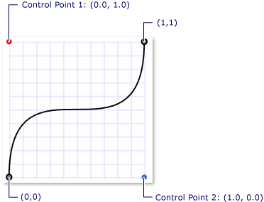
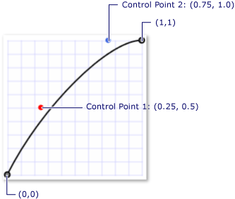

# Key-Frame Animations Overview
This topic introduces you to key-frame animations. Key-frame animations enable you to animate using more than two target values, and control an animation's interpolation method.  
  
   
## Prerequisites  
 To understand this overview, you should be familiar with [!INCLUDE[TLA#tla_winclient](../../../../includes/tlasharptla-winclient-md.md)] animations and timelines. For an introduction to animations, see the [Animation Overview](../../../../docs/framework/wpf/graphics-multimedia/animation-overview.md). It also helps to be familiar with From/To/By animations. For more information, see the From/To/By Animations Overview.  
  
   
## What is a Key-Frame Animation?  
 Like a From/To/By animation, a key-frame animation animates the value of a target property. It creates a transition among its target values over its <xref:System.Windows.Media.Animation.Timeline.Duration%2A>. However, while a From/To/By animation creates a transition between two values, a single key-frame animation can create transitions among any number of target values. Unlike a From/To/By animation, a key frame animation has no From, To, or By properties with which to set its target values. A key-frame animation's target values are described using key frames objects (hence the term, "key-frame animation"). To specify the animation's target values, you create key frame objects and add them to the animation's <xref:System.Windows.Media.Animation.DoubleAnimationUsingKeyFrames.KeyFrames%2A> collection. When the animation runs, it transitions between the frames you specified.  
  
 In addition to supporting multiple target values, some key-frame methods even support multiple interpolation methods. An animation's interpolation method defines how it transitions from one value to the next. There are three types of interpolations: discrete, linear, and splined.  
  
 To animate with a key-frame animation, you complete the following steps.  
  
-   Declare the animation and specify its <xref:System.Windows.Media.Animation.Timeline.Duration%2A>, just like you would for a from/to/by animation.  
  
-   For each target value, create a key frame of the appropriate type, set its value and <xref:System.Windows.Media.Animation.KeyTime>, and add it to the animation's <xref:System.Windows.Media.Animation.DoubleAnimationUsingKeyFrames.KeyFrames%2A> collection.  
  
-   Associate the animation with a property, just like you would with a From/To/By animation. For more information about applying an animation to a property using a storyboard, see [Storyboards Overview](../../../../docs/framework/wpf/graphics-multimedia/storyboards-overview.md).  
  
 The following example uses a <xref:System.Windows.Media.Animation.DoubleAnimationUsingKeyFrames> to animate a <xref:System.Windows.Shapes.Rectangle> element to four different locations.  
  
 [!code-xaml[keyframes_ovw_snippet#BasicKeyFrameExampleWholePage](../../../../samples/snippets/csharp/VS_Snippets_Wpf/keyframes_ovw_snippet/CS/KeyFramesIntroduction.xaml#basickeyframeexamplewholepage)]  
  
 Like a From/To/By animation, a key-frame animation can be applied to a property by using a <xref:System.Windows.Media.Animation.Storyboard> in markup and code or by using the <xref:System.Windows.Media.Animation.Animatable.BeginAnimation%2A> method in code. You may also use a key-frame animation to create an <xref:System.Windows.Media.Animation.AnimationClock> and apply it to one or more properties. For more information about the different methods for applying animations, see the [Property Animation Techniques Overview](../../../../docs/framework/wpf/graphics-multimedia/property-animation-techniques-overview.md).  
  
   
## Key-Frame Animation Types  
 Because animations generate property values, there are different animation types for different property types. To animate a property that takes a <xref:System.Double> (such as an element's <xref:System.Windows.FrameworkElement.Width%2A> property), you use an animation that produces <xref:System.Double> values. To animate a property that takes a <xref:System.Windows.Point>, you use an animation that produces <xref:System.Windows.Point> values, and so on.  
  
 The key-frame animation classes belong to the <xref:System.Windows.Media.Animation> namespace and adhere to the following naming convention:  
  
 *\<Type>* `AnimationUsingKeyFrames`  
  
 Where *\<Type>* is the type of value that the class animates.  
  
 [!INCLUDE[TLA2#tla_winclient](../../../../includes/tla2sharptla-winclient-md.md)] provides the following key-frame animation classes.  
  
|Property type|Corresponding from/to/by animation class|Interpolation methods supported|  
|-------------------|------------------------------------------------|-------------------------------------|  
|<xref:System.Boolean>|<xref:System.Windows.Media.Animation.BooleanAnimationUsingKeyFrames>|Discrete|  
|<xref:System.Byte>|<xref:System.Windows.Media.Animation.ByteAnimationUsingKeyFrames>|Discrete, Linear, Splined|  
|<xref:System.Windows.Media.Color>|<xref:System.Windows.Media.Animation.ColorAnimationUsingKeyFrames>|Discrete, Linear, Splined|  
|<xref:System.Decimal>|<xref:System.Windows.Media.Animation.DecimalAnimationUsingKeyFrames>|Discrete, Linear, Splined|  
|<xref:System.Double>|<xref:System.Windows.Media.Animation.DoubleAnimationUsingKeyFrames>|Discrete, Linear, Splined|  
|<xref:System.Int16>|<xref:System.Windows.Media.Animation.Int16AnimationUsingKeyFrames>|Discrete, Linear, Splined|  
|<xref:System.Int32>|<xref:System.Windows.Media.Animation.Int32AnimationUsingKeyFrames>|Discrete, Linear, Splined|  
|<xref:System.Int64>|<xref:System.Windows.Media.Animation.Int64AnimationUsingKeyFrames>|Discrete, Linear, Splined|  
|<xref:System.Windows.Media.Matrix>|<xref:System.Windows.Media.Animation.MatrixAnimationUsingKeyFrames>|Discrete|  
|<xref:System.Object>|<xref:System.Windows.Media.Animation.ObjectAnimationUsingKeyFrames>|Discrete|  
|<xref:System.Windows.Point>|<xref:System.Windows.Media.Animation.PointAnimationUsingKeyFrames>|Discrete, Linear, Splined|  
|<xref:System.Windows.Media.Media3D.Quaternion>|<xref:System.Windows.Media.Animation.QuaternionAnimationUsingKeyFrames>|Discrete, Linear, Splined|  
|<xref:System.Windows.Rect>|<xref:System.Windows.Media.Animation.RectAnimationUsingKeyFrames>|Discrete, Linear, Splined|  
|<xref:System.Windows.Media.Media3D.Rotation3D>|<xref:System.Windows.Media.Animation.Rotation3DAnimationUsingKeyFrames>|Discrete, Linear, Splined|  
|<xref:System.Single>|<xref:System.Windows.Media.Animation.SingleAnimationUsingKeyFrames>|Discrete, Linear, Splined|  
|<xref:System.String>|<xref:System.Windows.Media.Animation.StringAnimationUsingKeyFrames>|Discrete|  
|<xref:System.Windows.Size>|<xref:System.Windows.Media.Animation.SizeAnimationUsingKeyFrames>|Discrete, Linear, Splined|  
|<xref:System.Windows.Thickness>|<xref:System.Windows.Media.Animation.ThicknessAnimationUsingKeyFrames>|Discrete, Linear, Splined|  
|<xref:System.Windows.Media.Media3D.Vector3D>|<xref:System.Windows.Media.Animation.Vector3DAnimationUsingKeyFrames>|Discrete, Linear, Splined|  
|<xref:System.Windows.Vector>|<xref:System.Windows.Media.Animation.VectorAnimationUsingKeyFrames>|Discrete, Linear, Splined|  
  
   
## Target Values (key frames) and Key Times  
 Just as there are different types of key-frame animations for animating different property types, there are also different types of key frame objects: one for each type of value animated and interpolation method supported. Key frame types adhere to the following naming convention:  
  
 *\<InterpolationMethod>\<Type>* `KeyFrame`  
  
 Where *\<InterpolationMethod>* is the interpolation method the key frame uses and *\<Type>* is the type of value that the class animates. A key-frame animation that supports all three interpolation methods will have three key frame types that you can use. For example, you can use three key frame types with a <xref:System.Windows.Media.Animation.DoubleAnimationUsingKeyFrames>: <xref:System.Windows.Media.Animation.DiscreteDoubleKeyFrame>, <xref:System.Windows.Media.Animation.LinearDoubleKeyFrame>, and <xref:System.Windows.Media.Animation.SplineDoubleKeyFrame>. (Interpolation methods are described in detail in a later section.)  
  
 The primary purpose of a key frame is to specify a <xref:System.Windows.Media.Animation.IKeyFrame.KeyTime%2A> and a <xref:System.Windows.Media.Animation.IKeyFrame.Value%2A>. Every key frame type provides these two properties.  
  
-   The <xref:System.Windows.Media.Animation.IKeyFrame.Value%2A> property specifies the target value for that key-frame.  
  
-   The <xref:System.Windows.Media.Animation.IKeyFrame.KeyTime%2A> property specifies when (within the animation's <xref:System.Windows.Media.Animation.Timeline.Duration%2A>) a key frame's <xref:System.Windows.Media.Animation.IKeyFrame.Value%2A> is reached.  
  
 When a key frame animation begins, iterates through its key frames in the order defined by their <xref:System.Windows.Media.Animation.IKeyFrame.KeyTime%2A> properties.  
  
-   If there is no key frame at time 0, the animation creates a transition between the target property's current value and the <xref:System.Windows.Media.Animation.IKeyFrame.Value%2A> of the first key frame; otherwise, the animation's output value becomes the value of the first key frame.  
  
-   The animation creates a transition between the <xref:System.Windows.Media.Animation.IKeyFrame.Value%2A> of the first and second key frames using the interpolation method specified by the second key frame. The transition starts at the first key frame's <xref:System.Windows.Media.Animation.IKeyFrame.KeyTime%2A> and ends when the second key frame's <xref:System.Windows.Media.Animation.IKeyFrame.KeyTime%2A> is reached.  
  
-   The animation continues, creating transitions between each subsequent key frame and its preceding key frame.  
  
-   Finally, the animation transitions to the value of the key frame with the greatest key time that is equal to or smaller than the animation's <xref:System.Windows.Media.Animation.Timeline.Duration%2A>.  
  
 If the animation's <xref:System.Windows.Media.Animation.Timeline.Duration%2A> is <xref:System.Windows.Duration.Automatic%2A> or its <xref:System.Windows.Media.Animation.Timeline.Duration%2A> is equal to the time of the last key frame, the animation ends. Otherwise, if the animation's <xref:System.Windows.Duration> is greater than the key time of the last key frame, the animation holds the key frame value until it reaches the end of its <xref:System.Windows.Duration>. Like all animations, a key-frame animation uses its <xref:System.Windows.Media.Animation.Timeline.FillBehavior%2A> property to determine whether it holds it final value when it reaches the end of its active period. For more information, see the [Timing Behaviors Overview](../../../../docs/framework/wpf/graphics-multimedia/timing-behaviors-overview.md).  
  
 The following example uses the <xref:System.Windows.Media.Animation.DoubleAnimationUsingKeyFrames> object defined in the preceding example to demonstrate how the <xref:System.Windows.Media.Animation.IKeyFrame.Value%2A> and <xref:System.Windows.Media.Animation.IKeyFrame.KeyTime%2A> properties work.  
  
-   The first key frame immediately sets the animation's output value to 0.  
  
-   The second key frame animates from 0 to 350. It starts after the first key frame ends (at time = 0 seconds) and plays for 2 seconds, ending at time = 0:0:2.  
  
-   The third key frame animates from 350 to 50. It starts when the second key frame ends (at time = 2 seconds) and plays for 5 seconds, ending at time = 0:0:7.  
  
-   The fourth key frame animates from 50 to 200. It starts when the third key frame ends (at time = 7 seconds) and plays for 1 second, ending at time = 0:0:8.  
  
-   Because the <xref:System.Windows.Media.Animation.Timeline.Duration%2A> property of the animation was set to 10 seconds, the animation holds its final value for two seconds before ending at time = 0:0:10.  
  
 [!code-xaml[keyframes_ovw_snippet#BasicKeyFrameExampleWholePage](../../../../samples/snippets/csharp/VS_Snippets_Wpf/keyframes_ovw_snippet/CS/KeyFramesIntroduction.xaml#basickeyframeexamplewholepage)]  
  
   
## Interpolation Methods  
 The preceding sections mentioned that some key-frame animations support multiple interpolation methods. An animation's interpolation describes how an animation transitions between values over its duration. By selecting which key frame type you use with your animation, you can define the interpolation method for that key frame segment. There are three different types of interpolation methods: linear, discrete, and splined.  
  
### Linear Interpolation  
 With linear interpolation, the animation progresses at a constant rate of the segment duration. For example, if a key frame segment transitions from 0 to 10 over a duration of 5 seconds, the animation will output the following values at the specified times:  
  
|Time|Output value|  
|----------|------------------|  
|0|0|  
|1|2|  
|2|4|  
|3|6|  
|4|8|  
|4.25|8.5|  
|4.5|9|  
|5|10|  
  
### Discrete Interpolation  
 With discrete interpolation, the animation function jumps from one value to the next without interpolation. If a key frame segment transitions from 0 to 10 over a duration of 5 seconds, the animation will output the following values at the specified times:  
  
|Time|Output value|  
|----------|------------------|  
|0|0|  
|1|0|  
|2|0|  
|3|0|  
|4|0|  
|4.25|0|  
|4.5|0|  
|5|10|  
  
 Notice how the animation does not change its output value until the very end of the segment duration.  
  
 Splined interpolation is more complex. It is described in the next section.  
  
   
### Splined Interpolation  
 Splined interpolation can be used to achieve more realistic timing effects. Because animations are so often used to imitate effects that occur in the real world, developers might need fine control of the acceleration and deceleration of objects, and close manipulation of timing segments. Spline key frames enable you to animate with splined interpolation. With other key frames, you specify a <xref:System.Windows.Media.Animation.IKeyFrame.Value%2A> and <xref:System.Windows.Media.Animation.IKeyFrame.KeyTime%2A>. With a spline key frame, you also specify a <xref:System.Windows.Media.Animation.SplineDoubleKeyFrame.KeySpline%2A>. The following example shows a single spline key frame for a <xref:System.Windows.Media.Animation.DoubleAnimationUsingKeyFrames>. Notice the <xref:System.Windows.Media.Animation.KeySpline> property; that's what makes a spline key frame different from the other types of key frames.  
  
 [!code-xaml[keyframes_ovw_snippet#SingleSplineKeyFrameExample](../../../../samples/snippets/csharp/VS_Snippets_Wpf/keyframes_ovw_snippet/CS/InterpolationMethodsExample.xaml#singlesplinekeyframeexample)]  
  
 A cubic Bezier curve is defined by a start point, an end point, and two control points. The <xref:System.Windows.Media.Animation.KeySpline> property of a spline key frame defines the two control point of a Bezier curve that extends from (0,0) to (1,1). The first control point controls the curve factor of the first half of the Bezier curve, and the second control point controls the curve factor of the second half of the Bezier segment. The resulting curve describes the rate of change for that spline key frame. The steeper the curve, the faster the key frame changes its values. As the curve gets flatter, the key frame changes its values more slowly.  
  
 You might use <xref:System.Windows.Media.Animation.KeySpline> to simulate physical trajectories like falling water or bouncing balls, or apply other "ease in" and "ease out" effects to motion animations. For user interaction effects like background fades or control button rebound, you might apply splined interpolation to speed up or slow down the rate of change for an animation in a specific way.  
  
 The following example specifies a <xref:System.Windows.Media.Animation.KeySpline> of 0,1 1,0, which creates the following Bezier curve.  
  
   
A key spline with control points (0.0, 1.0) and (1.0, 0.0)  
  
 [!code-xaml[keyframes_ovw_snippet#SingleSplineKeyFrameExample](../../../../samples/snippets/csharp/VS_Snippets_Wpf/keyframes_ovw_snippet/CS/InterpolationMethodsExample.xaml#singlesplinekeyframeexample)]  
  
 This key frame animates rapidly when it begins, slows down, and then speeds up again before it ends.  
  
 The following example specifies a <xref:System.Windows.Media.Animation.KeySpline> of 0.5,0.25 0.75,1.0, which creates the following Bezier curve.  
  
   
A key spline with control points (0.25, 0.5) and (0.75, 1.0)  
  
 [!code-xaml[keyframes_ovw_snippet#SingleSplineKeyFrameExampleInline3](../../../../samples/snippets/csharp/VS_Snippets_Wpf/keyframes_ovw_snippet/CS/InterpolationMethodsExample.xaml#singlesplinekeyframeexampleinline3)]  
  
 Because the curvature of the Bezier curve changes very little, this key frame animates at an almost constant rate; it slows down somewhat toward its very end.  
  
 The following example uses a <xref:System.Windows.Media.Animation.DoubleAnimationUsingKeyFrames> to animate the position of rectangle. Because the <xref:System.Windows.Media.Animation.DoubleAnimationUsingKeyFrames> uses <xref:System.Windows.Media.Animation.SplineDoubleKeyFrame> objects, the transition between each key frame value uses splined interpolation.  
  
 [!code-xaml[keyframes_ovw_snippet#SplinedInterpolationExample](../../../../samples/snippets/csharp/VS_Snippets_Wpf/keyframes_ovw_snippet/CS/InterpolationMethodsExample.xaml#splinedinterpolationexample)]  
  
 Splined interpolation can be difficult to understand; experimenting with different settings can help. The [Key Spline Animation Sample](http://go.microsoft.com/fwlink/?LinkID=160011) enables you to change key spline values and see the result it has on an animation.  
  
   
### Combining Interpolation Methods  
 You can use key frames with different interpolation types in a single key frame animation. When two key frame animations with different interpolations follow each other, the interpolation method of the second key frame is used to create the transition from the first value to the second.  
  
 In the following example, a <xref:System.Windows.Media.Animation.DoubleAnimationUsingKeyFrames> is created that uses linear, splined, and discrete interpolation.  
  
 [!code-xaml[keyframes_ovw_snippet#ComboInterpolationExample](../../../../samples/snippets/csharp/VS_Snippets_Wpf/keyframes_ovw_snippet/CS/InterpolationMethodsExample.xaml#combointerpolationexample)]  
  
   
## More about Duration and Key Times  
 Like other animations, key-frame animations have a <xref:System.Windows.Duration> property. In addition to specifying the animation's <xref:System.Windows.Duration>, you need to specify what portion of that duration is given to each key frame. You do so by describing a   <xref:System.Windows.Media.Animation.IKeyFrame.KeyTime%2A> for each of the animation's key frames. Each key frame's <xref:System.Windows.Media.Animation.IKeyFrame.KeyTime%2A> specifies when that key frame ends.  
  
 The <xref:System.Windows.Media.Animation.IKeyFrame.KeyTime%2A> property does not specify how long the key time plays. The amount of time a key frame plays is determined by when the key frame ends, when the previous key frame ended, and the animation's duration. Key times may be specified as a time value, a percentage, or as the special values <xref:System.Windows.Media.Animation.KeyTime.Uniform%2A> or <xref:System.Windows.Media.Animation.KeyTime.Paced%2A>.  
  
 The following list describes the different ways of specifying key times.  
  
### TimeSpan Values  
 You may use <xref:System.TimeSpan> values to specify a <xref:System.Windows.Media.Animation.KeyTime>. The value should be greater than or equal to 0 and less than or equal to the animation's duration. The following example shows an animation with a duration of 10 seconds and four key frames whose key times are specified as time values.  
  
-   The first key frame animates from the base value to 100 over the first 3 seconds, ending at time = 0:0:03.  
  
-   The second key frame animates from 100 to 200. It starts after the first key frame ends (at time = 3 seconds) and plays for 5 seconds, ending at time = 0:0:8.  
  
-   The third key frame animates from 200 to 500. It starts when the second key frame ends (at time = 8 seconds) and plays for 1 second, ending at time = 0:0:9.  
  
-   The fourth key frame animates from 500 to 600. It starts when the third key frame ends (at time = 9 seconds) and plays for 1 second, ending at time = 0:0:10.  
  
 [!code-xaml[keyframes_ovw_snippet#TimeSpanKeyTimeExample](../../../../samples/snippets/csharp/VS_Snippets_Wpf/keyframes_ovw_snippet/CS/KeyTimesExample.xaml#timespankeytimeexample)]  
  
### Percentage Values  
 A percentage value specifies that the key frame ends at some percentage of the animation's <xref:System.Windows.Media.Animation.Timeline.Duration%2A>. In [!INCLUDE[TLA2#tla_xaml](../../../../includes/tla2sharptla-xaml-md.md)], you specify the percentage as a number followed by the `%` symbol. In code, you use the <xref:System.Windows.Media.Animation.KeyTime.FromPercent%2A> method and pass it a <xref:System.Double> indicating the percentage. The value must be greater than or equal to 0 and less than or equal to 100 percent. The following example shows an animation with a duration of 10 seconds and four key frames whose key times are specified as percentages.  
  
-   The first key frame animates from the base value to 100 over the first 3 seconds, ending at time = 0:0:3.  
  
-   The second key frame animates from 100 to 200. It starts after the first key frame ends (at time = 3 seconds) and plays for 5 seconds, ending at time = 0:0:8 (0.8 * 10 = 8).  
  
-   The third key frame animates from 200 to 500. It starts when the second key frame ends (at time = 8 seconds) and plays for 1 second, ending at time = 0:0:9 (0.9 * 10 = 9).  
  
-   The fourth key frame animates from 500 to 600. It starts when the third key frame ends (at time = 9 seconds) and plays for 1 second, ending at time = 0:0:10 (1 * 10 = 10).  
  
 [!code-xaml[keyframes_ovw_snippet#PercentageKeyTimeExample](../../../../samples/snippets/csharp/VS_Snippets_Wpf/keyframes_ovw_snippet/CS/KeyTimesExample.xaml#percentagekeytimeexample)]  
  
### Special Value, Uniform  
 Use <xref:System.Windows.Media.Animation.KeyTime.Uniform%2A> timing when you want each key frame to take the same amount of time.  
  
 A <xref:System.Windows.Media.Animation.KeyTime.Uniform%2A> key time divides the available time equally by the number of key frames to determine the end time of each key frame. The following example shows an animation with a duration of 10 seconds and four key frames whose key times are specified as <xref:System.Windows.Media.Animation.KeyTime.Uniform%2A>.  
  
-   The first key frame animates from the base value to 100 over the first 2.5 seconds, ending at time = 0:0:2.5.  
  
-   The second key frame animates from 100 to 200. It starts after the first key frame ends (at time = 2.5 seconds) and plays for approximately 2.5 seconds, ending at time = 0:0:5.  
  
-   The third key frame animates from 200 to 500. It starts when the second key frame ends (at time = 5 seconds) and plays for 2.5 seconds, ending at time = 0:0:7.5.  
  
-   The fourth key frame animates from 500 to 600. It starts when the second key frame ends (at time = 7.5 seconds) and plays for 2.5 seconds, ending at time = 0:0:1.  
  
 [!code-xaml[keyframes_ovw_snippet#UniformKeyTimeExample](../../../../samples/snippets/csharp/VS_Snippets_Wpf/keyframes_ovw_snippet/CS/KeyTimesExample.xaml#uniformkeytimeexample)]  
  
### Special Value, Paced  
 Use <xref:System.Windows.Media.Animation.KeyTime.Paced%2A> timing when you want to animate at a constant rate.  
  
 A <xref:System.Windows.Media.Animation.KeyTime.Paced%2A> key time allocates the available time according to the length of each of the key frames to determine the duration of each frame.  This will provide the behavior that the velocity or pace of the animation remains constant.  The following example shows an animation with a duration of 10 seconds and three key frames whose key times are specified as <xref:System.Windows.Media.Animation.KeyTime.Paced%2A>.  
  
 [!code-xaml[keyframes_ovw_snippet#PacedKeyTimeExample](../../../../samples/snippets/csharp/VS_Snippets_Wpf/keyframes_ovw_snippet/CS/KeyTimesExample.xaml#pacedkeytimeexample)]  
  
 Note that, if the last key frame's key time is <xref:System.Windows.Media.Animation.KeyTime.Paced%2A> or <xref:System.Windows.Media.Animation.KeyTime.Uniform%2A>, its resolved key time will be set to 100 percent. If the first key frame in a multiframe animation is paced, its resolved key time will be set to 0. (If the key frame collection contains only a single key frame and it is a paced key frame, its resolved key time will be set to 100 percent.)  
  
 Different key frames within a single key frame animation may use different key time types.  
  
   
## Combining Key Times, Out-Of-Order Key Frames  
 You can use key frames with different <xref:System.Windows.Media.Animation.KeyTime> value types in the same animation. And, although it's recommended that you add key frames in the order in which they should play, it's not necessary. The animation and timing system is capable of resolving out of order key frames. Key frames with invalid key times are ignored.  
  
 The following list describes the procedure by which key times are resolved for a key-frame animation's key frames.  
  
1.  Resolve <xref:System.TimeSpan> <xref:System.Windows.Media.Animation.KeyTime> values.  
  
2.  Determine the animation’s *total interpolation time*, the total time it takes the key-frame animation to complete a forward iteration.  
  
    1.  If the animation's <xref:System.Windows.Media.Animation.Timeline.Duration%2A> is not <xref:System.Windows.Duration.Automatic%2A> or <xref:System.Windows.Duration.Forever%2A>, the total interpolation time is the value of the animation's <xref:System.Windows.Media.Animation.Timeline.Duration%2A> property.  
  
    2.  Otherwise, the total interpolation time is the largest <xref:System.TimeSpan> <xref:System.Windows.Media.Animation.KeyTime> value specified among its key frames, if any exist.  
  
    3.  Otherwise, the total interpolation time is 1 second.  
  
3.  Use the total interpolation time value to resolve <xref:System.Windows.Media.Animation.KeyTimeType.Percent> <xref:System.Windows.Media.Animation.KeyTime> values.  
  
4.  Resolve last key frame, if it wasn't already resolved in the previous steps. If the <xref:System.Windows.Media.Animation.KeyTime> of the last key frame is <xref:System.Windows.Media.Animation.KeyTime.Uniform%2A> or <xref:System.Windows.Media.Animation.KeyTime.Paced%2A>, its resolved time will be equal to the total interpolation time.  
  
     If the <xref:System.Windows.Media.Animation.KeyTime> of the first key frame is <xref:System.Windows.Media.Animation.KeyTime.Paced%2A> and this animation has more than on key frames, resolve its <xref:System.Windows.Media.Animation.KeyTime> value to zero; if there is only one key frame and its <xref:System.Windows.Media.Animation.KeyTime> value is <xref:System.Windows.Media.Animation.KeyTime.Paced%2A>, it is resolved to the total interpolation time, as described in the preceding step.  
  
5.  Resolve remaining <xref:System.Windows.Media.Animation.KeyTime.Uniform%2A> <xref:System.Windows.Media.Animation.KeyTime> values: they are each given an equal share of the available time.  During this process, unresolved <xref:System.Windows.Media.Animation.KeyTime.Paced%2A> <xref:System.Windows.Media.Animation.KeyTime> values  are temporarily treated as <xref:System.Windows.Media.Animation.KeyTime.Uniform%2A> <xref:System.Windows.Media.Animation.KeyTime> values, and get a temporary resolved time.  
  
6.  Resolve the <xref:System.Windows.Media.Animation.KeyTime> values of key frames with unspecified key times by using the key frames declared nearest them that have resolved <xref:System.Windows.Media.Animation.KeyTime> values.  
  
7.  Resolve remaining <xref:System.Windows.Media.Animation.KeyTime.Paced%2A> <xref:System.Windows.Media.Animation.KeyTime> values. <xref:System.Windows.Media.Animation.KeyTime.Paced%2A> <xref:System.Windows.Media.Animation.KeyTime> use the <xref:System.Windows.Media.Animation.KeyTime> values of the neighboring key frames to determine their resolved time.  The goal is to ensure that the velocity of the animation is constant around this key frame's resolved time.  
  
8.  Sort key frames in order of resolved time (primary key), and order of declaration (secondary key), i.e., use a stable sort based on the resolved key frame <xref:System.Windows.Media.Animation.KeyTime> values.  
  
## See Also  
 <xref:System.Windows.Media.Animation.KeyTime>  
 <xref:System.Windows.Media.Animation.KeySpline>  
 <xref:System.Windows.Media.Animation.Timeline>  
 [Key Spline Animation Sample](http://go.microsoft.com/fwlink/?LinkID=160011)  
 [KeyFrame Animation Sample](http://go.microsoft.com/fwlink/?LinkID=160012)  
 [Animation Overview](../../../../docs/framework/wpf/graphics-multimedia/animation-overview.md)  
 [Storyboards Overview](../../../../docs/framework/wpf/graphics-multimedia/storyboards-overview.md)  
 [Key-Frame How-to Topics](../../../../docs/framework/wpf/graphics-multimedia/key-frame-animation-how-to-topics.md)  
 [Timing Behaviors Overview](../../../../docs/framework/wpf/graphics-multimedia/timing-behaviors-overview.md)
