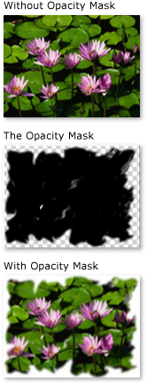
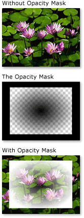

# Opacity Masks Overview
Opacity masks enable you to make portions of an element or visual either transparent or partially transparent. To create an opacity mask, you apply a <xref:System.Windows.Media.Brush> to the <xref:System.Windows.UIElement.OpacityMask%2A> property of an element or <xref:System.Windows.Media.Visual>.  The brush is mapped to the element or visual, and the opacity value of each brush pixel is used to determine the resulting opacity of each corresponding pixel of the element or visual.  
  
   
## Prerequisites  
 This overview assumes that you are familiar with <xref:System.Windows.Media.Brush> objects. For an introduction to using brushes, see [Painting with Solid Colors and Gradients Overview](../../../../docs/framework/wpf/graphics-multimedia/painting-with-solid-colors-and-gradients-overview.md). For information about <xref:System.Windows.Media.ImageBrush> and <xref:System.Windows.Media.DrawingBrush>, see [Painting with Images, Drawings, and Visuals](../../../../docs/framework/wpf/graphics-multimedia/painting-with-images-drawings-and-visuals.md).  
  
   
## Creating Visual Effects with Opacity Masks  
 An opacity mask works by mapping its contents to the element or visual. The alpha channel of each of the brush's pixels are then used to determine the resulting opacity of the element or visual's corresponding pixels; the actual color of the brush is ignored. If a given portion of the brush is transparent, the corresponding portion of the element or visual becomes transparent. If a given portion of the brush is opaque, the opacity of the corresponding portion of the element or visual is unchanged. The opacity specified by the opacity mask is combined with any opacity settings present in the element or visual. For example, if an element is 25 percent opaque and an opacity mask is applied that transitions from fully opaque to fully transparent, the result is an element that transitions from 25 percent opacity to fully transparent.  
  
> [!NOTE]
>  Although the examples in this overview demonstrate the use of opacity masks on image elements, an opacity mask may be applied to any element or <xref:System.Windows.Media.Visual>, including panels and controls.  
  
 Opacity masks are used to create interesting visual effects, such as to create images or buttons that fade from view, to add textures to elements, or to combine gradients to produce glass-like surfaces. The following illustration demonstrates the use of an opacity mask. A checkered background is used to show the transparent portions of the mask.  
  
   
Opacity masking example  
  
   
## Creating an Opacity Mask  
 To create an opacity mask, you create a <xref:System.Windows.Media.Brush> and apply it to the <xref:System.Windows.UIElement.OpacityMask%2A> property of an element or visual. You can use any type of <xref:System.Windows.Media.Brush> as an opacity mask.  
  
-   <xref:System.Windows.Media.LinearGradientBrush>, <xref:System.Windows.Media.RadialGradientBrush>: Used to make an element or visual fade from view.  
  
     The following image shows a <xref:System.Windows.Media.LinearGradientBrush> used as an opacity mask.  
  
       
LinearGradientBrush Opacity Masking Example  
  
-   <xref:System.Windows.Media.ImageBrush>: Used to create texture and soft or torn edge effects.  
  
     The following image shows an <xref:System.Windows.Media.ImageBrush> used as an opacity mask.  
  
       
LinearGradientBrush opacity masking example  
  
-   <xref:System.Windows.Media.DrawingBrush>: Used to create complex opacity masks from patterns of shapes, images, and gradients.  
  
     The following image shows a <xref:System.Windows.Media.DrawingBrush> used as an opacity mask.  
  
       
DrawingBrush opacity masking example  
  
 The gradient brushes (<xref:System.Windows.Media.LinearGradientBrush> and <xref:System.Windows.Media.RadialGradientBrush>) are particularly well-suited for use as an opacity mask. Because a <xref:System.Windows.Media.SolidColorBrush> fills an area with a uniform color, they make poor opacity masks; using a <xref:System.Windows.Media.SolidColorBrush> is equivalent to setting the element's or visual's <xref:System.Windows.UIElement.OpacityMask%2A> property.  
  
   
## Using a Gradient as an Opacity Mask  
 To create a gradient fill, you specify two or more gradient stops. Each gradient stop contains describes a color and a position (see [Painting with Solid Colors and Gradients Overview](../../../../docs/framework/wpf/graphics-multimedia/painting-with-solid-colors-and-gradients-overview.md) for more information about creating and using gradients). The process is the same when using a gradient as an opacity mask, except that, instead of blending colors, the opacity mask gradient blends alpha channel values. So the actual color of the gradient's contents do not matter; only the alpha channel, or opacity, of each color matters. The following is an example.  
  
 [!code-xaml[OpacityMasksSnippet#LinearGradientOpacityMaskonImage](../../../../samples/snippets/csharp/VS_Snippets_Wpf/OpacityMasksSnippet/CS/GradientBrushExample.xaml#lineargradientopacitymaskonimage)]  
  
   
## Specifying Gradient Stops for an Opacity Mask  
 In the previous example, the system-defined color <xref:System.Windows.Media.Colors.Black%2A> is used as the starting color of the gradient. Because all of the colors in the <xref:System.Windows.Media.Colors> class, except <xref:System.Windows.Media.Colors.Transparent%2A>, are fully opaque, they can be used to simply define a starting color for a gradient opacity mask.  
  
 For additional control over alpha values when defining an opacity mask, you can specify the alpha channel of colors using [!INCLUDE[TLA#tla_argb](../../../../includes/tlasharptla-argb-md.md)] hexadecimal notation in markup or using the <xref:System.Windows.Media.Color.FromScRgb%2A?displayProperty=nameWithType> method.  
  
   
### Specifying Color Opacity in "XAML"  
 In [!INCLUDE[TLA#tla_xaml](../../../../includes/tlasharptla-xaml-md.md)], you use  [!INCLUDE[TLA2#tla_argb](../../../../includes/tla2sharptla-argb-md.md)] hexadecimal notation to specify the opacity of individual colors. [!INCLUDE[TLA2#tla_argb](../../../../includes/tla2sharptla-argb-md.md)] hexadecimal notation uses the following syntax:  
  
 `#` **aa** *rrggbb*  
  
 The *aa* in the previous line represents a two-digit hexadecimal value used to specify the opacity of the color. The *rr*, *gg*, and *bb* each represent a two digit hexadecimal value used to specify the amount of red, green, and blue in the color. Each hexadecimal digit may have a value from 0-9 or A-F. 0 is the smallest value, and F is the greatest. An alpha value of 00 specifies a color that is completely transparent, while an alpha value of FF creates a color that is fully opaque.  In the following example, hexadecimal [!INCLUDE[TLA2#tla_argb](../../../../includes/tla2sharptla-argb-md.md)] notation is used to specify two colors. The first is fully opaque, while the second is completely transparent.  
  
 [!code-xaml[OpacityMasksSnippet#AARRGGBBValueonOpacityMask](../../../../samples/snippets/csharp/VS_Snippets_Wpf/OpacityMasksSnippet/CS/GradientBrushExample.xaml#aarrggbbvalueonopacitymask)]  
  
   
## Using an Image as an Opacity Mask  
 Images can also be used as an opacity mask. The following image shows an example. A checkered background is used to show the transparent portions of the mask.  
  
   
Opacity masking example  
  
 To use an image as an opacity mask, use an <xref:System.Windows.Media.ImageBrush> to contain the image. When creating an image to be used as an opacity mask, save the image in a format that supports multiple levels of transparency, such as [!INCLUDE[TLA#tla_png](../../../../includes/tlasharptla-png-md.md)]. The following example shows the code used to create the previous illustration.  
  
 [!code-xaml[OpacityMasksSnippet#UIElementOpacityMask](../../../../samples/snippets/csharp/VS_Snippets_Wpf/OpacityMasksSnippet/CS/ImageBrushExample.xaml#uielementopacitymask)]  
  
   
### Using a Tiled Image as an Opacity Mask  
 In the following example, the same image is used with another <xref:System.Windows.Media.ImageBrush>, but the brush's tiling features are used to produce tiles of the image 50 pixels square.  
  
 [!code-xaml[OpacityMasksSnippet#TiledImageasOpacityMask](../../../../samples/snippets/csharp/VS_Snippets_Wpf/OpacityMasksSnippet/CS/ImageBrushExample.xaml#tiledimageasopacitymask)]  
  
   
## Creating an Opacity Mask from a Drawing  
 Drawings can be used an opacity mask. The shapes contained within the drawing can themselves be filled with gradients, solid colors, images, or even other drawings. The following image shows an example of a drawing used as an opacity mask. A checkered background is used to show the transparent portions of the mask.  
  
   
DrawingBrush opacity masking example  
  
 To use a drawing as an opacity mask, use a <xref:System.Windows.Media.DrawingBrush> to contain the drawing. The following example shows the code used to create the previous illustration:  
  
 [!code-xaml[OpacityMasksSnippet#OpacityMaskfromDrawing](../../../../samples/snippets/csharp/VS_Snippets_Wpf/OpacityMasksSnippet/CS/DrawingBrushExample.xaml#opacitymaskfromdrawing)]  
  
   
### Using a Tiled Drawing as an Opacity Mask  
 Like the <xref:System.Windows.Media.ImageBrush>, the <xref:System.Windows.Media.DrawingBrush> can be made to tile its drawing. In the following example, a drawing brush is used to create a tiled opacity mask.  
  
 [!code-xaml[OpacityMasksSnippet#TiledDrawingasOpacityMask](../../../../samples/snippets/csharp/VS_Snippets_Wpf/OpacityMasksSnippet/CS/DrawingBrushExample.xaml#tileddrawingasopacitymask)]  
  
## See Also  
 [Painting with Images, Drawings, and Visuals](../../../../docs/framework/wpf/graphics-multimedia/painting-with-images-drawings-and-visuals.md)  
 [Painting with Solid Colors and Gradients Overview](../../../../docs/framework/wpf/graphics-multimedia/painting-with-solid-colors-and-gradients-overview.md)
