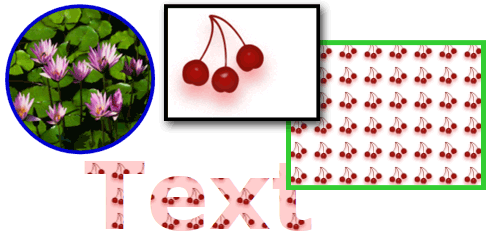
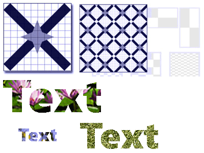

# Painting with Images, Drawings, and Visuals
This topic describes how to use <xref:System.Windows.Media.ImageBrush>, <xref:System.Windows.Media.DrawingBrush>, and <xref:System.Windows.Media.VisualBrush> objects to paint an area with an image, a <xref:System.Windows.Media.Drawing>, or a <xref:System.Windows.Media.Visual>.  
    
  
   
## Prerequisites  
 To understand this topic, you should be familiar with the different types of brushes [!INCLUDE[TLA#tla_winclient](../../../../includes/tlasharptla-winclient-md.md)] provides and their basic features. For an introduction, see the [WPF Brushes Overview](../../../../docs/framework/wpf/graphics-multimedia/wpf-brushes-overview.md).  
  
   
## Paint an Area with an Image  
 An <xref:System.Windows.Media.ImageBrush> paints an area with an <xref:System.Windows.Media.ImageSource>. The most common type of <xref:System.Windows.Media.ImageSource> to use with an <xref:System.Windows.Media.ImageBrush> is a <xref:System.Windows.Media.Imaging.BitmapImage>, which describes a bitmap graphic. You can use a <xref:System.Windows.Media.DrawingImage> to paint using a <xref:System.Windows.Media.Drawing> object, but it is simpler to use a <xref:System.Windows.Media.DrawingBrush> instead. For more information about <xref:System.Windows.Media.ImageSource> objects, see the [Imaging Overview](../../../../docs/framework/wpf/graphics-multimedia/imaging-overview.md).  
  
 To paint with an <xref:System.Windows.Media.ImageBrush>, create a <xref:System.Windows.Media.Imaging.BitmapImage> and use it to load the bitmap content. Then, use the <xref:System.Windows.Media.Imaging.BitmapImage> to set the <xref:System.Windows.Media.ImageBrush.ImageSource%2A> property of the <xref:System.Windows.Media.ImageBrush>. Finally, apply the <xref:System.Windows.Media.ImageBrush> to the object you want to paint.  In [!INCLUDE[TLA#tla_xaml](../../../../includes/tlasharptla-xaml-md.md)], you can also just set the <xref:System.Windows.Media.ImageBrush.ImageSource%2A> property of the <xref:System.Windows.Media.ImageBrush> with the path of the image to load.  
  
 Like all <xref:System.Windows.Media.Brush> objects, an <xref:System.Windows.Media.ImageBrush> can be used to paint objects such as shapes, panels, controls, and text. The following illustration shows some effects that can be achieved with an <xref:System.Windows.Media.ImageBrush>.  
  
   
Objects painted by an ImageBrush  
  
 By default, an <xref:System.Windows.Media.ImageBrush> stretches its image to completely fill the area being painted, possibly distorting the image if the painted area has a different aspect ratio than the image. You can change this behavior by changing the <xref:System.Windows.Media.TileBrush.Stretch%2A> property from its default value of <xref:System.Windows.Media.Stretch.Fill> to <xref:System.Windows.Media.Stretch.None>, <xref:System.Windows.Media.Stretch.Uniform>, or <xref:System.Windows.Media.Stretch.UniformToFill>. Because <xref:System.Windows.Media.ImageBrush> is a type of <xref:System.Windows.Media.TileBrush>, you can specify exactly how an image brush fills the output area and even create patterns. For more information about advanced <xref:System.Windows.Media.TileBrush> features, see the [TileBrush Overview](../../../../docs/framework/wpf/graphics-multimedia/tilebrush-overview.md).  
  
   
## Example: Paint an Object with a Bitmap Image  
 The following example uses an <xref:System.Windows.Media.ImageBrush> to paint the <xref:System.Windows.Controls.Panel.Background%2A> of a <xref:System.Windows.Controls.Canvas>.  
  
 [!code-xaml[BrushOverviewExamples_snip#GraphicsMMImageBrushAsCanvasBackgroundExampleWholePage](../../../../samples/snippets/xaml/VS_Snippets_Wpf/BrushOverviewExamples_snip/XAML/ImageBrushExample.xaml#graphicsmmimagebrushascanvasbackgroundexamplewholepage)]  
  
 [!code-csharp[BrushOverviewExamples_procedural_snip#GraphicsMMImageBrushAsCanvasBackgroundExampleWholePage](../../../../samples/snippets/csharp/VS_Snippets_Wpf/BrushOverviewExamples_procedural_snip/CSharp/ImageBrushExample.cs#graphicsmmimagebrushascanvasbackgroundexamplewholepage)]
 [!code-vb[BrushOverviewExamples_procedural_snip#GraphicsMMImageBrushAsCanvasBackgroundExampleWholePage](../../../../samples/snippets/visualbasic/VS_Snippets_Wpf/BrushOverviewExamples_procedural_snip/visualbasic/imagebrushexample.vb#graphicsmmimagebrushascanvasbackgroundexamplewholepage)]  
  
   
## Paint an Area with a Drawing  
 A <xref:System.Windows.Media.DrawingBrush> enables you to paint an area with shapes, text, images, and video. Shapes inside a drawing brush may themselves be painted with a solid color, gradient, image, or even another <xref:System.Windows.Media.DrawingBrush>. The following illustration demonstrates some uses of a <xref:System.Windows.Media.DrawingBrush>.  
  
   
Objects painted by a DrawingBrush  
  
 A <xref:System.Windows.Media.DrawingBrush> paints an area with a <xref:System.Windows.Media.Drawing> object. A <xref:System.Windows.Media.Drawing> object describes visible content, such as a shape, bitmap, video, or a line of text. Different types of drawings describe different types of content. The following is a list of the different types of drawing objects.  
  
-   <xref:System.Windows.Media.GeometryDrawing> – Draws a shape.  
  
-   <xref:System.Windows.Media.ImageDrawing> – Draws an image.  
  
-   <xref:System.Windows.Media.GlyphRunDrawing> – Draws text.  
  
-   <xref:System.Windows.Media.VideoDrawing> – Plays an audio or video file.  
  
-   <xref:System.Windows.Media.DrawingGroup> – Draws other drawings. Use a drawing group to combine other drawings into a single composite drawing.  
  
 For more information about <xref:System.Windows.Media.Drawing> objects, see the [Drawing Objects Overview](../../../../docs/framework/wpf/graphics-multimedia/drawing-objects-overview.md).  
  
 Like an <xref:System.Windows.Media.ImageBrush>, a <xref:System.Windows.Media.DrawingBrush> stretches its <xref:System.Windows.Media.DrawingBrush.Drawing%2A> to fill its output area. You can override this behavior by changing the <xref:System.Windows.Media.TileBrush.Stretch%2A> property from its default setting of <xref:System.Windows.Media.Stretch.Fill>. For more information, see the <xref:System.Windows.Media.TileBrush.Stretch%2A> property.  
  
   
## Example: Paint an Object with a Drawing  
 The following example shows how to paint an object with a drawing of three ellipses. A <xref:System.Windows.Media.GeometryDrawing> is used to describe the ellipses.  
  
 [!code-xaml[BrushOverviewExamples_snip#GraphicsMMDrawingBrushAsButtonBackgroundExample](../../../../samples/snippets/xaml/VS_Snippets_Wpf/BrushOverviewExamples_snip/XAML/DrawingBrushExample.xaml#graphicsmmdrawingbrushasbuttonbackgroundexample)]  
  
 [!code-csharp[BrushOverviewExamples_procedural_snip#GraphicsMMDrawingBrushAsButtonBackgroundExample1](../../../../samples/snippets/csharp/VS_Snippets_Wpf/BrushOverviewExamples_procedural_snip/CSharp/DrawingBrushExample.cs#graphicsmmdrawingbrushasbuttonbackgroundexample1)]
 [!code-vb[BrushOverviewExamples_procedural_snip#GraphicsMMDrawingBrushAsButtonBackgroundExample1](../../../../samples/snippets/visualbasic/VS_Snippets_Wpf/BrushOverviewExamples_procedural_snip/visualbasic/drawingbrushexample.vb#graphicsmmdrawingbrushasbuttonbackgroundexample1)]  
  
   
## Paint an Area with a Visual  
 The most versatile and powerful of all the  brushes, the <xref:System.Windows.Media.VisualBrush> paints an area with a <xref:System.Windows.Media.Visual>. A <xref:System.Windows.Media.Visual> is a low-level graphical type that serves as the ancestor of many useful graphical components. For example, the <xref:System.Windows.Window>, <xref:System.Windows.FrameworkElement>, and <xref:System.Windows.Controls.Control> classes are all types of <xref:System.Windows.Media.Visual> objects. Using a <xref:System.Windows.Media.VisualBrush>, you can paint areas with almost any [!INCLUDE[TLA#tla_winclient](../../../../includes/tlasharptla-winclient-md.md)] graphical object.  
  
> [!NOTE]
>  Although <xref:System.Windows.Media.VisualBrush> is a type of <xref:System.Windows.Freezable> object, it cannot be frozen (made read-only) when its <xref:System.Windows.Media.VisualBrush.Visual%2A> property is set to a value other than `null`.  
  
 There are two ways to specify the <xref:System.Windows.Media.VisualBrush.Visual%2A> content of a <xref:System.Windows.Media.VisualBrush>.  
  
-   Create a new <xref:System.Windows.Media.Visual> and use it to set the <xref:System.Windows.Media.VisualBrush.Visual%2A> property of the <xref:System.Windows.Media.VisualBrush>. For an example, see the [Example: Paint an Object with a Visual](#examplevisualbrush1) section that follows.  
  
-   Use an existing <xref:System.Windows.Media.Visual>, which creates a duplicate image of the target <xref:System.Windows.Media.Visual>. You can then use the <xref:System.Windows.Media.VisualBrush> to create interesting effects, such as reflection and magnification. For an example, see the [Example: Create a Reflection](#examplevisualbrush2) section.  
  
 When you define a new <xref:System.Windows.Media.VisualBrush.Visual%2A> for a <xref:System.Windows.Media.VisualBrush> and that <xref:System.Windows.Media.Visual> is a <xref:System.Windows.UIElement> (such as a panel or control), the layout system runs on the <xref:System.Windows.UIElement> and its child elements when the <xref:System.Windows.Media.VisualBrush.AutoLayoutContent%2A> property is set to `true`. However, the root <xref:System.Windows.UIElement> is essentially isolated from the rest of the system: styles, and external layout can't permeate this boundary. Therefore, you should explicitly specify the size of the root <xref:System.Windows.UIElement>, because its only parent is the <xref:System.Windows.Media.VisualBrush> and therefore it cannot automatically size itself to the area being painted. For more information about layout in [!INCLUDE[TLA#tla_winclient](../../../../includes/tlasharptla-winclient-md.md)], see the [Layout](../../../../docs/framework/wpf/advanced/layout.md).  
  
 Like <xref:System.Windows.Media.ImageBrush> and  <xref:System.Windows.Media.DrawingBrush>, a <xref:System.Windows.Media.VisualBrush> stretches its content to fill its output area. You can override this behavior by changing the <xref:System.Windows.Media.TileBrush.Stretch%2A> property from its default setting of <xref:System.Windows.Media.Stretch.Fill>. For more information, see the <xref:System.Windows.Media.TileBrush.Stretch%2A> property.  
  
   
## Example: Paint an Object with a Visual  
 In the following example, several controls and a panel are used to paint a rectangle.  
  
 [!code-xaml[BrushOverviewExamples_snip#GraphicsMMVisualBrushAsRectangleBackgroundExample](../../../../samples/snippets/xaml/VS_Snippets_Wpf/BrushOverviewExamples_snip/XAML/VisualBrushExample.xaml#graphicsmmvisualbrushasrectanglebackgroundexample)]  
  
 [!code-csharp[BrushOverviewExamples_procedural_snip#GraphicsMMVisualBrushAsRectangleBackgroundExample1](../../../../samples/snippets/csharp/VS_Snippets_Wpf/BrushOverviewExamples_procedural_snip/CSharp/VisualBrushExample.cs#graphicsmmvisualbrushasrectanglebackgroundexample1)]
 [!code-vb[BrushOverviewExamples_procedural_snip#GraphicsMMVisualBrushAsRectangleBackgroundExample1](../../../../samples/snippets/visualbasic/VS_Snippets_Wpf/BrushOverviewExamples_procedural_snip/visualbasic/visualbrushexample.vb#graphicsmmvisualbrushasrectanglebackgroundexample1)]  
  
   
## Example: Create a Reflection  
 The preceding example showed how to create a new <xref:System.Windows.Media.Visual> for use as a background. You can also use a <xref:System.Windows.Media.VisualBrush> to display an existing visual; this capability enables you to produce interesting visual effects, such as reflections and magnification. The following example uses a <xref:System.Windows.Media.VisualBrush> to create a reflection of a <xref:System.Windows.Controls.Border> that contains several elements. The following illustration shows the output that this example produces.  
  
   
A reflected Visual object  
  
 [!code-csharp[visualbrush_markup_snip#GraphicsMMVisualBrushReflectionExampleWholePage](../../../../samples/snippets/csharp/VS_Snippets_Wpf/visualbrush_markup_snip/CSharp/ReflectionExample.cs#graphicsmmvisualbrushreflectionexamplewholepage)]
 [!code-vb[visualbrush_markup_snip#GraphicsMMVisualBrushReflectionExampleWholePage](../../../../samples/snippets/visualbasic/VS_Snippets_Wpf/visualbrush_markup_snip/visualbasic/reflectionexample.vb#graphicsmmvisualbrushreflectionexamplewholepage)]
 [!code-xaml[visualbrush_markup_snip#GraphicsMMVisualBrushReflectionExampleWholePage](../../../../samples/snippets/xaml/VS_Snippets_Wpf/visualbrush_markup_snip/XAML/ReflectionExample.xaml#graphicsmmvisualbrushreflectionexamplewholepage)]  
  
 For additional examples that show how to magnify portions of the screen and how to create reflections, see the [VisualBrush Sample](http://go.microsoft.com/fwlink/?LinkID=160049).  
  
   
## TileBrush Features  
 <xref:System.Windows.Media.ImageBrush>, <xref:System.Windows.Media.DrawingBrush>, and <xref:System.Windows.Media.VisualBrush> are types of <xref:System.Windows.Media.TileBrush> objects. <xref:System.Windows.Media.TileBrush> objects provide you with a great deal of control over how an area is painted with an image, drawing, or visual. For example, instead of just painting an area with a single stretched image, you can paint an area with a series of image tiles that create a pattern.  
  
 A <xref:System.Windows.Media.TileBrush> has three primary components: content, tiles, and the output area.  
  
   
Components of a TileBrush with a single tile  
  
   
Components of a TileBrush with multiple tiles  
  
 For more information about the tiling features of <xref:System.Windows.Media.TileBrush> objects, see the [TileBrush Overview](../../../../docs/framework/wpf/graphics-multimedia/tilebrush-overview.md).  
  
## See Also  
 <xref:System.Windows.Media.ImageBrush>  
 <xref:System.Windows.Media.DrawingBrush>  
 <xref:System.Windows.Media.VisualBrush>  
 <xref:System.Windows.Media.TileBrush>  
 [TileBrush Overview](../../../../docs/framework/wpf/graphics-multimedia/tilebrush-overview.md)  
 [WPF Brushes Overview](../../../../docs/framework/wpf/graphics-multimedia/wpf-brushes-overview.md)  
 [Imaging Overview](../../../../docs/framework/wpf/graphics-multimedia/imaging-overview.md)  
 [Drawing Objects Overview](../../../../docs/framework/wpf/graphics-multimedia/drawing-objects-overview.md)  
 [Opacity Masks Overview](../../../../docs/framework/wpf/graphics-multimedia/opacity-masks-overview.md)  
 [WPF Graphics Rendering Overview](../../../../docs/framework/wpf/graphics-multimedia/wpf-graphics-rendering-overview.md)  
 [ImageBrush Sample](http://go.microsoft.com/fwlink/?LinkID=160005)  
 [VisualBrush Sample](http://go.microsoft.com/fwlink/?LinkID=160049)
