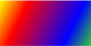
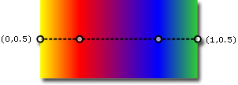
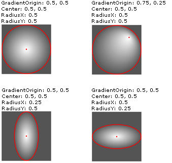

# Painting with Solid Colors and Gradients Overview
This topic describes how to use <xref:System.Windows.Media.SolidColorBrush>, <xref:System.Windows.Media.LinearGradientBrush>, and <xref:System.Windows.Media.RadialGradientBrush> objects to paint with solid colors, linear gradients, and radial gradients.  
  

  
   
## Painting an Area with a Solid Color  
 One of the most common operations in any platform is to paint an area with a solid <xref:System.Windows.Media.Color>. To accomplish this task, [!INCLUDE[TLA#tla_winclient](../../../../includes/tlasharptla-winclient-md.md)] provides the <xref:System.Windows.Media.SolidColorBrush> class. The following sections describe the different ways to paint with a <xref:System.Windows.Media.SolidColorBrush>.  
  
   
### Using a SolidColorBrush in "XAML"  
 To paint an area with a solid color in [!INCLUDE[TLA2#tla_xaml](../../../../includes/tla2sharptla-xaml-md.md)], use one of the following options.  
  
-   Select a predefined solid color brush by name.  For example, you can set a button's <xref:System.Windows.Controls.Control.Background%2A> to "Red" or "MediumBlue".  For a list of other predefined solid color brushes, see the static properties of the <xref:System.Windows.Media.Brushes> class. The following is an example.  
  
     [!code-xaml[BrushOverviewExamples_snip#SolidColorBrushNamedColor1XAML](../../../../samples/snippets/xaml/VS_Snippets_Wpf/BrushOverviewExamples_snip/XAML/SolidColorBrushExample.xaml#solidcolorbrushnamedcolor1xaml)]  
  
-   Choose a color from the 32-bit color palette by specifying the amounts of red, green, and blue to combine into a single solid color.  The format for specifying a color from the 32-bit palette is "*#rrggbb*", where *rr* is a two digit hexadecimal number specifying the relative amount of red, *gg* specifies the amount of green, and *bb* specifies the amount of blue.  Additionally, the color can be specified as "#*aarrggbb*" where *aa* specifies the *alpha* value, or transparency, of the color. This approach enables you to create colors that are partially transparent.  In the following example, the <xref:System.Windows.Controls.Control.Background%2A> of a <xref:System.Windows.Controls.Button> is set to fully-opaque red using hexadecimal notation.  
  
     [!code-xaml[BrushOverviewExamples_snip#SolidColorBrushHex1XAML](../../../../samples/snippets/xaml/VS_Snippets_Wpf/BrushOverviewExamples_snip/XAML/SolidColorBrushExample.xaml#solidcolorbrushhex1xaml)]  
  
-   Use property tag syntax to describe a <xref:System.Windows.Media.SolidColorBrush>. This syntax is more verbose but enables you to specify additional settings, such as the brush's opacity. In the following example, the <xref:System.Windows.Controls.Control.Background%2A> properties of two <xref:System.Windows.Controls.Button> elements are set to fully-opaque red. The first brush's color is described using a predefined color name. The second brush's color is described using hexadecimal notation.  
  
     [!code-xaml[BrushOverviewExamples_snip#SolidColorBrushPropertyTag1XAML](../../../../samples/snippets/xaml/VS_Snippets_Wpf/BrushOverviewExamples_snip/XAML/SolidColorBrushExample.xaml#solidcolorbrushpropertytag1xaml)]  
  
   
### Painting with a SolidColorBrush in Code  
 To paint an area with a solid color in code, use one of the following options.  
  
-   Use one of the predefined brushes provided by the <xref:System.Windows.Media.Brushes> class. In the following example, the <xref:System.Windows.Controls.Control.Background%2A> of a <xref:System.Windows.Controls.Button> is set to <xref:System.Windows.Media.Brushes.Red%2A>.  
  
     [!code-csharp[BrushOverviewExamples_snip#SolidColorBrushPredefinedBrush1CSharp](../../../../samples/snippets/csharp/VS_Snippets_Wpf/BrushOverviewExamples_snip/CSharp/SolidColorBrushExample.cs#solidcolorbrushpredefinedbrush1csharp)]  
  
-   Create a <xref:System.Windows.Media.SolidColorBrush> and set its <xref:System.Windows.Media.SolidColorBrush.Color%2A> property using a <xref:System.Windows.Media.Color> structure. You can use a predefined color from the <xref:System.Windows.Media.Colors> class or you can create a <xref:System.Windows.Media.Color> using the static <xref:System.Windows.Media.Color.FromArgb%2A> method.  
  
     The following example shows how to set the <xref:System.Windows.Media.SolidColorBrush.Color%2A> property of a <xref:System.Windows.Media.SolidColorBrush> using a predefined color.  
  
     [!code-csharp[BrushOverviewExamples_snip#SolidColorBrushPredefinedColor1CSharp](../../../../samples/snippets/csharp/VS_Snippets_Wpf/BrushOverviewExamples_snip/CSharp/SolidColorBrushExample.cs#solidcolorbrushpredefinedcolor1csharp)]  
  
 The static <xref:System.Windows.Media.Color.FromArgb%2A> enables you to specify the color's alpha, red, green, and blue values. The typical range for each of these values is 0-255. For example, an alpha value of 0 indicates that a color is completely transparent, while a value of 255 indicates the color is completely opaque. Likewise, a red value of 0 indicates that a color has no red in it, while a value of 255 indicates a color has the maximum amount of red possible.  In the following example, a brush's color is described by specifying alpha, red, green, and blue values.  
  
 [!code-csharp[BrushOverviewExamples_snip#SolidColorBrushfromArgbExample1CSharp](../../../../samples/snippets/csharp/VS_Snippets_Wpf/BrushOverviewExamples_snip/CSharp/SolidColorBrushExample.cs#solidcolorbrushfromargbexample1csharp)]  
  
 For additional ways to specify color, see the <xref:System.Windows.Media.Color> reference topic.  
  
   
## Painting an Area with a Gradient  
 A gradient brush paints an area with multiple colors that blend into each other along an axis. You can use them to create impressions of light and shadow, giving your controls a three-dimensional feel. You can also use them to simulate glass, chrome, water, and other smooth surfaces.  [!INCLUDE[TLA2#tla_winclient](../../../../includes/tla2sharptla-winclient-md.md)] provides two types of gradient brushes: <xref:System.Windows.Media.LinearGradientBrush> and <xref:System.Windows.Media.RadialGradientBrush>.  
  
   
## Linear Gradients  
 A <xref:System.Windows.Media.LinearGradientBrush> paints an area with a gradient defined along a line, the *gradient axis*.  You specify the gradient's colors and their location along the gradient axis using <xref:System.Windows.Media.GradientStop> objects.  You may also modify the gradient axis, which enables you to create horizontal and vertical gradients and to reverse the gradient direction. The gradient axis is described in the next section. By default, a diagonal gradient is created.  
  
 The following example shows the code that creates a linear gradient with four colors.  
  
 [!code-xaml[GradientBrushExamples_snip#DiagonalGradient1XAML](../../../../samples/snippets/xaml/VS_Snippets_Wpf/GradientBrushExamples_snip/XAML/LinearGradientBrushExample.xaml#diagonalgradient1xaml)]  
  
 [!code-csharp[GradientBrushExamples_snip#DiagonalGradient1CSharp](../../../../samples/snippets/csharp/VS_Snippets_Wpf/GradientBrushExamples_snip/CSharp/LinearGradientBrushExample.cs#diagonalgradient1csharp)]  
  
 This code produces the following gradient:  
  
   
  
 **Note:** The gradient examples in this topic use the default coordinate system for setting start points and end points. The default coordinate system is relative to a bounding box: 0 indicates 0 percent of the bounding box and 1 indicates 100 percent of the bounding box. You can change this coordinate system by setting the <xref:System.Windows.Media.GradientBrush.MappingMode%2A> property to the value <xref:System.Windows.Media.BrushMappingMode.Absolute>. An absolute coordinate system is not relative to a bounding box. Values are interpreted directly in local space.  
  
 The <xref:System.Windows.Media.GradientStop> is the basic building block of a gradient brush.  A gradient stop specifies a <xref:System.Windows.Media.GradientStop.Color%2A> at an <xref:System.Windows.Media.GradientStop.Offset%2A> along the gradient axis.  
  
-   The gradient stop's <xref:System.Windows.Media.GradientStop.Color%2A> property specifies the color of the gradient stop. You may set the color by using a predefined color (provided by the <xref:System.Windows.Media.Colors> class) or by specifying ScRGB or ARGB values. In [!INCLUDE[TLA2#tla_xaml](../../../../includes/tla2sharptla-xaml-md.md)], you may also use hexadecimal notation to describe a color. For more information, see the <xref:System.Windows.Media.Color> structure.  
  
-   The gradient stop's <xref:System.Windows.Media.GradientStop.Offset%2A> property specifies the position of the gradient stop's color on the gradient axis. The offset is a <xref:System.Double> that ranges from 0 to 1. The closer a gradient stop's offset value is to 0, the closer the color is to the start of the gradient. The closer the gradient's offset value is to 1, the closer the color is to the end of the gradient.  
  
 The color of each point between gradient stops is linearly interpolated as a combination of the color specified by the two bounding gradient stops. The following illustration highlights the gradient stops in the previous example. The circles mark the position of gradient stops and a dashed line shows the gradient axis.  
  
   
  
 The first gradient stop specifies the color yellow at an offset of `0.0`.  The second gradient stop specifies the color red at an offset of `0.25`.  The points between these two stops gradually change from yellow to red as you move from left to right along the gradient axis.  The third gradient stop specifies the color blue at an offset of `0.75`.  The points between the second and third gradient stops gradually change from red to blue. The fourth gradient stop specifies the color lime green at an offset of `1.0`. The points between the third and fourth gradient stops gradually change from blue to lime green.  
  
   
### The Gradient Axis  
 As previously mentioned, a linear gradient brush's gradient stops are positioned along a line, the gradient axis. You may change the orientation and size of the line using the brush's <xref:System.Windows.Media.LinearGradientBrush.StartPoint%2A> and <xref:System.Windows.Media.LinearGradientBrush.EndPoint%2A> properties. By manipulating the brush's <xref:System.Windows.Media.LinearGradientBrush.StartPoint%2A> and <xref:System.Windows.Media.LinearGradientBrush.EndPoint%2A>, you can create horizontal and vertical gradients, reverse the gradient direction, condense the gradient spread, and more.  
  
 By default, the linear gradient brush's <xref:System.Windows.Media.LinearGradientBrush.StartPoint%2A> and <xref:System.Windows.Media.LinearGradientBrush.EndPoint%2A> are relative to the area being painted. The point (0,0) represents the upper-left corner of the area being painted, and (1,1) represents the lower-right corner of the area being painted. The default <xref:System.Windows.Media.LinearGradientBrush.StartPoint%2A> of a <xref:System.Windows.Media.LinearGradientBrush> is (0,0), and its default <xref:System.Windows.Media.LinearGradientBrush.EndPoint%2A> is (1,1), which creates a diagonal gradient starting at the upper-left corner and extending to the lower-right corner of the area being painted. The following illustration shows the gradient axis of a linear gradient brush with default <xref:System.Windows.Media.LinearGradientBrush.StartPoint%2A> and <xref:System.Windows.Media.LinearGradientBrush.EndPoint%2A>.  
  
   
  
 The following example shows how to create a horizontal gradient by specifying the brush's <xref:System.Windows.Media.LinearGradientBrush.StartPoint%2A> and <xref:System.Windows.Media.LinearGradientBrush.EndPoint%2A>. Notice that the gradient stops are the same as in the previous examples; by simply changing the <xref:System.Windows.Media.LinearGradientBrush.StartPoint%2A> and <xref:System.Windows.Media.LinearGradientBrush.EndPoint%2A>, the gradient has been changed from diagonal to horizontal.  
  
 [!code-xaml[GradientBrushExamples_snip#HorizontalGradient1XAML](../../../../samples/snippets/xaml/VS_Snippets_Wpf/GradientBrushExamples_snip/XAML/LinearGradientBrushExample.xaml#horizontalgradient1xaml)]  
  
 [!code-csharp[GradientBrushExamples_snip#HorizontalGradient1CSharp](../../../../samples/snippets/csharp/VS_Snippets_Wpf/GradientBrushExamples_snip/CSharp/LinearGradientBrushExample.cs#horizontalgradient1csharp)]  
  
 The following illustration shows the gradient that is created. The gradient axis is marked with a dashed line, and the gradient stops are marked with circles.  
  
   
  
 The next example shows how to create a vertical gradient.  
  
 [!code-xaml[GradientBrushExamples_snip#VerticalGradient1XAML](../../../../samples/snippets/xaml/VS_Snippets_Wpf/GradientBrushExamples_snip/XAML/LinearGradientBrushExample.xaml#verticalgradient1xaml)]  
  
 [!code-csharp[GradientBrushExamples_snip#VerticalGradient1CSharp](../../../../samples/snippets/csharp/VS_Snippets_Wpf/GradientBrushExamples_snip/CSharp/LinearGradientBrushExample.cs#verticalgradient1csharp)]  
  
 The following illustration shows the gradient that is created. The gradient axis is marked with a dashed line, and the gradient stops are marked with circles.  
  
   
  
   
## Radial Gradients  
 Like a <xref:System.Windows.Media.LinearGradientBrush>, a <xref:System.Windows.Media.RadialGradientBrush> paints an area with colors that blend together along an axis. The previous examples showed how a linear gradient brush's axis is a straight line. A radial gradient brush's axis is defined by a circle; its colors "radiate" outward from its origin.  
  
 In the following example, a radial gradient brush is used to paint the interior of a rectangle.  
  
 [!code-xaml[GradientBrushExamples_snip#RadialGradient1XAML](../../../../samples/snippets/xaml/VS_Snippets_Wpf/GradientBrushExamples_snip/XAML/RadialGradientBrushExample.xaml#radialgradient1xaml)]  
  
 [!code-csharp[GradientBrushExamples_snip#RadialGradient1CSharp](../../../../samples/snippets/csharp/VS_Snippets_Wpf/GradientBrushExamples_snip/CSharp/RadialGradientBrushExample.cs#radialgradient1csharp)]  
  
 The following illustration shows the gradient created in the previous example. The brush's gradient stops have been highlighted. Notice that, even though the results are different, the gradient stops in this example are identical to the gradient stops in the previous linear gradient brush examples.  
  
   
  
 The <xref:System.Windows.Media.RadialGradientBrush.GradientOrigin%2A> specifies the start point of a radial gradient brush's gradient axis. The gradient axis radiates from the gradient origin to the gradient circle. A brush's gradient circle is defined by its <xref:System.Windows.Media.RadialGradientBrush.Center%2A>, <xref:System.Windows.Media.RadialGradientBrush.RadiusX%2A>, and <xref:System.Windows.Media.RadialGradientBrush.RadiusY%2A> properties.  
  
 The following illustration shows several radial gradients with different <xref:System.Windows.Media.RadialGradientBrush.GradientOrigin%2A>, <xref:System.Windows.Media.RadialGradientBrush.Center%2A>, <xref:System.Windows.Media.RadialGradientBrush.RadiusX%2A>, and <xref:System.Windows.Media.RadialGradientBrush.RadiusY%2A> settings.  
  
   
RadialGradientBrushes with different GradientOrigin, Center, RadiusX, and RadiusY settings.  
  
   
## Specifying Transparent or Partially-Transparent Gradient Stops  
 Because gradient stops do not provide an opacity property, you must specify the alpha channel of colors using  [!INCLUDE[TLA#tla_argb](../../../../includes/tlasharptla-argb-md.md)] hexadecimal notation in markup or use the <xref:System.Windows.Media.Color.FromScRgb%2A?displayProperty=nameWithType> method to create gradient stops that are transparent or partially transparent. The following sections explain how to create partially transparent gradient stops in [!INCLUDE[TLA2#tla_xaml](../../../../includes/tla2sharptla-xaml-md.md)] and code.  
  
   
### Specifying Color Opacity in "XAML"  
 In [!INCLUDE[TLA2#tla_xaml](../../../../includes/tla2sharptla-xaml-md.md)], you use  [!INCLUDE[TLA2#tla_argb](../../../../includes/tla2sharptla-argb-md.md)] hexadecimal notation to specify the opacity of individual colors. [!INCLUDE[TLA2#tla_argb](../../../../includes/tla2sharptla-argb-md.md)] hexadecimal notation uses the following syntax:  
  
 `#` **aa** *rrggbb*  
  
 The *aa* in the previous line represents a two-digit hexadecimal value used to specify the opacity of the color. The *rr*, *gg*, and *bb* each represent a two digit hexadecimal value used to specify the amount of red, green, and blue in the color. Each hexadecimal digit may have a value from 0-9 or A-F. 0 is the smallest value, and F is the greatest. An alpha value of 00 specifies a color that is completely transparent, while an alpha value of FF creates a color that is fully opaque.  In the following example, hexadecimal [!INCLUDE[TLA2#tla_argb](../../../../includes/tla2sharptla-argb-md.md)] notation is used to specify two colors. The first is partially transparent (it has an alpha value of x20), while the second is completely opaque.  
  
 [!code-xaml[GradientBrushExamples_snip#TransparentGradientStopExample1XAML](../../../../samples/snippets/xaml/VS_Snippets_Wpf/GradientBrushExamples_snip/XAML/GradientStopsExample.xaml#transparentgradientstopexample1xaml)]  
  
   
### Specifying Color Opacity in Code  
 When using code, the static <xref:System.Windows.Media.Color.FromArgb%2A> method enables you to specify an alpha value when you create a color. The method takes four parameters of type <xref:System.Byte>. The first parameter specifies the alpha channel of the color; the other three parameters specify the red, green, and blue values of the color. Each value should be between 0 to 255, inclusive. An alpha value of 0 specifies that the color is completely transparent, while an alpha value of 255 specifies that the color is completely opaque. In the following example, the <xref:System.Windows.Media.Color.FromArgb%2A> method is used to produce two colors. The first color is partially transparent (it has an alpha value of 32), while the second is fully opaque.  
  
 [!code-csharp[GradientBrushExamples_snip#TransparentGradientStopExample1CSharp](../../../../samples/snippets/csharp/VS_Snippets_Wpf/GradientBrushExamples_snip/CSharp/GradientStopsExample.cs#transparentgradientstopexample1csharp)]  
  
 Alternatively, you may use the <xref:System.Windows.Media.Color.FromScRgb%2A> method, which enables you to use ScRGB values to create a color.  
  
   
## Painting with Images, Drawings, Visuals, and Patterns  
 <xref:System.Windows.Media.ImageBrush>, <xref:System.Windows.Media.DrawingBrush>, and <xref:System.Windows.Media.VisualBrush> classes enable you to paint an area with images, drawings, or visuals. For information about painting with images, drawings, and patterns, see [Painting with Images, Drawings, and Visuals](../../../../docs/framework/wpf/graphics-multimedia/painting-with-images-drawings-and-visuals.md).  
  
## See Also  
 <xref:System.Windows.Media.Brush>  
 <xref:System.Windows.Media.SolidColorBrush>  
 <xref:System.Windows.Media.LinearGradientBrush>  
 <xref:System.Windows.Media.RadialGradientBrush>  
 [Painting with Images, Drawings, and Visuals](../../../../docs/framework/wpf/graphics-multimedia/painting-with-images-drawings-and-visuals.md)  
 [Brush Transformation Overview](../../../../docs/framework/wpf/graphics-multimedia/brush-transformation-overview.md)  
 [Graphics Rendering Tiers](../../../../docs/framework/wpf/advanced/graphics-rendering-tiers.md)
