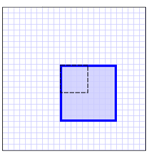
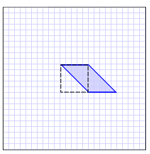
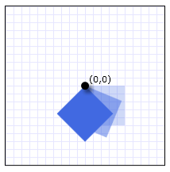
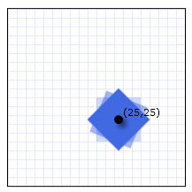
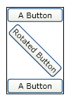

# Transforms Overview
This topic describes how to use the [!INCLUDE[TLA#tla_2d](../../../../includes/tlasharptla-2d-md.md)] <xref:System.Windows.Media.Transform> classes to rotate, scale, move (translate), and skew <xref:System.Windows.FrameworkElement> objects.  
  
  
   
## What Is a Transform?  
 A <xref:System.Windows.Media.Transform> defines how to map, or transform, points from one coordinate space to another coordinate space. This mapping is described by a transformation <xref:System.Windows.Media.Matrix>, which is a collection of three rows with three columns of <xref:System.Double> values.  
  
> [!NOTE]
>  [!INCLUDE[TLA#tla_wpf](../../../../includes/tlasharptla-wpf-md.md)] uses row-major matrices. Vectors are expressed as row-vectors, not column vectors.  
  
 The following table shows the structure of a [!INCLUDE[TLA2#tla_winclient](../../../../includes/tla2sharptla-winclient-md.md)] matrix.  
  
### A 2-D transformation matrix  
  
||||  
|-|-|-|  
|<xref:System.Windows.Media.Matrix.M11%2A>   Default: 1.0|<xref:System.Windows.Media.Matrix.M12%2A>   Default: 0.0|0.0|  
|<xref:System.Windows.Media.Matrix.M21%2A>   Default: 0.0|<xref:System.Windows.Media.Matrix.M22%2A>   Default: 1.0|0.0|  
|<xref:System.Windows.Media.Matrix.OffsetX%2A>   Default: 0.0|<xref:System.Windows.Media.Matrix.OffsetY%2A>   Default: 0.0|1.0|  
  
 By manipulating matrix values, you can rotate, scale, skew, and move (translate) an object. For example, if you change the value in the first column of the third row (the <xref:System.Windows.Media.Matrix.OffsetX%2A> value) to 100, you can use it to move an object 100 units along the x-axis. If you change the value in the second column of the second row to 3, you can use it to stretch an object to three times its current height. If you change both values, you move the object 100 units along the x-axis and stretch its height by a factor of 3. Because [!INCLUDE[TLA#tla_wpf](../../../../includes/tlasharptla-wpf-md.md)] only supports affine transforms, the values in the right column are always 0, 0, 1.  
  
 Although [!INCLUDE[TLA#tla_wpf](../../../../includes/tlasharptla-wpf-md.md)] enables you to directly manipulate matrix values, it also provides several <xref:System.Windows.Media.Transform> classes that enable you to transform an object without knowing how the underlying matrix structure is configured. For example, the <xref:System.Windows.Media.ScaleTransform> class enables you to scale an object by setting its <xref:System.Windows.Media.ScaleTransform.ScaleX%2A> and <xref:System.Windows.Media.ScaleTransform.ScaleY%2A> properties, instead of manipulating a transformation matrix. Likewise, the <xref:System.Windows.Media.RotateTransform> class enables you to rotate an object by just setting its <xref:System.Windows.Media.RotateTransform.Angle%2A> property.  
  
   
## Transform Classes  
 [!INCLUDE[TLA#tla_wpf](../../../../includes/tlasharptla-wpf-md.md)] provides the following [!INCLUDE[TLA#tla_2d](../../../../includes/tlasharptla-2d-md.md)] <xref:System.Windows.Media.Transform> classes for common transformation operations:  
  
|Class|Description|Example|Illustration|  
|-----------|-----------------|-------------|------------------|  
|<xref:System.Windows.Media.RotateTransform>|Rotates an element by the specified <xref:System.Windows.Media.RotateTransform.Angle%2A>.|[Rotate an Object](../../../../docs/framework/wpf/graphics-multimedia/how-to-rotate-an-object.md)||  
|<xref:System.Windows.Media.ScaleTransform>|Scales an element by the specified <xref:System.Windows.Media.ScaleTransform.ScaleX%2A> and <xref:System.Windows.Media.ScaleTransform.ScaleY%2A> amounts.|[Scale an Element](../../../../docs/framework/wpf/graphics-multimedia/how-to-scale-an-element.md)||  
|<xref:System.Windows.Media.SkewTransform>|Skews an element by the specified <xref:System.Windows.Media.SkewTransform.AngleX%2A> and <xref:System.Windows.Media.SkewTransform.AngleY%2A> amounts.|[Skew an Element](../../../../docs/framework/wpf/graphics-multimedia/how-to-skew-an-element.md)||  
|<xref:System.Windows.Media.TranslateTransform>|Moves (translates) an element by the specified <xref:System.Windows.Media.TranslateTransform.X%2A> and <xref:System.Windows.Media.TranslateTransform.Y%2A> amounts.|[Translate an Element](../../../../docs/framework/wpf/graphics-multimedia/how-to-translate-an-element.md)||  
  
 For creating more complex transformations, [!INCLUDE[TLA#tla_wpf](../../../../includes/tlasharptla-wpf-md.md)] provides the following two classes:  
  
|Class|Description|Example|  
|-----------|-----------------|-------------|  
|<xref:System.Windows.Media.TransformGroup>|Groups multiple <xref:System.Windows.Media.TransformGroup> objects into a single <xref:System.Windows.Media.Transform> that you can then apply to transform properties.|[Apply Multiple Transforms to an Object](../../../../docs/framework/wpf/graphics-multimedia/how-to-apply-multiple-transforms-to-an-object.md)|  
|<xref:System.Windows.Media.MatrixTransform>|Creates custom transformations that are not provided by the other <xref:System.Windows.Media.Transform> classes. When you use a <xref:System.Windows.Media.MatrixTransform>, you manipulate a Matrix directly.|[Use a MatrixTransform to Create Custom Transforms](../../../../docs/framework/wpf/graphics-multimedia/how-to-use-a-matrixtransform-to-create-custom-transforms.md)|  
  
 [!INCLUDE[TLA#tla_wpf](../../../../includes/tlasharptla-wpf-md.md)] also provides [!INCLUDE[TLA#tla_3d](../../../../includes/tlasharptla-3d-md.md)] transformations. For more information, see the <xref:System.Windows.Media.Media3D.Transform3D> class.  
  
   
## Common Transformation Properties  
 One way to transform an object is to declare the appropriate <xref:System.Windows.Media.Transform> type and apply it to the transformation property of the object. Different types of objects have different types of transformation properties. The following table lists several commonly used [!INCLUDE[TLA#tla_wpf](../../../../includes/tlasharptla-wpf-md.md)] types and their transformation properties.  
  
|Type|Transformation properties|  
|----------|-------------------------------|  
|<xref:System.Windows.Media.Brush>|<xref:System.Windows.Media.Brush.Transform%2A>, <xref:System.Windows.Media.Brush.RelativeTransform%2A>|  
|<xref:System.Windows.Media.ContainerVisual>|<xref:System.Windows.Media.ContainerVisual.Transform%2A>|  
|<xref:System.Windows.Media.DrawingGroup>|<xref:System.Windows.Media.DrawingGroup.Transform%2A>|  
|<xref:System.Windows.FrameworkElement>|<xref:System.Windows.UIElement.RenderTransform%2A>, <xref:System.Windows.FrameworkElement.LayoutTransform%2A>|  
|<xref:System.Windows.Media.Geometry>|<xref:System.Windows.Media.Geometry.Transform%2A>|  
|<xref:System.Windows.Media.TextEffect>|<xref:System.Windows.Media.TextEffect.Transform%2A>|  
|<xref:System.Windows.UIElement>|<xref:System.Windows.UIElement.RenderTransform%2A>|  
  
   
## Transformations and Coordinate Systems  
 When you transform an object, you do not just transform the object, you transform coordinate space in which that object exists. By default, a transform is centered at the origin of the target object's coordinate system: (0,0). The only exception is <xref:System.Windows.Media.TranslateTransform>; a <xref:System.Windows.Media.TranslateTransform> has no center properties to set because the translation effect is the same regardless of where it is centered.  
  
 The following example uses a <xref:System.Windows.Media.RotateTransform> to rotate a <xref:System.Windows.Shapes.Rectangle> element, a type of <xref:System.Windows.FrameworkElement>, by 45 degrees about its default center, (0, 0). The following illustration shows the effect of the rotation.  
  
   
A Rectangle element rotated 45 degrees about the point (0,0)  
  
 [!code-xaml[Transforms_snip#TransformsFERotatedAboutTopLeft](../../../../samples/snippets/csharp/VS_Snippets_Wpf/Transforms_snip/CS/CoordinateSystemExample.xaml#transformsferotatedabouttopleft)]  
  
 By default, the element rotates about its upper-left corner, (0, 0). The <xref:System.Windows.Media.RotateTransform>, <xref:System.Windows.Media.ScaleTransform>, and <xref:System.Windows.Media.SkewTransform> classes provide CenterX and CenterY properties that enable you to specify the point at which the transform is applied.  
  
 The next example also uses a <xref:System.Windows.Media.RotateTransform> to rotate a <xref:System.Windows.Shapes.Rectangle> element by 45 degrees; however, this time the <xref:System.Windows.Media.RotateTransform.CenterX%2A> and <xref:System.Windows.Media.RotateTransform.CenterY%2A> properties are set so that the <xref:System.Windows.Media.RotateTransform> has a center of (25, 25). The following illustration shows the effect of the rotation.  
  
   
A Rectangle element rotated 45 degrees about the point (25, 25)  
  
 [!code-xaml[Transforms_snip#TransformsFERotatedAboutCenter](../../../../samples/snippets/csharp/VS_Snippets_Wpf/Transforms_snip/CS/CoordinateSystemExample.xaml#transformsferotatedaboutcenter)]  
  
   
## Transforming a FrameworkElement  
 To apply transformations to a <xref:System.Windows.FrameworkElement>, create a <xref:System.Windows.Media.Transform> and apply it to one of the two properties that the <xref:System.Windows.FrameworkElement> class provides:  
  
-   <xref:System.Windows.FrameworkElement.LayoutTransform%2A> – A transform that is applied before the layout pass. After the transform is applied, the layout system processes the transformed size and position of the element.  
  
-   <xref:System.Windows.UIElement.RenderTransform%2A> – A transform that modifies the appearance of the element but is applied after the layout pass is complete. By using the <xref:System.Windows.UIElement.RenderTransform%2A> property instead of the <xref:System.Windows.FrameworkElement.LayoutTransform%2A> property, you can obtain performance benefits.  
  
 Which property should you use? Because of the performance benefits that it provides, use the <xref:System.Windows.UIElement.RenderTransform%2A> property whenever possible, especially when you use animated <xref:System.Windows.Media.Transform> objects. Use the <xref:System.Windows.FrameworkElement.LayoutTransform%2A> property when scaling, rotating, or skewing and you need the  parent of the element to adjust to the transformed size of the element. Note that, when they are used with the <xref:System.Windows.FrameworkElement.LayoutTransform%2A> property, <xref:System.Windows.Media.TranslateTransform> objects appear to have no effect on elements. That is because the layout system returns the translated element to its original position as part of its processing.  
  
 For additional information about layout in [!INCLUDE[TLA#tla_winclient](../../../../includes/tlasharptla-winclient-md.md)], see [Layout](../../../../docs/framework/wpf/advanced/layout.md) overview.  
  
   
## Example: Rotate a FrameworkElement 45 Degrees  
 The following example uses a <xref:System.Windows.Media.RotateTransform> to rotate a button clockwise by 45 degrees. The button is contained in a <xref:System.Windows.Controls.StackPanel> that has two other buttons.  
  
 By default, a <xref:System.Windows.Media.RotateTransform> rotates about the point (0, 0). Because the example does not specify a center value, the button rotates about the point (0, 0), which is its upper-left corner. The <xref:System.Windows.Media.RotateTransform> is applied to the <xref:System.Windows.UIElement.RenderTransform%2A> property. The following illustration shows the result of the transformation.  
  
   
Clockwise rotation 45 degrees from upper-left corner  
  
 [!code-xaml[Transforms_snip#GraphicsMMRotateButtonExample1](../../../../samples/snippets/csharp/VS_Snippets_Wpf/Transforms_snip/CS/ButtonRotateTransformExample.xaml#graphicsmmrotatebuttonexample1)]  
  
 The next example also uses a <xref:System.Windows.Media.RotateTransform> to rotate a button 45 degrees clockwise, but it also sets the <xref:System.Windows.UIElement.RenderTransformOrigin%2A> of the button to (0.5, 0.5). The value of the <xref:System.Windows.UIElement.RenderTransformOrigin%2A> property is relative to the size of the button. As a result, the rotation is applied to the center of the button, instead of its upper-left corner. The following illustration shows the result of the transformation.  
  
   
Clockwise rotation 45 degrees around center  
  
 [!code-xaml[Transforms_snip#GraphicsMMRotateButtonExample2](../../../../samples/snippets/csharp/VS_Snippets_Wpf/Transforms_snip/CS/ButtonRotateTransformExample.xaml#graphicsmmrotatebuttonexample2)]  
  
 The following example uses the <xref:System.Windows.FrameworkElement.LayoutTransform%2A> property instead of the <xref:System.Windows.UIElement.RenderTransform%2A> property to rotate the button.  This causes the transformation to affect the layout of the button, which triggers a full pass by the layout system. As a result, the button is rotated and then repositioned because its size has changed. The following illustration shows the result of the transformation.  
  
   
LayoutTransform used to rotate the button  
  
 [!code-xaml[Transforms_snip#GraphicsMMRotateButtonExample3](../../../../samples/snippets/csharp/VS_Snippets_Wpf/Transforms_snip/CS/ButtonRotateTransformExample.xaml#graphicsmmrotatebuttonexample3)]  
  
   
## Animating Transformations  
 Because they inherit from the <xref:System.Windows.Media.Animation.Animatable> class, the <xref:System.Windows.Media.Transform> classes can be animated. To animate a <xref:System.Windows.Media.Transform>, apply an animation of a compatible type to the property you want to animate.  
  
 The following example uses a <xref:System.Windows.Media.Animation.Storyboard> and a <xref:System.Windows.Media.Animation.DoubleAnimation> with a <xref:System.Windows.Media.RotateTransform> to make a <xref:System.Windows.Controls.Button> spin in place when it is clicked.  
  
 [!code-xaml[Transforms_snip#GraphicsMMAnimatedRotateButtonExampleWholePage](../../../../samples/snippets/csharp/VS_Snippets_Wpf/Transforms_snip/CS/ButtonAnimatedRotateTransformExample.xaml#graphicsmmanimatedrotatebuttonexamplewholepage)]  
  
 For the complete sample, see [2-D Transforms Sample](http://go.microsoft.com/fwlink/?LinkID=158252). For more information about animations, see the [Animation Overview](../../../../docs/framework/wpf/graphics-multimedia/animation-overview.md).  
  
   
## Freezable Features  
 Because it inherits from the <xref:System.Windows.Freezable> class, the <xref:System.Windows.Media.Transform> class  provide several special features: <xref:System.Windows.Media.Transform> objects can be declared as [resources](../../../../docs/framework/wpf/advanced/xaml-resources.md), shared among multiple objects, made read-only to improve performance, cloned, and made thread-safe. For more information about the different features that are provided by <xref:System.Windows.Freezable> objects, see the [Freezable Objects Overview](../../../../docs/framework/wpf/advanced/freezable-objects-overview.md).  
  
## See Also  
 <xref:System.Windows.Media.Transform>  
 <xref:System.Windows.Media.Matrix>  
 [How-to Topics](../../../../docs/framework/wpf/graphics-multimedia/transformations-how-to-topics.md)  
 [2-D Transforms Sample](http://go.microsoft.com/fwlink/?LinkID=158252)
