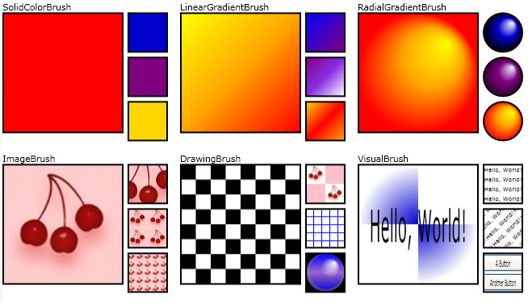
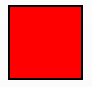
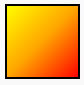
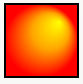
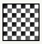

# WPF Brushes Overview
Everything visible on your screen is visible because it was painted by a brush. For example, a brush is used to describe the background of a button, the foreground of text, and the fill of a shape. This topic introduces the concepts of painting with [!INCLUDE[TLA#tla_winclient](../../../../includes/tlasharptla-winclient-md.md)] brushes and provides examples. Brushes enable you to paint [!INCLUDE[TLA#tla_ui](../../../../includes/tlasharptla-ui-md.md)] objects with anything from simple, solid colors to complex sets of patterns and images.  
  
   
## Painting with a Brush  
 A <xref:System.Windows.Media.Brush> "paints" an area with its output. Different brushes have different types of output. Some brushes paint an area with a solid color, others with a gradient, pattern, image, or drawing. The following illustration shows examples of each of the different <xref:System.Windows.Media.Brush> types.  
  
   
Brush examples  
  
 Most visual objects enable you to specify how they are painted. The following table lists some common objects and properties with which you can use a <xref:System.Windows.Media.Brush>.  
  
|Class|Brush properties|  
|-----------|----------------------|  
|<xref:System.Windows.Controls.Border>|<xref:System.Windows.Controls.Border.BorderBrush%2A>, <xref:System.Windows.Controls.Border.Background%2A>|  
|<xref:System.Windows.Controls.Control>|<xref:System.Windows.Controls.Control.Background%2A>, <xref:System.Windows.Controls.Control.Foreground%2A>|  
|<xref:System.Windows.Controls.Panel>|<xref:System.Windows.Controls.Panel.Background%2A>|  
|<xref:System.Windows.Media.Pen>|<xref:System.Windows.Media.Pen.Brush%2A>|  
|<xref:System.Windows.Shapes.Shape>|<xref:System.Windows.Shapes.Shape.Fill%2A>, <xref:System.Windows.Shapes.Shape.Stroke%2A>|  
|<xref:System.Windows.Controls.TextBlock>|<xref:System.Windows.Controls.TextBlock.Background%2A>|  
  
 The following sections describe the different <xref:System.Windows.Media.Brush> types and provide an example of each.  
  
   
## Paint with a Solid Color  
 A <xref:System.Windows.Media.SolidColorBrush> paints an area with a solid <xref:System.Windows.Media.Color>. There are a variety of ways to specify the <xref:System.Windows.Media.SolidColorBrush.Color%2A> of a <xref:System.Windows.Media.SolidColorBrush>: for example, you can specify its alpha, red, blue, and green channels or use one of the predefined color provided by the <xref:System.Windows.Media.Colors> class.  
  
 The following example uses a <xref:System.Windows.Media.SolidColorBrush> to paint the <xref:System.Windows.Shapes.Shape.Fill%2A> of a <xref:System.Windows.Shapes.Rectangle>. The following illustration shows the painted rectangle.  
  
   
A Rectangle painted using a SolidColorBrush  
  
 [!code-csharp[BrushesIntroduction_snip#GraphicsMMSolidColorBrushExampleInline](../../../../samples/snippets/csharp/VS_Snippets_Wpf/BrushesIntroduction_snip/CSharp/BrushTypesExample.cs#graphicsmmsolidcolorbrushexampleinline)]
 [!code-vb[BrushesIntroduction_snip#GraphicsMMSolidColorBrushExampleInline](../../../../samples/snippets/visualbasic/VS_Snippets_Wpf/BrushesIntroduction_snip/visualbasic/brushtypesexample.vb#graphicsmmsolidcolorbrushexampleinline)]
 [!code-xaml[BrushesIntroduction_snip#GraphicsMMSolidColorBrushExampleInline](../../../../samples/snippets/xaml/VS_Snippets_Wpf/BrushesIntroduction_snip/XAML/BrushTypesExample.xaml#graphicsmmsolidcolorbrushexampleinline)]  
  
 For more information about the <xref:System.Windows.Media.SolidColorBrush> class, see [Painting with Solid Colors and Gradients Overview](../../../../docs/framework/wpf/graphics-multimedia/painting-with-solid-colors-and-gradients-overview.md).  
  
   
## Paint with a Linear Gradient  
 A <xref:System.Windows.Media.LinearGradientBrush> paints an area with a linear gradient. A linear gradient blends two or more colors across a line, the gradient axis. You use <xref:System.Windows.Media.GradientStop> objects to specify the colors in the gradient and their positions.  
  
 The following example uses a <xref:System.Windows.Media.LinearGradientBrush> to paint the <xref:System.Windows.Shapes.Shape.Fill%2A> of a <xref:System.Windows.Shapes.Rectangle>. The following illustration shows the painted rectangle.  
  
   
A Rectangle painted using a LinearGradientBrush  
  
 [!code-csharp[BrushesIntroduction_snip#GraphicsMMLinearGradientBrushExampleInline](../../../../samples/snippets/csharp/VS_Snippets_Wpf/BrushesIntroduction_snip/CSharp/BrushTypesExample.cs#graphicsmmlineargradientbrushexampleinline)]
 [!code-vb[BrushesIntroduction_snip#GraphicsMMLinearGradientBrushExampleInline](../../../../samples/snippets/visualbasic/VS_Snippets_Wpf/BrushesIntroduction_snip/visualbasic/brushtypesexample.vb#graphicsmmlineargradientbrushexampleinline)]
 [!code-xaml[BrushesIntroduction_snip#GraphicsMMLinearGradientBrushExampleInline](../../../../samples/snippets/xaml/VS_Snippets_Wpf/BrushesIntroduction_snip/XAML/BrushTypesExample.xaml#graphicsmmlineargradientbrushexampleinline)]  
  
 For more information about the <xref:System.Windows.Media.LinearGradientBrush> class, see [Painting with Solid Colors and Gradients Overview](../../../../docs/framework/wpf/graphics-multimedia/painting-with-solid-colors-and-gradients-overview.md).  
  
   
## Paint with a Radial Gradient  
 A <xref:System.Windows.Media.RadialGradientBrush> paints an area with a radial gradient. A radial gradient blends two or more colors across a circle. As with the <xref:System.Windows.Media.LinearGradientBrush> class, you use <xref:System.Windows.Media.GradientStop> objects to specify the colors in the gradient and their positions.  
  
 The following example uses a <xref:System.Windows.Media.RadialGradientBrush> to paint the <xref:System.Windows.Shapes.Shape.Fill%2A> of a <xref:System.Windows.Shapes.Rectangle>. The following illustration shows the painted rectangle.  
  
   
A Rectangle painted using a RadialGradientBrush  
  
 [!code-csharp[BrushesIntroduction_snip#GraphicsMMRadialGradientBrushExampleInline](../../../../samples/snippets/csharp/VS_Snippets_Wpf/BrushesIntroduction_snip/CSharp/BrushTypesExample.cs#graphicsmmradialgradientbrushexampleinline)]
 [!code-vb[BrushesIntroduction_snip#GraphicsMMRadialGradientBrushExampleInline](../../../../samples/snippets/visualbasic/VS_Snippets_Wpf/BrushesIntroduction_snip/visualbasic/brushtypesexample.vb#graphicsmmradialgradientbrushexampleinline)]
 [!code-xaml[BrushesIntroduction_snip#GraphicsMMRadialGradientBrushExampleInline](../../../../samples/snippets/xaml/VS_Snippets_Wpf/BrushesIntroduction_snip/XAML/BrushTypesExample.xaml#graphicsmmradialgradientbrushexampleinline)]  
  
 For more information about the <xref:System.Windows.Media.RadialGradientBrush> class, see [Painting with Solid Colors and Gradients Overview](../../../../docs/framework/wpf/graphics-multimedia/painting-with-solid-colors-and-gradients-overview.md).  
  
   
## Paint with an Image  
 An <xref:System.Windows.Media.ImageBrush> paints an area with a <xref:System.Windows.Media.ImageSource>.  
  
 The following example uses an <xref:System.Windows.Media.ImageBrush> to paint the <xref:System.Windows.Shapes.Shape.Fill%2A> of a <xref:System.Windows.Shapes.Rectangle>. The following illustration shows the painted rectangle.  
  
   
A Rectangle painted using a Image  
  
 [!code-csharp[BrushesIntroduction_snip#GraphicsMMImageBrushExampleInline](../../../../samples/snippets/csharp/VS_Snippets_Wpf/BrushesIntroduction_snip/CSharp/BrushTypesExample.cs#graphicsmmimagebrushexampleinline)]
 [!code-vb[BrushesIntroduction_snip#GraphicsMMImageBrushExampleInline](../../../../samples/snippets/visualbasic/VS_Snippets_Wpf/BrushesIntroduction_snip/visualbasic/brushtypesexample.vb#graphicsmmimagebrushexampleinline)]
 [!code-xaml[BrushesIntroduction_snip#GraphicsMMImageBrushExampleInline](../../../../samples/snippets/xaml/VS_Snippets_Wpf/BrushesIntroduction_snip/XAML/BrushTypesExample.xaml#graphicsmmimagebrushexampleinline)]  
  
 For more information about the <xref:System.Windows.Media.ImageBrush> class, see [Painting with Images, Drawings, and Visuals](../../../../docs/framework/wpf/graphics-multimedia/painting-with-images-drawings-and-visuals.md).  
  
   
## Paint with a Drawing  
 A <xref:System.Windows.Media.DrawingBrush> paints an area with a <xref:System.Windows.Media.Drawing>. A <xref:System.Windows.Media.Drawing> can contain shapes, images, text, and media.  
  
 The following example uses a <xref:System.Windows.Media.DrawingBrush> to paint the <xref:System.Windows.Shapes.Shape.Fill%2A> of a <xref:System.Windows.Shapes.Rectangle>. The following illustration shows the painted rectangle.  
  
   
A Rectangle painted using a DrawingBrush  
  
 [!code-csharp[BrushesIntroduction_snip#GraphicsMMDrawingBrushExampleInline](../../../../samples/snippets/csharp/VS_Snippets_Wpf/BrushesIntroduction_snip/CSharp/BrushTypesExample.cs#graphicsmmdrawingbrushexampleinline)]
 [!code-vb[BrushesIntroduction_snip#GraphicsMMDrawingBrushExampleInline](../../../../samples/snippets/visualbasic/VS_Snippets_Wpf/BrushesIntroduction_snip/visualbasic/brushtypesexample.vb#graphicsmmdrawingbrushexampleinline)]
 [!code-xaml[BrushesIntroduction_snip#GraphicsMMDrawingBrushExampleInline](../../../../samples/snippets/xaml/VS_Snippets_Wpf/BrushesIntroduction_snip/XAML/BrushTypesExample.xaml#graphicsmmdrawingbrushexampleinline)]  
  
 For more information about the <xref:System.Windows.Media.DrawingBrush> class, see [Painting with Images, Drawings, and Visuals](../../../../docs/framework/wpf/graphics-multimedia/painting-with-images-drawings-and-visuals.md).  
  
   
## Paint with a Visual  
 A <xref:System.Windows.Media.VisualBrush> paints an area with a <xref:System.Windows.Media.Visual> object. Examples of Visual objects include <xref:System.Windows.Controls.Button>, <xref:System.Windows.Controls.Page>, and <xref:System.Windows.Controls.MediaElement>. A <xref:System.Windows.Media.VisualBrush> also enables you to project content from one portion of your application into another area; it's very useful for creating reflection effects and magnifying portions of the screen.  
  
 The following example uses a <xref:System.Windows.Media.VisualBrush> to paint the <xref:System.Windows.Shapes.Shape.Fill%2A> of a <xref:System.Windows.Shapes.Rectangle>. The following illustration shows the painted rectangle.  
  
   
A Rectangle painted using a VisualBrush  
  
 [!code-csharp[BrushesIntroduction_snip#GraphicsMMVisualBrushExampleInline](../../../../samples/snippets/csharp/VS_Snippets_Wpf/BrushesIntroduction_snip/CSharp/BrushTypesExample.cs#graphicsmmvisualbrushexampleinline)]
 [!code-vb[BrushesIntroduction_snip#GraphicsMMVisualBrushExampleInline](../../../../samples/snippets/visualbasic/VS_Snippets_Wpf/BrushesIntroduction_snip/visualbasic/brushtypesexample.vb#graphicsmmvisualbrushexampleinline)]
 [!code-xaml[BrushesIntroduction_snip#GraphicsMMVisualBrushExampleInline](../../../../samples/snippets/xaml/VS_Snippets_Wpf/BrushesIntroduction_snip/XAML/BrushTypesExample.xaml#graphicsmmvisualbrushexampleinline)]  
  
 For more information about the <xref:System.Windows.Media.VisualBrush> class, see [Painting with Images, Drawings, and Visuals](../../../../docs/framework/wpf/graphics-multimedia/painting-with-images-drawings-and-visuals.md).  
  
   
## Paint using Predefined and System Brushes  
 For convenience, [!INCLUDE[TLA#tla_wpf](../../../../includes/tlasharptla-wpf-md.md)] provides a set of predefined and system brushes that you can use to paint objects.  
  
-   For a list of available predefined brushes, see the <xref:System.Windows.Media.Brushes> class. For an example showing how to use a predefined brush, see [Paint an Area with a Solid Color](../../../../docs/framework/wpf/graphics-multimedia/how-to-paint-an-area-with-a-solid-color.md).  
  
-   For a list of available system brushes, see the <xref:System.Windows.SystemColors> class. For an example, see [Paint an Area with a System Brush](../../../../docs/framework/wpf/graphics-multimedia/how-to-paint-an-area-with-a-system-brush.md).  
  
   
## Common Brush Features  
 <xref:System.Windows.Media.Brush> objects provide an <xref:System.Windows.Media.Brush.Opacity%2A> property that can be used to make a brush transparent or partially transparent. An <xref:System.Windows.Media.Brush.Opacity%2A> value of 0 makes a brush completely transparent, while an <xref:System.Windows.Media.Brush.Opacity%2A> value of 1 makes a brush completely opaque. The following example uses the <xref:System.Windows.Media.Brush.Opacity%2A> property to make a <xref:System.Windows.Media.SolidColorBrush> 25 percent opaque.  
  
 [!code-xaml[BrushOverviewExamples_snip#OpacityExample1XAML](../../../../samples/snippets/xaml/VS_Snippets_Wpf/BrushOverviewExamples_snip/XAML/OpacityExample.xaml#opacityexample1xaml)]  
  
 [!code-csharp[BrushOverviewExamples_snip#OpacityExample1CSharp](../../../../samples/snippets/csharp/VS_Snippets_Wpf/BrushOverviewExamples_snip/CSharp/OpacityExample.cs#opacityexample1csharp)]  
  
 If the brush contains colors that are partially transparent, the opacity value of the color is combined through multiplication with the opacity value of the brush. For example, if a brush has an opacity value of 0.5 and a color used in the brush also has an opacity value of 0.5, the output color has an opacity value of 0.25.  
  
> [!NOTE]
>  It's more efficient to change the opacity value of a brush than it is to change the opacity of an entire element using its <xref:System.Windows.UIElement.Opacity%2A?displayProperty=nameWithType> property.  
  
 You can rotate, scale, skew, and translate a brush's content by using its <xref:System.Windows.Media.Brush.Transform%2A> or <xref:System.Windows.Media.Brush.RelativeTransform%2A> properties. For more information, see [Brush Transformation Overview](../../../../docs/framework/wpf/graphics-multimedia/brush-transformation-overview.md).  
  
 Because they are <xref:System.Windows.Media.Animation.Animatable> objects, <xref:System.Windows.Media.Brush> objects can be animated. For more information, see [Animation Overview](../../../../docs/framework/wpf/graphics-multimedia/animation-overview.md).  
  
   
### Freezable Features  
 Because it inherits from the <xref:System.Windows.Freezable> class, the <xref:System.Windows.Media.Brush> class provides several special features: <xref:System.Windows.Media.Brush> objects can be declared as [resources](../../../../docs/framework/wpf/advanced/xaml-resources.md), shared among multiple objects, and cloned. In addition, all the <xref:System.Windows.Media.Brush> types except <xref:System.Windows.Media.VisualBrush> can be made read-only to improve performance and made thread-safe.  
  
 For more information about the different features provided by <xref:System.Windows.Freezable> objects, see [Freezable Objects Overview](../../../../docs/framework/wpf/advanced/freezable-objects-overview.md).  
  
 For more information on why <xref:System.Windows.Media.VisualBrush> objects cannot be frozen, see the <xref:System.Windows.Media.VisualBrush> type page.  
  
## See Also  
 <xref:System.Windows.Media.Brush>  
 <xref:System.Windows.Media.Brushes>  
 [Painting with Solid Colors and Gradients Overview](../../../../docs/framework/wpf/graphics-multimedia/painting-with-solid-colors-and-gradients-overview.md)  
 [Painting with Images, Drawings, and Visuals](../../../../docs/framework/wpf/graphics-multimedia/painting-with-images-drawings-and-visuals.md)  
 [Freezable Objects Overview](../../../../docs/framework/wpf/advanced/freezable-objects-overview.md)  
 [Brushes Sample](http://go.microsoft.com/fwlink/?LinkID=159973)  
 [ImageBrush Sample](http://go.microsoft.com/fwlink/?LinkID=160005)  
 [VisualBrush Sample](http://go.microsoft.com/fwlink/?LinkID=160049)  
 [How-to Topics](../../../../docs/framework/wpf/graphics-multimedia/brushes-how-to-topics.md)  
 [Other Performance Recommendations](../../../../docs/framework/wpf/advanced/optimizing-performance-other-recommendations.md)
