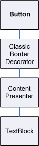
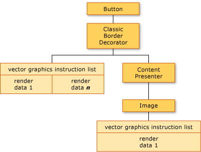
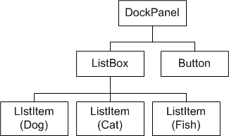
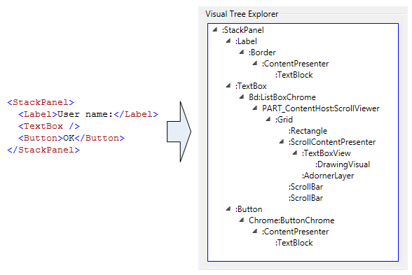
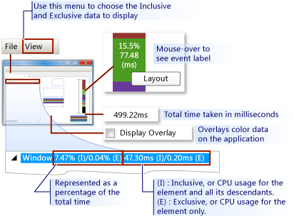
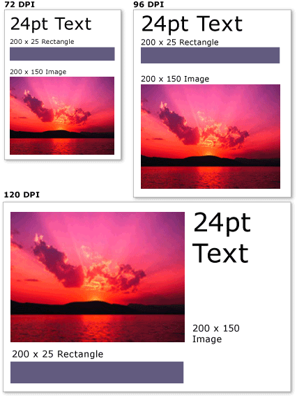

# WPF Graphics Rendering Overview
This topic provides an overview of the [!INCLUDE[TLA2#tla_winclient](../../../../includes/tla2sharptla-winclient-md.md)] visual layer. It focuses on the role of the <xref:System.Windows.Media.Visual> class for rendering support in the [!INCLUDE[TLA2#tla_winclient](../../../../includes/tla2sharptla-winclient-md.md)] model.  
  
  
   
## Role of the Visual Object  
 The <xref:System.Windows.Media.Visual> class is the basic abstraction from which every <xref:System.Windows.FrameworkElement> object derives. It also serves as the entry point for writing new controls in [!INCLUDE[TLA2#tla_winclient](../../../../includes/tla2sharptla-winclient-md.md)], and in many ways can be thought of as the window handle (HWND) in the Win32 application model.  
  
 The <xref:System.Windows.Media.Visual> object is a core [!INCLUDE[TLA2#tla_winclient](../../../../includes/tla2sharptla-winclient-md.md)] object, whose primary role is to provide rendering support. User interface controls, such as <xref:System.Windows.Controls.Button> and <xref:System.Windows.Controls.TextBox>, derive from the <xref:System.Windows.Media.Visual> class, and use it for persisting their rendering data. The <xref:System.Windows.Media.Visual> object provides support for:  
  
-   Output display: Rendering the persisted, serialized drawing content of a visual.  
  
-   Transformations: Performing transformations on a visual.  
  
-   Clipping: Providing clipping region support for a visual.  
  
-   Hit testing: Determining whether a coordinate or geometry is contained within the bounds of a visual.  
  
-   Bounding box calculations: Determining the bounding rectangle of a visual.  
  
 However, the <xref:System.Windows.Media.Visual> object does not include support for non-rendering features, such as:  
  
-   Event handling  
  
-   Layout  
  
-   Styles  
  
-   Data binding  
  
-   Globalization  
  
 <xref:System.Windows.Media.Visual> is exposed as a public abstract class from which child classes must be derived. The following illustration shows the hierarchy of the visual objects that are exposed in [!INCLUDE[TLA2#tla_winclient](../../../../includes/tla2sharptla-winclient-md.md)].  
  
   
Visual class hierarchy  
  
### DrawingVisual Class  
 The <xref:System.Windows.Media.DrawingVisual> is a lightweight drawing class that is used to render shapes, images, or text. This class is considered lightweight because it does not provide layout or event handling, which improves its runtime performance. For this reason, drawings are ideal for backgrounds and clip art. The <xref:System.Windows.Media.DrawingVisual> can be used to create a custom visual object. For more information, see [Using DrawingVisual Objects](../../../../docs/framework/wpf/graphics-multimedia/using-drawingvisual-objects.md).  
  
### Viewport3DVisual Class  
 The <xref:System.Windows.Media.Media3D.Viewport3DVisual> provides a bridge between 2D <xref:System.Windows.Media.Visual> and <xref:System.Windows.Media.Media3D.Visual3D> objects. The <xref:System.Windows.Media.Media3D.Visual3D> class is the base class for all 3D visual elements. The <xref:System.Windows.Media.Media3D.Viewport3DVisual> requires that you define a <xref:System.Windows.Media.Media3D.Viewport3DVisual.Camera%2A> value and a <xref:System.Windows.Media.Media3D.Viewport3DVisual.Viewport%2A> value. The camera allows you to view the scene. The viewport establishes where the projection maps onto the 2D surface. For more information on 3D in [!INCLUDE[TLA2#tla_winclient](../../../../includes/tla2sharptla-winclient-md.md)], see [3-D Graphics Overview](../../../../docs/framework/wpf/graphics-multimedia/3-d-graphics-overview.md).  
  
### ContainerVisual Class  
 The <xref:System.Windows.Media.ContainerVisual> class is used as a container for a collection of <xref:System.Windows.Media.Visual> objects. The <xref:System.Windows.Media.DrawingVisual> class derives from the <xref:System.Windows.Media.ContainerVisual> class, allowing it to contain a collection of visual objects.  
  
### Drawing Content in Visual Objects  
 A <xref:System.Windows.Media.Visual> object stores its render data as a **vector graphics instruction list**. Each item in the instruction list represents a low-level set of graphics data and associated resources in a serialized format. There are four different types of render data that can contain drawing content.  
  
|Drawing content type|Description|  
|--------------------------|-----------------|  
|Vector graphics|Represents vector graphics data, and any associated <xref:System.Windows.Media.Brush> and <xref:System.Windows.Media.Pen> information.|  
|Image|Represents an image within a region defined by a <xref:System.Windows.Rect>.|  
|Glyph|Represents a drawing that renders a <xref:System.Windows.Media.GlyphRun>, which is a sequence of glyphs from a specified font resource. This is how text is represented.|  
|Video|Represents a drawing that renders video.|  
  
 The <xref:System.Windows.Media.DrawingContext> allows you to populate a <xref:System.Windows.Media.Visual> with visual content. When you use a <xref:System.Windows.Media.DrawingContext> object's draw commands, you are actually storing a set of render data that will later be used by the graphics system; you are not drawing to the screen in real-time.  
  
 When you create a [!INCLUDE[TLA2#tla_winclient](../../../../includes/tla2sharptla-winclient-md.md)] control, such as a <xref:System.Windows.Controls.Button>, the control implicitly generates render data for drawing itself. For example, setting the <xref:System.Windows.Controls.ContentControl.Content%2A> property of the <xref:System.Windows.Controls.Button> causes the control to store a rendering representation of a glyph.  
  
 A <xref:System.Windows.Media.Visual> describes its content as one or more <xref:System.Windows.Media.Drawing> objects contained within a <xref:System.Windows.Media.DrawingGroup>. A <xref:System.Windows.Media.DrawingGroup> also describes opacity masks, transforms, bitmap effects, and other operations that are applied to its contents. <xref:System.Windows.Media.DrawingGroup> operations are applied in the following order when content is rendered: <xref:System.Windows.Media.DrawingGroup.OpacityMask%2A>, <xref:System.Windows.Media.DrawingGroup.Opacity%2A>, <xref:System.Windows.Media.DrawingGroup.BitmapEffect%2A>, <xref:System.Windows.Media.DrawingGroup.ClipGeometry%2A>, <xref:System.Windows.Media.DrawingGroup.GuidelineSet%2A>, and then <xref:System.Windows.Media.DrawingGroup.Transform%2A>.  
  
 The following illustration shows the order in which <xref:System.Windows.Media.DrawingGroup> operations are applied during the rendering sequence.  
  
   
Order of DrawingGroup operations  
  
 For more information, see [Drawing Objects Overview](../../../../docs/framework/wpf/graphics-multimedia/drawing-objects-overview.md).  
  
#### Drawing Content at the Visual Layer  
 You never directly instantiate a <xref:System.Windows.Media.DrawingContext>; you can, however, acquire a drawing context from certain methods, such as <xref:System.Windows.Media.DrawingGroup.Open%2A?displayProperty=nameWithType> and <xref:System.Windows.Media.DrawingVisual.RenderOpen%2A?displayProperty=nameWithType>. The following example retrieves a <xref:System.Windows.Media.DrawingContext> from a <xref:System.Windows.Media.DrawingVisual> and uses it to draw a rectangle.  
  
 [!code-csharp[drawingvisualsample#101](../../../../samples/snippets/csharp/VS_Snippets_Wpf/DrawingVisualSample/CSharp/Window1.xaml.cs#101)]
 [!code-vb[drawingvisualsample#101](../../../../samples/snippets/visualbasic/VS_Snippets_Wpf/DrawingVisualSample/visualbasic/window1.xaml.vb#101)]  
  
#### Enumerating Drawing Content at the Visual Layer  
 In addition to their other uses, <xref:System.Windows.Media.Drawing> objects also provide an object model for enumerating the contents of a <xref:System.Windows.Media.Visual>.  
  
> [!NOTE]
>  When you are enumerating the contents of the visual, you are retrieving <xref:System.Windows.Media.Drawing> objects, and not the underlying representation of the render data as a vector graphics instruction list.  
  
 The following example uses the <xref:System.Windows.Media.VisualTreeHelper.GetDrawing%2A> method to retrieve the <xref:System.Windows.Media.DrawingGroup> value of a <xref:System.Windows.Media.Visual> and enumerate it.  
  
 [!code-csharp[DrawingMiscSnippets_snip#GraphicsMMRetrieveDrawings](../../../../samples/snippets/csharp/VS_Snippets_Wpf/DrawingMiscSnippets_snip/CSharp/EnumerateDrawingsExample.xaml.cs#graphicsmmretrievedrawings)]  
  
   
## How Visual Objects are Used to Build Controls  
 Many of the objects in [!INCLUDE[TLA2#tla_winclient](../../../../includes/tla2sharptla-winclient-md.md)] are composed of other visual objects, meaning they can contain varying hierarchies of descendant objects. Many of the user interface elements in [!INCLUDE[TLA2#tla_winclient](../../../../includes/tla2sharptla-winclient-md.md)], such as controls, are composed of multiple visual objects, representing different types of rendering elements. For example, the <xref:System.Windows.Controls.Button> control can contain a number of other objects, including <xref:Microsoft.Windows.Themes.ClassicBorderDecorator>, <xref:System.Windows.Controls.ContentPresenter>, and <xref:System.Windows.Controls.TextBlock>.  
  
 The following code shows a <xref:System.Windows.Controls.Button> control defined in markup.  
  
 [!code-xaml[VisualsOverview#VisualsOverviewSnippet1](../../../../samples/snippets/csharp/VS_Snippets_Wpf/VisualsOverview/CSharp/Window1.xaml#visualsoverviewsnippet1)]  
  
 If you were to enumerate the visual objects that comprise the default <xref:System.Windows.Controls.Button> control, you would find the hierarchy of visual objects illustrated below:  
  
   
Diagram of visual tree hierarchy  
  
 The <xref:System.Windows.Controls.Button> control contains a <xref:Microsoft.Windows.Themes.ClassicBorderDecorator> element, which in turn, contains a <xref:System.Windows.Controls.ContentPresenter> element. The <xref:Microsoft.Windows.Themes.ClassicBorderDecorator> element is responsible for drawing a border and a background for the <xref:System.Windows.Controls.Button>. The <xref:System.Windows.Controls.ContentPresenter> element is responsible for displaying the contents of the <xref:System.Windows.Controls.Button>. In this case, since you are displaying text, the <xref:System.Windows.Controls.ContentPresenter> element contains a <xref:System.Windows.Controls.TextBlock> element. The fact that the <xref:System.Windows.Controls.Button> control uses a <xref:System.Windows.Controls.ContentPresenter> means that the content could be represented by other elements, such as an <xref:System.Windows.Controls.Image> or a geometry, such as an <xref:System.Windows.Media.EllipseGeometry>.  
  
### Control Templates  
 The key to the expansion of a control into a hierarchy of controls is the <xref:System.Windows.Controls.ControlTemplate>. A control template specifies the default visual hierarchy for a control. When you explicitly reference a control, you implicitly reference its visual hierarchy. You can override the default values for a control template to create a customized visual appearance for a control. For example, you could modify the background color value of the <xref:System.Windows.Controls.Button> control so that it uses a linear gradient color value instead of a solid color value. For more information, see [Button Styles and Templates](../../../../docs/framework/wpf/controls/button-styles-and-templates.md).  
  
 A user interface element, such as a <xref:System.Windows.Controls.Button> control, contains several vector graphics instruction lists that describe the entire rendering definition of a control. The following code shows a <xref:System.Windows.Controls.Button> control defined in markup.  
  
 [!code-xaml[VisualsOverview#VisualsOverviewSnippet2](../../../../samples/snippets/csharp/VS_Snippets_Wpf/VisualsOverview/CSharp/Window1.xaml#visualsoverviewsnippet2)]  
  
 If you were to enumerate the visual objects and vector graphics instruction lists that comprise the <xref:System.Windows.Controls.Button> control, you would find the hierarchy of objects illustrated below:  
  
   
Diagram of visual tree and rendering data  
  
 The <xref:System.Windows.Controls.Button> control contains a <xref:Microsoft.Windows.Themes.ClassicBorderDecorator> element, which in turn, contains a <xref:System.Windows.Controls.ContentPresenter> element. The <xref:Microsoft.Windows.Themes.ClassicBorderDecorator> element is responsible for drawing all the discrete graphic elements that make up the border and background of a button. The <xref:System.Windows.Controls.ContentPresenter> element is responsible for displaying the contents of the <xref:System.Windows.Controls.Button>. In this case, since you are displaying an image, the <xref:System.Windows.Controls.ContentPresenter> element contains a <xref:System.Windows.Controls.Image> element.  
  
 There are a number of points to note about the hierarchy of visual objects and vector graphics instruction lists:  
  
-   The ordering in the hierarchy represents the rendering order of the drawing information. From the root visual element, child elements are traversed, left to right, top to bottom. If an element has visual child elements, they are traversed before the element’s siblings.  
  
-   Non-leaf node elements in the hierarchy, such as <xref:System.Windows.Controls.ContentPresenter>, are used to contain child elements—they do not contain instruction lists.  
  
-   If a visual element contains both a vector graphics instruction list and visual children, the instruction list in the parent visual element is rendered before drawings in any of the visual child objects.  
  
-   The items in the vector graphics instruction list are rendered left to right.  
  
   
## Visual Tree  
 The visual tree contains all visual elements used in an application's user interface. Since a visual element contains persisted drawing information, you can think of the visual tree as a scene graph, containing all the rendering information needed to compose the output to the display device. This tree is the accumulation of all visual elements created directly by the application, whether in code or in markup. The visual tree also contains all visual elements created by the template expansion of elements such as controls and data objects.  
  
 The following code shows a <xref:System.Windows.Controls.StackPanel> element defined in markup.  
  
 [!code-xaml[VisualsOverview#VisualsOverviewSnippet3](../../../../samples/snippets/csharp/VS_Snippets_Wpf/VisualsOverview/CSharp/Window1.xaml#visualsoverviewsnippet3)]  
  
 If you were to enumerate the visual objects that comprise the <xref:System.Windows.Controls.StackPanel> element in the markup example, you would find the hierarchy of visual objects illustrated below:  
  
   
Diagram of visual tree hierarchy  
  
### Rendering Order  
 The visual tree determines the rendering order of [!INCLUDE[TLA2#tla_winclient](../../../../includes/tla2sharptla-winclient-md.md)] visual and drawing objects. The order of traversal starts with the root visual, which is the top-most node in the visual tree. The root visual’s children are then traversed, left to right. If a visual has children, its children are traversed before the visual’s siblings. This means that the content of a child visual is rendered in front of the visual's own content.  
  
   
Diagram of visual tree rendering order  
  
### Root Visual  
 The **root visual** is the top-most element in a visual tree hierarchy. In most applications, the base class of the root visual is either <xref:System.Windows.Window> or <xref:System.Windows.Navigation.NavigationWindow>. However, if you were hosting visual objects in a Win32 application, the root visual would be the top-most visual you were hosting in the Win32 window. For more information, see [Tutorial: Hosting Visual Objects in a Win32 Application](../../../../docs/framework/wpf/graphics-multimedia/tutorial-hosting-visual-objects-in-a-win32-application.md).  
  
### Relationship to the Logical Tree  
 The logical tree in [!INCLUDE[TLA2#tla_winclient](../../../../includes/tla2sharptla-winclient-md.md)] represents the elements of an application at run time. Although you do not manipulate this tree directly, this view of the application is useful for understanding property inheritance and event routing. Unlike the visual tree, the logical tree can represent non-visual data objects, such as <xref:System.Windows.Documents.ListItem>. In many cases, the logical tree maps very closely to an application's markup definitions. The following code shows a <xref:System.Windows.Controls.DockPanel> element defined in markup.  
  
 [!code-xaml[VisualsOverview#VisualsOverviewSnippet5](../../../../samples/snippets/csharp/VS_Snippets_Wpf/VisualsOverview/CSharp/Window1.xaml#visualsoverviewsnippet5)]  
  
 If you were to enumerate the logical objects that comprise the <xref:System.Windows.Controls.DockPanel> element in the markup example, you would find the hierarchy of logical objects illustrated below:  
  
   
Diagram of logical tree  
  
 Both the visual tree and logical tree are synchronized with the current set of application elements, reflecting any addition, deletion, or modification of elements. However, the trees present different views of the application. Unlike the visual tree, the logical tree does not expand a control's <xref:System.Windows.Controls.ContentPresenter> element. This means there is not a direct one-to-one correspondence between a logical tree and a visual tree for the same set of objects. In fact, invoking the **LogicalTreeHelper** object's <xref:System.Windows.LogicalTreeHelper.GetChildren%2A> method and the **VisualTreeHelper** object's <xref:System.Windows.Media.VisualTreeHelper.GetChild%2A> method using the same element as a parameter yields differing results.  
  
 For more information on the logical tree, see [Trees in WPF](../../../../docs/framework/wpf/advanced/trees-in-wpf.md).  
  
### Viewing the Visual Tree with XamlPad  
 The [!INCLUDE[TLA2#tla_winclient](../../../../includes/tla2sharptla-winclient-md.md)] tool, XamlPad, provides an option for viewing and exploring the visual tree that corresponds to the currently defined [!INCLUDE[TLA#tla_titlexaml](../../../../includes/tlasharptla-titlexaml-md.md)] content. Click the **Show Visual Tree** button on the menu bar to display the visual tree. The following illustrates the expansion of [!INCLUDE[TLA#tla_titlexaml](../../../../includes/tlasharptla-titlexaml-md.md)] content into visual tree nodes in the **Visual Tree Explorer** panel of XamlPad:  
  
   
Visual Tree Explorer panel in XamlPad  
  
 Notice how the <xref:System.Windows.Controls.Label>, <xref:System.Windows.Controls.TextBox>, and <xref:System.Windows.Controls.Button> controls each display a separate visual object hierarchy in the **Visual Tree Explorer** panel of XamlPad. This is because [!INCLUDE[TLA2#tla_winclient](../../../../includes/tla2sharptla-winclient-md.md)] controls have a <xref:System.Windows.Controls.ControlTemplate> that contains the visual tree of that control. When you explicitly reference a control, you implicitly reference its visual hierarchy.  
  
### Profiling Visual Performance  
 [!INCLUDE[TLA2#tla_winclient](../../../../includes/tla2sharptla-winclient-md.md)] provides a suite of performance profiling tools that allow you to analyze the run-time behavior of your application and determine the types of performance optimizations you can apply. The Visual Profiler tool provides a rich, graphical view of performance data by mapping directly to the application's visual tree. In this screenshot, the **CPU Usage** section of the Visual Profiler gives you a precise breakdown of an object's use of [!INCLUDE[TLA2#tla_winclient](../../../../includes/tla2sharptla-winclient-md.md)] services, such as rendering and layout.  
  
   
Visual Profiler display output  
  
   
## Visual Rendering Behavior  
 [!INCLUDE[TLA2#tla_winclient](../../../../includes/tla2sharptla-winclient-md.md)] introduces several features that affect the rendering behavior of visual objects: retained mode graphics, vector graphics, and device independent graphics.  
  
### Retained Mode Graphics  
 One of the keys to understanding the role of the Visual object is to understand the difference between **immediate mode** and **retained mode** graphics systems. A standard Win32 application based on GDI or GDI+ uses an immediate mode graphics system. This means that the application is responsible for repainting the portion of the client area that is invalidated, due to an action such as a window being resized, or an object changing its visual appearance.  
  
   
Diagram of Win32 rendering sequence  
  
 In contrast, [!INCLUDE[TLA2#tla_winclient](../../../../includes/tla2sharptla-winclient-md.md)] uses a retained mode system. This means application objects that have a visual appearance define a set of serialized drawing data. Once the drawing data is defined, the system is responsible thereafter for responding to all repaint requests for rendering the application objects. Even at run time, you can modify or create application objects, and still rely on the system for responding to paint requests. The power in a retained mode graphics system is that drawing information is always persisted in a serialized state by the application, but rendering responsibility left to the system. The following diagram shows how the application relies on [!INCLUDE[TLA2#tla_winclient](../../../../includes/tla2sharptla-winclient-md.md)] for responding to paint requests.  
  
   
Diagram of WPF rendering sequence  
  
#### Intelligent Redrawing  
 One of the biggest benefits in using retained mode graphics is that [!INCLUDE[TLA2#tla_winclient](../../../../includes/tla2sharptla-winclient-md.md)] can efficiently optimize what needs to be redrawn in the application. Even if you have a complex scene with varying levels of opacity, you generally do not need to write special-purpose code to optimize redrawing. Compare this with Win32 programming in which you can spend a great deal of effort in optimizing your application by minimizing the amount of redrawing in the update region. See [Redrawing in the Update Region](https://msdn.microsoft.com/library/dd162909.aspx) for an example of the type of complexity involved in optimizing redrawing in Win32 applications.  
  
### Vector Graphics  
 [!INCLUDE[TLA2#tla_winclient](../../../../includes/tla2sharptla-winclient-md.md)] uses **vector graphics** as its rendering data format. Vector graphics—which include Scalable Vector Graphics (SVG), Windows metafiles (.wmf), and TrueType fonts—store rendering data and transmit it as a list of instructions that describe how to recreate an image using graphics primitives. For example, TrueType fonts are outline fonts that describe a set of lines, curves, and commands, rather than an array of pixels. One of the key benefits of vector graphics is the ability to scale to any size and resolution.  
  
 Unlike vector graphics, bitmap graphics store rendering data as a pixel-by-pixel representation of an image, pre-rendered for a specific resolution. One of the key differences between bitmap and vector graphic formats is fidelity to the original source image. For example, when the size of a source image is modified, bitmap graphics systems stretch the image, whereas vector graphics systems scale the image, preserving the image fidelity.  
  
 The following illustration shows a source image that has been resized by 300%. Notice the distortions that appear when the source image is stretched as a bitmap graphics image rather than scaled as a vector graphics image.  
  
   
Differences between raster and vector graphics  
  
 The following markup shows two <xref:System.Windows.Shapes.Path> elements defined. The second element uses a <xref:System.Windows.Media.ScaleTransform> to resize the drawing instructions of the first element by 300%. Notice that the drawing instructions in the <xref:System.Windows.Shapes.Path> elements remain unchanged.  
  
 [!code-xaml[VectorGraphicsSnippets#VectorGraphicsSnippet1](../../../../samples/snippets/csharp/VS_Snippets_Wpf/VectorGraphicsSnippets/CS/PageOne.xaml#vectorgraphicssnippet1)]  
  
### About Resolution and Device-Independent Graphics  
 There are two system factors that determine the size of text and graphics on your screen: resolution and DPI. Resolution describes the number of pixels that appear on the screen. As the resolution gets higher, pixels get smaller, causing graphics and text to appear smaller. A graphic displayed on a monitor set to 1024 x 768 will appear much smaller when the resolution is changed to 1600 x 1200.  
  
 The other system setting, DPI, describes the size of a screen inch in pixels. Most [!INCLUDE[TLA#tla_mswin](../../../../includes/tlasharptla-mswin-md.md)] systems have a DPI of 96, which means a screen inch is 96 pixels. Increasing the DPI setting makes the screen inch larger; decreasing the DPI makes the screen inch smaller. This means that a screen inch isn't the same size as a real-world inch; on most systems, it's probably not. As you increase the DPI, DPI-aware graphics and text become larger because you've increased the size of the screen inch. Increasing the DPI can make text easier to read, especially at high resolutions.  
  
 Not all applications are DPI-aware: some use hardware pixels as the primary unit of measurement; changing the system DPI has no effect on these applications. Many other applications use DPI-aware units to describe font sizes, but use pixels to describe everything else. Making the DPI too small or too large can cause layout problems for these applications, because the applications' text scales with the system's DPI setting, but the applications' UI does not. This problem has been eliminated for applications developed using [!INCLUDE[TLA2#tla_winclient](../../../../includes/tla2sharptla-winclient-md.md)].  
  
 [!INCLUDE[TLA2#tla_winclient](../../../../includes/tla2sharptla-winclient-md.md)] supports automatic scaling by using the device independent pixel as its primary unit of measurement, instead of hardware pixels; graphics and text scale properly without any extra work from the application developer. The following illustration shows an example of how [!INCLUDE[TLA2#tla_winclient](../../../../includes/tla2sharptla-winclient-md.md)] text and graphics are appear at different DPI settings.  
  
   
Graphics and text at different DPI settings  
  
   
## VisualTreeHelper Class  
 The <xref:System.Windows.Media.VisualTreeHelper> class is a static helper class that provides low-level functionality for programming at the visual object level, which is useful in very specific scenarios, such as developing high-performance custom controls. In most case, the higher-level [!INCLUDE[TLA2#tla_winclient](../../../../includes/tla2sharptla-winclient-md.md)] framework objects, such as <xref:System.Windows.Controls.Canvas> and <xref:System.Windows.Controls.TextBlock>, offer greater flexibility and ease of use.  
  
### Hit Testing  
 The <xref:System.Windows.Media.VisualTreeHelper> class provides methods for hit testing on visual objects when the default hit test support does not meet your needs. You can use the <xref:System.Windows.Media.VisualTreeHelper.HitTest%2A> methods in the <xref:System.Windows.Media.VisualTreeHelper> class to determine whether a geometry or point coordinate value is within the boundary of a given object, such as a control or graphic element. For example, you could use hit testing to determine whether a mouse click within the bounding rectangle of an object falls within the geometry of a circle You can also choose to override the default implementation of hit testing to perform your own custom hit test calculations.  
  
 For more information on hit testing, see [Hit Testing in the Visual Layer](../../../../docs/framework/wpf/graphics-multimedia/hit-testing-in-the-visual-layer.md).  
  
### Enumerating the Visual Tree  
 The <xref:System.Windows.Media.VisualTreeHelper> class provides functionality for enumerating the members of a visual tree. To retrieve a parent, call the <xref:System.Windows.Media.VisualTreeHelper.GetParent%2A> method. To retrieve a child, or direct descendant, of a visual object, call the <xref:System.Windows.Media.VisualTreeHelper.GetChild%2A> method. This method returns a child <xref:System.Windows.Media.Visual> of the parent at the specified index.  
  
 The following example shows how to enumerate all the descendants of a visual object, which is a technique you might want to use if you were interested in serializing all the rendering information of a visual object hierarchy.  
  
 [!code-csharp[VisualsOverview#101](../../../../samples/snippets/csharp/VS_Snippets_Wpf/VisualsOverview/CSharp/Window1.xaml.cs#101)]
 [!code-vb[VisualsOverview#101](../../../../samples/snippets/visualbasic/VS_Snippets_Wpf/VisualsOverview/visualbasic/window1.xaml.vb#101)]  
  
 In most cases, the logical tree is a more useful representation of the elements in a [!INCLUDE[TLA2#tla_winclient](../../../../includes/tla2sharptla-winclient-md.md)] application. Although you do not modify the logical tree directly, this view of the application is useful for understanding property inheritance and event routing. Unlike the visual tree, the logical tree can represent non-visual data objects, such as <xref:System.Windows.Documents.ListItem>. For more information on the logical tree, see [Trees in WPF](../../../../docs/framework/wpf/advanced/trees-in-wpf.md).  
  
 The <xref:System.Windows.Media.VisualTreeHelper> class provides methods for returning the bounding rectangle of visual objects. You can return the bounding rectangle of a visual object by calling <xref:System.Windows.Media.VisualTreeHelper.GetContentBounds%2A>. You can return the bounding rectangle of all the descendants of a visual object, including the visual object itself, by calling <xref:System.Windows.Media.VisualTreeHelper.GetDescendantBounds%2A>. The following code shows how you would calculate the bounding rectangle of a visual object and all its descendants.  
  
 [!code-csharp[VisualsOverview#102](../../../../samples/snippets/csharp/VS_Snippets_Wpf/VisualsOverview/CSharp/Window1.xaml.cs#102)]
 [!code-vb[VisualsOverview#102](../../../../samples/snippets/visualbasic/VS_Snippets_Wpf/VisualsOverview/visualbasic/window1.xaml.vb#102)]  
  
## See Also  
 <xref:System.Windows.Media.Visual>  
 <xref:System.Windows.Media.VisualTreeHelper>  
 <xref:System.Windows.Media.DrawingVisual>  
 [2D Graphics and Imaging](../../../../docs/framework/wpf/advanced/optimizing-performance-2d-graphics-and-imaging.md)  
 [Hit Testing in the Visual Layer](../../../../docs/framework/wpf/graphics-multimedia/hit-testing-in-the-visual-layer.md)  
 [Using DrawingVisual Objects](../../../../docs/framework/wpf/graphics-multimedia/using-drawingvisual-objects.md)  
 [Tutorial: Hosting Visual Objects in a Win32 Application](../../../../docs/framework/wpf/graphics-multimedia/tutorial-hosting-visual-objects-in-a-win32-application.md)  
 [Optimizing WPF Application Performance](../../../../docs/framework/wpf/advanced/optimizing-wpf-application-performance.md)
