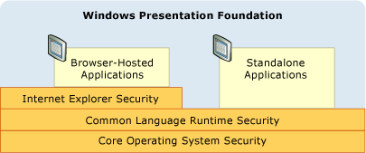
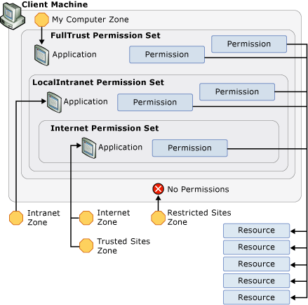

# WPF Security Strategy - Platform Security
While Windows Presentation Foundation (WPF) provides a variety of security services, it also leverages the security features of the underlying platform, which includes the operating system, the CLR, and Internet Explorer. These layers combine to provide [!INCLUDE[TLA2#tla_wpf](../../../includes/tla2sharptla-wpf-md.md)] a strong, defense-in-depth security model that attempts to avoid any single point of failure, as shown in the following figure:  
  
   
  
 The remainder of this topic discusses the features in each of these layers that pertain to [!INCLUDE[TLA2#tla_wpf](../../../includes/tla2sharptla-wpf-md.md)] specifically.  

   
## Operating System Security  
The core of Windows provides several security features that form the security foundation for all Windows applications, including those built with WPF. This topic discusses the breadth of these security features that are important to WPF, as well as how WPF integrates with them to provide further defense-in-depth.  
  
   
### Microsoft Windows XP Service Pack 2 (SP2)  
 In addition to a general review and strengthening of Windows, there are three key features from [!INCLUDE[TLA2#tla_winxpsp2](../../../includes/tla2sharptla-winxpsp2-md.md)] that we will discuss in this topic:  
  
- /GS compilation  
  
- [!INCLUDE[TLA#tla_win_update](../../../includes/tlasharptla-win-update-md.md)].  
  
#### /GS Compilation  
 [!INCLUDE[TLA2#tla_winxpsp2](../../../includes/tla2sharptla-winxpsp2-md.md)] provides protection by recompiling many core system libraries, including all of the [!INCLUDE[TLA2#tla_wpf](../../../includes/tla2sharptla-wpf-md.md)] dependencies such as the CLR, to help mitigate buffer overruns. This is achieved by using the /GS parameter with the C/C++ command-line compiler. Although buffer overruns should be explicitly avoided, /GS compilation provides an example of a defense-in-depth against potential vulnerabilities that are inadvertently or maliciously created by them.  
  
 Historically, buffer overruns have been the cause of many high-impact security exploits. A buffer overrun occurs when an attacker takes advantage of a code vulnerability that allows the injection of malicious code that writes past the boundaries of a buffer. This then allows an attacker to hijack the process in which the code is executing by overwriting the return address of a function to cause the execution of the attacker's code. The result is malicious code that executes arbitrary code with the same privileges as the hijacked process.  
  
 At a high level, the /GS compiler flag protects against some potential buffer overruns by injecting a special security cookie to protect the return address of a function that has local string buffers. After a function returns, the security cookie is compared with its previous value. If the value has changed, a buffer overrun may have occurred and the process is stopped with an error condition. Stopping the process prevents the execution of potentially malicious code. See [-GS (Buffer Security Check)](/cpp/build/reference/gs-buffer-security-check) for more details.  
  
 [!INCLUDE[TLA2#tla_wpf](../../../includes/tla2sharptla-wpf-md.md)] is compiled with the /GS flag to add yet another layer of defense to [!INCLUDE[TLA2#tla_wpf](../../../includes/tla2sharptla-wpf-md.md)] applications.  
  
#### Microsoft Windows Update Enhancements  
 [!INCLUDE[TLA#tla_win_update](../../../includes/tlasharptla-win-update-md.md)] was also improved in [!INCLUDE[TLA2#tla_winxpsp2](../../../includes/tla2sharptla-winxpsp2-md.md)] to simplify the process for downloading and installing updates. These changes significantly enhance security for [!INCLUDE[TLA2#tla_wpf](../../../includes/tla2sharptla-wpf-md.md)] customers by helping to ensure that their systems are up-to-date, particularly with respect to security updates.  
  
   
### Windows Vista  
WPF users on Windows Vista will benefit from the operating system's additional security enhancements, including "Least-Privilege User Access", code integrity checks, and privilege isolation.  
  
#### User Account Control (UAC)  
 Today, Windows users tend to run with administrator privileges because many applications require them for either installation or execution, or both. Being able to write default application settings to the Registry is one example.  
  
 Running with administrator privileges really means that applications execute from processes that are granted administrator privileges. The security impact of this is that any malicious code that hijacks a process running with administrator privileges will automatically inherit those privileges, including access to critical system resources.  
  
 One way to protect against this security threat is to run applications with the least amount of privileges that are required. This is known as the principle of least privilege, and is a core feature of the Windows operating system. This feature is called User Account Control (UAC), and is used by Windows UAC in two key ways:  
  
- To run most applications with UAC privileges by default, even if the user is an administrator; only applications that need administrator privileges will run with administrator privileges. To run with administrative privileges, applications must be explicitly marked in either their application manifest or as an entry in security policy.  
  
- To provide compatibility solutions like virtualization. For example, many applications try to write to restricted locations like C:\Program Files. For applications executing under UAC, an alternative per-user location exists that does not require administrator privileges to write to. For applications running under UAC, UAC virtualizes C:\Program Files so that applications who think they are writing to it are actually writing to the alternative, per-user location. This kind of compatibility work enables the operating system to run many applications that couldn't previously run in UAC.  
  
#### Code Integrity Checks  
 Windows Vista incorporates deeper code integrity checks to help prevent malicious code from being injected into system files or into the kernel at load/run time. This goes beyond system file protection.  
  
   
### Limited Rights Process for Browser-Hosted Applications  
 Browser-hosted [!INCLUDE[TLA2#tla_wpf](../../../includes/tla2sharptla-wpf-md.md)] applications execute within the Internet zone sandbox. [!INCLUDE[TLA2#tla_wpf](../../../includes/tla2sharptla-wpf-md.md)] integration with Microsoft Internet Explorer extends this protection with additional support.  
  
 Since [!INCLUDE[TLA#tla_winfxwebapp#plural](../../../includes/tlasharptla-winfxwebappsharpplural-md.md)] are generally sandboxed by the Internet zone permission set, removing these privileges does not harm [!INCLUDE[TLA#tla_winfxwebapp#plural](../../../includes/tlasharptla-winfxwebappsharpplural-md.md)] from a compatibility perspective. Instead, an additional defense-in-depth layer is created; if a sandboxed application is able to exploit other layers and hijack the process, the process will still only have limited privileges.  
  
 See [Using a Least-Privileged User Account](https://docs.microsoft.com/previous-versions/tn-archive/cc700846%28v=technet.10%29).  
  
   
## Common Language Runtime Security  
 The common language runtime (CLR) offers a number of key security benefits that include validation and verification, Code Access Security (CAS), and the Security Critical Methodology.  
  
   
### Validation and Verification  
 To provide assembly isolation and integrity, the CLR uses a process of validation. CLR validation ensures that assemblies are isolated by validating their Portable Executable (PE) file format for addresses that point outside the assembly. CLR validation also validates the integrity of the metadata that is embedded within an assembly.  
  
 To ensure type safety, help prevent common security issues (e.g. buffer overruns), and enable sandboxing through sub-process isolation, CLR security uses the concept of verification.  
  
 Managed applications are compiled into Microsoft Intermediate Language (MSIL). When methods in a managed application are executed, its MSIL is compiled into native code through Just-In-Time (JIT) compilation. JIT compilation includes a verification process that applies many safety and robustness rules that ensure code does not:  
  
- Violate type contracts  
  
- Introduce buffer overruns  
  
- Wildly access memory.  
  
 Managed code that does not conform to verification rules is not allowed to execute, unless it is considered trusted code.  
  
 The advantage of verifiable code is a key reason why [!INCLUDE[TLA2#tla_wpf](../../../includes/tla2sharptla-wpf-md.md)] builds on the .NET Framework. To the extent that verifiable code is used, the possibility of exploiting possible vulnerabilities is greatly lowered.  
  
   
### Code Access Security  
 A client machine exposes a wide variety of resources that a managed application can have access to, including the file system, the Registry, printing services, the user interface, reflection, and environment variables. Before a managed application can access any of the resources on a client machine, it must have .NET Framework permission to do so. A permission in CAS is a subclass of the <xref:System.Security.CodeAccessPermission>; CAS implements one subclass for each resource that managed applications can access.  
  
 The set of permissions that a managed application is granted by CAS when it starts executing is known as a permission set and is determined by evidence provided by the application. For [!INCLUDE[TLA2#tla_wpf](../../../includes/tla2sharptla-wpf-md.md)] applications, the evidence that is provided is the location, or zone, from which the applications are launched. CAS identifies the following zones:  
  
- **My Computer**. Applications launched from the client machine (Fully Trusted).  
  
- **Local Intranet**. Applications launched from the intranet. (Somewhat Trusted).  
  
- **Internet**. Applications launched from the Internet. (Least Trusted).  
  
- **Trusted Sites**. Applications identified by a user as being trusted. (Least Trusted).  
  
- **Untrusted Sites**. Applications identified by a user as being untrusted. (Untrusted).  
  
 For each of these zones, CAS provides a predefined permission set that includes the permissions which matches the level of trust associated with each. These include:  
  
- **FullTrust**. For applications launched from the **My Computer** zone. All possible permissions are granted.  
  
- **LocalIntranet**. For applications launched from the **Local Intranet** zone. A subset of permissions are granted to provide moderate access to a client machine’s resources, including isolated storage, unrestricted UI access, unrestricted file dialogs, limited reflection, limited access to environment variables. Permissions for critical resources like the Registry are not provided.  
  
- **Internet**. For applications launched from the **Internet** or **Trusted Sites** zone. A subset of permissions are granted to provided limited access to a client machine’s resources, including isolated storage, file open only, and limited UI. Essentially, this permission set isolates applications from the client machine.  
  
 Applications identified as being from the **Untrusted Sites** zone are granted no permissions by CAS at all. Consequently, a predefined permission set does not exist for them.  
  
 The following figure illustrates the relationship between zones, permission sets, permissions, and resources:  
  
   
  
 The restrictions of the Internet zone security sandbox apply equally to any code that an XBAP imports from a system library, including [!INCLUDE[TLA2#tla_wpf](../../../includes/tla2sharptla-wpf-md.md)]. This ensures that every bit of the code is locked down, even [!INCLUDE[TLA2#tla_wpf](../../../includes/tla2sharptla-wpf-md.md)]. Unfortunately, to be able to execute, an XBAP needs to execute functionality that requires more permissions than those enabled by the Internet zone security sandbox.  
  
 Consider an XBAP application that includes the following page:  
  
 [!code-csharp[WPFPlatformSecuritySnippets#Permission](~/samples/snippets/csharp/VS_Snippets_Wpf/WPFPlatformSecuritySnippets/CSharp/Page1.xaml.cs#permission)]
 [!code-vb[WPFPlatformSecuritySnippets#Permission](~/samples/snippets/visualbasic/VS_Snippets_Wpf/WPFPlatformSecuritySnippets/VisualBasic/Page1.xaml.vb#permission)]  
  
 To execute this XBAP, the underlying [!INCLUDE[TLA2#tla_wpf](../../../includes/tla2sharptla-wpf-md.md)] code must execute more functionality than is available to the calling XBAP, including:  
  
- Creating a window handle (HWND) for rendering  
  
- Dispatching messages  
  
- Loading the Tahoma font  
  
 From a security point of view, allowing direct access to any of these operations from the sandboxed application would be catastrophic.  
  
 Fortunately, [!INCLUDE[TLA2#tla_wpf](../../../includes/tla2sharptla-wpf-md.md)] caters to this situation by allowing these operations to execute with elevated privileges on behalf of the sandboxed application. While all [!INCLUDE[TLA2#tla_wpf](../../../includes/tla2sharptla-wpf-md.md)] operations are checked against the limited Internet zone security permissions of the application domain of the XBAP, [!INCLUDE[TLA2#tla_wpf](../../../includes/tla2sharptla-wpf-md.md)] (as with other system libraries) is granted a permission set that includes all possible permissions.
  
 This requires that [!INCLUDE[TLA2#tla_wpf](../../../includes/tla2sharptla-wpf-md.md)] receives elevated privileges while preventing those privileges from being governed by the Internet zone permission set of the host application domain.  
  
 [!INCLUDE[TLA2#tla_wpf](../../../includes/tla2sharptla-wpf-md.md)] does this by using the **Assert** method of a permission. The following code shows how this happens.  
  
 [!code-csharp[WPFPlatformSecuritySnippets#Permission](~/samples/snippets/csharp/VS_Snippets_Wpf/WPFPlatformSecuritySnippets/CSharp/Page1.xaml.cs#permission)]
 [!code-vb[WPFPlatformSecuritySnippets#Permission](~/samples/snippets/visualbasic/VS_Snippets_Wpf/WPFPlatformSecuritySnippets/VisualBasic/Page1.xaml.vb#permission)]  
  
 The **Assert** essentially prevents the unlimited permissions required by [!INCLUDE[TLA2#tla_wpf](../../../includes/tla2sharptla-wpf-md.md)] from being restricted by the Internet zone permissions of the XBAP.  
  
 From a platform perspective, [!INCLUDE[TLA2#tla_wpf](../../../includes/tla2sharptla-wpf-md.md)] is responsible for using **Assert** correctly; an incorrect use of **Assert** could enable malicious code to elevate privileges. Consequently, it is important then to only call **Assert** when needed, and to ensure that sandbox restrictions remain intact. For example, sandboxed code is not allowed to open random files, but it is allowed to use fonts. [!INCLUDE[TLA2#tla_wpf](../../../includes/tla2sharptla-wpf-md.md)] enables sandboxed applications to use font functionality by calling **Assert**, and for [!INCLUDE[TLA2#tla_wpf](../../../includes/tla2sharptla-wpf-md.md)] to read files known to contain those fonts on behalf of the sandboxed application.  
  
   
### ClickOnce Deployment  
 ClickOnce is a comprehensive deployment technology that is included with .NET Framework, and integrates with [!INCLUDE[TLA#tla_visualstu](../../../includes/tlasharptla-visualstu-md.md)] (see [ClickOnce security and deployment](/visualstudio/deployment/clickonce-security-and-deployment) for detailed information). Standalone [!INCLUDE[TLA2#tla_wpf](../../../includes/tla2sharptla-wpf-md.md)] applications can be deployed using ClickOnce, while browser-hosted applications must be deployed with ClickOnce.  
  
 Applications deployed using ClickOnce are given an additional security layer over Code Access Security (CAS); essentially, ClickOnce deployed applications request the permissions that they need. They are granted only those permissions if they do not exceed the set of permissions for the zone from which the application is deployed. By reducing the set of permissions to only those that are needed, even if they are less than those provided by the launch zone's permission set, the number of resources that the application has access to is reduced to a bare minimum. Consequently, if the application is hijacked, the potential for damage to the client machine is reduced.  
  
   
### Security-Critical Methodology  
 The [!INCLUDE[TLA2#tla_wpf](../../../includes/tla2sharptla-wpf-md.md)] code that uses permissions to enable the Internet zone sandbox for XBAP applications must be held to highest possible degree of security audit and control. To facilitate this requirement, .NET Framework provides new support for managing code that elevates privilege. Specifically, the CLR enables you to identify code that elevates privilege and mark it with the <xref:System.Security.SecurityCriticalAttribute>; any code not marked with <xref:System.Security.SecurityCriticalAttribute> becomes *transparent* using this methodology. Conversely, managed code that is not marked with <xref:System.Security.SecurityCriticalAttribute> is prevented from elevating privilege.  
  
 The Security-Critical Methodology allows the organization of [!INCLUDE[TLA2#tla_wpf](../../../includes/tla2sharptla-wpf-md.md)] code that elevates privilege into *security-critical kernel*, with the remainder being transparent. Isolating the security-critical code enables the [!INCLUDE[TLA2#tla_wpf](../../../includes/tla2sharptla-wpf-md.md)] engineering team focus an additional security analysis and source control on the security-critical kernel above and beyond standard security practices (see [WPF Security Strategy - Security Engineering](wpf-security-strategy-security-engineering.md)).  
  
 Note that .NET Framework permits trusted code to extend the XBAP Internet zone sandbox by allowing developers to write managed assemblies that are marked with <xref:System.Security.AllowPartiallyTrustedCallersAttribute> (APTCA) and deployed to the user's Global Assembly Cache (GAC). Marking an assembly with APTCA is a highly sensitive security operation as it allows any code to call that assembly, including malicious code from the Internet. Extreme caution and best practices must be used when doing this and users must choose to trust that software in order for it to be installed.  
  
   
## Microsoft Internet Explorer Security  
 Beyond reducing security issues and simplifying security configuration, Microsoft Internet Explorer 6 (SP2) contains several features that security improvements that enhance security for users of [!INCLUDE[TLA#tla_winfxwebapp#plural](../../../includes/tlasharptla-winfxwebappsharpplural-md.md)]. The thrust of these features attempts to allow users greater control over their browsing experience.  
  
 Prior to IE6 SP2, users could be subject to any of the following:  
  
- Random popup windows.  
  
- Confusing script redirection.  
  
- Numerous security dialogs on some Web sites.  
  
 In some cases, untrustworthy Web sites would try to trick users by spoofing installation [!INCLUDE[TLA#tla_ui](../../../includes/tlasharptla-ui-md.md)] or repeatedly showing a Microsoft ActiveX installation dialog box, even though the user may have canceled it. Using these techniques, it is possible that a significant number of users have been tricked into making poor decisions that resulted with the installation of spyware applications.  
  
 IE6 SP2 includes several features to mitigate these types of issues, which revolve around the concept of user initiation. IE6 SP2 detects when a user has clicked on a link or page element prior to an action, which is known as *user initiation*, and treats it differently than when a similar action is instead triggered by the script on a page. As an example, IE6 SP2 incorporates a **Pop-Up Blocker** that detects when a user clicks a button prior to the page creating a pop-up. This enables IE6 SP2 to allow most innocuous pop-ups while preventing pop-ups that users neither ask for nor want. Blocked pop-ups are trapped under the new **Information Bar**, which allows the user to manually override the block and view the pop-up.  
  
 The same user-initiation logic is also applied to **Open**/**Save** security prompts. ActiveX installation dialog boxes are always trapped under the Information Bar unless they represent an upgrade from a previously installed control. These measures combine to give users a safer, more controlled user experience since they are protected against sites which harass them to install either unwanted or malicious software.  
  
 These features also protect customers who use IE6 SP2 to browse to web sites that allow them to download and install [!INCLUDE[TLA2#tla_wpf](../../../includes/tla2sharptla-wpf-md.md)] applications. In particular, this is because IE6 SP2 offers a better user experience that reduces the chance for users to install malicious or devious applications irrespective of what technology was used to build it, including [!INCLUDE[TLA2#tla_wpf](../../../includes/tla2sharptla-wpf-md.md)]. [!INCLUDE[TLA2#tla_wpf](../../../includes/tla2sharptla-wpf-md.md)] adds to these protections by using ClickOnce to facilitate downloading of its applications over the Internet. Since [!INCLUDE[TLA#tla_winfxwebapp#plural](../../../includes/tlasharptla-winfxwebappsharpplural-md.md)] execute within an Internet zone security sandbox, they can be seamlessly launched. On the other hand, standalone [!INCLUDE[TLA2#tla_wpf](../../../includes/tla2sharptla-wpf-md.md)] applications require full trust to execute. For these applications, ClickOnce will display a security dialog box during the launch process to notify the use of the application's additional security requirements. However, this must be user-initiated, will also be governed by user initiated logic, and can be canceled.  
  
 Internet Explorer 7 incorporates and extends the security capabilities of IE6 SP2 as part of an ongoing commitment to security.  
  
## See also

- [Code Access Security](../misc/code-access-security.md)
- [Security](security-wpf.md)
- [WPF Partial Trust Security](wpf-partial-trust-security.md)
- [WPF Security Strategy - Security Engineering](wpf-security-strategy-security-engineering.md)
