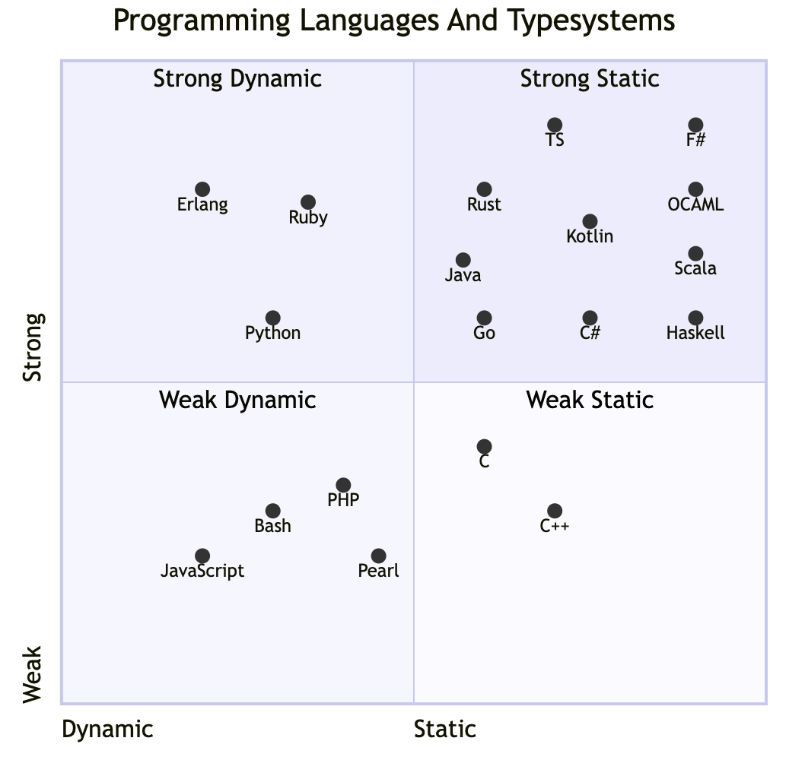

# Language Comparisons

Here is a quick table comparing F# with some commonly known programming languages:

| Language   | Compile Time Types | Runtime Types | Type Signature | Type Inference        | Interactive REPL | LOC Estimate | Memory Management   | Native Code     |
|------------|--------------------|---------------|----------------|-----------------------|-------------------|--------------|---------------------|-----------------|
| Java       | true               | Weak          | mandatory      | Manual Annotation     | false             | More         | GC                  | AOT             |
| Python     | false               | Strong        | __             | __                    | true              | Less         | GC                  | Not Supported   |
| JavaScript | false              | Weak          | __             | __                    | true              | Less         | GC                  | Not Supported   |
| F#         | true               | Strong        | optional       | Automatic Annotation  | true              | Less         | GC                  | AOT             |

Find out how the `F#` programming language compares to other relevant programming languages:

* [Python](python.md)
* [Javascript](javascript.md)
* [Java](java.md)
