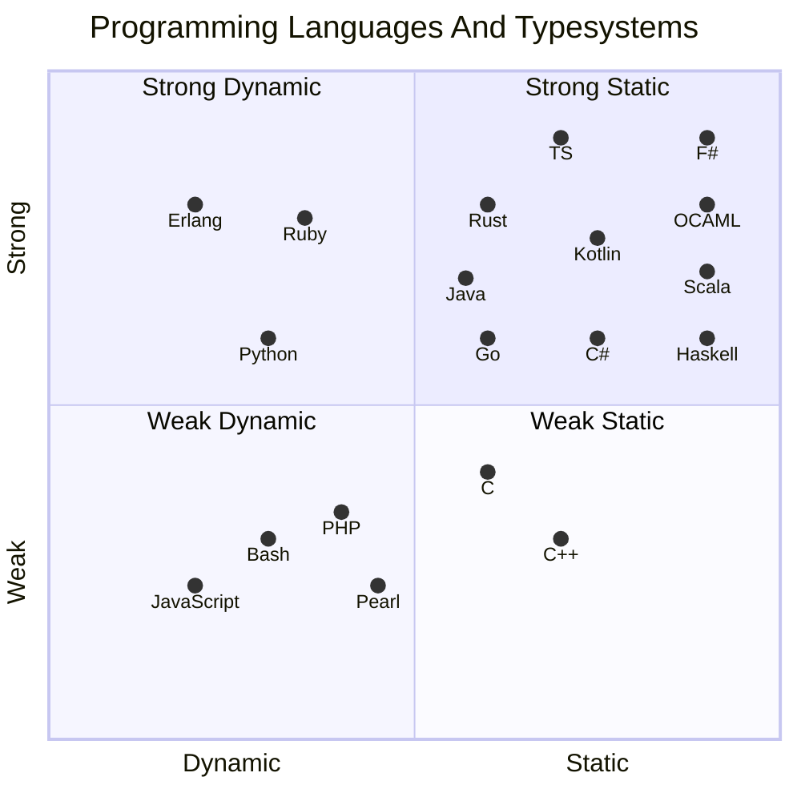

```mermaid
quadrantChart
    title Programming Languages And Typesystems
    x-axis Dynamic --> Static
    y-axis Weak --> Strong
    quadrant-1 Strong Static
    quadrant-2 Strong Dynamic
    quadrant-3 Weak Dynamic
    quadrant-4 Weak Static
    Python: [0.3, 0.6]
    Erlang: [0.2, 0.8]
    Ruby: [0.35, 0.78]
    Java: [0.57, 0.69]
    Haskell: [0.9, 0.6]
    Kotlin: [0.75, 0.75]
    C#: [0.75, 0.6]
    Scala: [0.9, 0.7]
    Go: [0.6, 0.6]
    Rust: [0.6, 0.8]
    TS: [0.7, 0.9]
    OCAML: [0.9, 0.8]
    F#: [0.9, 0.9]
    C: [0.6, 0.4]
    C++: [0.7, 0.3]
    PHP: [0.40, 0.34]
    Pearl: [0.45, 0.23]
    JavaScript: [0.2, 0.23]
    Bash: [0.3, 0.3]
```
