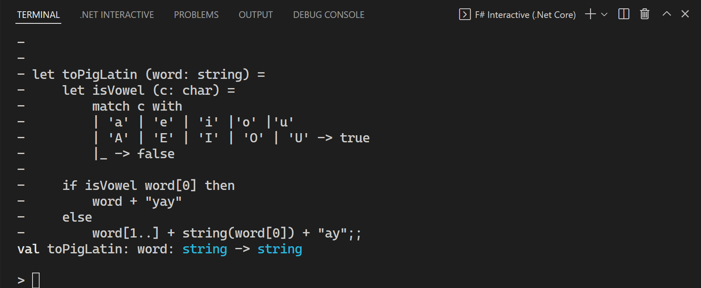

# Get Started with F# in Visual Studio Code

You can write F# in [Visual Studio Code](https://code.visualstudio.com) with the [Ionide plugin](https://marketplace.visualstudio.com/items?itemName=Ionide.Ionide-fsharp) to get a great cross-platform, lightweight Integrated Development Environment (IDE) experience with IntelliSense and code refactorings. Visit [Ionide.io](https://ionide.io) to learn more about the plugin.

To begin, ensure that you have [F# and the Ionide plugin correctly installed](install-fsharp.md#install-f-with-visual-studio-code).

## Create your first project with Ionide

To create a new F# project, open a command line and create a new project with the .NET CLI:

```dotnetcli
dotnet new console -lang "F#" -o FirstIonideProject
```

Once it completes, change directory to the project and open Visual Studio Code:

```console
cd FirstIonideProject
code .
```

After the project loads on Visual Studio Code, you should see the F# Solution Explorer pane on the left-hand side of your window open. This means Ionide has successfully loaded the project you just created. You can write code in the editor before this point in time, but once this happens, everything has finished loading.

### Write your first script

Once you've configured Visual Studio Code to use .NET Core scripting, navigate to the Explorer view in Visual Studio Code and create a new file. Name it *MyFirstScript.fsx*.

Now add the following code to it:

[!code-fsharp[ToPigLatin](~/samples/snippets/fsharp/getting-started/to-pig-latin.fsx)]

This function converts a word to a form of [Pig Latin](https://en.wikipedia.org/wiki/Pig_Latin). The next step is to evaluate it using F# Interactive (FSI).

Highlight the entire function (it should be 11 lines long). Once it's highlighted, hold the **Alt** key and hit **Enter**. You'll notice a terminal window pop up on the bottom of the screen, and it should look similar to this:



This did three things:

1. It started the FSI process.
2. It sent the code you highlighted over the FSI process.
3. The FSI process evaluated the code you sent over.

Because what you sent over was a [function](../language-reference/functions/index.md), you can now call that function with FSI! In the interactive window, type the following:

```fsharp
toPigLatin "banana";;
```

You should see the following result:

```fsharp
val it: string = "ananabay"
```

Now, let's try with a vowel as the first letter. Enter the following:

```fsharp
toPigLatin "apple";;
```

You should see the following result:

```fsharp
val it: string = "appleyay"
```

The function appears to be working as expected. Congratulations, you just wrote your first F# function in Visual Studio Code and evaluated it with FSI!

> [!NOTE]
> As you may have noticed, the lines in FSI are terminated with `;;`. This is because FSI allows you to enter multiple lines. The `;;` at the end lets FSI know when the code is finished.

## Explaining the code

If you're not sure about what the code is actually doing, here's a step-by-step.

As you can see, `toPigLatin` is a function that takes a word as its input and converts it to a Pig-Latin representation of that word. The rules for this are as follows:

If the first character in a word starts with a vowel, add "yay" to the end of the word. If it doesn't start with a vowel, move that first character to the end of the word and add "ay" to it.

You may have noticed the following in FSI:

```fsharp
val toPigLatin: word: string -> string
```

This states that `toPigLatin` is a function that takes in a `string` as input (called `word`), and returns another `string`. This is known as the [type signature of the function](https://fsharpforfunandprofit.com/posts/function-signatures/), a fundamental piece of F# that's key to understanding F# code. You'll also notice this if you hover over the function in Visual Studio Code.

In the body of the function, you'll notice two distinct parts:

1. An inner function, called `isVowel`, that determines if a given character (`c`) is a vowel by checking if it matches one of the provided patterns via [Pattern Matching](../language-reference/pattern-matching.md):

   [!code-fsharp[ToPigLatin](~/samples/snippets/fsharp/getting-started/to-pig-latin.fsx#L2-L6)]

2. An [`if..then..else`](../language-reference/conditional-expressions-if-then-else.md) expression that checks if the first character is a vowel, and constructs a return value out of the input characters based on if the first character was a vowel or not:

   [!code-fsharp[ToPigLatin](~/samples/snippets/fsharp/getting-started/to-pig-latin.fsx#L8-L11)]

The flow of `toPigLatin` is thus:

Check if the first character of the input word is a vowel. If it is, attach "yay" to the end of the word. Otherwise, move that first character to the end of the word and add "ay" to it.

There's one final thing to notice about this: in F#, there's no explicit instruction to return from the function. This is because F# is expression-based, and the last expression evaluated in the body of a function determines the return value of that function. Because `if..then..else` is itself an expression, evaluation of the body of the `then` block or the body of the `else` block determines the value returned by the `toPigLatin` function.

## Turn the console app into a Pig Latin generator

The previous sections in this article demonstrated a common first step in writing F# code: writing an initial function and executing it interactively with FSI. This is known as REPL-driven development, where [REPL](https://en.wikipedia.org/wiki/Read%E2%80%93eval%E2%80%93print_loop) stands for "Read-Evaluate-Print Loop". It's a great way to experiment with functionality until you have something working.

The next step in REPL-driven development is to move working code into an F# implementation file. It can then be compiled by the F# compiler into an assembly that can be executed.

To begin, open the *Program.fs* file that you created earlier with the .NET CLI. You'll notice that some code is already in there.

Next, create a new [`module`](../language-reference/modules.md) called `PigLatin` and copy the `toPigLatin` function you created earlier into it as such:

[!code-fsharp[ToPigLatin](~/samples/snippets/fsharp/getting-started/pig-latin.fs#L3-L14)]

This module should be above the `main` function and below the `open System` declaration. Order of declarations matters in F#, so you'll need to define the function before you call it in a file.

Now, in the `main` function, call your Pig Latin generator function on the arguments:

```fsharp
[<EntryPoint>]
let main args =
    for arg in args do
        let newArg = PigLatin.toPigLatin arg
        printfn "%s in Pig Latin is: %s" arg newArg

    0
```

Now you can run your console app from the command line:

```dotnetcli
dotnet run apple banana
```

And you'll see that it outputs the same result as your script file, but this time as a running program!

## Troubleshooting Ionide

Here are a few ways you can troubleshoot certain problems that you might run into:

1. To get the code editing features of Ionide, your F# files need to be saved to disk and inside of a folder that is open in the Visual Studio Code workspace.
1. If you've made changes to your system or installed Ionide prerequisites with Visual Studio Code open, restart Visual Studio Code.
1. If you have invalid characters in your project directories, Ionide might not work.  Rename your project directories if this is the case.
1. If none of the Ionide commands are working, check your [Visual Studio Code Key Bindings](https://code.visualstudio.com/docs/getstarted/keybindings#_advanced-customization) to see if you're overriding them by accident.
1. If Ionide is broken on your machine and none of the above has fixed your problem, try removing the `ionide-fsharp` directory on your machine and reinstall the plugin suite.
1. If a project failed to load (the F# Solution Explorer will show this), right-click on that project and click **See details** to get more diagnostic info.

Ionide is an open-source project built and maintained by members of the F# community. Report issues and feel free to contribute at the [ionide-vscode-fsharp GitHub repository](https://github.com/ionide/ionide-vscode-fsharp).

You can also ask for further help from the Ionide developers and F# community in the [Ionide Gitter channel](https://gitter.im/ionide/ionide-project).

## Next steps

To learn more about F# and the features of the language, check out [Tour of F#](../tour.md).
