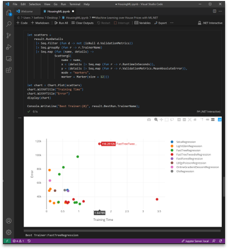

# F# notebooks

F# is well suited to notebook programming because of its ordered declarations and scripting constructs.

[.NET Interactive](https://github.com/dotnet/interactive/#net-interactive-) F# notebooks can be used with [Jupyter](https://github.com/dotnet/interactive/#jupyter-and-nteract), [Visual Studio Code](https://github.com/dotnet/interactive#notebooks-with-net), and [Visual Studio](https://marketplace.visualstudio.com/items?itemName=MLNET.notebook).

## See also

- [Machine Learning with F#](../scenarios/machine-learning.md)
- [.NET Interactive](https://github.com/dotnet/interactive/)
- [A Guide to Data Access with F#](https://fsharp.org/guides/data-access/)
- [A Guide to Data Science with F#](https://fsharp.org/guides/data-science/)
