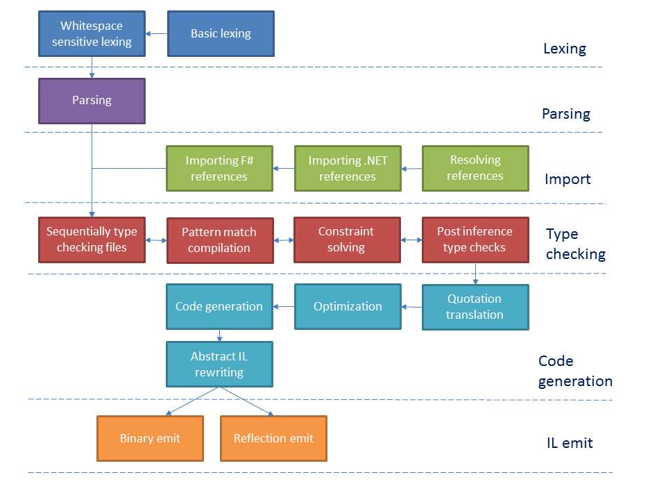

# F# compiler guide

This guide discusses the F# compiler source code and implementation from a technical point of view. The source code for the F# compiler and tools can be found at [`dotnet/fsharp` on GitHub](https://github.com/dotnet/fsharp).

## Overview

There are several artifacts involved in the development of F#:

* The [F# compiler library](https://github.com/dotnet/fsharp/tree/master/src/fsharp/FSharp.Compiler.Private), called `FSharp.Compiler.Private`. Contains all logic for F# compilation - including parsing, syntax tree processing, typechecking, constraint solving, optimizations, IL importing, IL writing, pretty printing of F# constructs, and F# metadata format processing - and the F# compiler APIs for tooling.

* The [F# compiler executable](https://github.com/dotnet/fsharp/tree/master/src/fsharp/fsc), called `fsc`, which is called as a console app. It sets the .NET GC into batch mode and then invokes `FSharp.Compiler.Private` with command-line arguments.

* The [F# Core Library](https://github.com/dotnet/fsharp/tree/master/src/fsharp/FSharp.Core), called `FSharp.Core`. Contains all primitive F# types and logic for how they interact, core data structures and library functions for operating on them, structured printing logic, units of measure for scientific programming, core numeric functionality, F# quotations, F# type reflection logic, and asynchronous programming types and logic.

* The [F# Interactive tool](https://github.com/dotnet/fsharp/tree/master/src/fsharp/fsi), called `fsi`. A REPL for F# that supports execution and pretty-printing of F# code and results, loading F# script files, referencing assemblies, and referencing packages from NuGet.

* The [F# Compiler Service](https://github.com/dotnet/fsharp/tree/master/fcs), called `FSharp.Compiler.Service` or abbreviated to FCS. It is mostly identical to `FSharp.Compiler.Private`, but critically contains the "Expression API" that allows other environments to inspect and operate on type-checked F# expressions (such as transpiling F# code to a different runtime target).

The `FSharp.Compiler.Private` is by far the largest of these components and contains nearly all logic that `fsc` and `fsi` use. It is the primary subject of this guide.

The F# compiler repositories are used to produce a range of different artifacts.  For the purposes of this
guide, the important ones are:

### Key data formats and representations

The following are the key data formats and internal data representations of the F# compiler code in its various configurations:

* _Input source files_  Read as Unicode text, or binary for referenced assemblies.

* _Input command-line arguments_  See [CompileOptions.fs](https://github.com/dotnet/fsharp/blob/master/src/fsharp/CompileOptions.fs) for the full code implementing the arguments table. Command-line arguments are also accepted by the F# Compiler Service API in project specifications, and as optional input to F# Interactive.

* _Tokens_, see [pars.fsy](https://github.com/dotnet/fsharp/blob/master/src/fsharp/pars.fsy), [lex.fsl](https://github.com/dotnet/fsharp/blob/master/src/fsharp/lex.fsl), [lexhelp.fs](https://github.com/dotnet/fsharp/blob/master/src/fsharp/lexhelp.fs) and related files.

* _Abstract Syntax Tree (AST)_, see [SyntaxTree.fs](https://github.com/dotnet/fsharp/blob/master/src/fsharp/SyntaxTree.fs), the untyped syntax tree resulting from parsing.

* _Typed Abstract Syntax Tree (TAST)_, see [TypedTree.fs](https://github.com/dotnet/fsharp/blob/master/src/fsharp/TypedTree.fs), [TypedTreeBasics.fs](https://github.com/dotnet/fsharp/blob/master/src/fsharp/TypedTree.fs), [TypedTreeOps.fs](https://github.com/dotnet/fsharp/blob/master/src/fsharp/TypedTreeOps.fs), and related files. The typed, bound syntax tree including both type/module definitions and their backing expressions, resulting from type checking and the subject of successive phases of optimization and representation change.

* _Type checking context/state_, see for example [`TcState` in CompileOps.fs](https://github.com/dotnet/fsharp/blob/master/src/fsharp/CompileOps.fsi) and its constituent parts, particularly `TcEnv` in [TypeChecker.fs](https://github.com/dotnet/fsharp/blob/master/src/fsharp/TypeChecker.fsi) and `NameResolutionEnv` in [NameResolution.fs](https://github.com/dotnet/fsharp/blob/master/src/fsharp/NameResolution.fsi). A set of tables representing the available names, assemblies etc. in scope during type checking, plus associated information.

* _Abstract IL_, the output of code generation, then used for binary generation, and the input format when reading .NET assemblies, see [`ILModuleDef` in il.fs](https://github.com/dotnet/fsharp/blob/master/src/absil/il.fsi).

* _The .NET Binary format_ (with added "pickled" F# Metadata resource), the final output of fsc.exe, see the ECMA 335 specification and the [ilread.fs](https://github.com/dotnet/fsharp/blob/master/src/absil/ilread.fs) and [ilwrite.fs](https://github.com/dotnet/fsharp/blob/master/src/absil/ilwrite.fs) binary reader/generator implementations. The added F# metadata is stored in a binary resource, see [TypedTreePickle.fs](https://github.com/dotnet/fsharp/blob/master/src/fsharp/TypedTreePickle.fs).

* _The incrementally emitted .NET reflection assembly,_ the incremental output of fsi.exe. See [ilreflect.fs](https://github.com/dotnet/fsharp/blob/master/src/absil/ilreflect.fs).

* The incremental project build engine state in [IncrementalBuild.fsi](https://github.com/fsharp/FSharp.Compiler.Service/tree/master/src/fsharp/service/IncrementalBuild.fsi)/[IncrementalBuild.fs](https://github.com/fsharp/FSharp.Compiler.Service/tree/master/src/fsharp/service/IncrementalBuild.fs), a part of the F# Compiler Service API.

* The corresponding APIs wrapping and accessing these structures in the public-facing [`FSharp.Compiler.Service` API](https://github.com/dotnet/fsharp/tree/master/src/fsharp/service) and [Symbol API](https://github.com/dotnet/fsharp/tree/master/src/fsharp/symbols).

TODO CLEAN THESE UP

* The [F# Compiler Service Operations Queue](fsharp-compiler-service-queue.md), covered in the compiler service documentation (note: An older version of this functionality persists internally in the Microsoft\visualfsharp repository for the Visual F# Tools)

* The [F# Compiler Service Caches](fsharp-compiler-service-caches.md), covered in the compiler service documentation (note: An older version of this functionality persists internally in the Microsoft\visualfsharp repository for the Visual F# Tools)

END TODO

### Key compiler phases

The following is a diagram of how different phases of F# compiler work:



The following are the key phases and high-level logical operations of the F# compiler code in its various configurations:

* _Basic lexing_.  Produces a token stream from input source file text.

* _White-space sensitive lexing_.  Accepts and produces a token stream, augmenting per the F# Language Specification.

* _Parsing_. Accepts a token stream and produces an AST per the grammar in the F# Language Specification.

* _Resolving references_. See [ReferenceResolver.fs](https://github.com/dotnet/fsharp/blob/master/src/fsharp/ReferenceResolver.fs) for the abstract definition of compiler reference resolution. See [LegacyMSBuildReferenceResolver.fs](https://github.com/dotnet/fsharp/blob/master/src/fsharp/LegacyMSBuildReferenceResolver.fs) for reference resolution used by the .NET Framework F# compiler when running on .NET Framework. See [SimulatedMSBuildReferenceResolver.fs](https://github.com/dotnet/fsharp/blob/master/src/fsharp/SimulatedMSBuildReferenceResolver.fs) when not using the .NET Framework F# compiler. See [Microsoft.DotNet.DependencyManager](https://github.com/dotnet/fsharp/tree/master/src/fsharp/Microsoft.DotNet.DependencyManager) for reference resolution and package management used in `fsi`.

* _Importing referenced .NET binaries_, see [import.fsi](https://github.com/dotnet/fsharp/blob/master/src/fsharp/import.fsi)/[import.fs](https://github.com/dotnet/fsharp/blob/master/src/fsharp/import.fs). Accepts file references and produces a TAST node for each referenced assembly, including information about its type definitions (and type forwarders if any).

* _Importing referenced F# binaries and optimization information as TAST data structures_, see [TypedTreePickle.fs](https://github.com/dotnet/fsharp/blob/master/src/fsharp/TypedTreePickle.fs). Accepts binary data and produces  TAST nodes for each referenced assembly, including information about its type/module/function/member definitions.

* _Sequentially type checking files_, see [TypeChecker.fsi](https://github.com/dotnet/fsharp/blob/master/src/fsharp/TypeChecker.fsi)/[TypeChecker.fs](https://github.com/dotnet/fsharp/blob/master/src/fsharp/TypeChecker.fs). Accepts an AST plus a type checking context/state and produces new TAST nodes
  incorporated into an updated type checking state, plus additional TAST Expression nodes used during code generation.

* _Pattern match compilation_, see [PatternMatchCompilation.fsi](https://github.com/dotnet/fsharp/blob/master/src/fsharp/PatternMatchCompilation.fsi)/[PatternMatchCompilation.fs](https://github.com/dotnet/fsharp/blob/master/src/fsharp/PatternMatchCompilation.fs). Accepts a subset of checked TAST nodes representing F# pattern matching and produces TAST expressions implementing the pattern matching. Called during type checking as each construct involving pattern matching is processed.

* _Constraint solving_, see [ConstraintSolver.fsi](https://github.com/dotnet/fsharp/blob/master/src/fsharp/ConstraintSolver.fsi)/[ConstraintSolver.fs](https://github.com/dotnet/fsharp/blob/master/src/fsharp/ConstraintSolver.fs).A constraint solver state is maintained during type checking of a single file, and constraints are progressively asserted (i.e. added to this state). Fresh inference variables are generated and variables are eliminated (solved). Variables are also generalized at various language constructs, or explicitly declared, making them "rigid". Called during type checking as each construct is processed.

* _Post-inference type checks_, see [PostInferenceChecks.fsi](https://github.com/dotnet/fsharp/blob/master/src/fsharp/PostInferenceChecks.fsi)/[PostInferenceChecks.fs](https://github.com/dotnet/fsharp/blob/master/src/fsharp/PostInferenceChecks.fs). Called at the end of type checking/inference for each file. A range of checks that can only be enforced after type checking on a file is complete, such as analysis when using `byref<'T>` or other `IsByRefLike` structs.

* _Quotation translation_, see [QuotationTranslator.fsi](https://github.com/dotnet/fsharp/blob/master/src/fsharp/QuotationTranslator.fsi)/[QuotationTranslator.fs](https://github.com/dotnet/fsharp/blob/master/src/fsharp/QuotationTranslator.fs)/[QuotationPickler.fsi](https://github.com/dotnet/fsharp/blob/master/src/fsharp/QuotationPickler.fsi)/[QuotationPickler.fs](https://github.com/dotnet/fsharp/blob/master/src/fsharp/QuotationPickler.fs). Generates the stored information for F# quotation nodes, generated from the TAST expression structures of the F# compiler. Quotations are ultimately stored as binary data plus some added type references. "ReflectedDefinition" quotations are collected and stored in a single blob.

* _Optimization phases_, primarily the "Optimize" (peephole/inlining) and "Top Level Representation" (lambda lifting) phases,
  see [Optimizer.fsi](https://github.com/dotnet/fsharp/blob/master/src/fsharp/Optimizer.fsi)/[Optimizer.fs](https://github.com/dotnet/fsharp/blob/master/src/fsharp/Optimizer.fs) and [InnerLambdasToTopLevelFuncs.fsi](https://github.com/dotnet/fsharp/blob/master/src/fsharp/InnerLambdasToTopLevelFuncs.fsi)/[InnerLambdasToTopLevelFuncs.fs](https://github.com/dotnet/fsharp/blob/master/src/fsharp/InnerLambdasToTopLevelFuncs.fs) and [LowerCallsAndSeqs.fs](https://github.com/dotnet/fsharp/blob/master/src/fsharp/LowerCallsAndSeqs.fs). Each of these takes TAST nodes for types and expressions and either modifies the nodes in place or produces new TAST nodes. These phases are orchestrated in [CompileOptions.fs](https://github.com/dotnet/fsharp/blob/master/src/fsharp/CompileOptions.fs)

* _Code generation_, see [IlxGen.fsi](https://github.com/dotnet/fsharp/blob/master/src/fsharp/IlxGen.fsi)/[IlxGen.fs](https://github.com/dotnet/fsharp/blob/master/src/fsharp/IlxGen.fs). Accepts TAST nodes and produces Abstract IL nodes, sometimes applying optimizations.

* _Abstract IL code rewriting_, see [EraseClosures.fs](https://github.com/dotnet/fsharp/blob/master/src/ilx/EraseClosures.fs) and
  [EraseUnions.fs](https://github.com/dotnet/fsharp/blob/master/src/ilx/EraseUnions.fs). Eliminates some constructs by rewriting Abstract IL nodes.
  
* _Binary emit_, see [ilwrite.fsi](https://github.com/dotnet/fsharp/blob/master/src/absil/ilwrite.fsi)/[ilwrite.fs](https://github.com/dotnet/fsharp/blob/master/src/absil/ilwrite.fs).

* _Reflection-Emit_, see [ilreflect.fs](https://github.com/dotnet/fsharp/blob/master/src/absil/ilreflect.fs).

The above are the internal phases and transformations used to build the following:

* _The F# Compiler Service API_, see the [Symbol API](https://github.com/dotnet/fsharp/tree/master/src/fsharp/symbols) and [Service API](https://github.com/dotnet/fsharp/tree/master/src/fsharp/service)

* _The F# Interactive Shell_, see [fsi.fs](https://github.com/dotnet/fsharp/blob/master/src/fsharp/fsi/fsi.fs).

* _The F# Compiler Shell_, see [fsc.fs](https://github.com/dotnet/fsharp/blob/master/src/fsharp/fsc.fs) and [fscmain.fs](https://github.com/dotnet/fsharp/blob/master/src/fsharp/fscmain.fs).

## Coding standards and idioms

### Abbreviations

The compiler codebase uses various abbreviations. Here are some of the most common ones.

| Abbreviation             |   Meaning  |  
|:------------------------------|:-----------|
| ``ad``                | Accessor domain, meaning the permissions the accessing code has to access other constructs |
| ``amap``                | Assembly map, saying how to map IL references to F# CCUs |
| ``arg``                | Argument (parameter) |
| ``argty``                | Argument (parameter) type |
| ``arginfo``                | Argument (parameter) metadata  |
| ``ccu``                | Reference to an F# compilation unit = an F# DLL (possibly including the DLL being compiled)  |
| ``celem``               | Custom attribute element |
| ``cenv``                | Compilation environment. Means different things in different contexts, but usually a parameter for a singlecompilation state object being passed through a set of related functions in a single phase. The compilation state is often mutable. |
| ``cpath``                | Compilation path, meaning A.B.C for the overall names containing a type or module definition |
| ``css``                | Constraint solver state. |
| ``denv``                | Display Environment. Parameters guiding the formatting of types |
| ``einfo``              | An info object for an event  (whether a .NET event, an F# event or a provided event) |
| ``e``                   | Expression |
| ``env``                | Environment. Means different things in different contexts, but usually immutable state being passed and adjusted  through a set of related functions in a single phase. |
| ``finfo``              | An info object for a field (whether a .NET field or a provided field) |
| ``fref``              | A reference to an ILFieldRef Abstract IL node for a field reference. Would normally be modernized to ``ilFieldRef`` |
| ``g``                   | The TcGlobals value |
| ``id``                   | Identifier |
| ``lid``                   | Long Identifier |
| ``m``                   | A source code range marker |
| ``mimpl``               | IL interface method implementation |
| ``minfo``              | An info object for a method (whet a .NET method, an F# method or a provided method) |
| ``modul``                | a TAST structure for a namespace or F# module |
| ``pat``              | Pattern, a syntactic AST node representing part of a pattern in a pattern match |
| ``pinfo``              | An info object for a property  (whether a .NET property, an F# property or a provided property) |
| ``rfref``              | Record or class field  reference, a reference to a TAST node for a record or class field |
| ``scoref``              | The scope of a reference in IL metadata, either assembly, ``.netmodule`` or local |
| ``spat``              | Simple Pattern, a syntactic AST node representing part of a pattern in a pattern match |
| ``tau``              | A type with the "forall" nodes stripped off (i.e. the nodes which represent generic type parameters).  Comes from the notation 𝛕used in type theory  |
| ``tcref``              | Type constructor  reference (an EntityRef) |
| ``tinst``              | Type instantiation |
| ``tpenv``              | Type parameter environment, tracks the type parameters in scope during type checking |
| ``ty``, ``typ``                 |  Type, usually a TAST type |
| ``tys``, ``typs``                 |  List of types, usually TAST types |
| ``typar``                 |  Type Parameter |
| ``tyvar``                | Type Variable, usually referring to an IL type variable, the compiled form of an F# type parameter |
| ``ucref``              | Union case reference, a reference to a TAST node for a union case |
| ``vref``              | Value reference, a reference to a TAST node for a value |

| Phase Abbreviation             |   Meaning  |  
|:------------------------------|:-----------|
| ``Syn``                  | Abstract Syntax Tree |
| ``Tc``                  | Type-checker |
| ``IL``                 | Abstract  IL = F# representation of .NET IL |
| ``Ilx``                 | Extended Abstract IL = .NET IL plus a coulpe of contructs that get erased |

## Error Messages and User-facing Text

### Adding Error Messages

Steffen Forkmann has written [an excellent introductory guide to adding a new error message](http://www.navision-blog.de/blog/2016/04/25/make-failure-great-again-a-small-journey-into-the-f-compiler/).

### Formatting User Text from TAST items

When formatting TAST objects such as ``TyconRef``s as text, you normally use either

* The functions in the ``NicePrint`` module such as ``NicePrint.outputTyconRef``.  These take
  a ``DisplayEnv`` that records the context in which a type was referenced, e.g. the open
  namespaces.  Opened namespaces are not shown in the displayed output.

* The ``DisplayName`` properties on the relevant object.  This drops the ``'n`` text that .NET
  adds to the compiled name of a type, and uses the F#-facing name for a type rather than
  the compiled name for a type (e.g. the name given in a ``CompiledName`` attribute).

* The functions such as ``Tastops.fullTextOfTyconRef``, used to show the full, qualified name of an item.

When formatting "info" objects, see the functions in the ``NicePrint`` module.

### Notes on displaying types

When displaying a type, you will normally want to "prettify" the type first (make the type "pretty").
This converts any remaining type inference variables to new, better user-friendly type variables with names
like ``'a``.  Various functions prettify types prior to display, e.g. ``NicePrint.layoutPrettifiedTypes``
and others.

When displaying multiple types in a comparative way, e.g. two types that didn't match, you will want to
display the minimal amount of infomation to convey the fact that the two types are different, e.g.
``NicePrint.minimalStringsOfTwoTypes``.

When displaying a type, you have the option of displaying the constraints implied by any type variables
mentioned in the types, appended as ``when ...``. For example, ``NicePrint.layoutPrettifiedTypeAndConstraints``.

## Input Size Limitations

The F# compiler must accept large inputs such as 
* large array expressions
* large list expressions
* long lists of sequential expressions
* long lists of `let v1 = e1 in let v2 = e2 in ....`
* long sequences of `if .. then ... else` expressions
* long sequences of `match x with ... | ...` expressions
* combinations of these

The general problem is that the input sizes accepted in various dimensions are determined partly by
available process stack for the devenv.exe, fsc.exe, fsi.exe and fsiAnyCpu.exe processes.  The input size
limitations are not precisely specified nor do we test to precise numbers and fail above those numbers). Instead
historically we've been able to remove these limits when we've encountered them by moving more stack to the heap
for certain operations (e.g. collecting free variables down long chains of `let`) through standard continuation coding
techniques in the compiler.

In many dimensions of expansion, large expressions simply don't occur - for example you don't get lambdas nested 20,000 deep
(you might get 100 deep at most). However, the above cases are examples where large expressions do occur in practice.

Asides from array expressions, most of the above are called "linear" expressions in that there is a single linear hole in the shape of expressions, e.g. to be more precise about where these linear holes are:
* `expr :: HOLE` (list expressions or other right-linear constructions)
* `expr; HOLE` (sequential expressions)
* `let v = expr in HOLE` (let expressions)
* `if expr then expr else HOLE` (conditional expression)
* `match expr with pat[vs] -> e1[vs] | pat2 -> HOLE` (e.g. `match expr with Some x -> ... | None -> ...`)

Note application expressions are not actually in this list.

Processing these in the naive way often uses unbounded stack.  Instead, these should be processed using continuations that place the stack frames on the heap.  For example, the `remapExpr` operation becomes two functions, `remapExpr` (for non-linear cases) and
`remapLinearExpr` (for linear cases).  The latter tailcalls for constructs in the `HOLE` positions mentioned above, passing
the result to the continuation.
```
and remapLinearExpr g compgen tmenv expr contf =
    match expr with 
    | Expr.Let (bind, bodyExpr, m, _) ->  
        ...
        // tailcall for the linear position
        remapLinearExpr g compgen tmenvinner bodyExpr (contf << (fun bodyExpr' -> 
            ...))
      
    | Expr.Sequential (expr1, expr2, dir, spSeq, m)  -> 
        ...
        // tailcall for the linear position
        remapLinearExpr g compgen tmenv expr2 (contf << (fun expr2' -> 
            ...))

    | LinearMatchExpr (spBind, exprm, dtree, tg1, expr2, sp2, m2, ty) ->
        ...
        // tailcall for the linear position
        remapLinearExpr g compgen tmenv expr2 (contf << (fun expr2' ->  ...))
        
    | LinearOpExpr (op, tyargs, argsFront, argLast, m) -> 
        ...
        // tailcall for the linear position
        remapLinearExpr g compgen tmenv argLast (contf << (fun argLast' -> ...))

    | _ -> contf (remapExpr g compgen tmenv e) 

and remapExpr (g: TcGlobals) (compgen:ValCopyFlag) (tmenv:Remap) expr =
    match expr with
    ...
    | LinearOpExpr _ 
    | LinearMatchExpr _ 
    | Expr.Sequential _  
    | Expr.Let _ -> remapLinearExpr g compgen tmenv expr (fun x -> x)
```
Note
* the tell-tale use of `contf` (continuation function)
* the processing of the body expression `e` of a let-expression is tail-recursive, if the next construct is also a let-expression.
* the processing of the `e2` expression of a sequential-expression is tail-recursive
* the processing of the second expression in a cons is tail-recursive

The code above may be considered incomplete, because arbitrary _combinations_ of `let` and sequential expressions aren't going to be dealt with in a tail-recursive way.  We generally try to do these combinations as well.

## Performance 

### Code Optimizations

The optimizations are performed in `Optimizer.fs`, `Detuple.fs`, `InnerLambdasToTopLevelFuncs.fs` and `LowerCallsAndSeqs.fs`.

The optimizations in `Optimizer.fs` are:
* propagation of known values (constants, x = y, lambdas, tuples/records/union-cases of known values)
* inlining of known lambda values
* eliminating unused bindings
* eliminating sequential code when there is no side-effect
* eliminating switches when we determine definite success or failure of pattern matching
* eliminating getting fields from an immutable record/tuple/union-case of known value
* expand tuple bindings "let v = (x1,...x3)" to avoid allocations if it's not used as a first class value
* propogating cutting big functions into multiple methods, especially at match cases, to avoid massive methods that take a long time to JIT
* removing tailcalls when it is determined that no code in the transitive closure does a tailcall nor recurses

### How to debug optimized assembly for generated code

To look at the optimized assembly generated by the JIT, in Visual Studio:
 - Go to Debug -> Options... -> Debugging -> General
 - Uncheck "Enable Just My Code" and "Suppress JIT optimization on module load (Managed only)"
 - Set a breakpoint in your code and open [the Disassembly window](https://msdn.microsoft.com/en-us/library/a3cwf295.aspx)
 - Start debugging as normal.
 - Optimized code can be difficult to step through. Your breakpoint may never hit despite the "line" being executed, because the line doesn't reliably map to generated code. You may need to re-arrange your code and put the breakpoint somewhere else. For example, put the breakpoint in a calling function and mark the function you want to inspect as inline so its code is inlined in the calling function.

### Potential future optimizations: Better Inlining 

From [this user voice request](http://fslang.uservoice.com/forums/245727-f-language/suggestions/6137978-better-inlining-analysis-and-heuristic-algorithms): It would be great if the compiler can inline away CPS compositions like the following. 

      let inline f k = (fun x -> k (x + 1)) 
      let inline g k = (fun x -> k (x + 2)) 
      (f << g) id 1 // 4

That thread includes the insightful comment:
  
> The problem I've described in one of the links Jack has linked to is actually more basic than the OP's. It's that the first order function passed as an argument to a second order function is not inlined even if both the second and first order functions are marked as inline. This makes it so that using second order functions always comes with a performance penalty, which is not the case for first order functions.


### Compiler Startup Performance

Compiler startup performance is a key factor affecting happiness of F# users.  If the compiler took 10sec to start up,
then far fewer people would use F#.

On all platforms, the following factors affect startup performance:

* Time to load compiler binaries.  This depends on the size of the generated binaries, whether they are pre-compiled (e.g. using NGEN), and the way the .NET implementation loads them.

* Time to open referenced assemblies (e.g. `mscorlib.dll`, `FSharp.Core.dll`) and analyze them for the types and namespaces defined.  This depends particularly on whether this is correctly done in an on-demand way.  

* Time to process "open" declarations are the top of each file.   Processing these declarations have been observed to take 
  time in some cases of  F# compilation.

* Factors specific to the specific files being compiled.

On Windows, compiler startup performance tends to be greatly improved through the use of NGEN.  NGEN is run on ``fsc.exe`` and ``fsi.exe`` for installations of the Visual F# Tools.  

On Mono/Linux/OSX, compiler startup performance is less good but is not too bad.  Some improvements can be achieved
using AOT (Mono's equivalent of NGEN).

> Note: If you are building tools using the ``FSharp.Compiler.Service`` NuGet package, NGEN is not automatically run on that DLL, and the startup time of the tool you are building may be degraded. If possible, you should arrange for NGEN to be run when your tool is installed.

### Compiler Memory Usage

Overall memory usage is a primary determinant of the usability of the F# compiler and instances of
the F# compiler service.  Overly high memory usage results in poor throughput (particularly due to increased GC times)
and low user interface responsivity in tools such as Visual Studio or other editing environments.

### Key scenarios for memory usage

Overall memory usage depends considerably on scenario,phase and configuration. Some key scenarios are:

* Overall memory usage of an instance of Visual Studio or another editing environment when editing F# projects
* Overall memory usage of the Visual F# Power Tools in Visual Studio when editing and refactoring F# projects
* Memory usage and throughput of the F# compiler `fsc.exe`
* Memory usage and throughput of the F# Interactive dynamic scripting compiler fsi.exe

Analyzing memory usage of the F# Compiler and instances of the F# Compiler Service can be done using tools such
as the Visual Studio Managed Memory analysis.  For example:

### Analyzing compiler memory usage

To analyze memory usage of the Visual F# Tools in Visual Studio (with or without the Visual F# Power Tools) 

1.  Take a process minidump of the devenv.exe process in Task Manager
2.  Open that .dmp file in another instance of Visual Studio and click on "Debug Managed Memory"

You can also compare to a baseline generated without using the Visual F# Tools.

This buckets memory usage by type and lets you analyze the roots keeping those objects alive.  
At the time of writing, these were some of the top types consuming managed memory were as follows - the 
percentages are approximate and depend on scenario. In some cases these have been bucketed:

| Type                           |   Approx %  |  Category | Cause  |
|:------------------------------|-----------:|:---------|:---------|
| ``MemChannel``                 |  ~20%       | TAST Abs/IL | In-memory representations of referenced DLLs. "System" DLLs are read using a memory-mapped file. |
|  ``ByteFile``                | | | |
| + others  | | | |
| ``ValData``                 	 | ~12%         |  TAST   | per-value data, one object for each F# value declared (or imported in optimization expressions)  |
| + others  | | | |
| ``EntityData``                 | ~12%         | TAST | various types for per-type-or-module-or-namespace-definition data, for each F# type declared, or F# or .NET type imported |
| ``TyconAugmentation``          | | | |
|  ``PublicPath``                | | | |
|  ``Lazy<ModuleOrNamespaceType>`` | | | |
| ``Func<ModuleOrNamespaceType>`` | | | |
| + others  | | | |
| ``ILTypeDefs``, ``ILTypeDef``  | ~9%  | TAST/AbsIL | various types and delayed thunks for reading IL type definitions from .NET assemblies |
| ``Tuple<ILScopeRef, ILAttributes, Lazy<ILTypeDef>>`` | | | |
| ``Lazy<Tuple<ILScopeRef, ILAttributes, Lazy<ILTypeDef>>`` |  |  |  | 
| ``Func<Tuple<ILScopeRef, ILAttributes, Lazy<ILTypeDef>>`` |   | |  | 
| ``Import+lazyModuleOrNamespaceTypeForNestedTypes@400``   | | | |
| + others  | | | |
| ``MapNode<string,Item>``  | ~10%  | TAST/NameResolution (in editor) | incremental TcState and name resolution environments stored for various open files and intermediate file points in an active Visual Studio sesson |
| ``MapNode<string,EntityRef>``   | | | |
| ``CapturedNameResolution``   | | | |
| ``NameResolutionEnv``   | | | |
| + others  | | | |
| ``Lazy<FSharpList<ILAttribute>>`` | ~6%  | TAST/AbsIL | various types for delayed thunks for reading lists of attributes about .NET assemblies |
| ``ILBinaryReader+seekReadCustomAttrs@2627`` | | | |
| ``Func<FSharpList<ILAttribute>>`` 	| | | |
| ``Attrib``	     | | | |
| + others  | | | |
| ``Dictionary<Int32, String>``	 | ~3%         | TAST/AbsIL   | various tables including those used in reading binaries |
| ``Dictionary<String, String>`` | ~2%  | TAST/AbsIL | memoization tables for strings  |
| ``EntityRef``               	 | ~3%  | TAST | nodes representing references to entities, pointing to an EntityData |
| ``NonLocalEntityRef``	     | | | |
| + others  | | | |
| ``SynExpr.App``               	 | ~3%  | AST | nodes for untyped syntax tree, kept by editor environment |
| + others  | | | |
| ``ILMethodDefs``, ``ILMethodDef``  | ~2%  | TAST/AbsIL | various types for reading IL methode definitions from .NET assemblies |
| + others  | | | |
| ``Ident``                      | ~1.5%    | TAST | identifiers - a range and a reference to a string |
| ``TType_fun``                  | ~1.5%    | TAST | node for function types, especially in imported metadata |
| ``TType_app``                  | ~1.5%    | TAST | node for constructed types like ``list<int>`` |
| ``FSharpList<TType>``          | ~1.5%    | TAST | lists of types, usually in tuple and type applications |
| ``TyparData``                  | ~1.5%    | TAST | data about type inference variables and generic parameters |
| ``ValLinkagePartialKey``	     | ~1%  | TAST | data indicating how one assembly references a value/method/member in another |
| ``ILTypeRef``	     | ~1%  | TAST/AbsIL | type references in AbstractIL metadata |
| ``XmlDoc``	     | ~1%  | AST | documentation strings |
| + a long tail of other types, most of which probably belong in the above general categories, increasing the totals to 100%  | | | |

Looking at the above analysis, the conclusions at the time of writing are

1. A considerable chunk of memory is used for in-memory copies of some referenced DLLs. In practice, this is difficult to
   avoid, as similar memory is also used even if using memory-mapped DLLs.

2. Nearly all long-lived memory is related to the TAST nodes of the F# compiler data structure, or the related Abstract IL nodes for .NET assemblies being imported.

3. The Abstract IL data structures for delayed-reading of .NET type definitions use memory inefficiently

4. The Abstract IL data structures for delayed-reading of .NET attributes use memory relatively inefficiently

5. There is a considerable "long tail" of memory usage when categorized by type

An alternative way to look at the data is at which F# types are being used inefficiently in long-stored objects.
For example: 

| F# Core Type                  |   Approx %  |  
|:------------------------------|-----------:|
| ``FSharpList<...>``                 |  ~4%       | 
| ``FSharpOption<...>``                 |  ~1.5%       | 
| ``Tuple<...>``                 |  ~1.5%       | 
| ``FSharpMap<...>``                 |  ~1%       | 
| ``FSharpSet<...>``                 |  ~0% (negligible)       | 

There are micro savings available here if you hunt carefully.

## From Compiler to Language Service

### Cross-project references

The compiler is generally built to compile one assembly: the assumption that we're compiling one assembly is baked into several aspects of the design of the TAST.

In contract, FCS supports compiling a graph of projects, each for a different assembly. The TAST nodes are **not** shared between different project compilations.  (ILModuleReader are shared by artificially extending their lifetime via caches).

How does this work?

* The [RawFSharpAssemblyData](https://github.com/dotnet/fsharp/blob/master/src/fsharp/service/service.fs#L2376) is the data blob that would normally be stuffed in the F# resource in the generated DLL  in a normal compilation. That's the "output" of checking each project.

* This is used as "input" for the assembly reference of each consuming project (instead of an on-disk DLL)

* Within each consuming project that blob is then resurrected to TAST nodes via TastPickle.fs.

Could we share? The thing is,  I have no idea how to share these nodes - either from a lifetime point of view nor from a correctness point of view.

* Re correctness: the process of generating this blob (TastPickle `p_XYZ`) and resurrecting it (TastPickle `u_*`) does some transformations to the TAST that are necessary for correctness of compilation, e.g. https://github.com/dotnet/fsharp/blob/master/src/fsharp/TastPickle.fs#L737.   So basically the TAST nodes from the compilation of one assembly are _not_ valid when compiling a different assembly. 

  Indeed it's much worse than this - the TAST nodes include CcuData nodes which have access to a number of callbacks into the TcImports compilation context for the assembly being compiled, e.g. https://github.com/dotnet/fsharp/blob/master/src/fsharp/tast.fs#L4156. So Tast nodes are "tied to a particular compilation of a particular assembly".

  I don't think there's any way we can share these as a result without a **lot** of hard work digging out these assumption. Note that pretty much all the TAST nodes for an assembly compilation are tied together in a graph.

* Re lifetime: the TAST nodes are tied together in a graph, so sharing one or two of them might drag across the entire graph and extend lifetimes of that graph.  That is risky.

To reiterate: the compiler is built to compile an assembly, and the assumption that we're compiling one assembly is baked into several aspects of the design of the TAST.

### `eventually` Computations

Some parts of the F# codebase (specifically, the type checker) are written using ``eventually`` computation expressions, see [`EventuallyBuilder` in illib.fs](https://github.com/dotnet/fsharp/blob/8d048d87a4b1450073ce4f76e10dabad6df76712/src/absil/illib.fs). These define resumption-like computations which can be  time-sliced, suspended or discarded at "bind" points.

This is done to ensure that long-running type-checking and other computations in the F# Compiler Service can be interrupted and cancelled.  The documentation of the [F# Compiler Service Operations Queue](fsharp-compiler-service-queue.md) covers some aspects of this.

To clarify:

* ``fsi.exe`` (F# Interactive) and ``fsc.exe`` don't use time sliced computations – they force ``eventually`` computations synchronously without interruption. 

* Instances of the F# compiler service use time slicing for two things:

1.	The low-priority computations of the reactor thread (i.e. the background typechecking of the incremental builder)
2.	The typechecking phase of TypeCheckOneFile which are high-priority computations on the reactor thread.

The first can be interrupted by having the incremental builder dependency graph 
(see [IncrementalBuild.fsi](https://github.com/fsharp/FSharp.Compiler.Service/tree/master/src/fsharp/service/IncrementalBuild.fsi)/[IncrementalBuild.fs](https://github.com/fsharp/FSharp.Compiler.Service/tree/master/src/fsharp/service/IncrementalBuild.fs)) 
decide not to bother continuing with the computation (it drops it on the floor)

The second can be interrupted via having ``isResultObsolete`` to the F# Compiler Service API return true.

### The F# Compiler Service Operations Queue

See [F# Compiler Service Queue](fsharp-compiler-service-queue.md).

### The F# Compiler Service Caches

See [F# Compiler Service Caches](fsharp-compiler-service-caches.md).

## Bootstrapping

The F# compiler is boostrapped. That is, an existing F# compiler is used to build a "proto" compiler from the current source code. That "proto" compiler is then used to compile itself, producing a "final" compiler. This ensures the final compiler is compiled with all relevant optimizations and fixes.

## FSharp.Build

TODO - Update, especially as it pertains to .NET Core/.NET SDK

`FSharp.Build.dll` and ``Microsoft.FSharp.targets` give XBuild/MSBuild support for F# projects (`.fsproj`).  Although
not strictly part of the F# compiler, these components are always found in F# tool distributions for Mono and Windows.

Also, Mono's XBuild targets files [Microsoft.Common.targets](https://github.com/mono/mono/blob/ef407901f8fdd9ed8c377dbec8123b5afb932ebb/mcs/tools/xbuild/data/12.0/Microsoft.Common.targets) processes EmbeddedResource items differently to MSBuild and this can lead to differences in how things work.

The best test project for understanding what's going on with resource names is ``tests\projects\Sample_VS2012_FSharp_ConsoleApp_net45_with_resource``.
This includes various EmbeddedResource items and some custom "FsSrGen" items that give rise to resources.

### How F# handles EmbeddedResource items differently to C# (details)

TODO - update

F# differs subtly to C# in how EmbeddedResource items in ``.fsproj`` files are handled.

When the ``Sample_VS2012_FSharp_ConsoleApp_net45_with_resource`` EmbeddedResource specifications
(minus the FsSrGen one) are used in a C# project we get roughly these command line arguments:
```
/resource:obj\Debug\ResxResource.resources
/resource:obj\Debug\ResxResourceWithLogicalName.resources,The.Explicit.Name.Of.ResxResourceWithLogicalName 
/resource:obj\Debug\SubDir.ResxResourceInSubDir.resources 
/resource:obj\Debug\SubDir.ResxResourceWithLogicalNameInSubDir.resources,The.Explicit.Name.Of.ResxResourceWithLogicalNameInSubDir 
/resource:NonResxResourceWithLogicalName.txt,The.Explicit.Name.Of.NonResxResourceWithLogicalName 
/resource:NonResxResource.txt,NonResxResource.txt 
/resource:SubDir\NonResxResourceInSubDir.txt,SubDir.NonResxResourceInSubDir.txt 
/resource:SubDir\NonResxResourceWithLogicalNameInSubDir.txt,The.Explicit.Name.Of.NonResxResourceWithLogicalNameInSubDir
```

This gives a .NET Binary with these resource names:
```
.mresource public ResxResource.resources
.mresource public The.Explicit.Name.Of.ResxResourceWithLogicalName
.mresource public SubDir.ResxResourceInSubDir.resources
.mresource public The.Explicit.Name.Of.ResxResourceWithLogicalNameInSubDir
.mresource public The.Explicit.Name.Of.NonResxResourceWithLogicalName
.mresource public NonResxResource.txt
.mresource public SubDir.NonResxResourceInSubDir.txt
.mresource public The.Explicit.Name.Of.NonResxResourceWithLogicalNameInSubDir
```

For F# on Windows using MSBuild we get these command line arguments:

```
--resource:obj\Debug\ResxResource.resources 
--resource:obj\Debug\ResxResourceWithLogicalName.resources 
--resource:obj\Debug\SubDir.ResxResourceInSubDir.resources 
--resource:obj\Debug\SubDir.ResxResourceWithLogicalNameInSubDir.resources 
--resource:NonResxResourceWithLogicalName.txt 
--resource:NonResxResource.txt 
--resource:SubDir\NonResxResourceInSubDir.txt 
--resource:SubDir\NonResxResourceWithLogicalNameInSubDir.txt
--resource:obj\Debug\FSComp.resources 
```

This gives a .NET Binary with these resource names:

```
.mresource public ResxResource.resources
.mresource public ResxResourceWithLogicalName.resources
.mresource public SubDir.ResxResourceInSubDir.resources
.mresource public SubDir.ResxResourceWithLogicalNameInSubDir.resources
.mresource public NonResxResourceWithLogicalName.txt
.mresource public NonResxResource.txt
.mresource public NonResxResourceInSubDir.txt
.mresource public NonResxResourceWithLogicalNameInSubDir.txt
.mresource public FSComp.resources
```

For F# on Linux/OSX using Mono and XBuild we get:

```
--resource:obj/Debug/ResxResource.resources 
--resource:obj/Debug/ResxResourceWithLogicalName.resources 
--resource:obj/Debug/ResxResourceInSubDir.resources 
--resource:obj/Debug/ResxResourceWithLogicalNameInSubDir.resources 
--resource:obj/Debug/FSComp.resources 
--resource:obj/Debug/FSCompLinkedInSuperDir.resources 
--resource:obj/Debug/FSCompLinkedInSameDir.resources 
--resource:obj/Debug/FSCompLinkedInSubDir.resources 
--resource:obj/Debug/NonResxResourceWithLogicalName.txt 
--resource:obj/Debug/NonResxResource.txt 
--resource:obj/Debug/NonResxResourceInSubDir.txt 
--resource:obj/Debug/NonResxResourceWithLogicalNameInSubDir.txt
```
This gives a .NET Binary with these resource names:

```
.mresource public ResxResource.resources 
.mresource public ResxResourceWithLogicalName.resources 
.mresource public ResxResourceInSubDir.resources 
.mresource public ResxResourceWithLogicalNameInSubDir.resources 
.mresource public FSComp.resources 
.mresource public FSCompLinkedInSuperDir.resources 
.mresource public FSCompLinkedInSameDir.resources 
.mresource public FSCompLinkedInSubDir.resources 
.mresource public NonResxResourceWithLogicalName.txt 
.mresource public NonResxResource.txt 
.mresource public NonResxResourceInSubDir.txt 
.mresource public NonResxResourceWithLogicalNameInSubDir.txt
```
Note 

* For both C# and F# on Windows ResX resources in subdirectories have ``SubDir`` prefixed. This is correct (C# also adds a default namespace, but the `RootNamespace`` property is not set by default in F# projects - I've removed it from the C# project).  

### Attribution

This document is based heavily on an [original document](http://fsharp.github.io/2015/09/29/fsharp-compiler-guide.html) published in 2015 by the [F# Software Foundation](http://fsharp.org).
