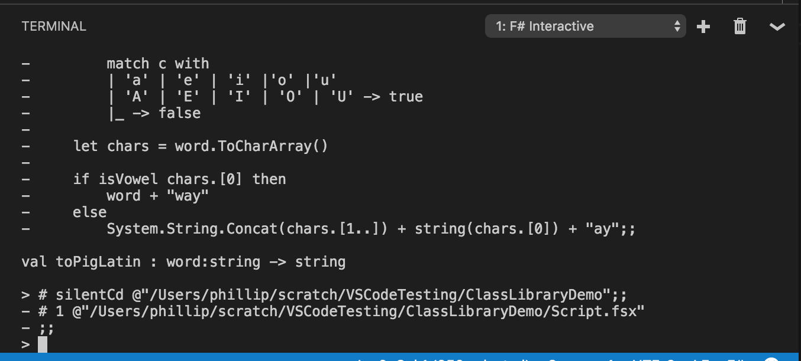

# Getting Started with F# in Visual Studio Code with Ionide

You can write F# in [Visual Studio Code](https://code.visualstudio.com) with the [Ionide plugin](https://marketplace.visualstudio.com/items?itemName=Ionide.Ionide-fsharp), to get a cross-platform, lightweight IDE experience with IntelliSense and basic code refactorings.

## Prerequisites

F# 4.0 or higher must be installed on your machine to use Ionide.

### Windows

If you're on Windows, the easiest way to do that is to install [Visual Studio with the Visual F# Tools](getting-started-visual-studio.md#installing-the-visual-f#-tools).

Alternatively, you can following the following instructions:

1. Install [.NET Framework 4.5 or higher](https://www.microsoft.com/en-US/download/details.aspx?id=30653) if you're running Windows 7.  If you're using Windows 8 or higher, you do not need to do this.

2. Install the Windows SDK for your OS:

    * [Windows 10 SDK](https://dev.windows.com/en-US/downloads/windows-10-sdk)
    * [Windows 8.1 SDK](http://msdn.microsoft.com/windows/desktop/bg162891)
    * [Windows 8 SDK](http://msdn.microsoft.com/windows/hardware/hh852363.aspx)
    * [Windows 7 SDK](http://www.microsoft.com/download/details.aspx?id=8279)

3. Install the [Microsoft Build Tools 2015](https://www.microsoft.com/en-us/download/details.aspx?id=48159).

4. Install the [Visual F# Tools](https://www.microsoft.com/en-us/download/details.aspx?id=48179).

On 64-bit Windows, the compiler and tools are located here:

```
C:\Program Files (x86)\Microsoft SDKs\F#\4.0\Framework\v4.0\fsc.exe
C:\Program Files (x86)\Microsoft SDKs\F#\4.0\Framework\v4.0\fsi.exe
C:\Program Files (x86)\Microsoft SDKs\F#\4.0\Framework\v4.0\fsiAnyCpu.exe
```

On 32-bit Windows, the compiler tools are located here:

```
C:\Program Files\Microsoft SDKs\F#\4.0\Framework\v4.0\fsc.exe
C:\Program Files\Microsoft SDKs\F#\4.0\Framework\v4.0\fsi.exe
C:\Program Files\Microsoft SDKs\F#\4.0\Framework\v4.0\fsiAnyCpu.exe
```

You will need to add these to your PATH for Ionide to work.

### macOS

On macOS, Ionide uses Mono.  The easiest way to install Mono on macOS is via Homebrew.  Simply type the following into your terminal:

```
brew install mono
```

### Linux

On Linux, Ionide also uses Mono.  If you're on Debian or Linux, you can use the following:

```
sudo apt-get update
sudo apt-get install mono-complete fsharp
```

## Installing Visual Studio Code and the Ionide plugin

You can install Visual Studio Code on the [code.visualstudio.com](https://code.visualstudio.com) website.  After that, there are a two ways to find the Ionide plugin:

1. Use the Command Palette (ctrl-P on Windows, ⌘-P on macOS, ctrl-shift-P on Linux) and type the following:

    ```
    ext install Ionide
    ```

2. Click the Extensions icon and search for "Ionide":

    

The only plugin required is **Ionide-fsharp**.  However, you can also install **Ionide-FAKE** and **Ionide-Paket** to get [FAKE](http://fsharp.github.io/FAKE/) and [Paket](https://fsprojects.github.io/Paket/) support.

## Creating your first project Ionide

To create a new F# project, open the Command Palette (ctrl-P on Windows, ⌘-P on macOS, ctrl-shift-P on Linux) and type the following:

```
>f#: New Project
```

You should see something like this:


Select it by hitting **Enter**, which will take you to this step:


This will select a template for a specific type of project.  There are quite a few options here, such as an FsLab template for Data Science or Suave template for Web Programming.  This article uses the `classlib` template, so highlight that and hit **Enter**.  You will then reach this step:


Here you can choose to create the project in a specific directory.  If you leave it blank, it will choose the current directory Visual Studio Code is opened in.  This article uses the current directory.  Once you've made your decision, hit **Enter** to bring up the final stage:


This lets you name your project.  F# uses PascalCase for project names.  This article uses `ClassLibrarySample` as the name.  Once you've entered the name you want for your project, hit **Enter**.

If you followed these steps, you should get the Explorer on the left-hand side to look something like this:


This template generates a few things you'll find useful:

1. The F# project itself, underneath the `ClassLibraryDemo` folder.
2. The correct directory structure for adding packages via [`Paket`](http://fsprojects.github.io/Paket/).
3. A cross-platform build script with [`FAKE`](http://fsharp.github.io/FAKE/).
4. The `paket.exe` executable which can fetch packages and resolve dependencies for you.
5. A useful `.gitignore` file if you wish to add this project to Git-based source control.

## Writing some code

Open the `ClassLibraryDemo` folder.  You'll notice a few files:

1. `ClassLibraryDemo.fs`, an F# source file with a class defined.
2. `CassLibraryDemo.fsproj`, an F# project file used to build this project.
3. `Script.fsx`, an F# script file which loads the source file.
4. `paket.references`, a Paket file which specifies the project dependencies.

Open `Script.fsx`, and add the following code at the end of it:

[!code-fsharp[ToPigLatin](../../../../samples/snippets/fsharp/getting-started/to-pig-latin.fsx)]

This function converts a word to a form of [Pig Latin](https://en.wikipedia.org/wiki/Pig_Latin).  Don't worry about the details of the code - that will be covered below.  The next step is to execute it using F# Interactive (fsi).

Highlight the entire function (it should be 13 lines long).  Once it is highlighted, hold the **alt** key and hit **Enter**.  You'll notice a Window pop up below, and it should show something like this:



This did two things:

1. It started the FSI process.
2. It sent the code you highlighted over the FSI process.
3. The FSI process evaluated the code you sent over.

Because what you sent over was a [function](../../language-reference/functions/index.md), you can now call that function with FSI!  In the interactive window, type the following:

```fsharp
toPigLatin "banana";;
```

You should see the following result:

```fsharp
val it : string = "ananabay"
```

Hooray!  It works when the first character isn't a vowel.  What about when it's a vowel?  Enter the following:

```fsharp
toPigLatin "apple";;
```

You should see the following result:

```fsharp
val it : string = "appleyay"
```

The function appears to be working as expected.  Congratulations, you just wrote your first F# function in Visual Studio Code and evaluated it with FSI!

>[!NOTE]
As you may have noticed, the lines in FSI are terminated with `;;`.  This is because FSI allows you to enter multiple lines.  The `;;` at the end lets FSI know when the code is finished.

## Explaining the code

If you're not sure about what the code is actually doing, here's a step-by-step.

As you can see, `toPigLatin` is a function which takes a word and converts it to a Pig-Latin representation of that word.  The rules for this are as follows:

If the first character in a word starts with a vowel, add "yay" to the end of the word.  If it doesn't start with a vowel, move that first character to the end of the word and add "ay" to it.

You may have noticed the following in FSI:

```
val toPigLatin : word:string -> string
```

This states that `toPigLatin` is a function which takes in a `string` as input (called `word`), and produces another `string`.  This is known as the [type signature of the function](https://fsharpforfunandprofit.com/posts/function-signatures/), a fundamental piece of F# that's key to understanding F# code.  You'll also notice this if you hover over the function in Visual Studio Code.

In the body of the function, you'll notice three distinct parts:

1. An inner function, called `isVowel`, which determines if a given character (`c`) is a vowel by checking if it matches one of the provided patterns via [Pattern Matching](../../language-reference/pattern-matching.md):

[!code-fsharp[ToPigLatin](../../../../samples/snippets/fsharp/getting-started/to-pig-latin.fsx#L2-L6)]

2. A call to `word.ToCharArray()`, which converts the input word into an [array](../../language-reference/arrays.md) of characters:

[!code-fsharp[ToPigLatin](../../../../samples/snippets/fsharp/getting-started/to-pig-latin.fsx#L8-L8)]

3. An [`if..then..else`](../../language-reference/conditional-expressions-if-then-else.md) expression which checks if the first character is a vowel, and constructs a return value out of the input characters based on if the first character was a vowel or not:

[!code-fsharp[ToPigLatin](../../../../samples/snippets/fsharp/getting-started/to-pig-latin.fsx#L8-L8)]

The flow of `toPigLatin` is thus:

1. Convert the input word into a character array.
2. Check if the first character is a vowel.

    a. If it is, attach "yay" to the end of the word.

    b. Otherwise, move that first character to the end of the word and add "ay" to it.

There's one final thing to notice about this: there's no explicit instruction to return from the function, unlike many other languages out there.  This is because F# is Expression-based, and the last expression in the body of a function is the return value.  Because `if..then..else` is itself an expression, the body of the `then` block or the body of the `else` block will be returned depending on the input value.

## Making your script code part of your source code

The previous sections in this article demonstrated a common first step in writing F# code: writing an initial function and executing it interactively with FSI.  This is known as REPL-driven development, where REPL stands for "Read-Evaluate-Print Loop".  It's a great way to tweak with functionality until you have something working.

The next step is to incorporate code in your F# script file into F# source code.  To begin, open `ClassLibraryDemo.fs`.  You'll notice that some code is already in there.  Go ahead and delete the class definition, but make sure to leave the [`namespace`](../../language-reference/namespaces.md) declaration at the top.

Next, create a new [`module`](../../language-reference/modules.md) called `PigLatin` and copy the `toPigLatin` function into it as such:

[!code-fsharp[ToPigLatin](../../../../samples/snippets/fsharp/getting-started/pig-latin.fs#L1-L16)]

This is one of the many ways you can organize functions in F# code, and a very common approach, especially if you intend for C# or Visual Basic projects to call this code.

Next, open the `Script.fsx` file again, and delete the entire `toPigLatin` function, but make sure to keep the following two lines in the file:

```
#load "ClassLibraryDemo.fs"
open ClassLibraryDemo
```

Those two lines will load the `ClassLibraryDemo.fs` file and `open` the `ClassLibraryDemo` namespace, just like if you were to reference this code in another project.  Note that you can also open FSI with `>FSI: Start`, then type those two lines with `;;` as the delimiter to accomplish the same thing.

Next, call the function with the `PigLatin` module that you defined earlier:

```
> PigLatin.toPigLatin "banana";;
val it : string = "ananabay"
> PigLatin.toPigLatin "apple";;
val it : string = "appleyay"
```

Success!  You get the same results as before, but now loaded from an F# source file.  The majoy difference here is that F# source files are compiled into assemblies which can be executed anywhere, not just in FSI.

## Summary

In this article, you learned a number of this:

1. How to set up Visual Studio Code with Ionide.
2. How to create your first F# project with Ionide.
3. How to use F# Scripting to write your first F# function in Ionide and then execute it in FSI.
4. How to migrate your script code to F# source and then call that code from FSI.

You're now equipped to write much more F# code using Visual Studio Code and Ionide.

## Next steps

To learn more about F# and the features of the language, check out [Tour of F#](../../tour.md).

## See also

[Tour of F#](../../tour.md)
[F# Language Reference](../../language-reference/index.md)
[Functions](../../language-reference/functions/index.md)
[Modules](../../language-reference/modules.md)
[Namespaces]([Functions](../../language-reference/namespaces.md)