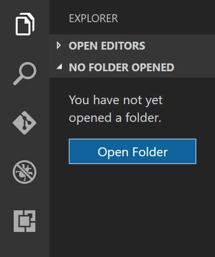
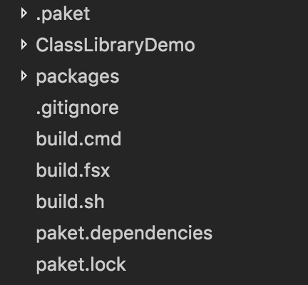
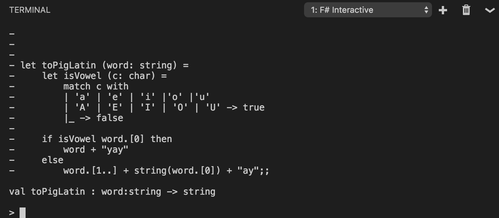

# Getting Started with F# in Visual Studio Code with Ionide

You can write F# in [Visual Studio Code](https://code.visualstudio.com) with the [Ionide plugin](https://marketplace.visualstudio.com/items?itemName=Ionide.Ionide-fsharp), to get a great cross-platform, lightweight IDE experience with IntelliSense and basic code refactorings.  Visit [Ionide.io](http://ionide.io) to learn more about the plugin suite.

## Prerequisites

F# 4.0 or higher must be installed on your machine to use Ionide.

You must also have [git installed](https://git-scm.com/download) and available on your PATH to make use of project templates in Ionide.  You can verify that it is installed correctly by typing `git` at a command prompt.and pressing **Enter**.

### Windows

If you're on Windows, you have two options for installing F#.

If you've already installed Visual Studio and don't have F#, you can [Install the Visual F# Tools](getting-started-visual-studio.md#installing-f).  This will install all the necessary components to write, compile, and execute F# code.

If you prefer not to install Visual Studio, use the following instructions:

1. Install [.NET Framework 4.5 or higher](https://www.microsoft.com/en-US/download/details.aspx?id=30653) if you're running Windows 7.  If you're using Windows 8 or higher, you do not need to do this.

2. Install the Windows SDK for your OS:

    * [Windows 10 SDK](https://dev.windows.com/en-US/downloads/windows-10-sdk)
    * [Windows 8.1 SDK](http://msdn.microsoft.com/windows/desktop/bg162891)
    * [Windows 8 SDK](http://msdn.microsoft.com/windows/hardware/hh852363.aspx)
    * [Windows 7 SDK](http://www.microsoft.com/download/details.aspx?id=8279)

3. Install the [Microsoft Build Tools 2015](https://www.microsoft.com/en-us/download/details.aspx?id=48159).  You may also need to install [Microsoft Build Tools 2013](https://www.microsoft.com/en-us/download/details.aspx?id=40760).

4. Install the [Visual F# Tools](https://www.microsoft.com/en-us/download/details.aspx?id=48179).

On 64-bit Windows, the compiler and tools are located here:

```
C:\Program Files (x86)\Microsoft SDKs\F#\4.0\Framework\v4.0\fsc.exe
C:\Program Files (x86)\Microsoft SDKs\F#\4.0\Framework\v4.0\fsi.exe
C:\Program Files (x86)\Microsoft SDKs\F#\4.0\Framework\v4.0\fsiAnyCpu.exe
```

On 32-bit Windows, the compiler tools are located here:

```
C:\Program Files\Microsoft SDKs\F#\4.0\Framework\v4.0\fsc.exe
C:\Program Files\Microsoft SDKs\F#\4.0\Framework\v4.0\fsi.exe
C:\Program Files\Microsoft SDKs\F#\4.0\Framework\v4.0\fsiAnyCpu.exe
```

Ionide automatically detects the compiler and tools, but if it doesn't for some reason (for example, the Visual F# Tools were installed to a different directory), you can manually add the containing folder (`...\Microsoft SDKs\F#\4.0`) to your PATH.

### macOS

On macOS, Ionide uses [Mono](http://www.mono-project.com).  The easiest way to install Mono on macOS is via Homebrew.  Simply type the following into your terminal:

```
brew install mono
```

### Linux

On Linux, Ionide also uses [Mono](http://www.mono-project.com).  If you're on Debian or Ubuntu, you can use the following:

```
sudo apt-get update
sudo apt-get install mono-complete fsharp
```

## Installing Visual Studio Code and the Ionide plugin

You can install Visual Studio Code from the [code.visualstudio.com](https://code.visualstudio.com) website.  After that, there are two ways to find the Ionide plugin:

1. Use the Command Palette (Ctrl+P on Windows, ⌘+P on macOS, Ctrl+Shift+P on Linux) and type the following:

    ```
    >ext install Ionide
    ```

2. Click the Extensions icon and search for "Ionide":

    

The only plugin required for F# support in Visual Studio Code is [Ionide-fsharp](https://marketplace.visualstudio.com/items?itemName=Ionide.Ionide-fsharp).  However, you can also install [Ionide-FAKE](https://marketplace.visualstudio.com/items?itemName=Ionide.Ionide-FAKE) and to get [FAKE](http://fsharp.github.io/FAKE/) support and [Ionide-Paket](https://marketplace.visualstudio.com/items?itemName=Ionide.Ionide-Paket) to get [Paket](https://fsprojects.github.io/Paket/) support.  FAKE and Paket are additonal F# community tools for building projects and managing dependencies, respectively.

## Creating your first project with Ionide

To create a new F# project, open Visual Studio Code in a new folder (you can name it whatever you like).



Next, open the Command Palette (Ctrl+P on Windows, ⌘+P on macOS, Ctrl+Shift+P on Linux) and type the following:

```
>f#: New Project
```

This is powered by the [FORGE](https://github.com/fsharp-editing/Forge) project.  You should see something like this:


> [!NOTE]
If you don't see the above, try refreshing templates by running the following command in the Command Palette: `>F#: Refresh Project Templates`.

Select "F#: New Project" by hitting **Enter**, which will take you to this step:


This will select a template for a specific type of project.  There are quite a few options here, such as an [FsLab](http://fslab.org) template for Data Science or [Suave](https://suave.io) template for Web Programming.  This article uses the `classlib` template, so highlight that and hit **Enter**.  You will then reach the following step:


This lets you create the project in a different directory, if you like.  Leave it blank for now.  It will create the project in the current directory.  Once you press **Enter**, you will reach the following step:


This lets you name your project.  F# uses [Pascal case](http://c2.com/cgi/wiki?PascalCase) for project names.  This article uses `ClassLibraryDemo` as the name.  Once you've entered the name you want for your project, hit **Enter**.

If you followed the previous step steps, you should get the Visual Studio Code Workspace on the left-hand side to look something like this:



This template generates a few things you'll find useful:

1. The F# project itself, underneath the `ClassLibraryDemo` folder.
2. The correct directory structure for adding packages via [`Paket`](http://fsprojects.github.io/Paket/).
3. A cross-platform build script with [`FAKE`](http://fsharp.github.io/FAKE/).
4. The `paket.exe` executable which can fetch packages and resolve dependencies for you.
5. A `.gitignore` file if you wish to add this project to Git-based source control.

## Writing some code

Open the *ClassLibraryDemo* folder.  You should see the following files:

1. `ClassLibraryDemo.fs`, an F# implementation file with a class defined.
2. `CassLibraryDemo.fsproj`, an F# project file used to build this project.
3. `Script.fsx`, an F# script file which loads the source file.
4. `paket.references`, a Paket file which specifies the project dependencies.

Open `Script.fsx`, and add the following code at the end of it:

[!code-fsharp[ToPigLatin](../../../../samples/snippets/fsharp/getting-started/to-pig-latin.fsx)]

This function converts a word to a form of [Pig Latin](https://en.wikipedia.org/wiki/Pig_Latin).  The next step is to evaluate it using F# Interactive (FSI).

Highlight the entire function (it should be 11 lines long).  Once it is highlighted, hold the **Alt** key and hit **Enter**.  You'll notice a window pop up below, and it should show something like this:



This did three things:

1. It started the FSI process.
2. It sent the code you highlighted over the FSI process.
3. The FSI process evaluated the code you sent over.

Because what you sent over was a [function](../../language-reference/functions/index.md), you can now call that function with FSI!  In the interactive window, type the following:

```fsharp
toPigLatin "banana";;
```

You should see the following result:

```fsharp
val it : string = "ananabay"
```

Now, let's try with a vowel as the first letter. Enter the following:

```fsharp
toPigLatin "apple";;
```

You should see the following result:

```fsharp
val it : string = "appleyay"
```

The function appears to be working as expected.  Congratulations, you just wrote your first F# function in Visual Studio Code and evaluated it with FSI!

>[!NOTE]
As you may have noticed, the lines in FSI are terminated with `;;`.  This is because FSI allows you to enter multiple lines.  The `;;` at the end lets FSI know when the code is finished.

## Explaining the code

If you're not sure about what the code is actually doing, here's a step-by-step.

As you can see, `toPigLatin` is a function which takes a word as its input and converts it to a Pig-Latin representation of that word.  The rules for this are as follows:

If the first character in a word starts with a vowel, add "yay" to the end of the word.  If it doesn't start with a vowel, move that first character to the end of the word and add "ay" to it.

You may have noticed the following in FSI:

```
val toPigLatin : word:string -> string
```

This states that `toPigLatin` is a function which takes in a `string` as input (called `word`), and returns another `string`.  This is known as the [type signature of the function](https://fsharpforfunandprofit.com/posts/function-signatures/), a fundamental piece of F# that's key to understanding F# code.  You'll also notice this if you hover over the function in Visual Studio Code.

In the body of the function, you'll notice two distinct parts:

1. An inner function, called `isVowel`, which determines if a given character (`c`) is a vowel by checking if it matches one of the provided patterns via [Pattern Matching](../../language-reference/pattern-matching.md):

   [!code-fsharp[ToPigLatin](../../../../samples/snippets/fsharp/getting-started/to-pig-latin.fsx#L2-L6)]

2. An [`if..then..else`](../../language-reference/conditional-expressions-if-then-else.md) expression which checks if the first character is a vowel, and constructs a return value out of the input characters based on if the first character was a vowel or not:

   [!code-fsharp[ToPigLatin](../../../../samples/snippets/fsharp/getting-started/to-pig-latin.fsx#L8-L11)]

The flow of `toPigLatin` is thus:

Check if the first character of the input word is a vowel.  If it is, attach "yay" to the end of the word.  Otherwise, move that first character to the end of the word and add "ay" to it.

There's one final thing to notice about this: there's no explicit instruction to return from the function, unlike many other languages out there.  This is because F# is Expression-based, and the last expression in the body of a function is the return value.  Because `if..then..else` is itself an expression, the body of the `then` block or the body of the `else` block will be returned depending on the input value.

## Moving your script code into the implementation file

The previous sections in this article demonstrated a common first step in writing F# code: writing an initial function and executing it interactively with FSI.  This is known as REPL-driven development, where REPL stands for "Read-Evaluate-Print Loop".  It's a great way to experiment with functionality until you have something working.

The next step in REPL-driven development is to move working code into an F# implementation file.  It can then be compiled by the F# compiler into an assembly which can be executed.

To begin, open `ClassLibraryDemo.fs`.  You'll notice that some code is already in there.  Go ahead and delete the class definition, but make sure to leave the [`namespace`](../../language-reference/namespaces.md) declaration at the top.

Next, create a new [`module`](../../language-reference/modules.md) called `PigLatin` and copy the `toPigLatin` function into it as such:

[!code-fsharp[ToPigLatin](../../../../samples/snippets/fsharp/getting-started/pig-latin.fs#L1-L14)]

This is one of the many ways you can organize functions in F# code, and a common approach if you also want to call your code from C# or Visual Basic projects.

Next, open the `Script.fsx` file again, and delete the entire `toPigLatin` function, but make sure to keep the following two lines in the file:

```
#load "ClassLibraryDemo.fs"
open ClassLibraryDemo
```

The first line is needed for FSI scripting to load `ClassLibraryDemo.fs`.  The second line is a convenience: omitting it is optional, but you will need to type `open ClassLibraryDemo` in an FSI window if you wish to bring the `ToPigLatin` module into scope.

Next, in the FSI window, call the function with the `PigLatin` module that you defined earlier:

```
> PigLatin.toPigLatin "banana";;
val it : string = "ananabay"
> PigLatin.toPigLatin "apple";;
val it : string = "appleyay"
```

Success!  You get the same results as before, but now loaded from an F# implementation file.  The major difference here is that F# source files are compiled into assemblies which can be executed anywhere, not just in FSI.

## Summary

In this article, you've learned:

1. How to set up Visual Studio Code with Ionide.
2. How to create your first F# project with Ionide.
3. How to use F# Scripting to write your first F# function in Ionide and then execute it in FSI.
4. How to migrate your script code to F# source and then call that code from FSI.

You're now equipped to write much more F# code using Visual Studio Code and Ionide.

## Troubleshooting

Here are a few ways you can troubleshoot certain problems that you might run into:

1. To get the code editing features of Ionide, your F# files need to be saved to disk and inside of a folder that is open in the Visual Studio Code workspace.
2. If you've made changes to your system or installed Ionide prerequisites with Visual Studio Code open, restart Visual Studio Code.
3. Check that you can use the F# compiler and F# interactive from the command line without a fully-qualified path.  You can do so by typing `fsc` in a command line for the F# compiler, and `fsi` or `fsharpi` for the Visual F# tools on Windows and Mono on Mac/Linux, respectively.
4. If you have invalid characters in your project directories, Ionide might not work.  Rename your project directories if this is the case.
5. If none of the Ionide commands are working, check your [Visual Studio Code keybindings](https://code.visualstudio.com/docs/customization/keybindings#_customizing-shortcuts) to see if you're overriding them by accident.
6. If Ionide is broken on your machine and none of the above has fixed your problem, try removing the `ionide-fsharp` directory on your machine and reinstall the plugin suite.

Ionide is an open source project built and maintained by members of the F# community.  Please report issues and feel free to contribute at the [Ionide-Vscode-Fsharp GitHub repository](https://github.com/ionide/ionide-vscode-fsharp).

If you have an issue to report, please follow [the instructions for getting logs to use when reporting an issue](https://github.com/ionide/ionide-vscode-fsharp#how-to-get-logs-for-debugging--issue-reporting).

You can also ask for further help from the Ionide developers and F# community in the [Ionide Gitter channel](https://gitter.im/ionide/ionide-project).

## Next steps

To learn more about F# and the features of the language, check out [Tour of F#](../../tour.md).

## See also

[Tour of F#](../../tour.md)

[F# Language Reference](../../language-reference/index.md)

[Functions](../../language-reference/functions/index.md)

[Modules](../../language-reference/modules.md)

[Namespaces](../../language-reference/namespaces.md)

[Ionide-Vscode-Fsharp](https://github.com/ionide/ionide-vscode-fsharp)
