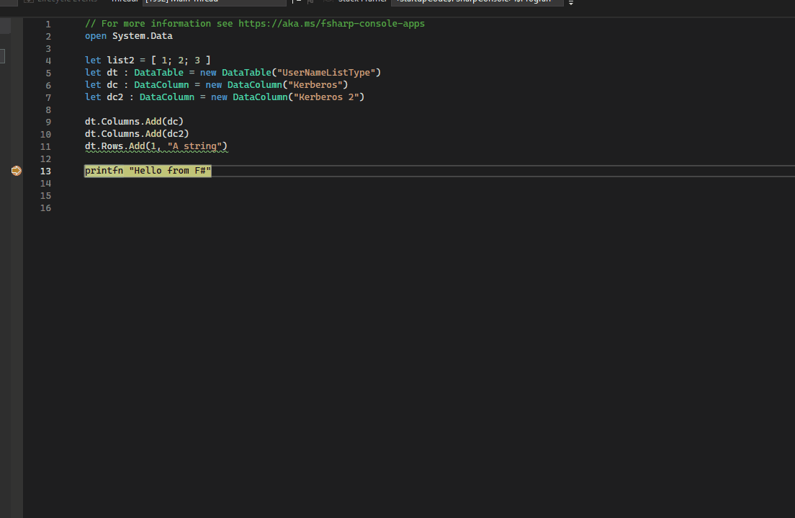
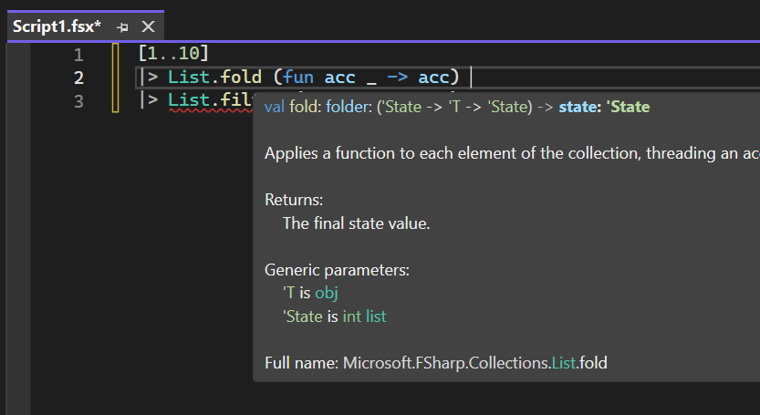

# What's new in F# 9

F# 9 introduces a range of enhancements that make your programs safer, more resilient, and performant. This article highlights the major changes in F# 9, developed in the [F# open source code repository](https://github.com/dotnet/fsharp).

F# 9 is available in .NET 9. You can download the latest .NET SDK from the [.NET downloads page](https://dotnet.microsoft.com/download).

## Nullable reference types

Although F# is designed to avoid `null`, it can creep in when interfacing with .NET libraries written in C#. F# now provides a type-safe way to deal with reference types that can have `null` as a valid value.

For more details, see the [Nullable Reference Types in F# 9](https://devblogs.microsoft.com/dotnet/nullable-reference-types-in-fsharp-9/) blog post.

Here are some examples:

```fsharp
// Declared type at let-binding
let notAValue: string | null = null

let isAValue: string | null = "hello world"

let isNotAValue2: string = null // gives a nullability warning

let getLength (x: string | null) = x.Length // gives a nullability warning since x is a nullable string

// Parameter to a function
let len (str: string | null) =
    match str with
    | null -> -1
    | s -> s.Length  // binds a non-null result - compiler eliminated "null" after the first clause

// Parameter to a function
let len (str: string | null) =
    let s = nullArgCheck "str" str // Returns a non-null string
    s.Length  // binds a non-null result

// Declared type at let-binding
let maybeAValue: string | null = hopefullyGetAString()

// Array type signature
let f (arr: (string | null)[]) = ()

// Generic code, note 'T must be constrained to be a reference type
let findOrNull (index: int) (list: 'T list) : 'T | null when 'T : not struct =
    match List.tryItem index list with
    | Some item -> item
    | None -> null
```

## Discriminated union `.Is*` properties

Discriminated unions now have auto-generated properties for each case, allowing you to check if a value is of a particular case. For example, for the following type:

```fsharp
type Contact =
    | Email of address: string
    | Phone of countryCode: int * number: string

type Person = { name: string; contact: Contact }
```

Previously, you had to write something like:

```fsharp
let canSendEmailTo person =
    match person.contact with
    | Email _ -> true
    | _ -> false
```

Now, you can instead write:

```fsharp
let canSendEmailTo person =
    person.contact.IsEmail
```

## Partial active patterns can return `bool` instead of `unit option`

Previously, partial active patterns returned `Some ()` to indicate a match and `None` otherwise. Now, they can also return `bool`.

For example, the active pattern for the following:

```fsharp
match key with
| CaseInsensitive "foo" -> ...
| CaseInsensitive "bar" -> ...
```

Was previously written as:

```fsharp
let (|CaseInsensitive|_|) (pattern: string) (value: string) =
    if String.Equals(value, pattern, StringComparison.OrdinalIgnoreCase) then
        Some ()
    else
        None
```

Now, you can instead write:

```fsharp
let (|CaseInsensitive|_|) (pattern: string) (value: string) =
    String.Equals(value, pattern, StringComparison.OrdinalIgnoreCase)
```

## Prefer extension methods to intrinsic properties when arguments are provided

To align with a pattern seen in some .NET libraries, where extension methods are defined with the same names as intrinsic properties of a type, F# now resolves these extension methods instead of failing the type check.

Example:

```fsharp
type Foo() =
    member val X : int = 0 with get, set

[<Extension>]
type FooExt =
    [<Extension>]
    static member X (f: Foo, i: int) = f.X <- i; f

let f = Foo()

f.X(1) // We can now call the extension method to set the property and chain further calls
```

## Empty-bodied computation expressions

F# now supports empty [computation expressions](../language-reference/computation-expressions.md).

```fsharp
let xs = seq { } // Empty sequence
```

```fsharp
let html =
    div {
        p { "Some content." }
        p { } // Empty paragraph
    }
```

Writing an empty computation expression will result in a call to the computation expression builder's `Zero` method.

This is a more natural syntax compared to the previously available `builder { () }`.

## Hash directives are allowed to take non-string arguments

Hash directives for the compiler previously only allowed string arguments passed in quotes. Now, they can take any type of argument.

Previously, you had:

```fsharp
#nowarn "0070"
#time "on"
```

Now, you can write:

```fsharp
#nowarn 0070
#time on
```

This also ties into the next two changes.

## Extended #help directive in fsi to show documentation in the REPL

The `#help` directive in F# Interactive now shows documentation for a given object or function, which you can now pass without quotes.

```
> #help List.map;;

Description:
Builds a new collection whose elements are the results of applying the given function
to each of the elements of the collection.

Parameters:
- mapping: The function to transform elements from the input list.
- list: The input list.
Returns:
The list of transformed elements.

Examples:
let inputs = [ "a"; "bbb"; "cc" ]

inputs |> List.map (fun x -> x.Length)
// Evaluates to [ 1; 3; 2 ]

Full name: Microsoft.FSharp.Collections.ListModule.map
Assembly: FSharp.Core.dll
```

See [Enhancing #help in F# Interactive blog post](https://devblogs.microsoft.com/dotnet/enhancing-help-in-fsi/) for more details.

## Allow #nowarn to support the FS prefix on error codes to disable warnings

Previously, when you wanted to disable a warning and wrote `#nowarn "FS0057"`, you would get an `Invalid warning number 'FS0057'`. Even though the warning number is correct, it just wasn't supposed to have the `FS` prefix.

Now, you won't have to spend time figuring that out because the warning numbers are accepted even with the prefix.

All of these will now work:

```fsharp
#nowarn 57
#nowarn 0057
#nowarn FS0057

#nowarn "57"
#nowarn "0057"
#nowarn "FS0057"
```

It's a good idea to use the same style throughout your project.

## Warning about TailCall attribute on non-recursive functions or let-bound values

F# now emits a warning when you put the `[<TailCall>]` attribute somewhere it doesn't belong. While it has no effect on what the code does, it could confuse someone reading it.

For example, these usages will now emit a warning:

```fsharp
[<TailCall>]
let someNonRecFun x = x + x

[<TailCall>]
let someX = 23

[<TailCall>]
let rec someRecLetBoundValue = nameof(someRecLetBoundValue)
```

## Enforce attribute targets

The compiler now correctly enforces the `AttributeTargets` on let values, functions, union case declarations, implicit constructors, structs, and classes. This can prevent some hard-to-notice bugs, such as forgetting to add the unit argument to an Xunit test.

Previously, you could write:

```fsharp
[<Fact>]
let ``this test always fails`` =
  Assert.True(false)
```

When you ran the tests with `dotnet test`, they would pass. Since the test function is not actually a function, it was ignored by the test runner.

Now, with correct attribute enforcement, you will get an `error FS0842: This attribute is not valid for use on this language element`.

## Updates to the [standard library (FSharp.Core)](https://fsharp.github.io/fsharp-core-docs/)

### Random functions for collections

The `List`, `Array`, and `Seq` modules have new functions for random sampling and shuffling. This makes F# easier to use for common data science, machine learning, game development, and other scenarios where randomness is needed.

All functions have the following variants:

* One that uses an implicit, thread-safe, shared <xref:System.Random> instance
* One that takes a `Random` instance as an argument
* One that takes a custom `randomizer` function, which should return a float value greater than or equal to 0.0 and less than 1.0

There are four functions (each with three variants) available: `Shuffle`, `Choice`, `Choices`, and `Sample`.

#### Shuffle

The `Shuffle` functions return a new collection of the same type and size, with each item in a randomly mixed position. The chance to end up in any position is weighted evenly on the length of the collection.

```fsharp
let allPlayers = [ "Alice"; "Bob"; "Charlie"; "Dave" ]
let round1Order = allPlayers |> List.randomShuffle // [ "Charlie"; "Dave"; "Alice"; "Bob" ]
```

For arrays, there are also `InPlace` variants that shuffle the items in the existing array instead of creating a new one.

#### Choice

The `Choice` functions return a single random element from the given collection. The random choice is weighted evenly on the size of the collection.

```fsharp
let allPlayers = [ "Alice"; "Bob"; "Charlie"; "Dave" ]
let randomPlayer = allPlayers |> List.randomChoice // "Charlie"
```

#### Choices

The `Choices` functions select N elements from the input collection in random order, allowing elements to be selected more than once.

```fsharp
let weather = [ "Raining"; "Sunny"; "Snowing"; "Windy" ]
let forecastForNext3Days = weather |> List.randomChoices 3 // [ "Windy"; "Snowing"; "Windy" ]
```

#### Sample

The `Sample` functions select N elements from the input collection in random order, without allowing elements to be selected more than once. N cannot be greater than the collection length.

```fsharp
let foods = [ "Apple"; "Banana"; "Carrot"; "Donut"; "Egg" ]
let today'sMenu = foods |> List.randomSample 3 // [ "Donut"; "Apple"; "Egg" ]
```

For a full list of functions and their variants, see ([RFC #1135](https://github.com/fsharp/fslang-design/blob/main/FSharp.Core-9.0/FS-1135-random-functions-for-collections.md)).

### Parameterless constructor for `CustomOperationAttribute`

This constructor makes it easier to create a custom operation for a computation expression builder. It uses the name of the method instead of having to explicitly name it (when in most cases the name matches the method name already).

```fsharp
type FooBuilder() =
    [<CustomOperation>]  // Previously had to be [<CustomOperation("bar")>]
    member _.bar(state) = state
```

### C# collection expression support for F# lists and sets

When using F# lists and sets from C#, you can now use collection expressions to initialize them.

Instead of:

```csharp
FSharpSet<int> mySet = SetModule.FromArray([1, 2, 3]);
```

You can now write:

```csharp
FSharpSet<int> mySet = [ 1, 2, 3 ];
```

Collection expressions make it easier to use the F# immutable collections from C#. You might want to use the F# collections when you need their structural equality, which <xref:System.Collections.Immutable> collections don't have.

## Developer productivity improvements

### Parser recovery

There have been continuous improvements in parser recovery, meaning that tooling (for example, syntax highlighting) still works with code when you're in the middle of editing it and it might not be syntactically correct at all times.

For example, the parser will now recover on unfinished `as` patterns, object expressions, enum case declarations, record declarations, complex primary constructor patterns, unresolved long identifiers, empty match clauses, missing union case fields, and missing union case field types.

### Diagnostics

Diagnostics, or understanding what the compiler doesn't like about your code, are an important part of the user experience with F#. There are a number of new or improved diagnostic messages or more precise diagnostic locations in F# 9.

These include:

- Ambiguous override method in object expression
- Abstract members when used in non-abstract classes
- Property that has the same name as a discriminated union case
- Active pattern argument count mismatch
- Unions with duplicated fields
- Using `use!` with `and!` in computation expressions

There is also a new compile-time error for classes with over 65,520 methods in generated [IL](../../standard/managed-code.md#intermediate-language--execution). Such classes aren't loadable by the CLR and result in a run-time error. (You won't author that many methods, but there have been cases with generated code.)

### Real visibility

There is a quirk with how F# generates assemblies that results in private members being written to [IL](../../standard/managed-code.md#intermediate-language--execution) as internal. This allows inappropriate access to private members from non-F# projects that have access to an F# project via [`InternalsVisibleTo`](xref:System.Runtime.CompilerServices.InternalsVisibleToAttribute).

Now, there is an opt-in fix for this behavior available via the `--realsig+` compiler flag. Try it in your solution to see if any of your projects depend on this behavior. You can add it to your `.fsproj` files like this:

```xml
<PropertyGroup>
    <RealSig>true</RealSig>
</PropertyGroup>
```

## Performance improvements

### Optimized equality checks

Equality checks are now faster and allocate less memory.

For example:

```fsharp
[<Struct>]
type MyId =
    val Id: int
    new id = { Id = id }

let ids = Array.init 1000 MyId
let missingId = MyId -1

// used to box 1000 times, doesn't box anymore
let _ = ids |> Array.contains missingId
```

#### Benchmark results for affected array functions, applied to a 2-member struct

Before:

| Method                       | Mean        | Error      | Gen0   | Allocated |
|----------------------------- |------------:|-----------:|-------:|----------:|
| ArrayContainsExisting        |    15.48 ns |   0.398 ns | 0.0008 |      48 B |
| ArrayContainsNonexisting     | 5,190.95 ns | 103.533 ns | 0.3891 |   24000 B |
| ArrayExistsExisting          |    17.97 ns |   0.389 ns | 0.0012 |      72 B |
| ArrayExistsNonexisting       | 5,316.64 ns | 103.776 ns | 0.3891 |   24024 B |
| ArrayTryFindExisting         |    24.80 ns |   0.554 ns | 0.0015 |      96 B |
| ArrayTryFindNonexisting      | 5,139.58 ns | 260.949 ns | 0.3891 |   24024 B |
| ArrayTryFindIndexExisting    |    15.92 ns |   0.526 ns | 0.0015 |      96 B |
| ArrayTryFindIndexNonexisting | 4,349.13 ns | 100.750 ns | 0.3891 |   24024 B |

After:

| Method                       | Mean         | Error      | Gen0   | Allocated |
|----------------------------- |-------------:|-----------:|-------:|----------:|
| ArrayContainsExisting        |     4.865 ns |  0.3452 ns |      - |         - |
| ArrayContainsNonexisting     |   766.005 ns | 15.2003 ns |      - |         - |
| ArrayExistsExisting          |     8.025 ns |  0.1966 ns | 0.0004 |      24 B |
| ArrayExistsNonexisting       |   834.811 ns | 16.2784 ns |      - |      24 B |
| ArrayTryFindExisting         |    16.401 ns |  0.3932 ns | 0.0008 |      48 B |
| ArrayTryFindNonexisting      | 1,140.515 ns | 22.7372 ns |      - |      24 B |
| ArrayTryFindIndexExisting    |    14.864 ns |  0.3648 ns | 0.0008 |      48 B |
| ArrayTryFindIndexNonexisting |   990.028 ns | 19.7157 ns |      - |      24 B |

You can read all the details here: [F# Developer Stories: How we’ve finally fixed a 9-year-old performance issue](https://devblogs.microsoft.com/dotnet/fsharp-developer-stories-how-weve-finally-fixed-a-9yearold-performance-issue/).

### Field sharing for struct discriminated unions

If fields in multiple cases of a struct discriminated union have the same name and type, they can share the same memory location, reducing the struct's memory footprint. (Previously, same field names weren't allowed, so there are no issues with binary compatibility.)

For example:

```fsharp
[<Struct>]
type MyStructDU =
    | Length of int64<meter>
    | Time of int64<second>
    | Temperature of int64<kelvin>
    | Pressure of int64<pascal>
    | Abbrev of TypeAbbreviationForInt64
    | JustPlain of int64
    | MyUnit of int64<MyUnit>

sizeof<MyStructDU> // 16 bytes
```

Comparing to previous verion (where you had to use unique field names):

```fsharp
[<Struct>]
type MyStructDU =
    | Length of length: int64<meter>
    | Time of time: int64<second>
    | Temperature of temperature: int64<kelvin>
    | Pressure of pressure: int64<pascal>
    | Abbrev of abbrev: TypeAbbreviationForInt64
    | JustPlain of plain: int64
    | MyUnit of myUnit: int64<MyUnit>

sizeof<MyStructDU> // 60 bytes
```

### Integral range optimizations

The compiler now generates optimized code for more instances of `start..finish` and `start..step..finish` expressions. Previously, these were only optimized when the type was `int`/`int32` and the step was a constant `1` or `-1`. Other integral types and different step values used an inefficient `IEnumerable`-based implementation. Now, all of these are optimized.

This leads to anywhere from 1.25× up to 8× speed up in loops:

```fsharp
for … in start..finish do …
```

List/array expressions:

```fsharp
[start..step..finish]
```

and comprehensions:

```fsharp
[for n in start..finish -> f n]
```

### Optimized `for x in xs -> …` in list and array comprehensions

On a related note, comprehensions with `for x in xs -> …` have been optimized for lists and arrays, with notable improvements especially for arrays, with speedups up to 10× and ⅓ to ¼ allocation size.

## Improvements in tooling

### Live buffers in Visual Studio

This previously opt-in feature has been thoroughly tested and is now enabled by default. The background compiler powering the IDE now works with live file buffers, meaning you don't have to save the files to disk to get the changes applied. Previously, this could cause some unexpected behavior. (Most notoriously when you tried to rename a symbol present in a file that had been edited but not saved.)

### Analyzer and code fix for removing unnecessary parentheses

Sometimes extra parentheses are used for clarity, but sometimes they are just noise. For the latter case, you now get a code fix in Visual Studio to remove them.

For example:

```fsharp
let f (x) = x // -> let f x = x
let _ = (2 * 2) + 3 // -> let _ = 2 * 2 + 3
```

### Custom visualizer support for F# in Visual Studio

The debugger visualizer in Visual Studio now works with F# projects.



### Signature tooltips shown mid-pipeline

Previously, signature help wasn't offered in a situation like the following, where a function in the middle of a pipeline already had a complex curried parameter (for example, a lambda) applied to it. Now, the signature tooltip shows up for the next parameter (`state`):


