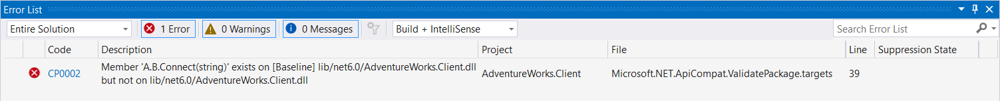
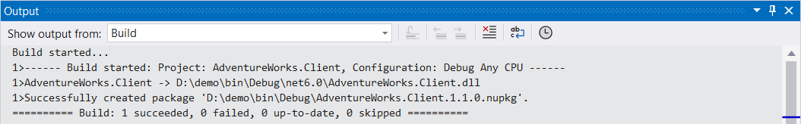

# Validate against a baseline package version

Package validation can help you validate your library project against a previously released, stable version of your package. To enable package validation, add the [`PackageValidationBaselineVersion`](../../../core/project-sdk/msbuild-props.md#packagevalidationbaselineversion) or [`PackageValidationBaselineName`](../../../core/project-sdk/msbuild-props.md#packagevalidationbaselinename) property to your project file.

Package validation detects any breaking changes on any of the shipped target frameworks. It also detects if any target framework support has been dropped.

For example, consider the following scenario. You're working on the AdventureWorks.Client NuGet package and you want to make sure that you don't accidentally make breaking changes. You configure your project to instruct package validation tooling to run API compatibility checks against the previous version of the package.

```xml
<Project Sdk="Microsoft.NET.Sdk">

  <PropertyGroup>
    <TargetFramework>net6.0</TargetFramework>
    <PackageVersion>1.1.0</PackageVersion>
    <EnablePackageValidation>true</EnablePackageValidation>
    <PackageValidationBaselineVersion>1.0.0</PackageValidationBaselineVersion>
  </PropertyGroup>

</Project>
```

A few weeks later, you're tasked with adding support for a connection timeout to your library. The `Connect` method currently looks like this:

```csharp
public static HttpClient Connect(string url)
{
    // ...
}
```

Since a connection timeout is an advanced configuration setting, you reckon that you can just add an optional parameter:

```csharp
public static HttpClient Connect(string url, TimeSpan timeout = default)
{
    // ...
}
```

However, when you try to pack, it throws an error.

```dotnetcli
D:\demo>dotnet pack
MSBuild version 17.3.2+561848881 for .NET
  Determining projects to restore...
  All projects are up-to-date for restore.
  AdventureWorks.Client -> D:\demo\bin\Debug\net6.0\AdventureWorks.Client.dll
C:\Program Files\dotnet\sdk\6.0.413\Sdks\Microsoft.NET.Sdk\targets\Microsoft.NET.Compatibility.Common.targets(33,5): error CP0002: Member 'A.B.Connect(string)' exists on [Baseline] lib/net6.0/AdventureWorks.Client.dll but not on lib/net6.0/AdventureWorks.Client.dll [D:\demo\AdventureWorks.Client.csproj]
```



You realize that while this is not a [source breaking change](../../../standard/library-guidance/breaking-changes.md#source-breaking-change), it is a [binary breaking change](../../../standard/library-guidance/breaking-changes.md#binary-breaking-change). You solve this problem by adding a new overload instead of adding a parameter to the existing method:

```csharp
public static HttpClient Connect(string url)
{
    return Connect(url, Timeout.InfiniteTimeSpan);
}

public static HttpClient Connect(string url, TimeSpan timeout)
{
    // ...
}
```

Now when you pack the project, it succeeds.



For version 2.0.0, you decide you want to remove the obsolete `Connect` method that has the single `string` parameter. After careful consideration, you decide to accept this breaking change.

```xml
<Project Sdk="Microsoft.NET.Sdk">

  <PropertyGroup>
    <TargetFramework>net6.0</TargetFramework>
    <PackageVersion>2.0.0</PackageVersion>
    <EnablePackageValidation>true</EnablePackageValidation>
    <PackageValidationBaselineVersion>1.1.0</PackageValidationBaselineVersion>
  </PropertyGroup>

</Project>
```

```diff
- public static HttpClient Connect(string url)
- {
-     return Connect(url, Timeout.InfiniteTimeSpan);
- }

public static HttpClient Connect(string url, TimeSpan timeout)
{
    // ...
}
```

To suppress the `CP0002` error for this intentional breaking change, you can add a *CompatibilitySuppressions.xml* file to your project. You can generate the suppression file automatically by calling `dotnet pack /p:GenerateCompatibilitySuppressionFile=true` once. The file contains a suppression for each validation error that occurred during pack. For more information, see [How to suppress](../diagnostic-ids.md#how-to-suppress).

In this example, the *CompatibilitySuppressions.xml* contains the suppression for the `CP0002` error:

```xml
<?xml version="1.0" encoding="utf-8"?>
<Suppressions xmlns:xsi="http://www.w3.org/2001/XMLSchema-instance" xmlns:xsd="http://www.w3.org/2001/XMLSchema">
  <Suppression>
    <DiagnosticId>CP0002</DiagnosticId>
    <Target>M:A.B.Connect(System.String)</Target>
    <Left>lib/net6.0/AdventureWorks.Client.dll</Left>
    <Right>lib/net6.0/AdventureWorks.Client.dll</Right>
    <IsBaselineSuppression>true</IsBaselineSuppression>
  </Suppression>
</Suppressions>
```

This file should be checked into source control to document and review the breaking changes made in a PR and the upcoming release.

After you've released version 2.0.0 of the package, you can delete the *CompatibilitySuppressions.xml* file and update the `PackageValidationBaselineVersion` property to validate future changes against the new release.

```xml
<Project Sdk="Microsoft.NET.Sdk">

  <PropertyGroup>
    <TargetFramework>net6.0</TargetFramework>
    <PackageVersion>2.1.0</PackageVersion>
    <EnablePackageValidation>true</EnablePackageValidation>
    <PackageValidationBaselineVersion>2.0.0</PackageValidationBaselineVersion>
  </PropertyGroup>

</Project>
```
