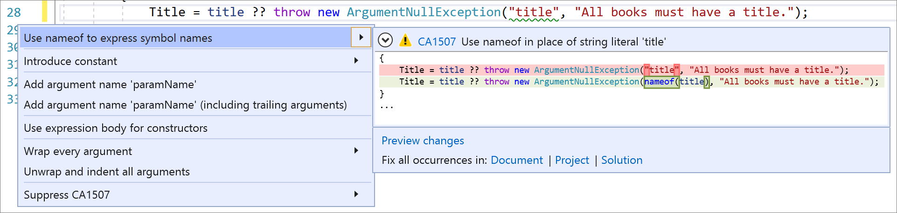

# CA1507: Use `nameof` in place of string

| | Value |
|-|-|
| **Rule ID** |CA1507|
| **Category** |[Maintainability](maintainability-warnings.md)|
| **Fix is breaking or non-breaking** |Non-breaking|

## Cause

A `string` literal or constant that matches the name of a parameter of the containing method or the name of a property of the containing type is used as an argument to a method.

## Rule description

Rule CA1507 flags the use of a `string` literal as an argument to a method or constructor where a [nameof](../../../csharp/language-reference/operators/nameof.md) (`NameOf` in Visual Basic) expression would add maintainability. The rule fires if all of the following conditions are met:

- The argument is a `string` literal or constant.

- The argument corresponds to a `string`-typed parameter of the method or the constructor that's being invoked (that is, there is no conversion involved at the call site).

- Either:
  - The declared name of the parameter is `paramName` and the constant value of the `string` literal matches the name of a parameter of the method, lambda, or local function within which the method or constructor is being invoked.

  - The declared name of the parameter is `propertyName` and the constant value of the `string` literal matches the name of a property of the type within which the method or constructor is being invoked.

Rule CA1507 improves code maintainability in cases where the parameter may be renamed in the future, but the `string` literal is mistakenly not renamed. By using `nameof`, the symbol will be renamed when the parameter is renamed through a refactoring operation. In addition, any spelling mistakes in the name of the parameter are caught by the compiler.

## How to fix violations

To fix a violation, replace the `string` literal with a [nameof](../../../csharp/language-reference/operators/nameof.md) (`NameOf` in Visual Basic) expression. For example, the following two code snippets show a violation of the rule and how to fix it:

```csharp
public Book(string title)
{
    // Violates rule CA1507
    Title = title ?? throw new ArgumentNullException("title", "All books must have a title.");
}
```

```csharp
public Book(string title)
{
    // Resolves rule CA1507 violation
    Title = title ?? throw new ArgumentNullException(nameof(title), "All books must have a title.");
}
```

> [!TIP]
> A code fix is available for this rule in Visual Studio. To use it, position the cursor on the `string` literal and press **Ctrl**+**.** (period). Choose **Use nameof to express symbol names** from the list of options that's presented.
>
> 

## When to suppress warnings

It's safe to suppress a violation of this rule if you're not concerned about the maintainability of your code.

## Related rules

- [CA2208: Instantiate argument exceptions correctly](ca2208.md)

## See also

- [Maintainability rules](maintainability-warnings.md)
