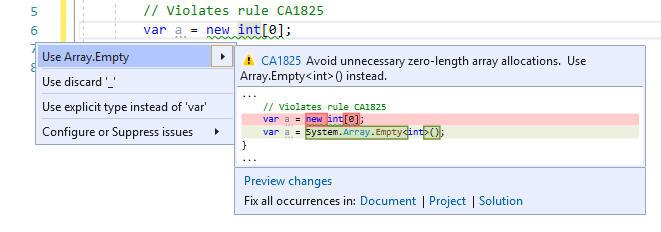

# CA1825: Avoid zero-length array allocations

| | Value |
|-|-|
| **Rule ID** |CA1825|
| **Category** |[Performance](performance-warnings.md)|
| **Fix is breaking or non-breaking** |Non-breaking|

## Cause

An empty <xref:System.Array> with no elements is allocated.

## Rule description

Initializing a zero-length array leads to an unnecessary memory allocation. Instead, use the statically allocated empty array instance by calling the <xref:System.Array.Empty%2A?displayProperty=nameWithType> method. The memory allocation is shared across all invocations of this method.

## How to fix violations

To fix a violation, replace the zero-length array allocation with a call to <xref:System.Array.Empty%2A?displayProperty=nameWithType>. For example, the following two code snippets show a violation of the rule and how to fix it:

```csharp
class C
{
    public void M1()
    {
        // Violates rule CA1825.
        var a = new int[0];
    }
}
```

```csharp
class C
{
    public void M1()
    {
        // Resolves rule CA1825 violation.
        var a = System.Array.Empty<int>();
    }
}
```

> [!TIP]
> A code fix is available for this rule in Visual Studio. To use it, position the cursor on the array allocation and press **Ctrl**+**.** (period). Choose **Use Array.Empty** from the list of options that's presented.
>
> 

## When to suppress warnings

It's safe to suppress a violation of this rule if you're not concerned about the additional memory allocation.

## Suppress a warning

If you just want to suppress a single violation, add preprocessor directives to your source file to disable and then re-enable the rule.

```csharp
#pragma warning disable CA1825
// The code that's violating the rule is on this line.
#pragma warning restore CA1825
```

To disable the rule for a file, folder, or project, set its severity to `none` in the [configuration file](../configuration-files.md).

```ini
[*.{cs,vb}]
dotnet_diagnostic.CA1825.severity = none
```

To disable this entire category of rules, set the severity for the category to `none` in the [configuration file](../configuration-files.md).

```ini
[*.{cs,vb}]
dotnet_analyzer_diagnostic.category-Performance.severity = none
```

For more information, see [How to suppress code analysis warnings](../suppress-warnings.md).

## Related rules

- [CA1814: Prefer jagged arrays over multidimensional](ca1814.md)

## See also

- [Performance rules](performance-warnings.md)
