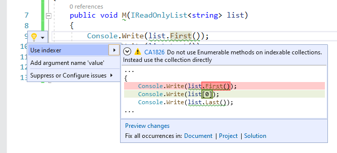

# CA1826: Use property instead of Linq Enumerable method

|                                     | Value                                  |
| ----------------------------------- | -------------------------------------- |
| **Rule ID**                         | CA1826                                 |
| **Category**                        | [Performance](performance-warnings.md) |
| **Fix is breaking or non-breaking** | Non-breaking                           |
| **Enabled by default in .NET 7**    | No                                     |

## Cause

The <xref:System.Linq.Enumerable> LINQ method was used on a type that supports an equivalent, more efficient property.

## Rule description

This rule flags the <xref:System.Linq.Enumerable> LINQ method calls on collections of types that have equivalent but more efficient properties to fetch the same data.

This rule analyzes collection types that implement <xref:System.Collections.Generic.IReadOnlyList%601> but not <xref:System.Collections.Generic.IList%601>.

This rule flags calls to the following methods on these collection types:

- <xref:System.Linq.Enumerable.Count%2A?displayProperty=fullName>
- <xref:System.Linq.Enumerable.First%2A?displayProperty=fullName>
- <xref:System.Linq.Enumerable.FirstOrDefault%2A?displayProperty=fullName>
- <xref:System.Linq.Enumerable.Last%2A?displayProperty=fullName>
- <xref:System.Linq.Enumerable.LastOrDefault%2A?displayProperty=fullName>

The analyzed collection types and methods may be extended in the future to cover more cases.

## How to fix violations

To fix a violation, replace the <xref:System.Linq.Enumerable> method call with property access. For example, the following two code snippets show a violation of the rule and how to fix it:

```csharp
using System;
using System.Collections.Generic;
using System.Linq;

class C
{
    public void M(IReadOnlyList<string> list)
    {
        Console.Write(list.First());
        Console.Write(list.Last());
        Console.Write(list.Count());
    }
}
```

```csharp
using System;
using System.Collections.Generic;

class C
{
    public void M(IReadOnlyList<string> list)
    {
        Console.Write(list[0]);
        Console.Write(list[list.Count - 1]);
        Console.Write(list.Count);
    }
}
```

> [!TIP]
> A code fix is available for this rule in Visual Studio. To use it, position the cursor on the violation and press <kbd>Ctrl</kbd>+<kbd>.</kbd> (period). Choose **Use indexer** from the list of options that's presented.
>
> 

## When to suppress warnings

It's safe to suppress a violation of this rule if you're not concerned about the performance impact from specific <xref:System.Linq.Enumerable> method calls.

## Suppress a warning

If you just want to suppress a single violation, add preprocessor directives to your source file to disable and then re-enable the rule.

```csharp
#pragma warning disable CA1826
// The code that's violating the rule is on this line.
#pragma warning restore CA1826
```

To disable the rule for a file, folder, or project, set its severity to `none` in the [configuration file](../configuration-files.md).

```ini
[*.{cs,vb}]
dotnet_diagnostic.CA1826.severity = none
```

For more information, see [How to suppress code analysis warnings](../suppress-warnings.md).

## Configure code to analyze

Use the following option to configure which parts of your codebase to run this rule on.

- [Exclude FirstOrDefault and LastOrDefault methods](#exclude-firstordefault-and-lastordefault-methods)

### Exclude FirstOrDefault and LastOrDefault methods

You can configure this rule to exclude the <xref:System.Linq.Enumerable.FirstOrDefault%2A?displayProperty=nameWithType> and <xref:System.Linq.Enumerable.LastOrDefault%2A?displayProperty=nameWithType> methods from analysis. You might consider excluding these methods if readability is a concern, since the code you'd write to replace them is not easily readable. To exclude these methods, add the following key-value pair to an *.editorconfig* file in your project:

```ini
dotnet_code_quality.CA1826.exclude_ordefault_methods = true
```

## Related rules

- [CA1827: Do not use Count/LongCount when Any can be used](ca1827.md)
- [CA1828: Do not use CountAsync/LongCountAsync when AnyAsync can be used](ca1828.md)
- [CA1829: Use Length/Count property instead of Enumerable.Count method](ca1829.md)

## See also

- [Performance rules](performance-warnings.md)
