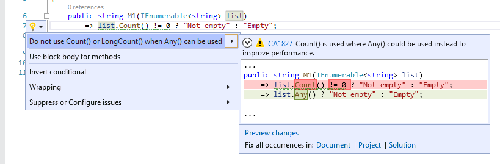

# CA1827: Do not use Count()/LongCount() when Any() can be used

|                                     | Value                                  |
| ----------------------------------- | -------------------------------------- |
| **Rule ID**                         | CA1827                                 |
| **Category**                        | [Performance](performance-warnings.md) |
| **Fix is breaking or non-breaking** | Non-breaking                           |
| **Enabled by default in .NET 7**    | No                                     |

## Cause

The [Count()](xref:System.Linq.Enumerable.Count%2A) or [LongCount()](xref:System.Linq.Enumerable.LongCount%2A) *method* was used where the [Any()](xref:System.Linq.Enumerable.Any%2A) method would be more efficient.

## Rule description

This rule flags [Count()](xref:System.Linq.Enumerable.Count%2A) and [LongCount()](xref:System.Linq.Enumerable.LongCount%2A) LINQ method calls that are used to check if the collection has at least one element. These methods enumerate the entire collection to compute the count. The same check is faster with the [Any()](xref:System.Linq.Enumerable.Any%2A) method as it avoids enumerating the collection.

> [!NOTE]
> This rule is similar to [CA1860: Avoid using 'Enumerable.Any()' extension method](ca1860.md). However that rule suggests using the `Count` *property*, while this rule applies to the Linq `Count()` *extension method*.

## How to fix violations

To fix a violation, replace the <xref:System.Linq.Enumerable.Count%2A> or <xref:System.Linq.Enumerable.LongCount%2A> method call with the <xref:System.Linq.Enumerable.Any%2A> method. For example, the following two code snippets show a violation of the rule and how to fix it:

```csharp
using System.Collections.Generic;
using System.Linq;

class C
{
    public string M1(IEnumerable<string> list)
        => list.Count() != 0 ? "Not empty" : "Empty";

    public string M2(IEnumerable<string> list)
        => list.LongCount() > 0 ? "Not empty" : "Empty";
}
```

```csharp
using System.Collections.Generic;
using System.Linq;

class C
{
    public string M1(IEnumerable<string> list)
        => list.Any() ? "Not empty" : "Empty";

    public string M2(IEnumerable<string> list)
        => list.Any() ? "Not empty" : "Empty";
}
```

> [!TIP]
> A code fix is available for this rule in Visual Studio. To use it, position the cursor on the violation and press <kbd>Ctrl</kbd>+<kbd>.</kbd> (period). Choose **Do not use Count() or LongCount() when Any() can be used** from the list of options that's presented.
>
> 

## When to suppress warnings

It's safe to suppress a violation of this rule if you're not concerned about the performance impact from unnecessary collection enumeration to compute the count.

## Suppress a warning

If you just want to suppress a single violation, add preprocessor directives to your source file to disable and then re-enable the rule.

```csharp
#pragma warning disable CA1827
// The code that's violating the rule is on this line.
#pragma warning restore CA1827
```

To disable the rule for a file, folder, or project, set its severity to `none` in the [configuration file](../configuration-files.md).

```ini
[*.{cs,vb}]
dotnet_diagnostic.CA1827.severity = none
```

For more information, see [How to suppress code analysis warnings](../suppress-warnings.md).

## Related rules

- [CA1826: Use property instead of Linq Enumerable method](ca1826.md)
- [CA1828: Do not use CountAsync/LongCountAsync when AnyAsync can be used](ca1828.md)
- [CA1829: Use Length/Count property instead of Enumerable.Count() method](ca1829.md)
- [CA1860: Avoid using 'Enumerable.Any()' extension method](ca1860.md)

## See also

- [Performance rules](performance-warnings.md)
